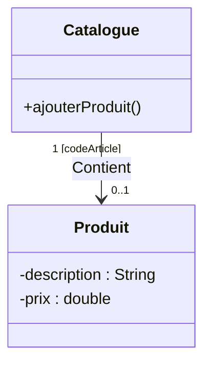

# 3. Masterclass on Qualified Associations (Dictionaries/Maps)

We briefly touched on this at the end of Chapter 2, but slides 41-43 and your TD exercises demand a deep dive. **Qualification** is the UML way of modeling Maps, Dictionaries, and HashTables.

### 1. The Concept of the "Qualifier"
Imagine a `Catalogue` that contains thousands of `Produit` objects. 
Normally, the multiplicity is `Catalogue "1" --> "*" Produit`.
If you want to find *one specific* product, you have to search through the entire `*` list.

But what if you use a **Code Article**? If you provide the Code Article to the Catalogue, it instantly hands you exactly `0..1` Product. The Code Article acts as an index or a key.

### 2. Graphical Representation (The "Key" Box)
* You draw the association line.
* At the end of the line attached to the **Class that does the searching** (the Container, e.g., Catalogue), you draw a small rectangle.
* Inside this small rectangle, you write the attribute used as the key (e.g., `codeArticle : String`).
* **The Magic Step:** The multiplicity on the target class (Produit) drops from `*` to `0..1` or `1`.



### 3. Code Translation (Why this matters for your 20/20)
If the professor asks you to generate the Java code for a Qualified Association, you **CANNOT use an ArrayList**. You MUST use a `Map` or `HashMap`.

```java
public class Catalogue {
    // The Qualifier (codeArticle: String) becomes the Key.
    // The Target (Produit) becomes the Value.
    private Map<String, Produit> produits = new HashMap<>();
    
    public Produit getProduit(String codeArticle) {
        return produits.get(codeArticle);
    }
}
```

> [!TIP] Exam Context (Flight Reservation)
> In one of your exams, a `Compagnie` proposes multiple `Vols` (Flights). A Flight is open to reservation and is "referenced by a flight number". 
> While an aggregation `Compagnie o-- "*" Vol` is acceptable, a **Qualified Association** `Compagnie [numeroVol] --> "0..1" Vol` proves you understand that the flight number is the unique search key within that company. This secures maximum points.
