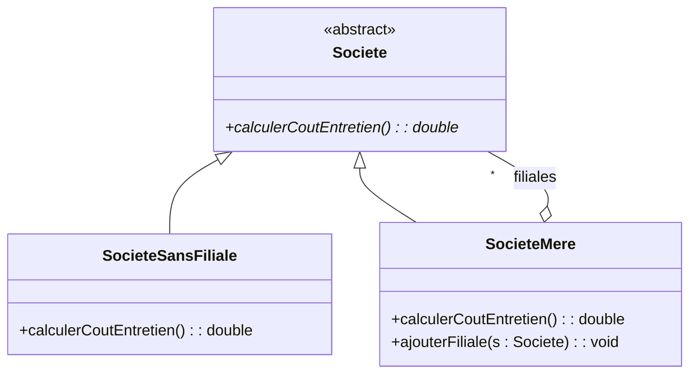

# 5. Recursive Composition (The Composite Pattern Trap)

This is the ultimate "Boss Level" concept in your M1 MCA course. It appears in the **Test N°2 (Société de vente)**, the **TD4 Ex 3 & 4 (Arithmetic Expressions)**, and the **TD3 Ex 3 (Geometric Objects)**. 

### 1. The Core Problem
How do you model something that is made up of smaller pieces, *but those smaller pieces are the exact same type of thing as the whole*?
* **Example 1 (Exam):** A Company (Société) can have subsidiaries. But those subsidiaries are also Companies!
* **Example 2 (TD4):** An Arithmetic Expression like `(5 * 2) + 4`. The `+` is an operation. Its left side `(5 * 2)` is an expression, and its right side `4` is an expression.
* **Example 3 (File System):** A Folder contains Files, but a Folder can also contain other Folders!

### 2. The Solution: The Composite Pattern Structure
You solve this by combining **Inheritance** and **Aggregation/Composition** in a loop.

Let's dissect the **Société** exam correction (which was worth 5 points!).

1. **The Base Component (Abstract):** Create an abstract superclass `Societe`. This defines what *any* company can do (e.g., `calculerCoutEntretien()`).
2. **The Leaf (No Children):** Create a subclass `SocieteSansFiliale` that inherits from `Societe`. It does the basic work. It has no list of subsidiaries.
3. **The Composite (Has Children):** Create a subclass `SocieteMere` that inherits from `Societe`.
4. **The Recursive Loop:** `SocieteMere` must aggregate its children. What type are the children? They are `Societe`! So, you draw an aggregation line from `SocieteMere` (with the diamond on SocieteMere) pointing back up to the abstract `Societe` class.

#### The Visual Structure (Memorize This Shape!)



### 3. Code Translation for the Recursive Loop
The professor explicitly asked for the Java code for this in the exam. Look at how beautifully the UML translates:

```java
// 1. The Abstract Component
public abstract class Societe {
    public abstract double calculerCoutEntretien();
}

// 2. The Leaf
public class SocieteSansFiliale extends Societe {
    public double calculerCoutEntretien() {
        return 500.0; // Base cost
    }
}

// 3. The Composite (Notice it extends AND contains the base class!)
public class SocieteMere extends Societe {
    // Here is the Aggregation (o-- "*") pointing to the Superclass!
    private ArrayList<Societe> filiales = new ArrayList<>();
    
    public void ajouterFiliale(Societe f) {
        filiales.add(f);
    }
    
    public double calculerCoutEntretien() {
        double coutTotal = 0.0;
        // Recursively call the method on all children
        for (Societe f : filiales) {
            coutTotal += f.calculerCoutEntretien();
        }
        return coutTotal;
    }
}
```

> [!WARNING] The Critical Exam Trap
> If the exam asks you to model a tree-like structure (Folders/Files, Companies/Subsidiaries, Math Expressions), **do not draw an aggregation from the Composite to the Leaf!** 
> If `SocieteMere` aggregated `SocieteSansFiliale`, then a Mother Company could *only* contain leaf companies. It couldn't contain another Mother Company! By aggregating the abstract superclass `Societe`, the `SocieteMere` can contain *both* Leaves and other Mother Companies, allowing infinite nesting. This is the exact logic required for full points.