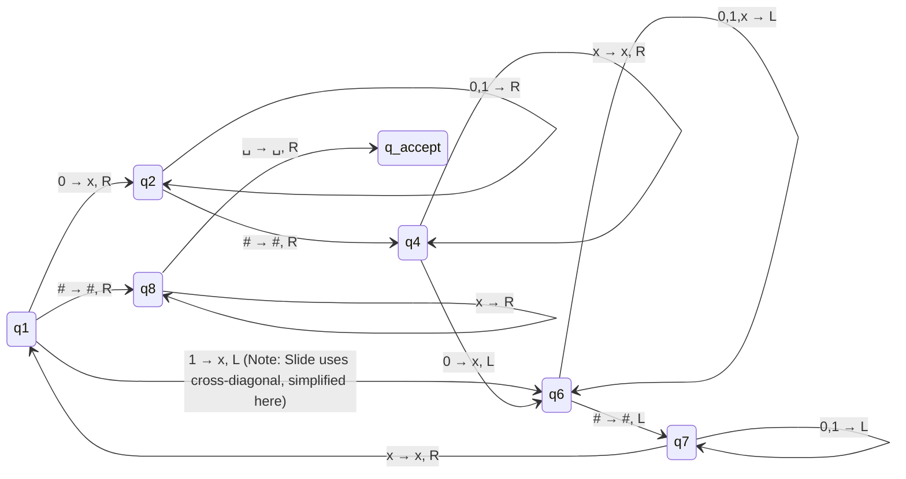

# 3. Formal Definition and Execution of a TM

## The 7-Tuple Definition
Mathematically, a Turing Machine is defined as a 7-uplet: **$(Q, \Sigma, \Gamma, \delta, q_{start}, q_{accept}, q_{reject})$**

| Component | Description |
| :--- | :--- |
| **$Q$** | The finite set of states. |
| **$\Sigma$** | The alphabet of inputs. **Important:** The blank symbol $\square \notin \Sigma$. |
| **$\Gamma$** | The tape alphabet. **Important:** $\square \in \Gamma$ and $\Sigma \subseteq \Gamma$. |
| **$\delta$** | The transition function: $Q \times \Gamma \rightarrow Q \times \Gamma \times \{L, R\}$ |
| **$q_{start}$** | The starting state ($q_{start} \in Q$). |
| **$q_{accept}$** | The accepting state ($q_{accept} \in Q$). |
| **$q_{reject}$** | The rejecting state ($q_{reject} \in Q$, and $q_{reject} \neq q_{accept}$). |

## Rules of Execution
1. **Initial setup:** The machine $M$ receives an input $w = w_1w_2\dots w_n \in \Sigma$ on the first $n$ cells of the tape. The rest is filled with blanks ($\square$). The head starts on the $1^{st}$ cell.
2. **Step-by-step:** The calculation strictly follows the rules of the transition function $\delta$. 
3. **Left Boundary Rule:** If a rule tries to move the head to the left of the $1^{st}$ cell, **the head stays in place**.
4. **Halting:** The calculation continues until the machine reaches $q_{accept}$ or $q_{reject}$, at which point it halts immediately.
5. **Infinite Loop:** If neither of those two states is reached, $M$ continues indefinitely.

> [!tip] Shortcut Notation ($q_{halt}$ and $S$)
> * **$q_{halt}$**: In some algorithms, $q_{reject}$ is useless. In these cases, $q_{accept}$ is the only stopping state and is simply called $q_{halt}$.
> * **Movement $S$ (Stay)**: To the possible movements $R$ and $L$, we sometimes add $S$ (Stay). It is mainly used to go to halting states while keeping the head in the correct position.

---

## Example: The Language $B = \{w\#w \mid w \in \{0,1\}^*\}$
We want to test if a string consists of a word, a `#`, and then the exact same word again (e.g., `011000#011000`).

### High-Level Strategy (Algorithm M1)
* Scan the tape in a **zigzag** pattern, matching positions on either side of the `#`.
* Cross off symbols as you match them (e.g., replace `0` with `x`) to keep track.
* If symbols don't match, or if there is no `#`, **reject**.
* When all symbols to the left of `#` are crossed off, check the right side. If symbols remain, **reject**. If nothing remains, **accept**.

### Diagram Representation
Based on the slide, the alphabet is $\Sigma = \{0, 1, \#\}$ and $\Gamma = \{0, 1, x, \#, \square\}$.
*(Note: As per the slide's exercise, any missing transitions logically go to $q_{rej}$.)*


*(Refer to Slide 12 for the exact visual mapping, as TM diagrams map heavily based on node placement. The core concept is crossing out, skipping over previously crossed out 'x's, and verifying the exact match.)*
```

---
