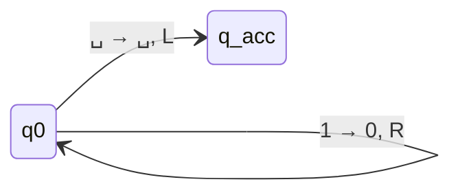
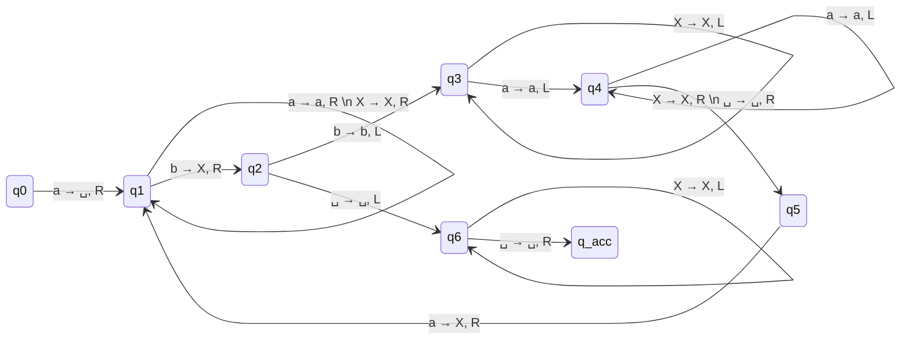

# Series 1. Calculability and Turing Machines

> [!important] Crucial Conventions for this Series
> Before solving any Turing Machine (TM) problem, you must explicitly know the constraints of the environment. In this course, the following rules apply:
> 1. **The tape is bounded to the left.** You cannot move left of the first cell (index 0). If the head is at the leftmost cell and receives an instruction to move Left (`L`), it will simply stay in place.
> 2. **Initial State:** The tape initially contains the input string starting at the very first cell, followed by an infinite number of blank symbols ($\sqcup$).
> 3. **DMTQ:** "Déterminer une Machine de Turing qui" (Determine a TM that...).

---

## Exercise 1. 1's Complement

**Task:** Determine a TM that calculates the 1's complement of a binary number (replaces all `0`s with `1`s, and `1`s with `0`s). Provide a description and its formal definition.

### 1. Conceptual Description
The 1's complement is a simple bitwise NOT operation. Since our tape is bounded to the left and the input starts immediately, we just need to scan the tape from left to right, flipping each bit as we see it.
1. Start at the leftmost cell in state $q_0$.
2. If the current symbol is `0`, write `1`, and move Right (`R`).
3. If the current symbol is `1`, write `0`, and move Right (`R`).
4. Continue this until you read a blank symbol ($\sqcup$). 
5. The blank symbol indicates the end of the input string. When we see it, we transition to the accept state $q_{acc}$ and halt. (It is best practice to move the head Left `L` so it rests on the last bit of the number).

### 2. Formal Definition
A Turing machine is formally defined as a 7-tuple: $M = (Q, \Sigma, \Gamma, \delta, q_{start}, q_{acc}, q_{rej})$
* **States ($Q$):** $\{q_0, q_{acc}, q_{rej}\}$
* **Input Alphabet ($\Sigma$):** $\{0, 1\}$
* **Tape Alphabet ($\Gamma$):** $\{0, 1, \sqcup\}$
* **Start, Accept, Reject:** $q_0, q_{acc}, q_{rej}$

**Transition Function ($\delta$):**
$$
\begin{aligned}
\delta(q_0, 0) &= (q_0, 1, R) \\
\delta(q_0, 1) &= (q_0, 0, R) \\
\delta(q_0, \sqcup) &= (q_{acc}, \sqcup, L)
\end{aligned}
$$
*(Note: Any undefined transition automatically leads to $q_{rej}$.)*

---

## Exercise 2. Unary Successor

**Task:** Calculate the successor of a number in unary coding. The unary representation of $0$ is the empty string ($\epsilon$), $1$ is `1`, $2$ is `11`, etc.

### 1. Conceptual Description
In unary representation, adding 1 to a number $N$ simply means appending one additional `1` to the string.
1. The machine starts at the leftmost cell.
2. It must scan rightwards over all existing `1`s without changing them.
3. The moment it encounters a blank ($\sqcup$), it has found the end of the number.
4. It replaces that $\sqcup$ with a `1`, moves the head (direction doesn't matter much here, `L` is standard), and halts in $q_{acc}$.

> [!tip] Edge Case: The Number 0
> What if the input is 0? In unary, 0 is the empty string. This means the tape immediately starts with a $\sqcup$. Our logic still works perfectly! It reads $\sqcup$ on the very first step, replaces it with `1`, and halts. The empty string correctly becomes `1`.

### 2. Formal Definition
* $Q = \{q_0, q_{acc}, q_{rej}\}$
* $\Sigma = \{1\}$
* $\Gamma = \{1, \sqcup\}$

**Transition Function ($\delta$):**
$$
\begin{aligned}
\delta(q_0, 1) &= (q_0, 1, R) \\
\delta(q_0, \sqcup) &= (q_{acc}, 1, L)
\end{aligned}
$$

---

## Exercise 3. Binary Successor

**Task:** Determine the successor of a binary number. Provide solutions for both **Little-endian** and **Big-endian** formats.

### Case A: Little-Endian (Least Significant Bit First)
In little-endian, the smallest unit (the ones place) is at the leftmost address. 
*Example: $3$ is written as `110` (which is $011_2$ in standard math). Successor is $4$, written as `001`.*

#### 1. Description
Since the smallest bit is on the left, we can just process from left to right!
1. Start at the leftmost bit.
2. If we read `1`, adding 1 causes it to become `0` with a "carry" of 1. So, we write `0` and move Right to carry the 1 to the next bit.
3. If we read `0`, adding the carry makes it `1`. The addition is now complete, so we write `1` and accept.
4. If we read a $\sqcup$, it means we carried a 1 past the end of the number (e.g., $11 \rightarrow 001$). We replace $\sqcup$ with `1` and accept.

#### 2. Formal Definition
* $Q = \{q_0, q_{acc}, q_{rej}\}$
* $\Gamma = \{0, 1, \sqcup\}$

**Transition Function ($\delta$):**
$$
\begin{aligned}
\delta(q_0, 1) &= (q_0, 0, R) \quad \text{// Flip 1 to 0, carry the 1 right} \\
\delta(q_0, 0) &= (q_{acc}, 1, R) \quad \text{// Flip 0 to 1, done} \\
\delta(q_0, \sqcup) &= (q_{acc}, 1, R) \quad \text{// Overflow case, add new bit}
\end{aligned}
$$

---

### Case B: Big-Endian (Most Significant Bit First)
In big-endian, the largest unit is on the left. This is how humans naturally read numbers.
*Example: $3$ is written as `011`. Successor is `100`.*

#### 1. Description
Because the smallest bit is at the far right, we must first traverse the entire string to the end, and *then* do the addition moving right-to-left.
1. **Scan Phase:** Move Right over all `0`s and `1`s until we hit $\sqcup$. Then move Left one step to stand on the Least Significant Bit.
2. **Add Phase:** If we read `1`, write `0` and move Left (carrying the 1).
3. **Finish Phase:** If we read `0`, write `1` and accept. 

> [!warning] The Left-Boundary Overflow Trap
> What happens if the input is `11` (which is 3)?
> `11` becomes `00` with a carry of 1. The head moves left, but because the tape is bounded on the left, **it cannot move past index 0!** It will get stuck.
> *Standard Exam Solution:* We usually assume the input is padded with a leading zero (e.g., `011`), or we provide a complex sub-routine to shift the entire string right by one cell to make room for the new `1`. For simplicity and clarity, the transition below assumes a leading zero exists to absorb an overflow.

#### 2. Formal Definition
* $Q = \{q_0, q_{add}, q_{acc}, q_{rej}\}$
* $\Gamma = \{0, 1, \sqcup\}$

**Transition Function ($\delta$):**
$$
\begin{aligned}
\text{// Phase 1: Go to the right end} \\
\delta(q_0, 0) &= (q_0, 0, R) \\
\delta(q_0, 1) &= (q_0, 1, R) \\
\delta(q_0, \sqcup) &= (q_{add}, \sqcup, L) \quad \text{// Reached end, step back left} \\
\\
\text{// Phase 2: Add 1 right-to-left} \\
\delta(q_{add}, 1) &= (q_{add}, 0, L) \quad \text{// Carry 1} \\
\delta(q_{add}, 0) &= (q_{acc}, 1, L) \quad \text{// Add 1 and stop} 
\end{aligned}
$$

---

## Exercise 4. Copy String {A, B, C}

**Task:** Generate a copy of a string composed of `{A, B, C}`. (e.g., `AABCA` $\rightarrow$ `AABCAAABCA`).

### 1. Conceptual Description
Copying a string requires the TM to constantly jump back and forth between the original string and the new copy being built. To do this without losing its place, the TM uses "markers" (e.g., lower-case letters).
We also use a delimiter `#` to separate the original string from the workspace.

**Step-by-step Algorithm:**
1. **Initialization:** Scan right to the end of the input and write a `#` to mark the boundary. Then return all the way to the first cell.
2. **Mark and Remember:** Read the first un-copied symbol (e.g., `A`). Replace it with a marked version (e.g., `a`) to remember we've copied it.
3. **Travel and Write:** Move right, passing over the rest of the original string, the `#`, and any already copied symbols, until reaching a $\sqcup$. Write the symbol we remembered (`A`).
4. **Return:** Move left until we find the marked symbol (`a`). Step one cell right to find the next un-copied symbol.
5. **Repeat:** Repeat steps 2-4. If, instead of an un-copied symbol, we read the `#` separator, it means the whole string has been copied!
6. **Cleanup:** Move left across the original string, converting the marked symbols (`a, b, c`) back to their original forms (`A, B, C`). Replace `#` with $\sqcup$.

### 2. Formal Definition (High-Level State Design)
Writing the exhaustive $\delta$ table for this requires dozens of transitions. Here is the rigorous mapping of states to prove understanding:
* $\Gamma = \{A, B, C, a, b, c, \#, \sqcup\}$
* **$q_{init}$**: Move R to $\sqcup$, write `#`, transition to $q_{return\_start}$.
* **$q_{return\_start}$**: Move L until hitting the left boundary, transition to $q_{read}$.
* **$q_{read}$**: 
  * If `A`, write `a`, transition to $q_{carry\_A}$.
  * If `B`, write `b`, transition to $q_{carry\_B}$.
  * If `C`, write `c`, transition to $q_{carry\_C}$.
  * If `#`, copy is complete. Transition to $q_{clean}$.
* **$q_{carry\_X}$**: Move R over everything until $\sqcup$. Write `X`. Transition to $q_{return}$.
* **$q_{return}$**: Move L over everything until finding a marked symbol (`a, b, c`). Move R once, transition to $q_{read}$.
* **$q_{clean}$**: Scan left, converting `a->A`, `b->B`, `c->C`.

---

## Exercise 5. Tracing a Complex TM

**Given:** $M = (\{q_0 \dots q_6, q_{acc}, q_{rej}\}, \{a, b\}, \{a, b, X, \sqcup\}, \delta, q_0, q_{acc}, q_{rej})$
Let's first transcribe the provided transition table accurately:

| State, Symbol | Transition | || State, Symbol | Transition | || State, Symbol | Transition |
| :--- | :--- | :--- | :--- | :--- | :--- | :--- | :--- | :--- |
| $(q_0, a)$ | $(q_1, \sqcup, R)$ | || $(q_2, a)$ | $(q_{rej}, \sqcup, R)$| || $(q_4, a)$ | $(q_4, a, L)$ |
| $(q_0, b)$ | $(q_{rej}, \sqcup, R)$| || $(q_2, b)$ | $(q_3, b, L)$ | || $(q_4, b)$ | $(q_{rej}, \sqcup, R)$|
| $(q_0, X)$ | $(q_{rej}, \sqcup, R)$| || $(q_2, X)$ | $(q_{rej}, \sqcup, R)$| || $(q_4, X)$ | $(q_5, X, R)$ |
| $(q_0, \sqcup)$ | $(q_{rej}, \sqcup, R)$| || $(q_2, \sqcup)$ | $(q_6, \sqcup, L)$ | || $(q_4, \sqcup)$ | $(q_5, \sqcup, R)$ |
| $(q_1, a)$ | $(q_1, a, R)$ | || $(q_3, a)$ | $(q_4, a, L)$ | || $(q_5, a)$ | $(q_1, X, R)$ |
| $(q_1, b)$ | $(q_2, X, R)$ | || $(q_3, b)$ | $(q_{rej}, \sqcup, R)$| || $(q_5, b)$ | $(q_{rej}, \sqcup, R)$|
| $(q_1, X)$ | $(q_1, X, R)$ | || $(q_3, X)$ | $(q_3, X, L)$ | || $(q_5, X)$ | $(q_{rej}, \sqcup, R)$|
| $(q_1, \sqcup)$ | $(q_{rej}, \sqcup, R)$| || $(q_3, \sqcup)$ | $(q_{rej}, \sqcup, R)$| || $(q_5, \sqcup)$ | $(q_{rej}, \sqcup, R)$|
| $(q_6, a)$ | $(q_{rej}, \sqcup, R)$| || $(q_6, b)$ | $(q_{rej}, \sqcup, R)$| || $(q_6, X)$ | $(q_6, X, L)$ |
| $(q_6, \sqcup)$ | $(q_{acc}, \sqcup, R)$|

### 1. State Diagram
Due to the sheer number of reject transitions, standard TM diagrams omit lines leading to $q_{rej}$. If a transition isn't drawn, it implicitly goes to $q_{rej}$.

### 2. Trace Configurations for input `aabb`
A configuration is written as `u q v` (Left-tape, State, Right-tape).
Watch how the machine creatively uses the first converted `a` (which becomes $\sqcup$) as a hard left-boundary marker!

1. **`q0 a a b b`** $\rightarrow$ Starts at leftmost 'a'. Rule: $\delta(q_0,a) = (q_1, \sqcup, R)$.
2. **`\sqcup q1 a b b`** $\rightarrow$ Skips over 'a'.
3. **`\sqcup a q1 b b`** $\rightarrow$ Finds first 'b'. Marks it as 'X'. Rule: $\delta(q_1,b) = (q_2, X, R)$.
4. **`\sqcup a X q2 b`** $\rightarrow$ Steps right. Rule: $\delta(q_2,b) = (q_3, b, L)$.
5. **`\sqcup a q3 X b`** $\rightarrow$ Scans left over 'X'. Rule: $\delta(q_3,X) = (q_3, X, L)$.
6. **`\sqcup q3 a X b`** $\rightarrow$ Sees 'a', steps left. Rule: $\delta(q_3,a) = (q_4, a, L)$.
7. **`q4 \sqcup a X b`** $\rightarrow$ Hits the left boundary blank! Rule: $\delta(q_4,\sqcup) = (q_5, \sqcup, R)$.
8. **`\sqcup q5 a X b`** $\rightarrow$ Marks the next 'a' as 'X'. Rule: $\delta(q_5,a) = (q_1, X, R)$.
9. **`\sqcup X q1 X b`** $\rightarrow$ Scans right over 'X'.
10. **`\sqcup X X q1 b`** $\rightarrow$ Finds next 'b', marks as 'X'.
11. **`\sqcup X X X q2 \sqcup`** $\rightarrow$ Hits right end of tape! Rule: $\delta(q_2,\sqcup) = (q_6, \sqcup, L)$.
12. **`\sqcup X X q6 X`** $\rightarrow$ Scans left over all 'X's to ensure no garbage is left.
13. **`\sqcup X q6 X X`**
14. **`\sqcup q6 X X X`**
15. **`q6 \sqcup X X X`** $\rightarrow$ Hits the left boundary blank again! Rule: $\delta(q_6,\sqcup) = (q_{acc}, \sqcup, R)$.
16. **`\sqcup q_{acc} X X X`** $\rightarrow$ **ACCEPT!**

### 3. Does M always halt? Justify.
**Yes.** 
* Every time the machine loops forward, it strictly replaces one `a` with an `X` (or $\sqcup$) and one `b` with an `X`. 
* Because the input string is finite, the machine will eventually run out of characters.
* There are no transitions that allow the head to stay in the same state while standing still, preventing infinite micro-loops. 
* If the string has an unequal number of 'a's and 'b's, or characters out of order (like `ba`), it immediately hits an undefined transition and goes to $q_{rej}$. 

### 4. What does it compute?
It decides the language **$L = \{a^n b^n \mid n \ge 1\}$**. 
It ensures all 'a's come before 'b's, and exactly matches every 'a' to a 'b' by iteratively crossing them out from left to right.

---

## Exercise 6. Completing the Diagram with $q_{reject}$

**Context:** The course provides a diagram for recognizing $w\#w$. Standard diagrams omit the reject state for readability. 

**Task:** Complete the diagram by identifying which transitions must go to $q_{rej}$.
**Answer:** Any character input for a state that does not have an explicitly drawn arrow goes to $q_{rej}$. 

Looking at the states (assuming the $w\#w$ alphabet $\Gamma = \{0, 1, x, \#, \sqcup\}$):
* **From $q_1$:** Explicit arrows exist for `0`, `1`, and `#`. Therefore, reading `x` or `\sqcup` transitions to $q_{rej}$.
* **From $q_2$:** Only `0`, `1` (via self loop), and `#` exist. Reading `x` or `\sqcup` transitions to $q_{rej}$.
* **From $q_4$:** Only `x` exists. Reading `0`, `1`, `#`, or `\sqcup` transitions to $q_{rej}$.
* **From $q_8$:** Only `x` and `\sqcup` exist. Reading `0`, `1`, or `#` transitions to $q_{rej}$.
*(This logic strictly applies to every state in the machine. A complete, mathematically rigorous TM must define $\delta$ for every single element of $Q \times \Gamma$.)*

---

## Exercise 7. Modified Matrix Mortality Problem (MMP)

**Background:** The standard Matrix Mortality Problem (MMP) asks if there is *any* finite sequence of matrix multiplications that results in the Zero Matrix. For matrices of size $n \ge 3$, this is mathematically proven to be **Undecidable** (impossible to write an algorithm that always halts and gives the correct answer).

**The Modification:** We are given $n=3$, but the sequence length $m$ is explicitly bounded: $1 \le m \le 1000$.

**Task:** Is this modified problem decidable or not? Justify.

### Answer & Justification
**YES, the modified problem is Decidable.**

**Why?**
The core reason the original MMP is undecidable is because the search space is infinite. Since $m$ could be $10$, $10^{10}$, or $10^{100000}$, if a zero matrix hasn't been found yet, the algorithm never knows if it should stop looking or keep trying. It could run forever.

However, by restricting $m \le 1000$:
1. Let $k$ be the number of matrices in the given set. 
2. The total number of possible sequences of length up to 1000 is exactly $k^1 + k^2 + k^3 + \dots + k^{1000}$.
3. This is a massive number, but it is strictly **finite**.
4. We can easily write a brute-force algorithm (which a Turing Machine can execute) that generates every single one of these sequences, multiplies them, and checks if the result is the zero matrix. 
5. Because the set of possibilities is finite, the algorithm is **guaranteed to halt**. It will either find the zero matrix and return `YES`, or exhaust all combinations and return `NO`. 

> [!abstract] Golden Rule of Decidability
> Any problem with a strictly finite, computable search space is inherently decidable. Complexity (taking a very long time) is not the same as Undecidability (being mathematically impossible).
