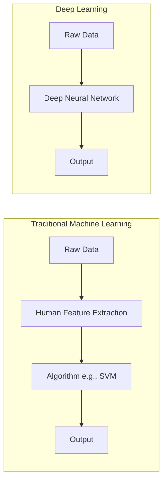

# 2. Machine Learning vs Deep Learning

Understanding when to use standard Machine Learning versus Deep Learning is a critical skill for any Data Scientist or AI Engineer.

## The Core Difference: Feature Engineering

- **Machine Learning (Traditional):** Requires **Feature Engineering**. A human expert must manually extract relevant features from the raw data. _Example: For a self-driving car, a human writes code to find edges, circles (wheels), and colors._
- **Deep Learning:** Features are learned automatically. The network is fed raw data (pixels) and learns on its own what features (edges, shapes, objects) are important to make the final decision.

## Detailed Comparison Table

| Characteristic              | Machine Learning                     | Deep Learning                              |
| :-------------------------- | :----------------------------------- | :----------------------------------------- |
| **Learning Type**           | Supervised, Unsupervised             | Supervised, Semi-supervised, Reinforcement |
| **Human Intervention**      | High to Medium (Feature Engineering) | Low (End-to-End learning)                  |
| **Input Data Type**         | Structured / Tabular                 | Unstructured (Images, Text, Audio)         |
| **Output Data Type**        | Numerical values                     | Text, Images, Video, Voice                 |
| **Data Volume Needed**      | Low to Medium (Thousands)            | Very High (Millions/Billions)              |
| **Data Quality Importance** | Very High (Garbage in, garbage out)  | High                                       |
| **Training Time**           | Short (Minutes to Hours)             | Long (Days to Weeks)                       |
| **Hardware Required**       | Low to Medium (CPUs)                 | Very High (GPUs/TPUs)                      |

> [!WARNING] Common Pitfall
> Students often think Deep Learning is always better. It is **not**. If you have tabular data (like an Excel sheet with house prices), algorithms like Random Forest or XGBoost will often beat Deep Learning, train much faster, and be much easier to explain. Save Deep Learning for Images, Text, and Audio.
