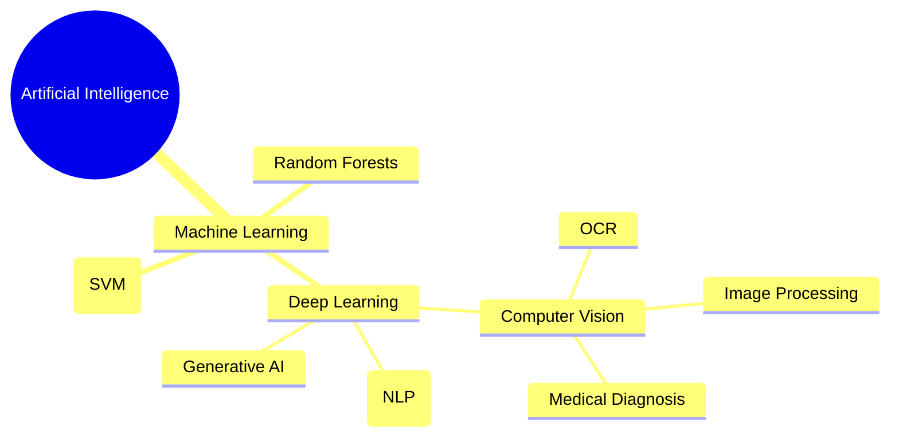

# 2.1. The AI Ecosystem and Deep Learning's Place

Deep Learning is not an isolated concept; it is a highly specialized subset within the broader field of computer science.

**Key Distinctions:**

- **AI (Artificial Intelligence):** The broadest concept. Any technique that enables computers to mimic human intelligence.
- **ML (Machine Learning):** A subset of AI that uses statistical methods to enable machines to improve with experience. Includes algorithms like Random Forests and SVMs.
- **DL (Deep Learning):** A subset of ML composed of Artificial Neural Networks (ANNs) with multiple "deep" layers. It learns complex representations directly from **raw data** (pixels, audio waves) without human intervention.
