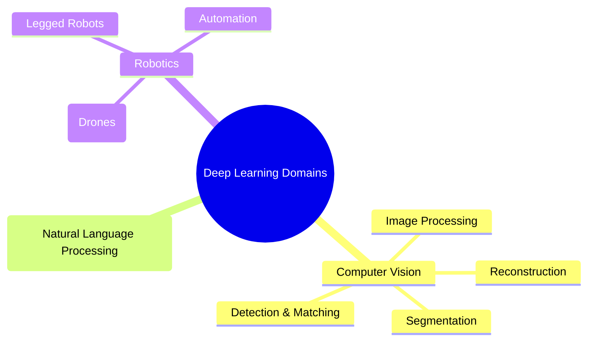

# 2.2. Advanced Computer Vision Tasks and Intersections

While "Computer Vision" is a broad umbrella term, Deep Learning breaks it down into highly specific, distinct tasks. A model built for one task usually cannot perform the other without architectural changes.

## The 4 Pillars of Image Analysis

1. **Classification:**
   - **Goal:** Assign a single label to an entire image.
   - **Example:** Looking at an image and outputting "Grille" (Grill), "Mushroom", or "Madagascar Cat". This was the primary focus of the 2012 ImageNet challenge.

2. **Retrieval (Content Association):**
   - **Goal:** Given a reference image, search a massive database to find visually or semantically similar images.
   - **Example:** Uploading a picture of a specific flower and having the system return 10 images of the exact same flower species from different angles.

3. **Detection (Object Detection):**
   - **Goal:** Locate specific objects within an image and draw a **Bounding Box** around them.
   - **Example:** Identifying a person, a horse, and a dog in the same image, drawing a colored rectangle around each, and labeling them (e.g., using the _Faster R-CNN_ architecture).

4. **Segmentation:**
   - **Goal:** The most complex task. It classifies _every single pixel_ in the image, creating a precise, color-coded mask of the objects.
   - **Example:** Instead of a box around a car, the exact outline of the car, the road, the sky, and pedestrians are highlighted pixel-by-pixel (e.g., _Farabet et al._).

_Note: As shown in the slide's Venn diagram, Computer Vision often intersects heavily with Robotics (for navigation) and NLP (for generating image captions)._
