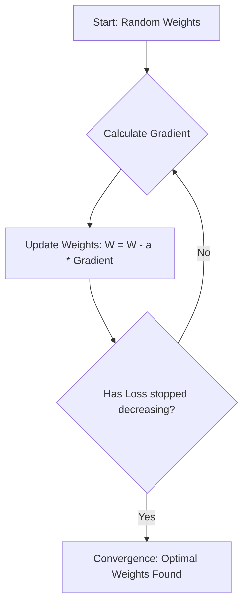

# 3. Gradient Descent Optimization

## Essential Background Knowledge

In machine learning, we want our model to make accurate predictions. To achieve this, we define a **Loss Function** $J(\theta)$, which measures how "wrong" our model is. The goal of training is to find the parameters (weights and biases) that minimize this loss function.

## What is Gradient Descent?

Gradient Descent is an iterative optimization algorithm used to find the minimum of a function. Imagine a blindfolded person trying to reach the bottom of a valley. They feel the slope of the ground with their feet and take a step in the direction that goes down the fastest.

### The Algorithm

1.  **Initialize** parameters randomly (e.g., $x_0$).
2.  **Calculate the Gradient:** Find the derivative of the function at the current point, $f'(x_t)$. The gradient points in the direction of the steepest ascent.
3.  **Update Parameters:** Move in the _opposite_ direction of the gradient.
4.  **Repeat** until convergence (when the gradient is zero or very close to zero).

**The Update Rule:**
$$ x\_{t+1} = x_t - \alpha \nabla f(x_t) $$

- $x$: The parameter we are trying to optimize.
- $\alpha$ (Alpha / Learning Rate): The step size.
- $\nabla f(x_t)$: The gradient (slope) at point $x_t$.

> [!TIP] Understanding the Learning Rate ($\alpha$)
>
> - **Too small:** The algorithm will take tiny steps. It will eventually find the minimum, but it will take an eternity.
> - **Too large:** The algorithm will take giant steps, overshooting the minimum. It might bounce back and forth and even diverge (go to infinity).

## Convex vs. Non-Convex Functions

- **Convex Function:** Looks like a single, smooth bowl. It has only one global minimum. Linear regression loss (MSE) is convex.
- **Non-Convex Function:** Looks like a mountain range with multiple valleys. It has **Local Minima** (a small valley) and a **Global Minimum** (the deepest valley). Neural Network loss functions are highly non-convex.

## Variations of Gradient Descent

Because calculating the gradient across an entire massive dataset (millions of images) is impossible due to RAM limits, we use variations of the algorithm:

1.  **Batch Gradient Descent:** Uses the _entire dataset_ for one update. Stable, but extremely slow and memory-heavy.
2.  **Stochastic Gradient Descent (SGD):** Uses a _single data point_ for one update. Very fast, but highly chaotic and erratic.
3.  **Mini-Batch Gradient Descent:** The gold standard. Uses a small chunk of data (e.g., 32, 64, or 512 samples) for each update. It perfectly balances speed, memory usage, and stability.

### The Magic of Mini-Batches

Mini-batches introduce a slight "noise" or "stochasticity" to the gradient. This noise is actually a good thing in deep learning! It acts like a slight earthquake that can shake the algorithm out of a shallow **local minimum** so it can continue rolling down into the true **global minimum**.

## Advanced Optimizers

Instead of a fixed learning rate $\alpha$, modern Deep Learning uses **Adaptive Optimizers** (like Adam, RMSProp, Adagrad). These algorithms automatically adjust the learning rate for _each individual parameter_ as training progresses, allowing for much faster and safer navigation of complex non-convex terrain.
