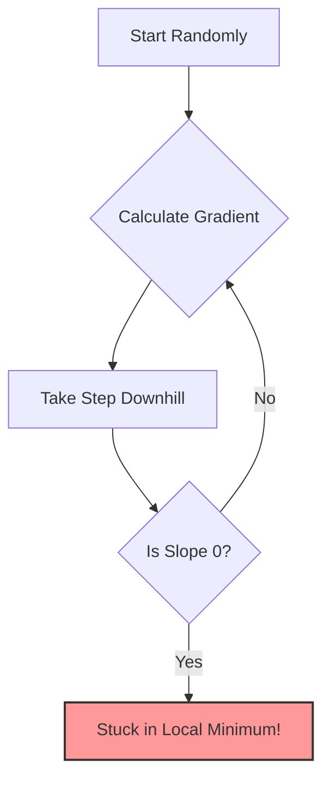

# 6.1. Deep Dive: Gradient Descent Optimization

Optimization is the process of minimizing a **differentiable and convex** function. In DL, this function is the **Loss Function** (how wrong our model is).

### The Mathematical Problem

Imagine we want to minimize $f(x) = x^2 - x + 1$.

- **Analytical Solution:** We calculate the derivative, set it to 0 ($f'(x) = 0$), and ensure the second derivative is positive ($f''(x) > 0$).
  - $f'(x) = 2x - 1 = 0 \Rightarrow x^* = 1/2$.
- **The DL Reality:** In Deep Learning, our function has millions of parameters ($x$). An analytical solution is impossible because the calculation is too computationally expensive. We must use an **iterative approximation**: Gradient Descent.

### Gradient Descent Algorithm

The gradient is the slope of the function. The algorithm steps in the opposite direction of the gradient to find the minimum.

$$ x\_{t+1} = x_t - \alpha \nabla f(x_t) $$

- $x_0$: The starting point (initialized randomly).
- $\alpha$: The Learning Rate (Taux d'apprentissage, formerly called $\eta$ 'eta'). It is a hyperparameter that modulates the size of the correction.
  - _Too small:_ extremely slow convergence.
  - _Too large:_ oscillation, instability, or divergence.
- $\nabla f(x_t)$: The gradient (derivative) evaluated at the current point.

**Stopping Criterion:** We stop when we reach convergence. This happens when the number of iterations reaches a fixed limit, or when the difference between successive values $|| \nabla f(x_t) ||$ or $|f(x_i) - f(x_{i+1})|$ is infinitesimally small.

### The Problem of Local Minima

Gradient Descent works perfectly on **Convex** functions (a smooth bowl with one global minimum). However, Deep Learning loss functions are highly **Non-Convex** (mountain ranges).

- **1D vs Multi-D:** A local minimum in 1 dimension is rarely a local minimum in a 1,000-dimension space; it is usually a **Saddle Point**. This is why neural networks can actually succeed in complex problems—there is almost always a path downwards in _some_ dimension.

### The Three Variants of Gradient Descent

| Characteristic         | Batch GD (Standard) | Stochastic GD (SGD) | Mini-batch GD                    |
| :--------------------- | :------------------ | :------------------ | :------------------------------- |
| **Data per Iteration** | All data            | A single sample     | A small group (e.g., 32 to 512)  |
| **Speed**              | Slow                | Very Fast           | Fast                             |
| **Stability**          | Very Stable         | Noisy / Chaotic     | Medium (Stable enough)           |
| **Memory (RAM) Usage** | Very High           | Low                 | Medium                           |
| **Primary Usage**      | Small datasets      | Massive datasets    | **The Industry Standard for DL** |

> [!NOTE] The 3 Hidden Benefits of Mini-Batches
>
> 1.  **Stagnation Prevention:** Because it uses a subset of data, it introduces _stochastic noise_. This noise causes slight oscillations that help the algorithm "jump" out of shallow local minima or saddle points.
> 2.  **RAM Management:** Calculating gradients on millions of images simultaneously is impossible for GPU VRAM. Mini-batches allow processing massive datasets on standard hardware.
> 3.  **Update Latency:** In Batch GD, weights are updated only _once_ per epoch. Mini-batches allow weights to be updated thousands of times per epoch, drastically accelerating global convergence.

### Solutions to the Learning Rate ($\alpha$) Problem

Because picking the perfect $\alpha$ is incredibly difficult, we use:

1.  **Learning Rate Schedulers:** Start with a high rate to encourage exploration and escape local minima, then gradually reduce it to fine-tune convergence.
2.  **Adaptive Optimizers:** Algorithms like **Adam, RMSProp, or Adagrad** automatically adjust the learning rate independently for _every single parameter_, navigating complex landscapes effortlessly.
