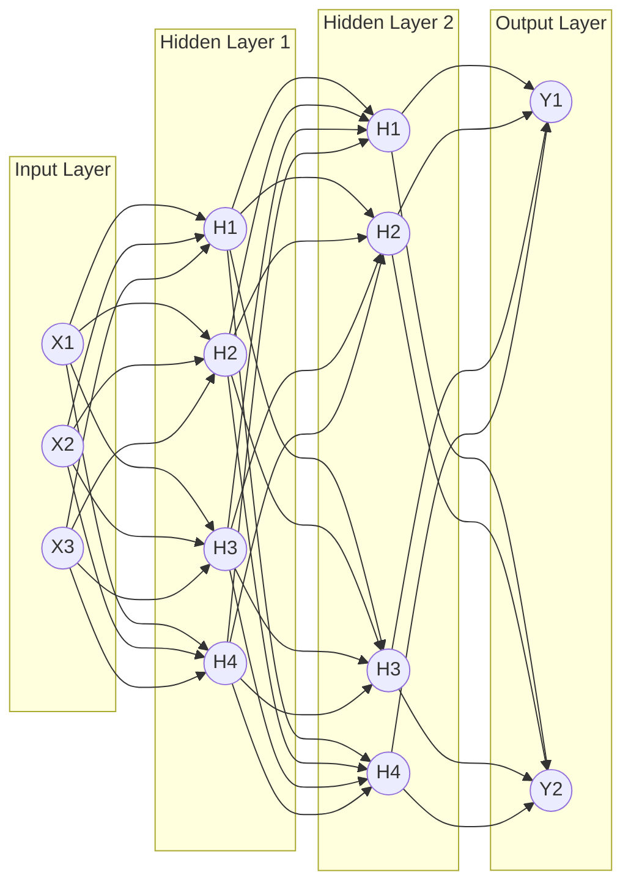

# 7. Multi-Layer Perceptron (MLP)

A Multi-Layer Perceptron (MLP), also known as an Artificial Neural Network (ANN), is a feedforward neural network capable of solving non-linearly separable problems by utilizing multiple layers of neurons.

## Architecture of an MLP

1.  **Input Layer:** Receives the raw data (flattened into a 1D array). No math happens here; it just passes the values forward.
2.  **Hidden Layers:** The "brain" of the network. Each neuron connects to all neurons in the previous layer (Dense/Fully Connected). They apply weights, biases, and non-linear activation functions to learn complex patterns. The number of layers and neurons are **Hyperparameters** (settings you choose before training).
3.  **Output Layer:** Produces the final prediction. Its shape depends on your problem (1 neuron for binary, $N$ neurons for multi-class).

## The 4 Steps of Training: Backpropagation

Training a neural network is an iterative process governed by an algorithm called **Backpropagation**.

1.  **Forward Pass:** Data flows from input to output. The network makes a prediction based on its current, random weights.
2.  **Calculate Loss:** We compare the prediction to the true target using a Loss Function (e.g., Cross-Entropy).
3.  **Backward Pass (Backpropagation):** The network calculates the **Gradient** (the derivative of the loss) for every single weight and bias in the network, starting from the output and moving backward to the input using the _Chain Rule of Calculus_.
4.  **Update Weights:** The optimizer (like SGD or Adam) uses the gradients to adjust the weights slightly to reduce the error.

_This process is repeated for thousands of **Epochs** until the loss is minimized._

## Best Practices for Implementing MLPs

### 1. Data Preparation

- **Handle Missing Values:** Impute or drop them.
- **Encoding:** Use One-Hot Encoding for categorical text data.
- **Scaling:** You **MUST** scale data (Min-Max or Z-Score). Unscaled data will cause gradient descent to explode or stall.

### 2. Strategy and Architecture

- **Incremental Approach:** Always start simple (1 hidden layer). Only add complexity if the simple model underfits.
- **Weight Initialization:** Do not initialize weights to zero. Use techniques like **Xavier/Glorot** (best for Tanh/Sigmoid) or **He Initialization** (best for ReLU).

### 3. Preventing Overfitting

Deep learning models are so powerful they can easily memorize the training data, failing on new data. To prevent this:

- **L1/L2 Regularization:** Penalizes large weights.
- **Dropout:** Randomly turns off a percentage of neurons during training, forcing the network to not rely on any single neuron.
- **Early Stopping:** Monitor the Validation Loss. If Training Loss goes down but Validation Loss starts going up, stop training immediately.

> [!TIP] Dataset Splitting
> Never train and test on the same data. Split your data:
>
> - **Train (70%):** To learn the weights.
> - **Validation (15%):** To tune hyperparameters (number of layers, learning rate) and trigger Early Stopping.
> - **Test (15%):** Untouched data for final evaluation.
