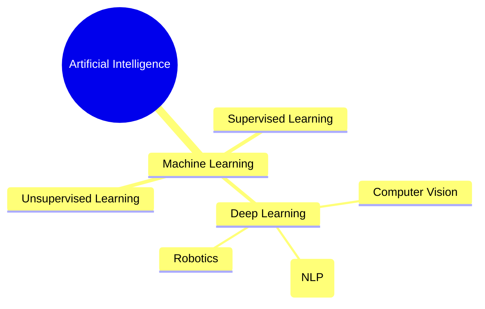

# 1. Definition and History of Deep Learning

## Essential Background Knowledge

**Artificial Intelligence (AI)** is the broad concept of machines being able to carry out tasks in a way that we would consider "smart." **Machine Learning (ML)** is an application of AI based around the idea that we should just be able to give machines access to data and let them learn for themselves. **Deep Learning (DL)** is a highly specialized subset of Machine Learning.

## What is Deep Learning?

Deep Learning is a machine learning method based on **Artificial Neural Networks (ANNs)** with multiple layers (hence the word "deep"). These deep layers allow the network to learn incredibly complex representations directly from raw, unstructured data (like pixels in an image or sound waves in audio).

## Historical Evolution of Deep Learning

The journey of neural networks has been marked by periods of extreme hype followed by "AI Winters," until the massive boom in the 2010s.

- **1943 - 1960: Biological Inspiration**
  - The first artificial neuron was modeled by McCulloch & Pitts.
  - **Frank Rosenblatt** invented the **Perceptron** (the first trainable neural network).
- **1980 - 1998: Learning and Vision**
  - **Geoffrey Hinton** popularized **Backpropagation**, the algorithm used to train networks.
  - **Yann LeCun** invented Convolutional Neural Networks (CNNs), crucial for image recognition (e.g., reading handwritten digits on checks).
  - **Yoshua Bengio** (1990) combined ANNs with probabilistic sequence models, laying the groundwork for attention mechanisms used in modern translation.
- **The Dark Ages (up to 2006)**
  - Neural networks were largely abandoned. Traditional statistical methods like Support Vector Machines (SVMs) and Random Forests were favored because early neural networks were too hard to train and required too much compute power.
- **2012: The Great Shift (AlexNet)**
  - The **ImageNet Challenge** (classifying 1 million images into 1000 categories) was decisively won by Geoffrey Hinton's team.
  - **The Secret Sauce:** Hinton's brilliant idea to repurpose **GPUs** (Graphics Processing Units, originally built for video games) to process massive mathematical calculations in parallel.
- **2014: GANs**
  - Ian Goodfellow invented Generative Adversarial Networks, allowing AI to create ultra-realistic fake images.
- **2017 - Present: The Generative AI Era**
  - Google introduced the **Transformer** architecture ("Attention is All You Need").
  - Hinton, LeCun, and Bengio won the Turing Award (the Nobel Prize of Computing) in 2018.
  - Rise of Large Language Models (LLMs) like GPT-3, ChatGPT, Gemini, etc.

> [!TIP] Key Takeaway
> Deep Learning succeeded recently not because the math changed drastically since the 80s, but because we finally acquired the **Massive Data (Big Data)** and **Computing Power (GPUs)** required to make the math work effectively.
