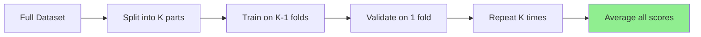
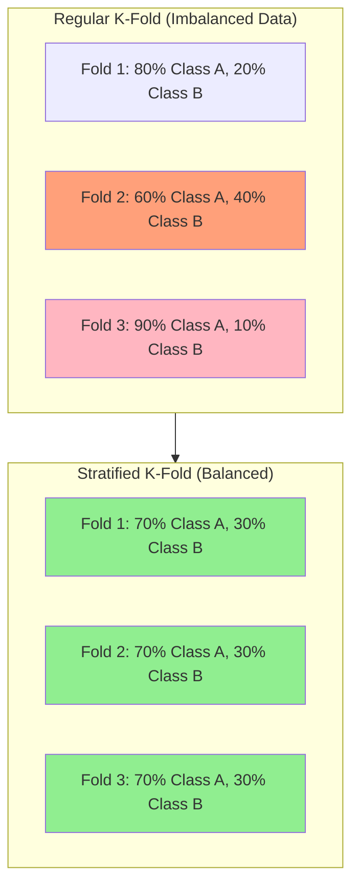
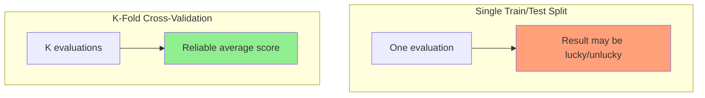

# Cross-Validation (K-Fold)

## Definition
**Cross-validation** is a technique to evaluate model performance by splitting data into multiple training/validation sets.

---

## K-Fold Cross-Validation Visual

```mermaid
block-beta
    columns 5
    
    block:fold1
        A1["TEST"]
        A2["TRAIN"]
        A3["TRAIN"]
        A4["TRAIN"]
        A5["TRAIN"]
    end
    
    block:fold2
        B1["TRAIN"]
        B2["TEST"]
        B3["TRAIN"]
        B4["TRAIN"]
        B5["TRAIN"]
    end
    
    block:fold3
        C1["TRAIN"]
        C2["TRAIN"]
        C3["TEST"]
        C4["TRAIN"]
        C5["TRAIN"]
    end
    
    block:fold4
        D1["TRAIN"]
        D2["TRAIN"]
        D3["TRAIN"]
        D4["TEST"]
        D5["TRAIN"]
    end
    
    block:fold5
        E1["TRAIN"]
        E2["TRAIN"]
        E3["TRAIN"]
        E4["TRAIN"]
        E5["TEST"]
    end
```



**Final Score = Average of all 5 fold scores**

---

## How It Works



1. **Split data into K equal parts** (folds)
2. **Train on K-1 folds**, validate on 1 fold
3. **Repeat K times**, each fold used as validation once
4. **Average all K scores** for final evaluation

---

## Why Use Cross-Validation?

| Benefit | Explanation |
|---------|-------------|
| **More Reliable Evaluation** | Uses all data for validation eventually |
| **Detects Overfitting** | High variance across folds indicates overfitting |
| **Better for Small Data** | Maximizes use of limited data |
| **Hyperparameter Tuning** | More robust than single train/test split |

---

## Common Values of K


| K Value | Use Case |
|---------|----------|
| **K=5** | Standard choice, good balance |
| **K=10** | More thorough, more computation |
| **K=N** (Leave-One-Out) | Maximum accuracy, very expensive |

---

## Stratified K-Fold

For **imbalanced datasets**, use Stratified K-Fold to maintain class distribution:



---

## Python Example

```python
from sklearn.model_selection import cross_val_score, KFold
from sklearn.ensemble import RandomForestClassifier

# Set up K-Fold
kf = KFold(n_splits=5, shuffle=True, random_state=42)

# Perform cross-validation
model = RandomForestClassifier()
scores = cross_val_score(model, X, y, cv=kf, scoring='accuracy')

print(f"Fold scores: {scores}")
print(f"Mean accuracy: {scores.mean():.3f}")
print(f"Standard deviation: {scores.std():.3f}")
```

### Stratified Version

```python
from sklearn.model_selection import StratifiedKFold

skf = StratifiedKFold(n_splits=5, shuffle=True, random_state=42)
scores = cross_val_score(model, X, y, cv=skf)
```

---

## Cross-Validation vs Single Split



---

## Quick Memory Aid
**Cross-Validation** = Rotate test data → Reliable scores → Use K=5 or K=10