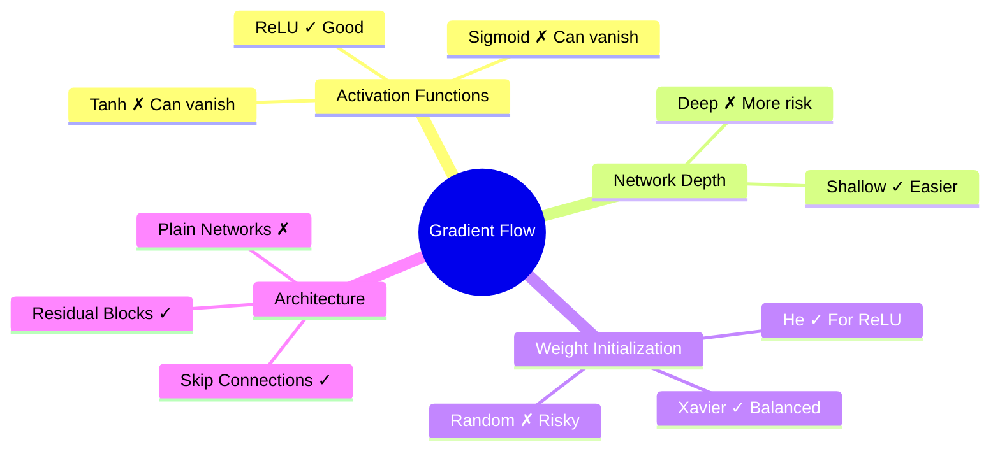
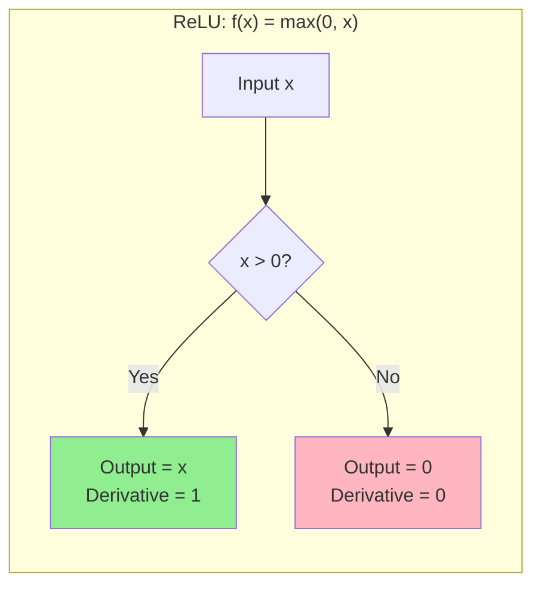
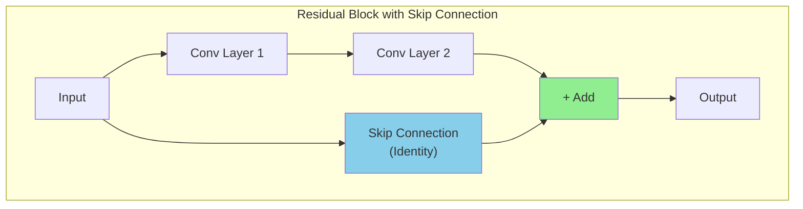

# Gradient Flow

## Definition
**Gradient flow** describes how gradients propagate backward through layers during training.

---

## Good vs Poor Gradient Flow

```mermaid
flowchart TB
    subgraph Good["✓ Good Gradient Flow"]
        G_Input[Input Layer]
        G_H1[Hidden Layer 1]
        G_H2[Hidden Layer 2]
        G_Out[Output Layer]
        
        G_Out -->|Strong| G_H2
        G_H2 -->|Strong| G_H1
        G_H1 -->|Strong| G_Input
    end
    
    subgraph Poor["✗ Poor Gradient Flow"]
        P_Input[Input Layer]
        P_H1[Hidden Layer 1]
        P_H2[Hidden Layer 2]
        P_Out[Output Layer]
        
        P_Out -->|Strong| P_H2
        P_H2 -->|Weak| P_H1
        P_H1 -->|Tiny| P_Input
    end
    
    style G_Input fill:#90EE90
    style G_H1 fill:#90EE90
    style G_H2 fill:#90EE90
    style G_Out fill:#98FB98
    
    style P_Input fill:#FFB6C1
    style P_H1 fill:#FFA07A
    style P_H2 fill:#90EE90
    style P_Out fill:#98FB98
```

---

## Factors Affecting Gradient Flow

| Factor | Impact |
|--------|--------|
| **Activation Functions** | ReLU improves flow; Sigmoid/Tanh hinder it |
| **Network Depth** | Deeper = more opportunities for degradation |
| **Weight Initialization** | Poor initialization → poor flow from start |
| **Skip Connections** | Provide "highways" for gradients |

---

## Why It's Important

1. **All layers learn properly** with good gradient flow
2. **Faster convergence** during training
3. **Enables training very deep networks** (100+ layers)

---

## The ReLU Advantage

**For positive inputs:**
- Gradient = 1 (passes through unchanged!)
- No multiplication of small numbers
- Gradient preserved through many layers

---

## How Skip Connections Help

**Benefits:**
- Gradient can flow directly through skip connection
- Even if main path has vanishing gradients, skip path preserves them
- Enables training of 100+ layer networks

---

## Quick Memory Aid
**Gradient Flow** = Highway for learning signals → ReLU + Skip Connections keep it smooth