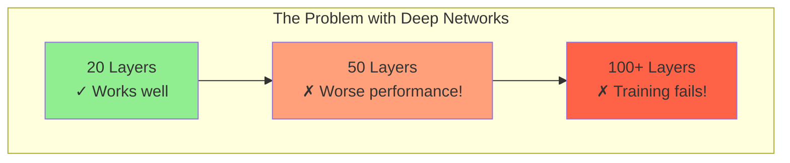
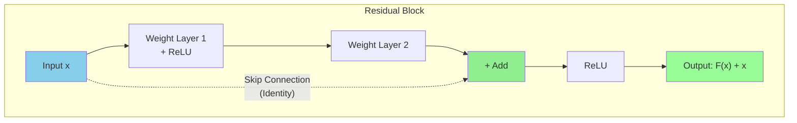
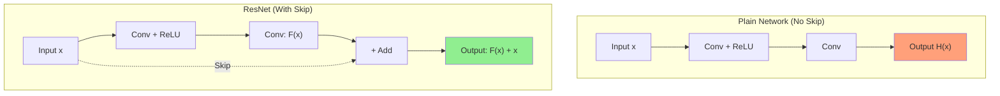
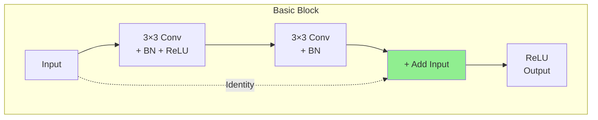
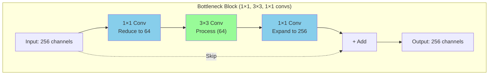
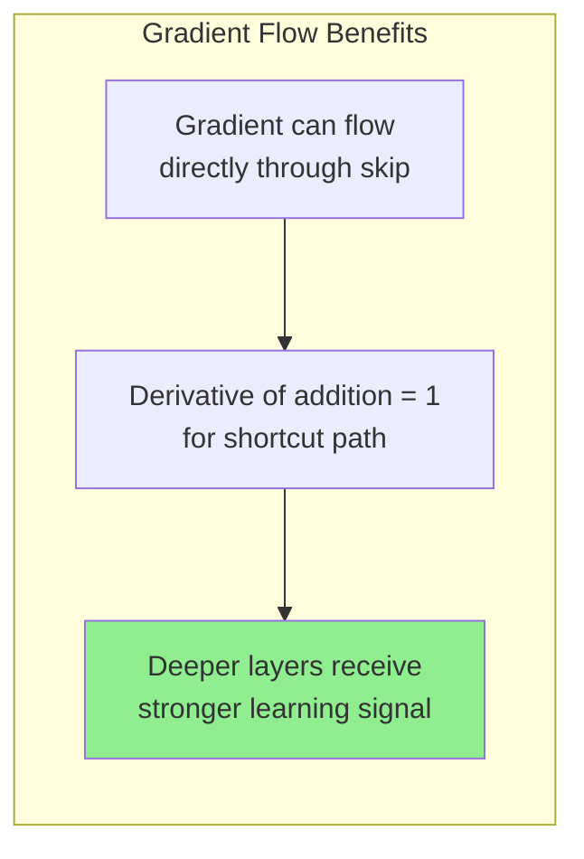
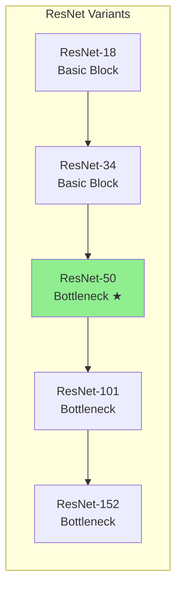
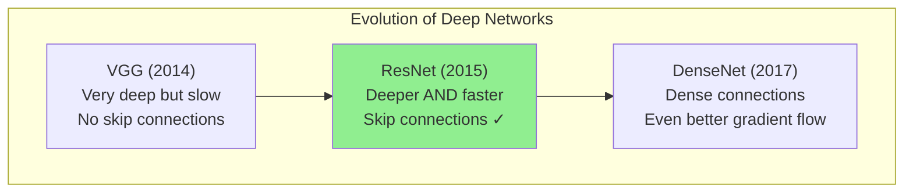
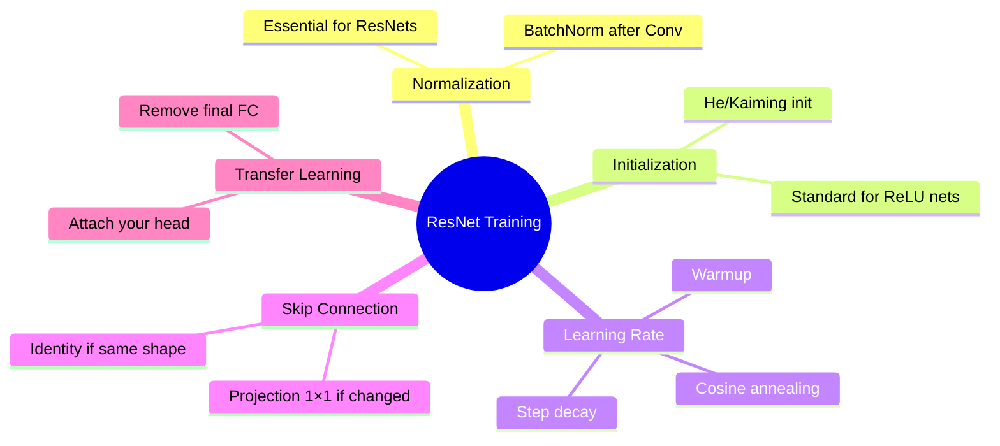
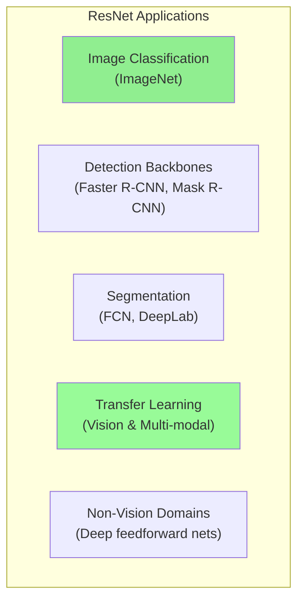

# ResNet (Residual Networks)

## What is ResNet?

**ResNet** (Residual Network) is a family of deep convolutional neural network architectures introduced to make very deep networks trainable by using **skip connections** (also called shortcut connections). It solved the problem that simply stacking more layers often made training **worse** (not better) due to vanishing/exploding gradients and optimization difficulties.

---

## The Problem: Why Do We Need ResNet?



**Paradox:** Deeper networks should perform better, but they often perform **worse** due to:
- **Vanishing gradients** - early layers don't learn
- **Degradation problem** - even with good initialization, deeper = harder to optimize

---

## Intuition / Motivation

When you stack many layers, it becomes hard for SGD to update weights so deeper layers improve performance. ResNet puts **identity shortcuts** that let gradients and signals flow directly through the network.

### Key Insight
Instead of forcing a block to learn a full mapping **H(x)**, you ask it to learn the **residual**:

$$F(x) = H(x) - x$$

Then the block output is:

$$\text{output} = F(x) + x$$

**If the block cannot improve on identity**, it can learn F(x) ≈ 0 so the block behaves like an identity — this stabilizes very deep nets.

---

## The Solution: Skip Connections



---

## Plain Network vs ResNet



---

## The Residual Block (Two Variants)

### Basic Block (ResNet-18 / ResNet-34)



- Two 3×3 convolutions (Conv-BN-ReLU), then add the input (x)
- If spatial or channel dimensions change (stride >1 or different channels), a **projection** (1×1 conv) is applied to x to match shapes

### Bottleneck Block (ResNet-50/101/152)



- 1×1 conv reduces channels → 3×3 conv processes → 1×1 conv expands channels
- Reduces computation while allowing deeper models

---

## Why Skip Connections Help (Gradient View)



### 1. **Gradient Highway**
- Skip connection acts as a "gradient superhighway"
- Gradients flow backward without being multiplied by small numbers
- Derivative of addition is 1 for the shortcut path

### 2. **Easy Identity Learning**
- If the best solution is to pass input unchanged, network can learn F(x) = 0
- Then H(x) = 0 + x = x (identity mapping)

### 3. **Solves Degradation Problem**
- Adding more layers doesn't hurt performance
- Network can always learn to ignore extra layers if needed

---

## ResNet Versions and Differences



| Model | Layers | Block Type | Use Case |
|-------|--------|------------|----------|
| ResNet-18 | 18 | Basic | Small datasets, fast training |
| ResNet-34 | 34 | Basic | Medium complexity tasks |
| **ResNet-50** | 50 | Bottleneck | **Most popular, good balance** |
| ResNet-101 | 101 | Bottleneck | Complex tasks, more compute |
| ResNet-152 | 152 | Bottleneck | Research, maximum accuracy |

### ResNet-v2 (Pre-activation)
- Reorders block as **BN → ReLU → Conv**
- Helps optimization and generalization in very deep models

---

## ResNet vs Previous Architectures



---

## Practical Details / Training Tips



| Tip | Details |
|-----|---------|
| **BatchNorm** | Use after convolutions (ResNets rely on it) |
| **Initialization** | He initialization (Kaiming) is standard |
| **Learning Rate** | Typical schedules: step decay, cosine, warmup |
| **Projection** | If channels/stride change, use 1×1 conv in shortcut |
| **Transfer Learning** | Remove final FC layer and attach your custom head |

---

## Common Uses



- **Image classification** (ImageNet)
- **Detection and segmentation backbones** (Faster R-CNN, Mask R-CNN)
- **Transfer learning backbone** in many vision and multi-modal architectures
- **Non-vision domains** where very deep feedforward nets are helpful

---

## Strengths and Limitations

### Strengths ✓

| Strength | Explanation |
|----------|-------------|
| **Elegant Design** | Simple trick with outsized impact — fundamentally changed deep learning |
| **Robust Backbone** | Very reliable for transfer learning |
| **Scalable** | Scales to deep models (100+ layers) while remaining trainable |
| **Must-Know Baseline** | Understanding residual connections is essential for modern architectures |

### Limitations ✗

| Limitation | Explanation |
|------------|-------------|
| **Compute Heavy** | Still heavy compute for large models |
| **Newer Architectures** | Swin, ConvNeXt, Vision Transformers can outperform ResNets on some tasks |
| **May Need Modifications** | Pre-activation, layer scaling, improved normalization can provide better performance |

---

## Key Takeaways

```mermaid
mindmap
    root((ResNet))
        Core Idea
            Skip Connections
            Learn Residual F(x)
            Output = F(x) + x
        Benefits
            Train Very Deep Networks
            Solve Vanishing Gradients
            Easy Identity Learning
        Variants
            ResNet-18 to ResNet-152
            Basic vs Bottleneck Blocks
            Pre-activation ResNet v2
        Impact
            Won ImageNet 2015
            152 layers trained
            Foundation for many architectures
```

---

## Quick Memory Aid

| Term | Meaning |
|------|---------|
| **ResNet** | Residual Network with skip connections |
| **Skip Connection** | Direct path that adds input to output |
| **Residual** | What the network learns (F(x) = H(x) - x) |
| **Bottleneck** | 1×1 → 3×3 → 1×1 conv block for efficiency |
| **Basic Block** | Two 3×3 convs (ResNet-18/34) |
| **Projection** | 1×1 conv to match dimensions when needed |

**ResNet = Skip connections let gradients flow → Train 100+ layers successfully!**