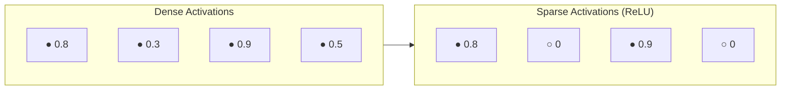
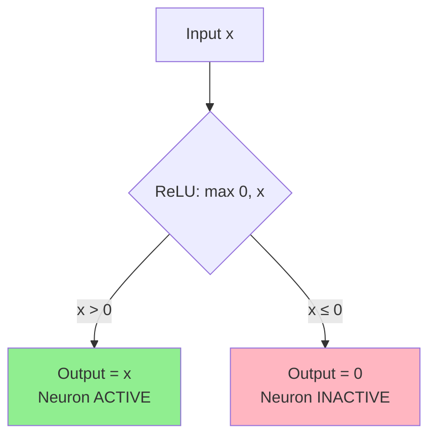

# Sparsity / Sparse Activations

## Definition
A neural network is **sparse** when **most of its neurons are inactive (output zero) at any given time**.

---

## How It Happens
- **ReLU** naturally creates sparsity: negative inputs → output = 0
- These "dead" neurons don't contribute to the next layer

---

## Example
```
Layer with 1000 neurons
Only 300 neurons fire (output > 0) for a given input
→ 70% sparsity
```

---

## Visual: Dense vs Sparse Activations



---

## Why Sparsity Matters

| Benefit | Explanation |
|---------|-------------|
| **Computational Efficiency** | Fewer active neurons → fewer calculations |
| **Better Generalization** | Network focuses on important features, not all neurons |
| **Memory Efficiency** | Sparse matrices can be stored more compactly |
| **Reduced Overfitting** | Less reliance on every neuron reduces memorization |

---

## How ReLU Creates Sparsity



---

## Quick Memory Aid
**Sparse** = Many zeros = Efficiency + Better Generalization