# Train-Validation-Test Split

## Overview

In supervised learning, datasets are commonly split into **three disjoint parts**, each serving a distinct purpose in the model development process.

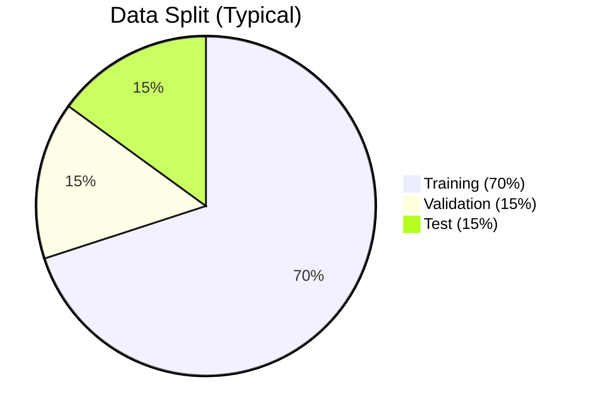

---

## The Three Sets

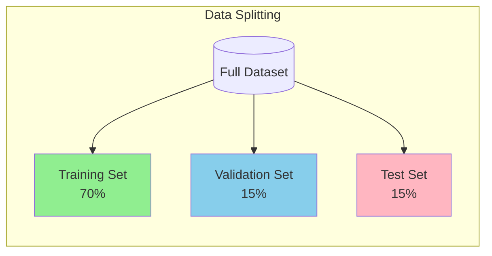

---

## 1. Training Set (70%)

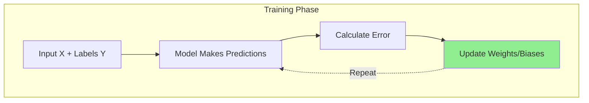

| Aspect | Details |
|--------|---------|
| **Purpose** | Used to "teach" the model |
| **Action** | Algorithm sees X and Y, calculates errors, updates parameters |
| **What It Does** | The model **learns** patterns from this data |

**Key Point:** This is where the model's weights and biases are adjusted through optimization (like gradient descent).

---

## 2. Validation Set (15%)

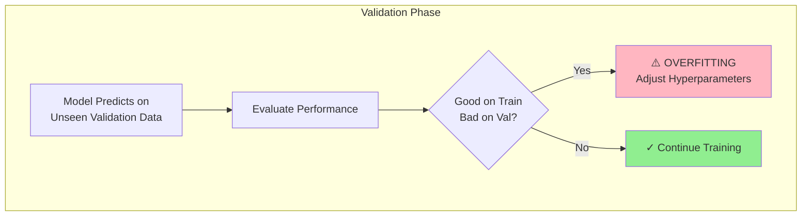

| Aspect | Details |
|--------|---------|
| **Purpose** | **Model Selection** and **Hyperparameter Tuning** |
| **Action** | Used *during* training to check performance |
| **What It Does** | Detects overfitting, guides hyperparameter choices |

### Why Validation Matters

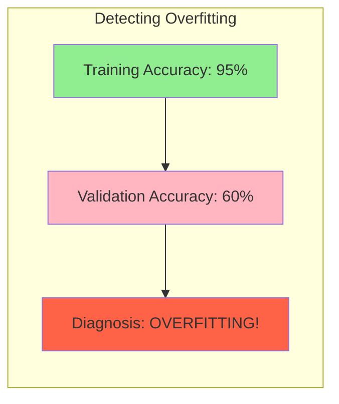

**If model performs well on Training but poorly on Validation → OVERFITTING**

### What We Use Validation For

| Hyperparameter | Example Values to Try |
|----------------|----------------------|
| K in KNN | 3, 5, 7, 9, 11 |
| Learning Rate | 0.001, 0.01, 0.1 |
| Number of Trees (Random Forest) | 50, 100, 200 |
| Max Depth | 5, 10, 20, None |
| Number of Epochs | Early stopping when val loss increases |

---

## 3. Test Set (15%)

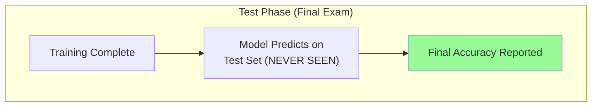

| Aspect | Details |
|--------|---------|
| **Purpose** | **Final Evaluation** |
| **Action** | Used **only once** at the very end |
| **What It Does** | Acts as the "Final Exam" for real-world accuracy |

### ⚠️ Critical Rule

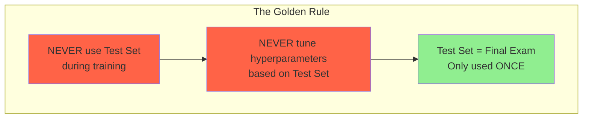

**If you use the Test Set to tune your model, you're cheating!** The test set should represent truly unseen data.

---

# The Validation Step (Deep Dive)

## What Is the Validation Step?

The **validation step** is the phase where:

> The current version of the trained model is evaluated on unseen data (validation set) **without updating parameters**.

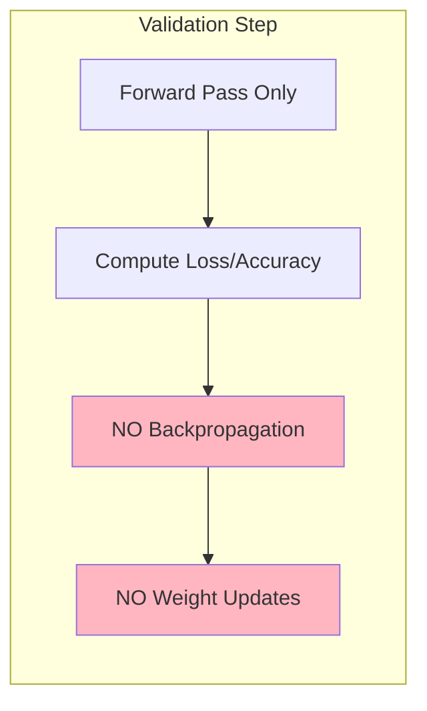

**Formally:**
- No backpropagation
- No weight updates
- No gradient computation
- Only forward pass + metric computation

**Its role is diagnostic and regulatory, not learning.**

It is not part of learning the weights. It is part of **learning how to train the model correctly**.

---

## How It Works During Each Epoch

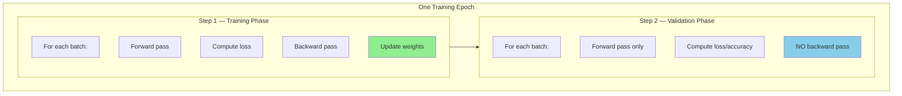

After every epoch, you get:
- Training Loss
- Training Accuracy
- Validation Loss
- Validation Accuracy

These values are tracked over time.

---

## Why the Validation Step Exists

### 1. Detecting Overfitting

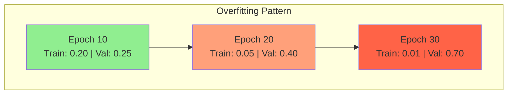

| Epoch | Train Loss | Val Loss | Interpretation |
|-------|------------|----------|----------------|
| 10 | 0.20 | 0.25 | ✓ Good |
| 20 | 0.05 | 0.40 | ⚠️ Starting to overfit |
| 30 | 0.01 | 0.70 | ✗ Severe overfitting |

**Interpretation:**
- Model keeps improving on training
- Gets worse on validation
- Means: **memorizing, not generalizing**

**Without validation, you would never see this.**

---

### 2. Hyperparameter Selection

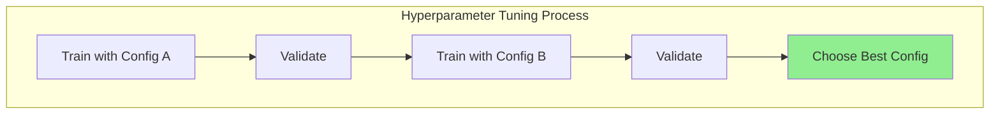

**Hyperparameters cannot be learned by gradient descent.**

| Hyperparameter | What It Controls |
|----------------|------------------|
| Learning Rate | Step size in optimization |
| Batch Size | Samples per gradient update |
| Number of Layers | Network depth |
| K in KNN | Number of neighbors |
| Regularization Strength | Penalty on complexity |
| Dropout Rate | Fraction of neurons to drop |

**Process:**
1. Train model with config A → Validate
2. Train model with config B → Validate
3. Choose best config based on validation performance

**Validation set decides.**

---

### 3. Early Stopping

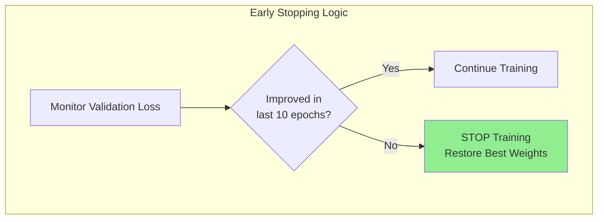

**Rule Example:**
> If validation loss does not improve for 10 epochs → stop training.

This prevents over-training and automatically selects the best epoch.

---

## Validation vs Training vs Test (Key Differences)

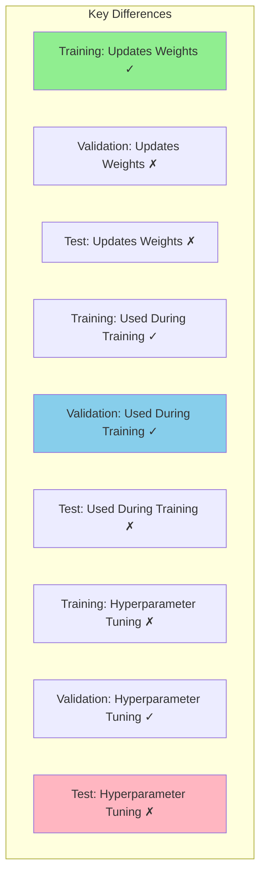

| Property | Training | Validation | Test |
|----------|----------|------------|------|
| **Updates Weights** | ✓ Yes | ✗ No | ✗ No |
| **Used During Training** | ✓ Yes | ✓ Yes | ✗ No |
| **Hyperparameter Tuning** | ✗ No | ✓ Yes | ✗ No |
| **Performance Reporting** | ✗ No | ✗ No | ✓ Yes |
| **Seen by Model** | ✓ Yes | Indirectly | ✗ Never |

**Important:** The model **never learns directly from validation**, but training decisions depend on it.

---

## Mathematical View

Let:
- θ = model parameters (weights)
- λ = hyperparameters

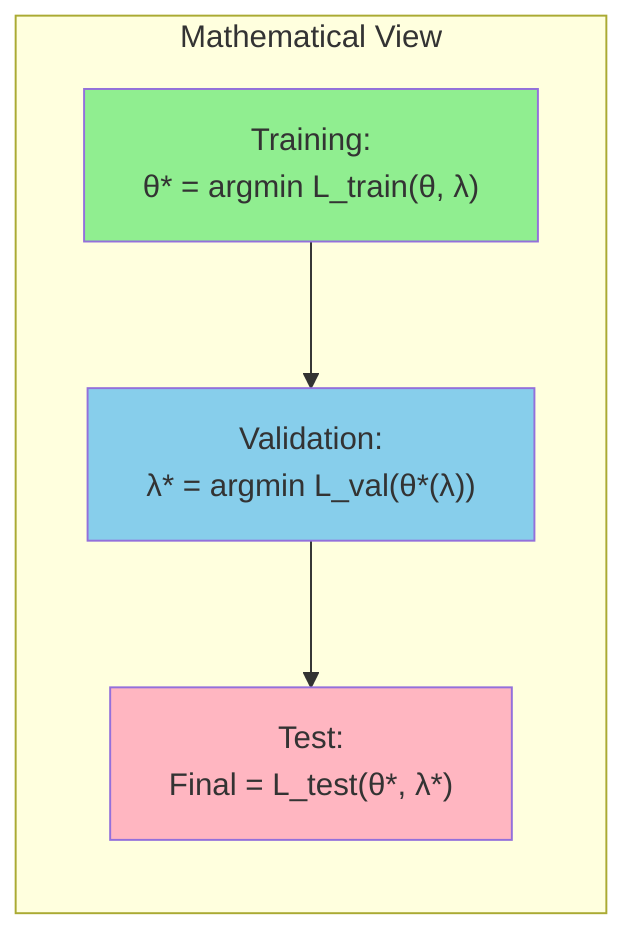

**Meaning:**
- **Training** optimizes θ (weights)
- **Validation** optimizes λ (hyperparameters)
- **Test** evaluates final model

---

## Cross-Validation vs Validation Set

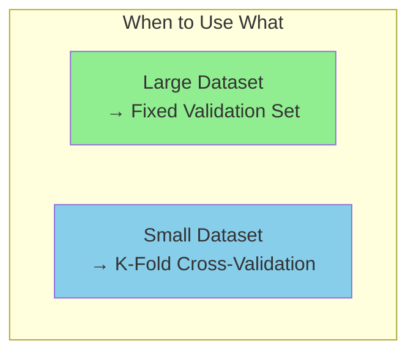

**When you don't have enough data:**

Instead of a fixed validation set, use **K-Fold Cross-Validation**:
- Split data into K folds
- Rotate which fold is validation
- Average results across all folds

This replaces a static validation set when data is limited.

---

## Common Mistakes

### Mistake 1: Tuning on Test Set

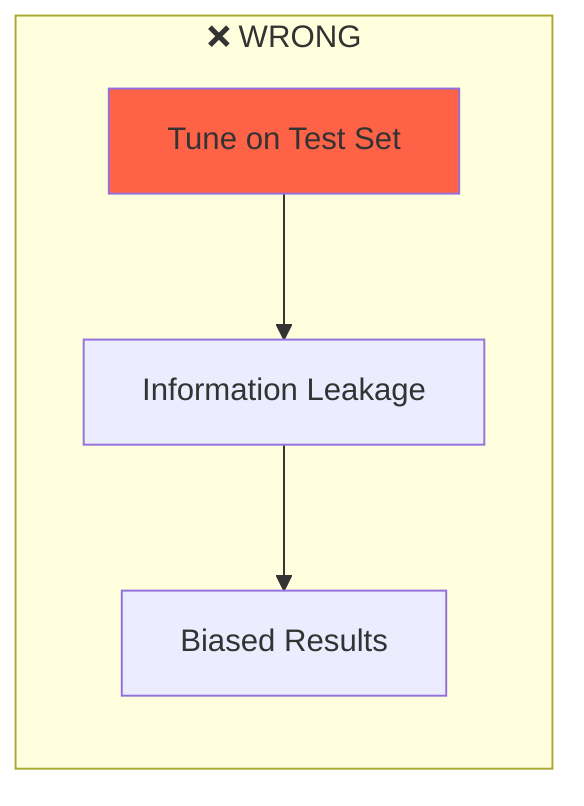

**If you tune using test data → You leak information → Result is biased → Not publishable.**

---

### Mistake 2: Training on Validation Later

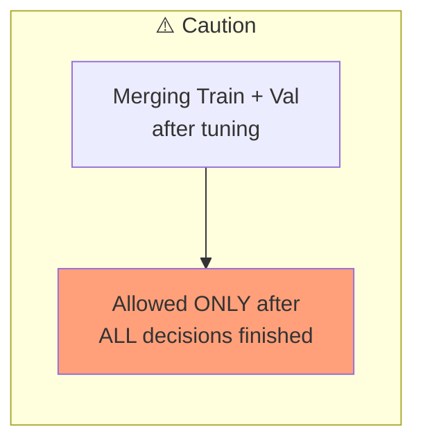

Sometimes people merge train+val after tuning. This is allowed **only after all decisions are finished**.

---

### Mistake 3: Ignoring Validation Curves

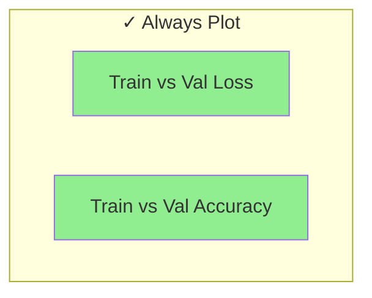

Only looking at final accuracy hides overfitting. **Always plot curves over time.**

---

## Mental Model

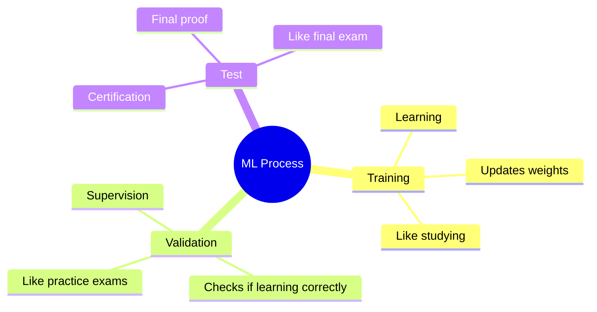

| Phase | Analogy | Purpose |
|-------|---------|---------|
| **Training** | Learning / Studying | Makes you better |
| **Validation** | Supervision / Practice Exams | Checks if you're learning correctly |
| **Test** | Certification / Final Exam | Proves your ability |

---

## Why Validation Matters (Opinion)

> Validation is one of the most underestimated parts of ML.

Many "good" models are actually:
- Overfit models with bad validation discipline
- Poorly tuned models with no early stopping
- Models optimized on leaked test data

**A clean validation pipeline matters more than fancy architectures.**

**If validation is wrong, your results are meaningless.**

---

## Comparison Table

| Set | Purpose | When Used | Can Model "See" It? |
|-----|---------|-----------|---------------------|
| **Training** | Learn patterns | Throughout training | ✓ Yes (weights updated) |
| **Validation** | Tune & detect overfitting | During training | ✗ No (only evaluation) |
| **Test** | Final evaluation | Once at the end | ✗ No (final exam) |

---

## Visual: The Complete Workflow

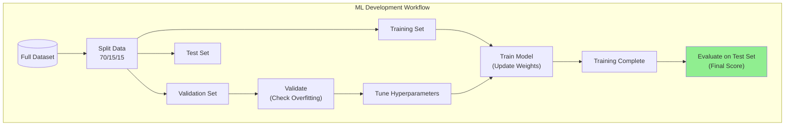

---

## Analogy: Student Learning

| Set | Student Analogy |
|-----|-----------------|
| **Training** | Textbook, notes, practice problems (student learns from these) |
| **Validation** | Practice exams (check understanding, adjust study methods) |
| **Test** | Final exam (never seen before, real measure of knowledge) |

---

## Common Split Ratios

| Ratio | When to Use |
|-------|-------------|
| **70/15/15** | Standard, balanced approach |
| **80/10/10** | Large datasets, less need for validation |
| **60/20/20** | Small datasets, need more validation reliability |
| **98/1/1** | Very large data (millions of samples) |

---

## Quick Memory Aid

| Set | Purpose | Remember As |
|-----|---------|-------------|
| **Training** | Learn | "Textbook" - model learns here |
| **Validation** | Tune | "Practice Exam" - adjust hyperparameters |
| **Test** | Evaluate | "Final Exam" - used ONCE for final score |

**Training = Learn | Validation = Tune | Test = Final Score**