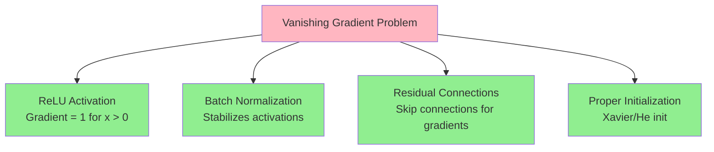

# Vanishing Gradient

## Definition
During backpropagation, **gradients (used to update weights) become extremely small**, often near 0, as they propagate backward through deep networks.

---

## The Problem: Gradients Shrink Through Layers

```mermaid
flowchart LR
    subgraph Backward["← Backpropagation Direction"]
        L1["Layer 1<br/>Gradient: TINY"]
        L2["Layer 2<br/>Gradient: Small"]
        L3["Layer 3<br/>Gradient: Medium"]
        LN["Layer N (Output)<br/>Gradient: Large"]
    end
    
    L1 <-- L2 <-- L3 <-- LN
    
    style L1 fill:#FFB6C1
    style L2 fill:#FFA07A
    style L3 fill:#90EE90
    style LN fill:#98FB98
```

---

## Why It Happens

| Activation | Derivative Range | Problem |
|------------|------------------|---------|
| **Sigmoid** | 0 to 0.25 | Derivative ≤ 0.25, multiplies down layers |
| **Tanh** | 0 to 1 | Derivative ≤ 1, still can vanish |
| **ReLU** | 0 or 1 | No vanishing for positive inputs! |

---

## Mathematical Explanation

```
For sigmoid: σ'(x) = σ(x) × (1 - σ(x))
Maximum value = 0.25 (when σ(x) = 0.5)

In a 10-layer network:
0.25^10 ≈ 0.0000000009 → gradient is essentially ZERO
```

---

## Visual: Sigmoid Derivative Problem


---

## Consequences

1. **Early layers learn very slowly** or almost not at all
2. **Training becomes inefficient** or fails entirely
3. **Deep networks become impossible to train**

---

## Solutions



| Solution | How It Helps |
|----------|--------------|
| **ReLU Activation** | Gradient = 1 for positive inputs (no vanishing) |
| **Batch Normalization** | Normalizes activations, stabilizes gradients |
| **Residual Connections** | Skip connections allow gradients to flow directly |
| **Proper Initialization** | Xavier/He initialization prevents early vanishing |

---

## Quick Memory Aid
**Vanishing Gradient** = Gradients disappear → Can't learn → Use ReLU to fix