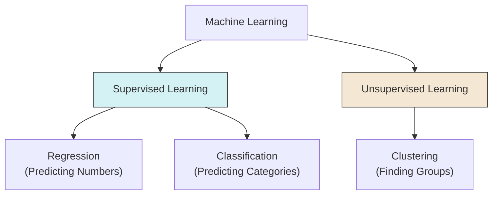

# 1.2. Taxonomy of Learning Algorithms

Machine Learning is strictly categorized based on the *nature of the data* available during the training phase.

## 1. Supervised Learning (Apprentissage Supervisé)

In supervised learning, the model is trained on a **labeled dataset**. This is akin to a student learning with a teacher who provides the answer key.

### Key Characteristics
*   **Input ($X$):** Known.
*   **Output ($Y$):** **Known** and provided during training.
*   **Goal:** Learn the mapping $Y \approx f(X)$ to predict $Y$ for future unseen $X$.

### Sub-Categories
1.  **Regression:**
    *   **Output:** A continuous numerical value (Quantitative).
    *   *Examples:* Predicting temperature ($24.5^\circ C$), Predicting House Price ($350,000), Predicting Stock Market value.
    *   *Algorithms:* Linear Regression, Non-Linear Regression, Neural Networks (Output layer linear).
2.  **Classification:**
    *   **Output:** A discrete class or category (Qualitative).
    *   *Examples:* Spam vs. Not Spam, Benign vs. Malignant, Handwriting recognition (0-9).
    *   *Algorithms:* Logistic Regression, SVM, KNN, Neural Networks (Output layer Softmax).

---

## 2. Unsupervised Learning (Apprentissage Non Supervisé)

In unsupervised learning, the model is trained on an **unlabeled dataset**. There is no teacher, and there are no "correct answers."

### Key Characteristics
*   **Input ($X$):** Known.
*   **Output ($Y$):** **Unknown / Non-existent**.
*   **Goal:** Discovery of structure. The algorithm looks for patterns, groupings, or densities within $X$.

### Primary Task: Clustering (Regroupement)
Clustering involves grouping data points such that points in the same group are more similar to each other than to points in other groups.
*   *Algorithm Example:* **K-Means**.
*   *Process:* The algorithm proposes the groups ($Y$) based on data proximity.

---

## 3. Concrete Example: The Medical Diagnosis

To fully grasp the difference, consider a medical table containing patient data.

| Descriptors ($X$) | | | Label ($Y$) |
| :--- | :---: | :---: | :--- |
| **Sugar Level** | **Iron Level** | ... | **Disease Type** |
| High | Low | ... | *Sick (Type A)* |
| Normal | Normal | ... | *Healthy* |
| High | High | ... | *Sick (Type B)* |

### How the approaches differ:

1.  **Supervised View (Classification):**
    *   **Training:** You feed the computer the **Sugar**, **Iron**, AND the **Disease Type**.
    *   **Logic:** The computer learns: *"If Sugar is High and Iron is Low, the output should be Type A."*
    *   **Use Case:** A new patient arrives. We measure Sugar/Iron. The model predicts: "This patient has Type A."

2.  **Unsupervised View (Clustering):**
    *   **Training:** You feed the computer **ONLY** the **Sugar** and **Iron** levels. You **hide** the Disease Type column.
    *   **Logic:** The computer analyzes the data geometry. It says: *"I noticed that Patient 1 and Patient 3 have very similar strange blood levels. I will put them in 'Group 1'. Patient 2 looks different, so they go in 'Group 2'."*
    *   **Result:** It discovers distinct groups of patients, but it cannot name the disease. It just knows they are mathematically similar.

> [!WARNING] Common Pitfall
> Do not confuse **Clustering** with **Classification**.
> *   **Classification:** You define the classes beforehand (e.g., "Cats" and "Dogs").
> *   **Clustering:** The machine invents the classes based on similarity (e.g., "Group 1" and "Group 2").