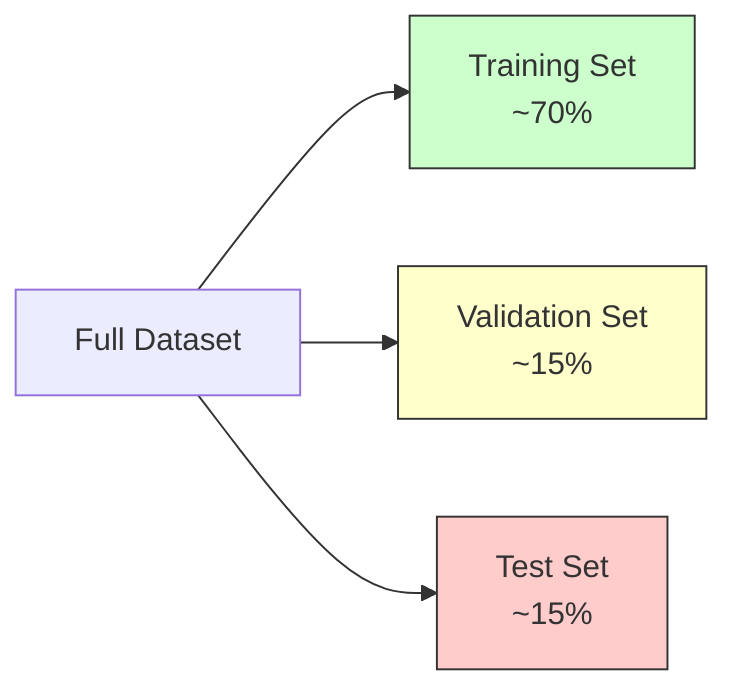

# 1.3. Data Management & Generalization

The ultimate goal of Machine Learning is not to memorize data, but to **generalize**. Generalization is the ability of a model to perform accurately on new, unseen data.

## 1. The Dataset Split Strategy
To ensure a model can generalize, we never train and test on the same data. This would be like giving a student the exam questions to study; they would score 100% but learn nothing (memorization).

We typically split the full dataset into three distinct subsets:

1.  **Training Set (70%):**
    *   **Purpose:** Used to "teach" the model.
    *   **Action:** The algorithm sees $X$ and $Y$, calculates errors, and updates its internal parameters (weights/biases).
2.  **Validation Set (15%):**
    *   **Purpose:** Used for **Model Selection** and **[[Hyperparameter Tuning]]**.
    *   **Action:** Used *during* training to check performance. If the model does well on Training but bad on Validation, we are Overfitting. We use this set to choose parameters like $K$ in KNN or learning rate in Neural Networks.
3.  **Test Set (15%):**
    *   **Purpose:** Final Evaluation.
    *   **Action:** Used **only once** at the very end. It acts as the "Final Exam" to report the real-world accuracy of the model.

> [!DANGER] Critical Rule
> **Never** use the Test Set for training or tuning. If you peek at the Test Set to adjust your model, you commit **Data Leakage**, and your reported accuracy will be fake.

---

## 2. Overfitting vs. Underfitting (Bias-Variance Tradeoff)

### A. Underfitting (High Bias)
*   **Definition:** The model is too simple to capture the underlying structure of the data.
*   **Symptoms:** Poor performance on Training Data AND Poor performance on Validation Data.
*   **Example:** Trying to fit a complex curve with a straight line.
*   **Solution:** Use a more complex model (e.g., add layers to ANN, use polynomial regression).

### B. Overfitting (High Variance)
*   **Definition:** The model is too complex. It memorizes the "noise" and random fluctuations in the training data rather than the pattern.
*   **Symptoms:** Amazing performance on Training Data (near 100%), but Terrible performance on Validation Data.
*   **Example:** Connecting every single dot in a scatter plot with a jagged line.
*   **Solution:** Get more data, simplify the model, use regularization, or stop training earlier (Early Stopping).

---

## 3. Cross-Validation (Robust Evaluation)
When the dataset is small, splitting off 30% for validation/testing might leave too little data for training. We use **Cross-Validation** to solve this.

### K-Fold Cross-Validation
1.  Divide the dataset into $K$ equal parts (folds).
2.  **Iteration 1:** Train on Folds 1-4, Test on Fold 5.
3.  **Iteration 2:** Train on Folds 1,2,3,5, Test on Fold 4.
4.  ...Repeat $K$ times.
5.  **Result:** The final score is the **average** of all $K$ iterations.

This ensures that every data point has been used for testing exactly once, providing a statistically robust estimate of model performance.