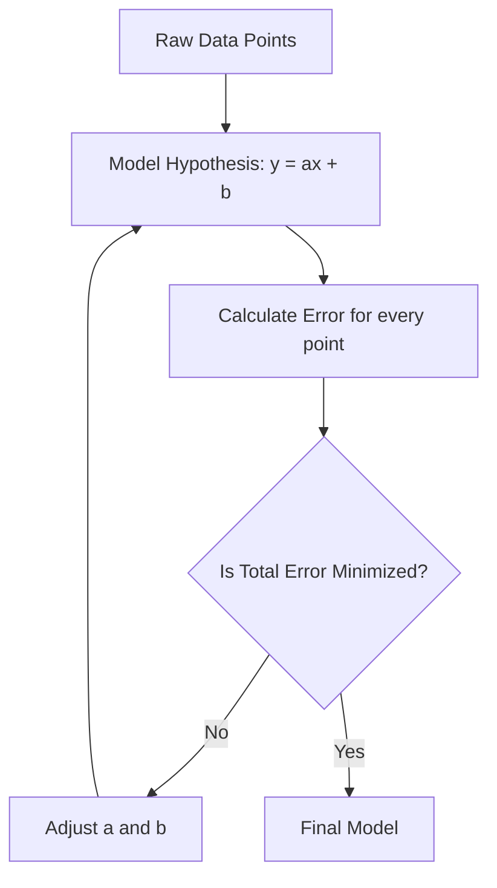

# 2.1. Linear Regression Mechanics

## 1. Definition and Objective
**Linear Regression** is the "Hello World" of Machine Learning algorithms. It is a **Supervised Learning** technique used for **Regression** tasks, meaning the target variable ($Y$) is continuous (a number), not a category.

### The Goal
The objective is to model the relationship between a dependent variable ($Y$) and one or more independent variables ($X$) by fitting a **linear equation** to observed data.

*   **Input ($X$):** The features (e.g., Study Time, House Size).
*   **Output ($Y$):** The target (e.g., Exam Score, House Price).
*   **Model:** A straight line (in 2D) or a hyperplane (in higher dimensions) that passes as close as possible to all data points.

---

## 2. The Linear Hypothesis (Scalar Form)

In its simplest form (Univariate Linear Regression), the relationship is defined by the equation of a line:

$$ \hat{y} = ax + b $$

### Components:
1.  **$x$ (Input/Feature):** The known data point.
2.  **$a$ (Slope / Weight):**
    *   Determines the **steepness** of the line.
    *   Represents the **rate of change**. If $a=2$, it means for every 1 unit increase in $x$, $y$ increases by 2.
    *   *In ML notation:* Often denoted as $w$ (weight) or $\theta_1$.
3.  **$b$ (Y-Intercept / Bias):**
    *   Determines where the line crosses the Y-axis (when $x=0$).
    *   Represents the **baseline**. Even if you study 0 hours ($x=0$), you might still get a score of 10 ($b=10$).
    *   *In ML notation:* Often denoted as $\theta_0$.
4.  **$\hat{y}$ (Prediction):** The value the model *thinks* $y$ should be.

> [!NOTE] Linearity vs. Non-Linearity
> *   **Linear Regression:** Assumes a constant rate of change (Arithmetic Progression). $10, 20, 30 \dots$
> *   **Non-Linear Regression:** Required when the rate of change is not constant (Geometric/Exponential Progression). $2, 4, 8, 16 \dots$. This requires polynomial terms ($x^2, x^3$).

---

## 3. The Best Fit Line
Consider a dataset of students with Study Time vs. Scores.
If we plot the points, they will be scattered. We cannot draw a line that touches *every* point perfectly (unless the data is fake).

*   **The Challenge:** There are infinite possible lines we could draw (infinite combinations of $a$ and $b$).
*   **The Solution:** We must define a metric to measure "how bad" a line is (The Cost Function) and minimize it.

### Visualizing the Error (Residuals)
For any given data point $(x^{(i)}, y^{(i)})$, the **error** is the vertical distance between the actual point and the line.
$$ \text{Error}^{(i)} = y^{(i)} - \hat{y}^{(i)} $$

*   **Positive Error:** The point is above the line (Model underestimated).
*   **Negative Error:** The point is below the line (Model overestimated).