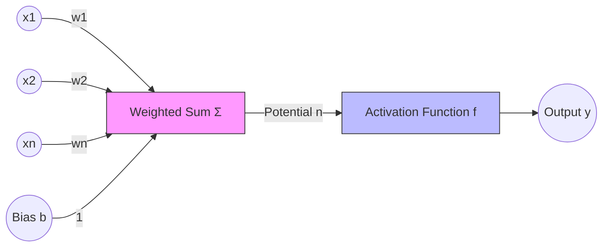

# 3.1. The Biological & Formal Neuron

Artificial Neural Networks (ANN) are a branch of Machine Learning inspired by the architecture of the human brain. The goal is to simulate the massive parallelism and learning capability of biological neurons.

## 1. The Biological Inspiration
To understand the math, we must look at the biological architecture:
1.  **Dendrites:** Receivers of electrical signals from other neurons.
2.  **Soma (Cell Body):** Sums the incoming signals. If the total electrical potential reaches a certain threshold, the neuron "fires."
3.  **Axon:** The transmission line that sends the signal to the next neuron.
4.  **Synapse:** The connection point. Learning happens by strengthening or weakening these connections.

---

## 2. The Formal Neuron (The Perceptron)
The **Formal Neuron** is the mathematical abstraction of the biological process. It is a parametric function that maps an input vector to a single output.

### The Mathematical Components:
1.  **Inputs ($x_i$):** The data features or outputs from a previous layer.
2.  **Weights ($w_i$):** Represent the **synaptic strength**. They determine how much influence a specific input has on the final output.
3.  **Bias ($b$):** 
    *   An additional parameter that allows the activation function to shift.
    *   **Analogy:** The bias is like a "threshold of stubbornness." It determines how high the signal must be before the neuron fires. Without it, the model would always be forced through the origin $(0,0)$.
4.  **The Potential ($n$):** The linear combination of inputs and weights.
    $$ n = \sum_{i=1}^{k} (w_i \cdot x_i) + b $$
5.  **Activation Function ($f$):** A non-linear function applied to the potential to produce the output.
6.  **Output ($y$):**
    $$ y = f(n) = f\left(\sum w_i x_i + b\right) $$

---

## 3. Vector and Matrix Notation
In practice, calculating neurons individually is inefficient. We treat inputs and weights as vectors:

*   **Input Vector:** $X = [x_1, x_2, \dots, x_n]^T$
*   **Weight Vector:** $W = [w_1, w_2, \dots, w_n]$
*   **Vector Equation:** $y = f(W \cdot X + b)$

> [!IMPORTANT] The Role of Learning
> When we say a Neural Network is "learning," we mean it is iteratively adjusting the values of **$W$ (weights)** and **$b$ (bias)** to minimize the error in its predictions.
