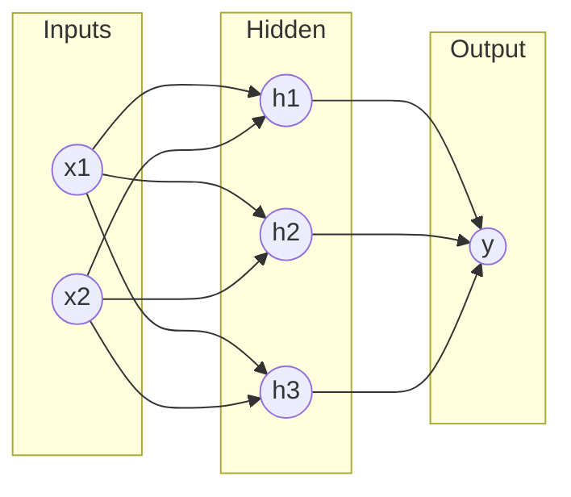

# 3.3. Multi-Layer Perceptron (MLP) Architecture

A single neuron is limited. To solve complex problems, we organize neurons into a structure called a **Multi-Layer Perceptron (MLP)**.

## 1. Layer Organization
An MLP consists of three types of layers:

1.  **Input Layer:** 
    *   One neuron for every feature in your data.
    *   No computation happens here; it just receives the data.
2.  **Hidden Layers:** 
    *   One or more layers between input and output.
    *   This is where feature extraction happens.
3.  **Output Layer:** 
    *   Produces the final prediction.
    *   1 neuron for Regression.
    *   $N$ neurons for Classification (where $N$ is the number of classes).

---

## 2. Feed-Forward Mechanism
In an MLP, information flows in **one direction**: Input $\to$ Hidden $\to$ Output. There are no loops or cycles.

### Forward Pass Calculation (Exhaustive Step-by-Step)
Imagine an MLP with:
*   Inputs: $P_1, P_2$
*   Hidden Layer: $n_1, n_2$ (Tanh activation)
*   Output Layer: $S$ (Linear activation)

**Step 1: Hidden Layer Potentials ($n$)**
$$ n_1^{hidden} = P_1 W_{11}^1 + P_2 W_{12}^1 + b_1^1 $$
$$ n_2^{hidden} = P_1 W_{21}^1 + P_2 W_{22}^1 + b_2^1 $$

**Step 2: Hidden Layer Activations ($a$)**
$$ a_1^{hidden} = \tanh(n_1^{hidden}) $$
$$ a_2^{hidden} = \tanh(n_2^{hidden}) $$

**Step 3: Output Layer Potential ($n$)**
The outputs of the hidden layer ($a$) become the inputs for the output layer.
$$ n^{output} = a_1^{hidden} W_{11}^2 + a_2^{hidden} W_{12}^2 + b^2 $$

**Step 4: Final Output ($S$)**
$$ S = \text{Linear}(n^{output}) = n^{output} $$

---

## 3. Matrix Representation (Vectorization)
To calculate a whole layer at once:
$$ A^L = f(W^L \cdot A^{L-1} + B^L) $$
*   $A^L$: Output of current layer.
*   $W^L$: Matrix of weights for current layer.
*   $A^{L-1}$: Output of previous layer.
*   $B^L$: Vector of biases for current layer.

> [!NOTE] Deep Learning Definition
> A "Deep" Neural Network is simply an MLP with many hidden layers. GPUs are used because they can calculate the matrix multiplication $W \cdot A$ for millions of neurons simultaneously.
