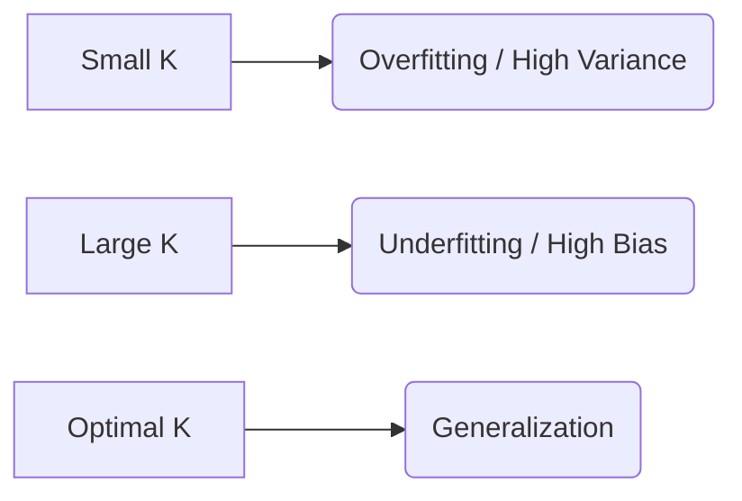

# 4.3. The Hyperparameter K & Bias-Variance

The variable $K$ is a **Hyperparameter**. This means the algorithm cannot "learn" the best $K$ on its own; you, the designer, must choose it.

## 1. The Impact of Small $K$ (e.g., $K=1$)
If $K$ is too small, the model is overly sensitive to the data points in its immediate vicinity.
*   **Overfitting:** The model captures the "noise" and outliers.
*   **High Variance:** If you change the training data slightly, the prediction might change completely.
*   **Decision Boundary:** Very jagged and complex.

---

## 2. The Impact of Large $K$ (e.g., $K=N$)
If $K$ is too large (e.g., equal to the total number of samples $N$), the model considers everyone a neighbor.
*   **Underfitting:** The model becomes too simple.
*   **High Bias:** It will likely just predict the majority class of the entire dataset every time.
*   **Decision Boundary:** Very smooth, essentially ignoring local patterns.

---

## 3. Finding the "Optimal" $K$
We typically find the best $K$ using **Cross-Validation**. 
*   We try $K=1, 3, 5, 7, \dots$
*   We plot the **Error Rate** for each $K$.
*   We choose the $K$ that results in the lowest error on the **Validation Set**.

### Rigorous Tie-Breaking Rules:
1.  **Always choose an Odd Number:** If you have 2 classes and choose $K=4$, you might get a 2-vs-2 tie. Choosing $K=3$ or $K=5$ guarantees a winner.
2.  **Weighted Voting:** Instead of a simple vote, you can give more "weight" to neighbors that are closer. A neighbor that is 0.1 units away should count more than a neighbor that is 5 units away.

