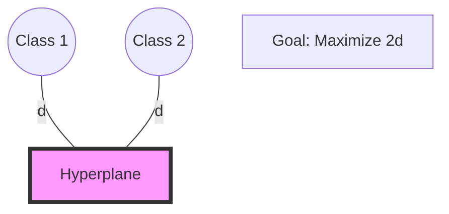

# 5.1. Hyperplanes & Margins

## 1. Introduction to SVM
**Support Vector Machines (SVM)** are a set of supervised learning methods used for classification, regression, and outliers detection. The core philosophy of SVM is not just to find a boundary that separates classes, but to find the **Optimal Hyperplane**—the one that maximizes the distance between the classes.

---

## 2. Geometric Definitions

### The Hyperplane
A hyperplane is a subspace of one dimension less than its ambient space.
*   In **2D**, a hyperplane is a **line**.
*   In **3D**, a hyperplane is a **flat plane**.
*   In **nD**, it is a **hyperplane**.

Mathematically, it is defined by the equation:
$$ w \cdot x + b = 0 $$
*   $w$: The weight vector (normal to the hyperplane).
*   $b$: The bias (intercept).

### The Margin
The margin is the "street" or the gap between the two classes. SVM is a **Maximal Margin Classifier**. It looks for a decision boundary where the distance to the nearest data point on either side is maximized.

### Support Vectors
These are the most important data points in the entire set.
*   **Definition:** Support vectors are the data points that lie exactly on the edge of the margin.
*   **The Logic:** If you move any other data point (that is not a support vector), the hyperplane stays the same. If you move a support vector, the hyperplane shifts. This makes SVM very memory efficient, as it only needs to "remember" these few critical points.

---

## 3. Hard Margin vs. Soft Margin

### A. Hard Margin
*   **Assumption:** The data is perfectly linearly separable.
*   **Constraint:** No data points are allowed to enter the margin.
*   **Problem:** It is extremely sensitive to outliers. A single "noisy" point can make the margin tiny or impossible to find.

### B. Soft Margin
*   **Assumption:** Real-world data is messy and has overlap.
*   **Constraint:** We allow some points to "violate" the margin (enter the street) or even be misclassified.
*   **Benefit:** This creates a much more robust model that generalizes better to new data. This is controlled by the **C Parameter** (covered in Note 5.3).

---

## 4. The Optimization Objective
To maximize the margin width ($M$), we must minimize the norm of the weight vector.
$$ \text{Margin Width} = \frac{2}{\|w\|} $$

Therefore, the mathematical goal of training an SVM is:
**Minimize $\frac{1}{2}\|w\|^2$** subject to the constraint that all points are correctly classified outside the margin.

