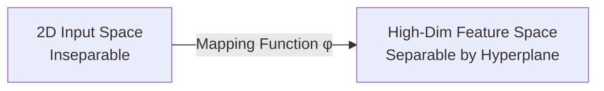

# 5.2. The Kernel Trick & Non-Linearity

## 1. The Problem: Non-Linear Separability
In many real-world cases, you cannot separate classes with a straight line.
*   *Example:* Imagine a cluster of points (Class A) in the center, surrounded by a ring of points (Class B).
*   Any straight line drawn through this will result in ~50% error.

---

## 2. Feature Mapping (Lifting Dimensions)
The solution is to map the data from its original low-dimensional space into a **higher-dimensional space**.

**The Intuition:**
Imagine two classes of dots on a table that are mixed. You can't separate them with a ruler. But if you could "lift" one class into the air (a 3rd dimension), you could slide a sheet of paper (a 2D hyperplane) between them.

---

## 3. The "Kernel Trick"
Lifting data into 100 or 1,000 dimensions is computationally "expensive" (it crashes computers). The **Kernel Trick** is a mathematical shortcut.

### The Mathematical Insight
The SVM optimization formula only depends on the **dot product** of the data points ($x_i \cdot x_j$).
The Kernel Function $K(x_i, x_j)$ calculates the dot product in the high-dimensional space **without actually moving the data there**.

$$ K(x_i, x_j) = \phi(x_i) \cdot \phi(x_j) $$

This allows us to get the power of infinite dimensions with the computational cost of low dimensions.

---

## 4. Common Kernel Functions

1.  **Linear Kernel:**
    *   No mapping. Used when data is already separable.
2.  **Polynomial Kernel:**
    *   Maps data into a space of degree $d$. Good for curved boundaries.
3.  **Radial Basis Function (RBF) / Gaussian Kernel:**
    *   The most popular kernel.
    *   Conceptually maps data into **infinite-dimensional space**.
    *   It creates "bubbles" around data points. It can learn almost any complex boundary.

> [!INFO] Why use RBF?
> The RBF kernel measures similarity based on distance to a point. If points are close, they are in the same class. It is the "Swiss Army Knife" of SVM kernels.
