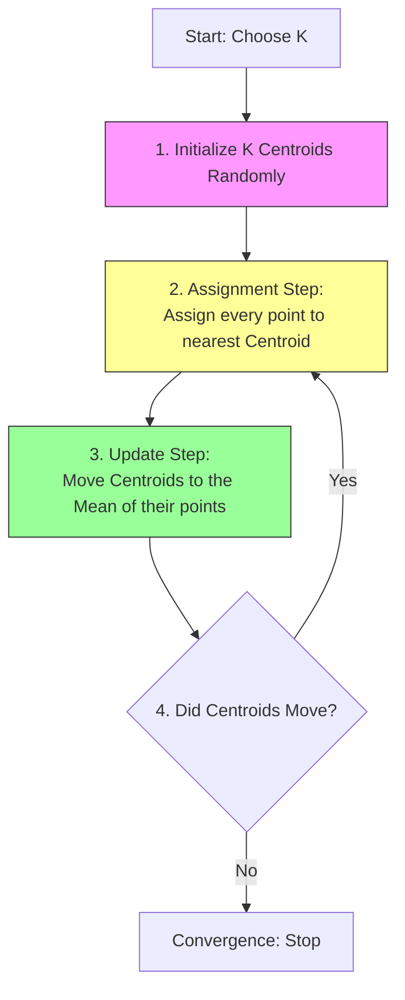

# 6.2. The K-Means Algorithm (Step-by-Step)

**K-Means** is an iterative algorithm that partitions a dataset into $K$ pre-defined distinct non-overlapping subgroups (clusters).

## 1. Core Concepts
*   **$K$:** The number of clusters (a hyperparameter you must choose).
*   **Centroid ($\mu$):** The center point of a cluster. It is the arithmetic mean of all data points belonging to that cluster.

## 2. The Algorithm Cycle
The process loops through two main steps (Assignment and Update) until it converges.

### Step 1: Initialization
*   We select $K$ points in the data space to act as the initial centroids.
*   *Note:* These can be random points or actual data points selected at random.

### Step 2: Cluster Assignment (Expectation)
*   For every data point $x_i$ in the dataset, we calculate its distance to every centroid $\mu_j$.
*   We typically use **Euclidean Distance**: $d(x, \mu) = ||x - \mu||^2$.
*   The point is assigned to the cluster of the closest centroid.

### Step 3: Move Centroids (Maximization)
*   Once all points are assigned, the centroid position is usually no longer in the center of its cluster.
*   We calculate the new position of centroid $\mu_j$ by taking the **Average (Mean)** of all points $x$ currently assigned to cluster $j$.
    $$ \mu_j = \frac{1}{|S_j|} \sum_{x \in S_j} x $$
    *(Where $S_j$ is the set of points in cluster $j$).*

### Step 4: Convergence
*   Steps 2 and 3 are repeated.
*   The algorithm stops when:
    1.  The centroids no longer change position (Stability).
    2.  No points change their cluster assignment.
    3.  A maximum number of iterations is reached.

---

## 3. Mathematical Example
Imagine 1D data: `[2, 3, 10, 11, 12]` and $K=2$.
1.  **Init:** Random centroids $\mu_1 = 2$, $\mu_2 = 12$.
2.  **Assign:**
    *   `2` is close to $\mu_1$.
    *   `3` is close to $\mu_1$.
    *   `10` is close to $\mu_2$.
    *   `11` is close to $\mu_2$.
    *   `12` is close to $\mu_2$.
    *   Cluster 1: `{2, 3}`, Cluster 2: `{10, 11, 12}`.
3.  **Update:**
    *   New $\mu_1 = \text{Average}(2, 3) = 2.5$.
    *   New $\mu_2 = \text{Average}(10, 11, 12) = 11$.
4.  **Repeat:** The process continues with centroids $2.5$ and $11$.