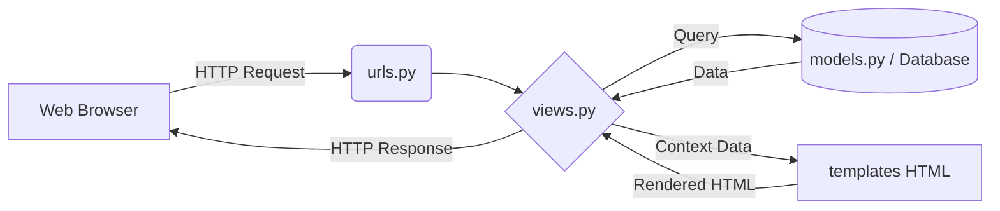

## Chapter 1: Introduction to Django and Environment Setup

### 1. Virtual Environments
**Background Knowledge:**
When programming in Python, installing libraries globally (system-wide) can lead to severe dependency conflicts. For example, Project A might require Django 3.2, while Project B requires Django 5.0. If you install them globally, one project will inevitably break. 

**What is a Virtual Environment (venv)?**
A virtual environment is an isolated directory tree that contains its own Python installation and its own set of libraries.

**Why use venv?**
*   **Isolation of dependencies:** Prevents version conflicts between projects.
*   **Reproducibility:** Each project has its exact list of packages, making it easy to share with other developers.
*   **Deployment ease:** You can generate a `requirements.txt` file that lists the exact libraries needed to run the project on a server.

**Commands and Workflow:**
1.  **Creation:** `python3 -m venv venv`
    *   *Tip:* The second `venv` is the folder name. It can be named anything (`.env`, `mon_environnement`), but `venv` or `.venv` is standard.
2.  **Activation:**
    *   Linux/macOS: `source venv/bin/activate`
    *   Windows (PowerShell): `venv\Scripts\Activate.ps1`
3.  **Dependency Management:**
    *   Install a package: `pip install django`
    *   Save packages to a file: `pip freeze > requirements.txt`
    *   Install from a file (e.g., when cloning a project): `pip install -r requirements.txt`
4.  **Deactivation:** `deactivate`

> **Common Pitfall:** Students often forget to activate their virtual environment before running `pip install` or `python manage.py`. If your terminal prompt doesn't show `(venv)` at the beginning, you are using the global Python environment!

---

### 2. Project Installation and Structure
Once Django is installed in your virtual environment, you initialize a project using Django's built-in command-line utility.

**Initialization:**
`django-admin startproject mysite`
This creates a root folder with the necessary boilerplate code. 

**Development Server:**
To run your project locally: `python manage.py runserver`

**Anatomy of a Django Project:**
A Django project is a collection of settings and configurations. A project can contain multiple *apps* (modular components like a blog, a forum, or a payment gateway).

*   `manage.py`: The command-line entry point. Used to run the server, apply database migrations, create apps, etc.
*   `settings.py`: The heart of the project. Contains configurations for databases, installed apps, static files, security keys (SECRET_KEY), and middlewares.
    *   *Best Practice:* Never hardcode sensitive data like passwords or your `SECRET_KEY` here in production; use environment variables.
*   `urls.py`: The main router. It links web URLs (like `/home/`) to specific Python functions (views).
*   `wsgi.py` (Web Server Gateway Interface): The entry point for deploying your application to a production web server (like Gunicorn).
*   **App Level Files (Created with `python manage.py startapp monapp`)**:
    *   `models.py`: Defines database structures.
    *   `views.py`: Contains the business logic.
    *   `admin.py`: Registers models to make them visible in Django's built-in admin panel.
    *   `apps.py`: App-specific configurations.
    *   `migrations/`: A folder tracking all changes made to your database schema.

---

### 3. Django MVT Architecture
**Background Knowledge:**
Most modern web frameworks follow the **MVC** (Model-View-Controller) design pattern to separate concerns. Django follows a slight variation called **MVT** (Model-View-Template) or **MCT** (Model-Controller-Template in French).

**How it corresponds to MVC:**
*   **Django Model** = MVC Model (Manages data and database logic).
*   **Django Template** = MVC View (Manages presentation / HTML).
*   **Django View** = MVC Controller (Receives requests, fetches data from the Model, and passes it to the Template).
*   *Note:* In Django, the framework itself handles the core "Controller" routing mechanisms.

**Advantages of MVT:**
*   **Separation of concerns:** Designers can work on templates while developers work on views and models.
*   **Reusability:** Code is modular.
*   **Testability:** You can test data logic independently of the UI.

---

## Chapter 1.1: Advanced Setup, Architecture Nuances, and Best Practices

### 1. The Multi Platform Problem
**Background Knowledge:**
The shift towards microservices and robust backends (like Django) is driven by the modern business landscape. Companies no longer just build a website. They must offer services across **multiple platforms**:
*   Web applications
*   Mobile applications (iOS/Android)
*   Desktop applications

**The Core Challenges:**
To guarantee a unified user experience across all these platforms, developers face several challenges:
1.  **Data Consistency (Cohérence des données):** Ensuring a user sees the same cart on their phone and their laptop.
2.  **Scaling (Scaler):** Handling sudden influxes of users efficiently.
3.  **Independent Deployments:** Deploying a new feature to the mobile app without bringing down the website.
4.  **Technological Evolution:** Adopting new mobile versions or front-end frameworks without rewriting the backend.
5.  **High Availability & Resilience:** Ensuring the system stays online even if one minor component fails.
*Conclusion:* These exact challenges are what push modern architectures away from monoliths and towards microservices.

### 2. Virtual Environment Deep Dive and Windows Specifics
While the basics of `venv` were covered, there are specific terminal commands and naming conventions to remember:
*   **Naming Flexibility:** The command `python3 -m venv venv` uses the name `venv` for the folder, but as noted in the slides, *the name is free*. You can name it `.env`, `env`, or `mon_environnement`. Using `.venv` is a popular convention as the dot hides the folder in Unix-based systems.
*   **Windows Activation:** Students often fail to activate environments on Windows. The exact path for PowerShell is:
    `venv\Scripts\Activate.ps1`
*   **Deactivation:** To leave the isolated environment, simply type `deactivate` in the terminal.

### 3. Django History and Integrated Tools
*   **Origins:** Django is an open-source Python framework created in **2005** with the primary goal of developing dynamic websites *rapidly*.
*   **Built-in Tools (Outils intégrés):** Django is "batteries-included". Out of the box, it provides:
    1.  An automatic administration panel.
    2.  A complete authentication system (users, permissions, groups).
    3.  Support for multiple databases simultaneously.
    4.  Management of cache, user sessions, and flash messages.

### 4. Detailed Project Architecture and File Roles
Understanding the exact role of every file in the tree is crucial for debugging:
*   `__init__.py`: An empty file that tells Python to treat this directory as a standard Python module.
*   `apps.py`: Contains the configuration specific to the app (name, specific behaviors). It is detected automatically by Django when added to `INSTALLED_APPS`.
*   `admin.py`: Where you explicitly declare which models should be visible and editable in the Django admin interface.
*   `migrations/`: A folder tracking schema evolution. *Tip:* Never manually edit the files inside here unless you are an advanced user fixing a merge conflict.

### 5. Security and Testing Best Practices
The slides highlight crucial production practices that are often skipped by beginners:
*   **Environment Variables:** Never leave your `SECRET_KEY` or Database Credentials (BDD) hardcoded in `settings.py`. Use environment variables (`os.environ.get('SECRET_KEY')`).
*   **Testing:** Always implement unit tests. The slides recommend using **pytest** or Python's built-in **unittest** to ensure application stability.
