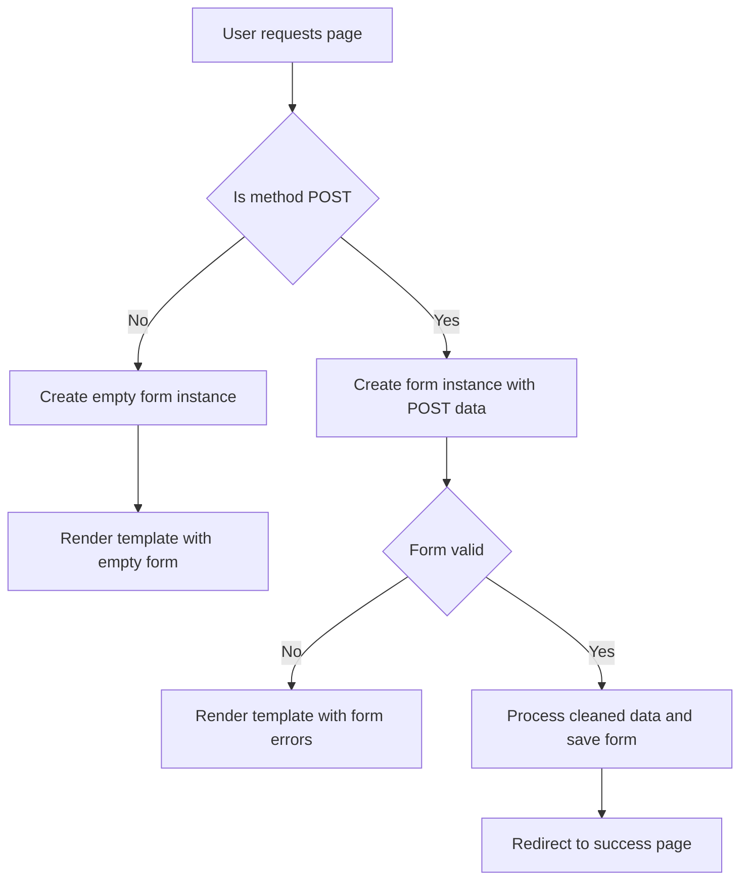

## Chapter 4: Forms and Data Validation

### 1. Django Forms API
Handling HTML forms manually means dealing with HTML writing, reading `POST` data, validating input, and returning error messages. Django's Forms API automates all of this.
*   Generates HTML form widgets automatically.
*   Validates data securely.
*   Includes CSRF (Cross-Site Request Forgery) protection automatically via the `` tag.

---

### 2. Classic Forms vs Model Forms

**Classic Forms (`forms.Form`):**
Used when the form data is NOT tied directly to a database model (e.g., a "Contact Us" form that just sends an email).
```python
class ContactForm(forms.Form):
    nom = forms.CharField(max_length=100)
    email = forms.EmailField()
    message = forms.CharField(widget=forms.Textarea)
```

**Model Forms (`forms.ModelForm`):**
Used when the form maps directly to a Model (e.g., adding a Patient). It saves immense boilerplate.
```python
class PatientForm(forms.ModelForm):
    class Meta:
        model = Patient
        fields = ['nom', 'email', 'date_naissance'] 
        # Django automatically infers the correct HTML input types based on the Model fields!
```

---

### 3. Form Rendering and View Logic

**Template Rendering:**
Pass the `form` object from the view to the template context.
*   `{{ form.as_p }}`: Wraps fields in `<p>` tags.
*   `{{ form.as_table }}`: Renders fields as table rows `<tr>`.
*   `{{ form.as_ul }}`: Renders fields as list items `<li>`.

```html
<form method="post">
    
    {{ form.as_p }}
    <button type="submit">Envoyer</button>
</form>
```

**Standard View Logic Lifecycle:**
This is a standard pattern every Django developer must know:



> **Important Reminder:** Always end a successful POST request with a `redirect()`. This prevents the "Confirm Form Resubmission" browser warning if the user refreshes the page (Post/Redirect/Get pattern).

---

## Chapter 4.1: Forms API Mechanics and Rendering Deep Dive

### 1. The Forms API Theoretical Advantages
Why not just write `<input type="text" name="nom">` manually? The Django Forms API provides:
1.  **Automatic Data Validation:** Ensures emails are emails, and required fields aren't blank.
2.  **HTML Generation:** Automatically creates the correct input tags, IDs, and labels.
3.  **Integrated CSRF Protection:** Protects against Cross-Site Request Forgery.
4.  **Model Integration:** With `ModelForm`, it seamlessly ties into the database schema, adhering to `max_length` and `null` rules automatically.

### 2. Detailed Form Rendering Methods
When `{{ form }}` is passed to a template, Django provides formatting helpers:
*   `{{ form.as_p }}`: Wraps each label and input field in `<p>` (paragraph) tags. Creates a simple, vertical layout.
*   `{{ form.as_table }}`: Renders the fields as `<tr>` and `<td>` tags. Note: You must manually provide the wrapping `<table>` and `</table>` tags in your HTML.
*   `{{ form.as_ul }}`: Renders the fields as `<li>` tags. Note: You must manually provide the wrapping `<ul>` tags.

### 3. Exact View Logic for Form Submission
The slides detail a specific, robust flow for handling forms in `views.py`. Here is the theoretical breakdown of that flow:
1.  **Check Method:** `if request.method == 'POST':` $\rightarrow$ Determine if the user is submitting data.
2.  **Bind Data:** `form = ContactForm(request.POST)` $\rightarrow$ Instantiate the form and bind the incoming POST data to it.
3.  **Validate:** `if form.is_valid():` $\rightarrow$ Run Django's internal validation rules.
4.  **Process:** Access sanitized data via `form.cleaned_data`. Or, if it's a `ModelForm`, simply call `form.save()`.
5.  **Redirect:** `return redirect('home')` $\rightarrow$ Redirect to prevent duplicate submissions.
6.  **Fallback:** `else: form = ContactForm()` $\rightarrow$ If the method is `GET` (or anything else), display an empty, unbound form to the user.

---
