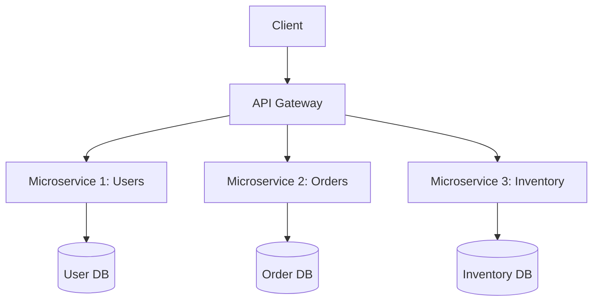

## Chapter 5: REST APIs and Microservices

### 1. The Multi Platform Problem and Monoliths
**The Context:**
Modern businesses need their software on Web, iOS, Android, and Desktop. 
*   **Monolithic Architecture:** Everything (database, logic, UI) is bundled together.
    *   *Limits:* Slow deployments, tight coupling (a bug in the PDF generator can crash the login system), and "all-or-nothing" scalability.

**The Solution: Microservices**
Decomposing the application into independent, specialized services (e.g., a "Payment Service", a "User Service").
*   *Advantages:* Granular scalability, independent deployments, fault isolation (resilience), and technological freedom (Service A in Django, Service B in Node.js).
*   *Challenges:* Operational complexity, harder to test, requires distributed transaction management and high observability.

---

### 2. REST API Principles
To allow front-ends (or other microservices) to talk to the backend, we use APIs. **REST** (Representational State Transfer) is an architectural style based on HTTP.

**Key Principles:**
1.  **Client-Server:** Separation of UI and data storage.
2.  **Stateless:** No client session state is stored on the server. Every request must contain all info needed (e.g., a token).
3.  **Cacheable:** Responses indicate if they can be cached.
4.  **Uniform Interface:** Standardized access to resources using HTTP methods.

**Standard HTTP Methods (Endpoints):**
*   `GET /api/users` $\rightarrow$ Read list.
*   `GET /api/users/1` $\rightarrow$ Read details of user 1.
*   `POST /api/users` $\rightarrow$ Create a user.
*   `PUT /api/users/1` $\rightarrow$ Full update of user 1.
*   `DELETE /api/users/1` $\rightarrow$ Delete user 1.

Data is almost universally exchanged in **JSON** format.

---

### 3. Microservices Architecture Components
A robust microservices architecture requires infrastructure.

*   **API Gateway:** A single entry point for all clients. It routes requests to the correct underlying microservice. Handles authentication, throttling, and aggregation. (Examples: Kong, Nginx, AWS API Gateway).
*   **Service Registry & Discovery (e.g., Consul):** Microservices have dynamic IPs. Consul acts as a directory. Services "Register" when they boot up, and the Gateway "Queries" Consul to find where the service currently lives.
*   **Message Brokers:** For asynchronous communication (e.g., RabbitMQ, Kafka).
*   **Database per Service:** Ideally, each microservice manages its own database to ensure loose coupling.

---

### 4. Building and Connecting Microservices in Django
We use **Django REST Framework (DRF)** to easily build REST APIs.

**Creating an Endpoint:**
Using the `@api_view` decorator, we transform a standard Django view into an API endpoint that consumes and returns JSON.

```python
from rest_framework.decorators import api_view
from rest_framework.response import Response

@api_view(["POST"])
def service_process(request):
    data = request.data # DRF automatically parses JSON into a Python dict
    return Response({"result": f"Processed: {data}"})
```

**Inter-Service Communication:**
If Service A (Django) needs data from Service B (Node.js or another Django app), Service A becomes an HTTP client. In Python, this is usually done using the `requests` library.

```python
import requests

# Calling an external microservice
data_to_send = {"user_id": 123, "action": "login"}
response = requests.post("http://localhost:8002/process/", json=data_to_send)

# Reading the JSON response
print(response.json())
```

> **Tip:** In a real production environment, you wouldn't hardcode `http://localhost:8002`. You would use environment variables or query a Service Registry (like Consul) to get the target URL dynamically.


### 1. The 6 Architectural Principles of REST
An API is only truly "RESTful" if it adheres to these 6 architectural constraints (as listed in the slides):
1.  **Client-Serveur:** Strict separation of roles. The client handles UI/UX; the server handles data storage and logic.
2.  **Stateless:** The server stores no session data between requests. Each request must contain all necessary information (like authentication tokens).
3.  **Cacheable:** Responses must implicitly or explicitly define themselves as cacheable or non-cacheable to improve network efficiency.
4.  **Uniform Interface:** Accessing resources is done uniformly via standard HTTP methods (`GET`, `POST`, `PUT`, `PATCH`, `DELETE`).
5.  **Layered System:** A client cannot tell if it is connected directly to the end server or an intermediary (like a proxy or load balancer).
6.  **Code on Demand (Optional):** Servers can temporarily extend the functionality of a client by transferring executable code (e.g., JavaScript).

### 2. Monolith Limits vs Microservices Characteristics
**Monolith "All-or-Nothing" Problem:**
In a monolithic architecture, you have **limited scalability (tout ou rien)**. If the image processing part of your app requires a lot of RAM, you cannot just scale that part; you must duplicate the *entire* monolith across multiple expensive servers. Furthermore, one critical error in a minor module can crash the whole system.

**Microservice Characteristics:**
*   **Single Responsibility:** Executes a single task (e.g., sending an email).
*   **Independent:** Deployable and maintainable independently of other services.
*   **Asynchronous & Scalable:** Services often communicate via asynchronous message brokers, allowing massive, granular scaling of only the services that need it.



### 3. The API Gateway Role
Because a system might consist of 50 microservices, a client (like a mobile app) cannot manage 50 different IP addresses.
*   **Point d'entrée unique:** The API Gateway provides a single URL for all clients.
*   **Functions:** It handles Routing, Authentication, Throttling (rate limiting), and Aggregation (gathering data from 3 microservices and sending it back to the client as one JSON response).
*   **Examples Mentioned:** Kong, Traefik, Nginx, AWS API Gateway.

### 4. Service Registry and Discovery with Consul
In a microservices architecture, services dynamically spin up and down (changing IP addresses). Hardcoding IPs is impossible. This is where HashiCorp **Consul** comes in.
*   **Register:** When a microservice boots, it adds itself to the Consul catalogue.
*   **Query:** When Service A needs to talk to Service B, it asks Consul for Service B's current healthy IP address via DNS or API.
*   **Secure (mTLS):** Consul provides authenticated and encrypted communication between services (Mutual TLS).
*   **Advanced Deployments:** Because Consul controls the routing, it facilitates progressive deployments like **Canary** (releasing to 1% of users), **A/B testing**, or **Blue/Green** deployments. It enforces a **Zero-trust** network security model using ACLs (Access Control Lists).

### 5. Complexities and Costs of Microservices
The slides explicitly note that microservices are not a silver bullet. They introduce significant "Défis et coûts" (Challenges and costs):
1.  **Operational Complexity:** Managing 50 servers/containers is much harder than managing 1.
2.  **Distributed Tests:** Testing how multiple independent services interact requires complex staging environments.
3.  **Distributed Transactions:** If a user buys an item, but the "Inventory" service crashes after the "Payment" service succeeds, rolling back the transaction across multiple databases is extremely difficult.
4.  **Observability & Security:** You must have advanced Logging, Monitoring, and Tracing to track a request as it jumps between 10 different services.