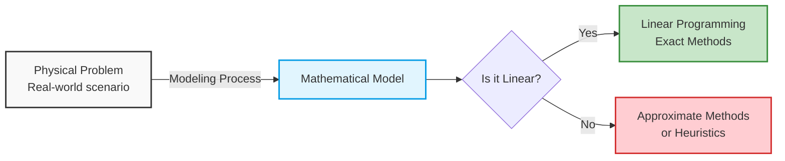
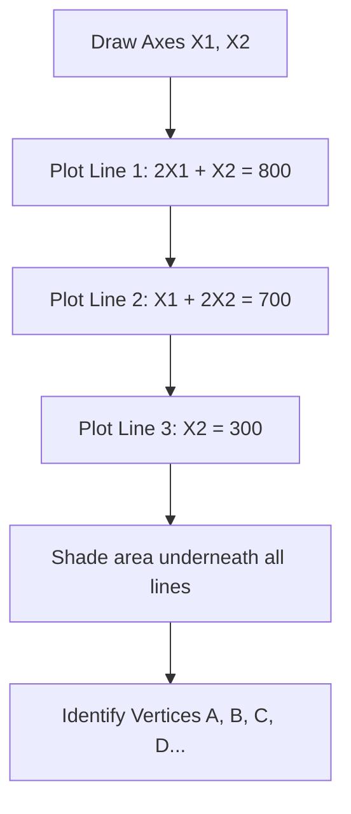
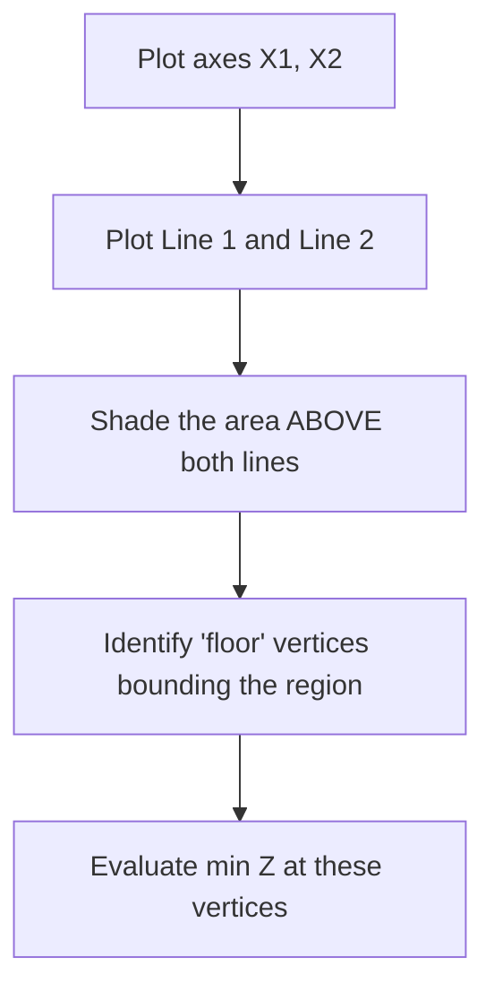

  

# 1. Introduction to Linear Programming

  

## Overview

**Linear Programming (LP)** (or *Programmation Linéaire*) is a mathematical method used to determine the best possible outcome (such as maximum profit or lowest cost) in a given mathematical model whose requirements are represented by linear relationships.

  

At its core, LP involves solving a system of linear equations and inequalities, which are called **constraints**, in order to optimize a specific target function, known as the **objective function**.

  

### Contexts of Application

Linear programming is generally applied in two main areas:

1. **Technical / Mechanical:** Optimizing machine usage, material blending, or physical resources.

2. **Economic / Commerce:** Maximizing profit, minimizing transportation costs, or optimizing supply chains.

  

---

  

## Linear vs. Non-Linear Models

To use Linear Programming, the model must be strictly **linear** with respect to its variables.

  

### What makes a function Linear?

A function is linear if all variables are to the power of 1, and there are no variables multiplied by each other.

* **Example of a Linear Equation:**

$$c_1x_1 + c_2x_2 + c_3x_3 = b_1$$

  

### What makes a function Non-Linear?

If any of the following exist in the equation, it is non-linear, and standard LP techniques cannot be used directly:

* Variables multiplied together: $c_1x_1x_2$

* Variables with exponents (squared, cubed, etc.): $c_1x_1^2$

* Roots or fractional powers: $\sqrt{x_1}$

* Trigonometric or logarithmic functions: $\sin(x_1), \cos(x_1), \ln(x_1)$

  

> [!warning] Important Reminder

> If a problem is non-linear, we cannot use exact linear methods. Instead, the physical problem must be approximated by a linear mathematical model, or solved using "approximate methods" (heuristics or non-linear programming).

  

  

---

  

## Key Terminology

  

* **Decision Variables ($x_1, x_2, \dots$):** The unknown quantities we need to determine (e.g., how many units of Product A to make).

* **Objective Function ($Z$):** The linear function we want to optimize (Maximize or Minimize). Also called the *economic function* or *cost function*.

* **Constraints:** The restrictions or limitations on the decision variables (e.g., limited raw materials, budget, time).

* **Admissible Solution (Feasible Solution):** Any set of values for the decision variables that satisfies **all** the constraints simultaneously.

* **Optimal Solution:** The absolute best admissible solution. It is the specific feasible solution that yields the highest (or lowest) value for the objective function.

  

> [!tip] Conceptual Check

> Think of Admissible Solutions as "Every possible path you *can* legally take," and the Optimal Solution as "The specific path that gets you there the fastest."

  

  
  

# 2. Mathematical Formulation and Modeling

  

## The Goal of Modeling

The most crucial step in Linear Programming is translating a real-world, textual problem into a rigid mathematical format.

  

### The Yogurt Manufacturing Problem (Example 01)

**Problem Statement:**

A manufacturer produces two types of yogurt: Product A and Product B. These products are made from three raw materials: Strawberries, Milk, and Sugar.

The manufacturer wants to know how many quantities of Yogurt A ($x_1$) and Yogurt B ($x_2$) to produce to maximize total profit.

  

**Data provided:**

* **Available Stock:** 800 kg Strawberries, 700 kg Milk, 300 kg Sugar.

* **Profit per unit:** Yogurt A yields 4 DA, Yogurt B yields 5 DA.

* **Recipe / Proportions:**

  

| Raw Material | Product A ($x_1$) | Product B ($x_2$) | Maximum Available |
| :----------- | :---------------- | :---------------- | :---------------- |
| Strawberries | 2                 | 1                 | 800               |
| Milk         | 1                 | 2                 | 700               |
| Sugar        | 0                 | 1                 | 300               |

  

---

  

## Step-by-Step Formulation

  

### Step 1: Define Decision Variables

First, identify exactly what you have the power to change.

* Let $x_1$ = Quantity of Yogurt A to produce.

* Let $x_2$ = Quantity of Yogurt B to produce.

  

### Step 2: Define the Objective Function

What is the goal? The problem states we want to **maximize profit**.

Profit comes from selling $x_1$ (at 4 DA each) and $x_2$ (at 5 DA each).

* **Objective Function:** $$\max Z = 4x_1 + 5x_2$$

  

### Step 3: Formulate Constraints (Technical Constraints)

We cannot produce infinite yogurt; we are limited by our raw materials. Every constraint compares *what we use* against *what we have*.

  

1. **Strawberry Constraint:** Producing one unit of A uses 2 kg, B uses 1 kg. Total used cannot exceed 800 kg.

$$2x_1 + x_2 \le 800$$

2. **Milk Constraint:**

$$x_1 + 2x_2 \le 700$$

3. **Sugar Constraint:** Product A uses no sugar. Product B uses 1 kg. Total used cannot exceed 300 kg.

$$0x_1 + 1x_2 \le 300 \implies x_2 \le 300$$

  

### Step 4: The Non-Negativity Constraint

This is the most frequently forgotten step! In real-world physical problems, you cannot produce negative quantities of a product. You must mathematically enforce this.

* **Positivity Control:** $$x_1, x_2 \ge 0$$

  

---

  

## The Final Mathematical Model

  

Bringing it all together, the complete mathematical representation of our problem is:

  

$$

\begin{align*}

\max Z = 4x_1 &+ 5x_2 \\

\text{Subject to (s.t.):} \quad \\

2x_1 + x_2 &\le 800 \\

x_1 + 2x_2 &\le 700 \\

x_2 &\le 300 \\

x_1, x_2 &\ge 0

\end{align*}

$$

  

> [!info] Why use inequalities ($\le$)?

> In maximization problems regarding physical resources, we use "less than or equal to" ($\le$) because we don't *have* to use all our resources, but we absolutely cannot use more than we have. This provides a compromise (optimization) space between making Product A or Product B.

  
  

# 3. Canonical Form of Linear Programs

  

## Definition

To solve linear programming problems using automated algorithms, the mathematical model must first be standardized into specific formats. The foundational format is the **Canonical Form**.

  

A Linear Program is considered to be in **Canonical Form** if it meets the following three strict conditions:

1. The objective function is a **Maximization** ($\max Z$).

2. **All** constraints are "less than or equal to" inequalities ($\le$).

3. **All** variables are strictly non-negative ($x_j \ge 0$).

  

### Mathematical Representation

$$ \max Z = \sum_{j=1}^{n} c_j x_j $$

Subject to:

$$ \sum_{j=1}^{n} a_{ij} x_j \le b_i \quad \text{for } i = 1 \dots m \text{ (number of constraints)} $$

$$ x_j \ge 0 \quad \text{for } j = 1 \dots n \text{ (number of variables)} $$

  

> [!note] Property of Linear Programs

> **Every** linear programming problem, no matter how it is originally formulated, can be mathematically transformed into the Canonical Form.

  

---

  

## Transformation Rules (How to fix non-canonical models)

  

Often, word problems will result in Minimization objectives, $\ge$ constraints, or unrestricted variables. Here is how to convert them to Canonical form.

  

### Rule 1: Converting Minimization to Maximization

If your objective is to minimize a function, you can simply maximize the negative of that function.

* **Formula:** $\min(Z) \Longleftrightarrow \max(-Z)$

* **Example:**

$$\min Z = 3x_1 - 2x_2$$

*Transforms to:*

$$\max(-Z) = -3x_1 + 2x_2$$

*(Note: Once you find the optimal maximum value, multiply it by -1 to get your actual minimum value).*

  

### Rule 2: Reversing Inequality Signs ($\ge$ to $\le$)

If a constraint is a "greater than or equal to" ($\ge$), multiply the entire inequality (both sides) by $-1$. This mathematically flips the sign.

* **Formula:** $\sum a_{ij} x_j \ge b_i \implies \sum (-a_{ij}) x_j \le -b_i$

* **Example:**

$$4x_1 + x_2 \ge 500$$

*Transforms to:*

$$-4x_1 - x_2 \le -500$$

  

### Rule 3: Converting Equalities ($=$) to Inequalities

Canonical form does not allow exact equations ($=$). An equation is mathematically true only if it is simultaneously $\le$ and $\ge$.

* **Formula:** $\sum a_{ij} x_j = b_i$ becomes two constraints:

1. $\sum a_{ij} x_j \le b_i$

2. $\sum a_{ij} x_j \ge b_i$ (which then must be multiplied by -1 per Rule 2)

* **Example:**

$$x_1 + x_2 = 100$$

*Transforms to:*

$$x_1 + x_2 \le 100$$

$$-x_1 - x_2 \le -100$$

  

### Rule 4: Handling Unrestricted Variables (Variables without sign constraints)

If the problem states that a variable $x_j$ can be positive, negative, or zero (unrestricted in sign), we must replace it with the difference of two strictly positive variables.

* **Formula:** Let $x_j = x_j' - x_j''$

* **Condition:** $x_j' \ge 0$ and $x_j'' \ge 0$

* **Reasoning:** By subtracting two positive numbers, the result can be positive (if $x' > x''$), negative (if $x' < x''$), or zero (if $x' = x''$), perfectly representing an unrestricted variable while satisfying the $x \ge 0$ canonical rule.

  

---

> [!tip] Quick Reference Checklist

> Before proceeding to solve any LP mathematically, ask yourself:
> - [x] Is it a Maximize problem?
> - [x] Are all signs $\le$?
> - [x] Are all variables $\ge 0$?
> If yes, you are in canonical form!

# 4. Graphical Resolution Method

  

## Introduction

The Graphical Resolution method is a visual way to solve Linear Programming problems.

  

> [!warning] Limitation

> This method can **only** be used when there are exactly **two decision variables** ($x_1$ and $x_2$). If there are 3 or more variables, we cannot easily graph it on a 2D plane, and algebraic methods (like the Simplex algorithm) must be used.

  

---

  

## Core Concepts of Graphical Solving

  

### 1. The Feasible Region (Polyhedron)

When we graph all the constraints (including non-negativity $x_1, x_2 \ge 0$), the area on the graph where **all** constraints overlap is called the **Feasible Region** (or *région des solutions réalisables*).

* Every single $(x_1, x_2)$ point inside this shaded area is a valid, admissible solution.

* If the constraints do not overlap at all, the problem has **no solution**.

  

### 2. Convexity

For Linear Programming, the feasible region is always a **convex set**.

* **Definition:** A set is convex if you can draw a straight line between *any* two points inside the region, and that entire line remains inside the region.

* **Importance:** Because the set is convex and linear, we are guaranteed that the optimal solution will not be hidden in a random dip or curve inside the shape.

  

### 3. Vertices (Sommets) and The Fundamental Theorem

The corners of the feasible region shape are called **Vertices** (or *Sommets*). Mathematically, these are known as **Basic Feasible Solutions** (*Solutions de base réalisables*).

  

> [!tip] The Golden Rule of Graphical LP

> **The optimal solution (maximum or minimum) will ALWAYS occur at one of the vertices of the feasible region.**
> You do not need to test thousands of points inside the shaded area. You only need to calculate the objective function value at the corners (vertices).

  

---

  

## Step-by-Step Graphical Solution (Using the Yogurt Example)

  

Let's solve the model established in Note 2:

$$ \max Z = 4x_1 + 5x_2 $$

1. $2x_1 + x_2 \le 800$

2. $x_1 + 2x_2 \le 700$

3. $x_2 \le 300$

4. $x_1, x_2 \ge 0$

  

### Step 1: Draw the Axes (Non-negativity)

Because $x_1 \ge 0$ and $x_2 \ge 0$, we only work in the **first quadrant** (top right) of the Cartesian plane. $x_1$ is the horizontal axis (X), $x_2$ is the vertical axis (Y).

  

### Step 2: Plot the Constraint Lines

To plot an inequality, treat it as an equality ($=$) to find the straight line. Find the intercept points where the line crosses the axes.

  

**Line 1:** $2x_1 + x_2 = 800$

* If $x_1 = 0 \implies x_2 = 800 \quad \rightarrow \text{Point (0, 800)}$

* If $x_2 = 0 \implies 2x_1 = 800 \implies x_1 = 400 \quad \rightarrow \text{Point (400, 0)}$

  

**Line 2:** $x_1 + 2x_2 = 700$

* If $x_1 = 0 \implies 2x_2 = 700 \implies x_2 = 350 \quad \rightarrow \text{Point (0, 350)}$

* If $x_2 = 0 \implies x_1 = 700 \quad \rightarrow \text{Point (700, 0)}$

  

**Line 3:** $x_2 = 300$

* This is a horizontal line at $x_2 = 300$.

  

### Step 3: Identify the Feasible Region

Plot these lines. Because the constraints are $\le$, the valid area is *below and to the left* of these lines, restricted by the axes.

  

  

When drawn, you will see a closed polygon. Let's trace the vertices (corners) of this polygon:

* **Point A:** Origin (0,0)

* **Point B:** Intersection of Y-axis and Line 3 $\implies (0, 300)$

* **Point C:** Intersection of Line 3 ($x_2 = 300$) and Line 2 ($x_1 + 2x_2 = 700$).

* Math: $x_1 + 2(300) = 700 \implies x_1 = 100$. Point is $(100, 300)$.

* **Point D:** Intersection of Line 1 and Line 2.

* Solve the system: $2x_1 + x_2 = 800$ and $x_1 + 2x_2 = 700$.

* Result: $x_1 = 300, x_2 = 200$. Point is $(300, 200)$.

* **Point E:** Intersection of X-axis and Line 1 $\implies (400, 0)$.

  

### Step 4: Evaluate the Objective Function

Now, plug the $(x_1, x_2)$ coordinates of each vertex into the objective function $Z = 4x_1 + 5x_2$ to find the maximum.

  

| Vertex | Coordinates $(x_1, x_2)$ | Calculation $Z = 4x_1 + 5x_2$ | Result (Profit) |
| :----- | :----------------------- | :---------------------------- | :-------------- |
| A      | (0, 0)                   | $4(0) + 5(0)$                 | 0 DA            |
| B      | (0, 300)                 | $4(0) + 5(300)$               | 1500 DA         |
| C      | (100, 300)               | $4(100) + 5(300)$             | 1900 DA         |
| **D**  | **(300, 200)**           | **$4(300) + 5(200)$**         | **2200 DA**     |
| E      | (400, 0)                 | $4(400) + 5(0)$               | 1600 DA         |

  

### Conclusion

The highest profit is 2200 DA.

Therefore, the **Optimal Solution** is to produce:

* $300$ units of Yogurt A ($x_1$)

* $200$ units of Yogurt B ($x_2$)

  

---

## Edge Cases & Special Remarks

  

1. **Closed vs. Open Regions:**

* If the region of feasible solutions is a **closed, convex set** (like our polygon), an optimal solution is guaranteed to exist (it may be a single point, or a multiple optimal solutions along an edge).

* If the region is **convex but NOT closed** (it extends infinitely outwards), the problem might be unbounded. For a maximization problem, the value of the objective function might increase infinitely, meaning no definitive optimal solution can be determined.

  

2. **Mixed Constraints:** Even if your graphical problem has mixed constraints ($\le$, $\ge$, and $=$), the graphical method works identically. You just shade the appropriate sides of the lines (above for $\ge$, below for $\le$, and exactly *on* the line for $=$).

  
  

# 5. Practical Exercises - Formulation and Modeling

  

## Overview

Formulating a mathematical model from a word problem is often the most challenging part of Linear Programming. This note breaks down two different scenarios (Maximization of revenue and Minimization of cost) to demonstrate how to systematically identify variables, objectives, and constraints.

  

---

  

## Exercise 1: The Restaurant Problem (Maximization)

  

**Problem Statement:**

A restaurant owner offers two types of mixed plates:

* **Plate 1 (80 DA):** Contains 5 sardines, 2 whitings (merlans), and 1 red mullet (rouge).

* **Plate 2 (120 DA):** Contains 3 sardines, 3 whitings, and 3 red mullets.

* **Available Stock:** 30 sardines, 24 whitings, and 18 red mullets.

* **Goal:** How many plates of each type should be prepared to maximize total revenue?

  

### Step-by-Step Formulation

  

**1. Decision Variables**

What are we trying to decide? The number of plates to produce.

* $x_1 =$ Number of 80 DA plates to prepare.

* $x_2 =$ Number of 120 DA plates to prepare.

  

**2. Objective Function**

We want to maximize revenue. Each $x_1$ brings in 80 DA, and each $x_2$ brings in 120 DA.

$$ \max Z = 80x_1 + 120x_2 $$

  

**3. Constraints**

We are constrained by our inventory of fish. The total fish used across both plates cannot exceed the stock.

  

* **Sardine Constraint:** 5 per Plate 1, 3 per Plate 2. Max 30.

$$5x_1 + 3x_2 \le 30$$

* **Whiting (Merlan) Constraint:** 2 per Plate 1, 3 per Plate 2. Max 24.

$$2x_1 + 3x_2 \le 24$$

* **Red Mullet (Rouge) Constraint:** 1 per Plate 1, 3 per Plate 2. Max 18.

$$1x_1 + 3x_2 \le 18$$

* **Positivity:** Cannot make negative plates.

$$x_1, x_2 \ge 0$$

  

> [!tip] Matrix View

> When reading these problems, it helps to build a mental table where columns are your variables ($x_1$, $x_2$) and rows are your constraints (Sardines, Whitings, Rouges). The right side of the inequality is always your "Available" column.

  

---

  

## Exercise 2: Airline Shift Scheduling (Minimization)

  

**Problem Statement:**

An airline needs to determine the minimum number of customer service employees required to cover various time slots (creneaux) throughout the day. Employees work in specific "Posts" (shifts), and each post has a different cost.

  

**Data Table Analysis:**

  

| Time Slot       | Demand (Min. Personnel) | Covered by Posts (Marked with X)                     |
| :-------------- | :---------------------- | :--------------------------------------------------- |
| 06h - 08h       | 48                      | Post 1                                               |
| 08h - 10h       | 79                      | Post 1, Post 2                                       |
| 10h - 12h       | 65                      | Post 1, Post 2                                       |
| 12h - 14h       | 87                      | Post 1, Post 2, Post 3                               |
| 14h - 16h       | 64                      | Post 2, Post 3                                       |
| 16h - 18h       | 73                      | Post 3, Post 4                                       |
| 18h - 20h       | 72                      | Post 3, Post 4                                       |
| 20h - 22h       | 43                      | Post 4                                               |
| 22h - 24h       | 52                      | Post 4, Post 5                                       |
| **Cost / Post** | -                       | **P1: 170$, P2: 160$, P3: 175$, P4: 180$, P5: 195$** |

  

### Step-by-Step Formulation

  

**1. Decision Variables**

We need to decide how many people to hire for *each shift type*.

* Let $x_1, x_2, x_3, x_4, x_5$ be the number of employees assigned to Post 1, Post 2, Post 3, Post 4, and Post 5, respectively.

  

**2. Objective Function**

The goal is to minimize the total cost of hiring these employees.

$$ \min Z = 170x_1 + 160x_2 + 175x_3 + 180x_4 + 195x_5 $$

  

**3. Constraints**

For every single time slot, the total number of employees working (from all overlapping shifts) must be *greater than or equal to* the demand.

  

* 06h-08h: $x_1 \ge 48$

* 08h-10h: $x_1 + x_2 \ge 79$

* 10h-12h: $x_1 + x_2 \ge 65$

* 12h-14h: $x_1 + x_2 + x_3 \ge 87$

* 14h-16h: $x_2 + x_3 \ge 64$

* 16h-18h: $x_3 + x_4 \ge 73$

* 18h-20h: $x_3 + x_4 \ge 72$

* 20h-22h: $x_4 \ge 43$

* 22h-24h: $x_4 + x_5 \ge 52$

  

---

  

## Important Concept: Redundant Constraints

  

When modeling, you may accidentally create constraints that overlap in a way that makes one completely unnecessary. This is called a **redundant constraint**.

  

Look closely at our model for the 08h-10h and 10h-12h slots:

1. $x_1 + x_2 \ge 79$

2. $x_1 + x_2 \ge 65$

  

> [!info] The Logic of Redundancy

> If the sum of $x_1$ and $x_2$ is already forced to be at least 79 (to cover the 08h-10h rush), then logically, the sum is *automatically* greater than 65.
> Therefore, the constraint $x_1 + x_2 \ge 65$ is "weaker" and completely redundant. Removing it will not change the mathematical outcome, but it will make the problem faster to compute.

  

**Another Example in our model:**

* $x_3 + x_4 \ge 73$ (Stronger)

* $x_3 + x_4 \ge 72$ (Weaker/Redundant)

  

*Note: In automated systems, removing redundancies is an optimization step. For manual modeling, it's good practice to identify them to show deep understanding.*

  

### A Note on Non-Negativity in this Model

Usually, we must explicitly state $x_i \ge 0$. However, look at the first constraint: $x_1 \ge 48$.

Because 48 is already greater than 0, $x_1$ is inherently forced to be positive. When lower bounds are strictly positive numbers, the $x_i \ge 0$ constraint is technically redundant, though it is still good form to write it.

  
  
  

# 6. Practical Exercises - Graphical Resolution and Saturation

  

## Overview

This note covers the complete graphical resolution of two problems: one Maximization problem with resource limits ($\le$), and one Minimization problem with requirement floors ($\ge$). It also introduces the critical analytical concept of **Constraint Saturation**.

  

---

  

## Exercise 1: Agricultural Yield (Maximization)

  

**Problem Statement:**

A farmer grows potatoes ($x_1$) and onions ($x_2$). The goal is to maximize total yield.

* Yields: 4 kg/m² for potatoes, 5 kg/m² for onions.

* Fertilizers needed per m²:

* Fertilizer A: 2L for potatoes, 1L for onions. Total available: 8L.

* Fertilizer B: 1L for potatoes, 2L for onions. Total available: 7L.

* Anti-parasite needed per m²:

* 1L for onions only. Total available: 3L.

  

**1. The Mathematical Model**

$$ \max Z = 4x_1 + 5x_2 $$

Subject to:

1. $2x_1 + x_2 \le 8$ (Fertilizer A)

2. $x_1 + 2x_2 \le 7$ (Fertilizer B)

3. $x_2 \le 3$ (Anti-parasite)

4. $x_1, x_2 \ge 0$

  

### 2. Graphical Resolution

  

To graph this, we find the axis intercepts for each constraint equation:

  

| Constraint Line | X-Intercept (set $x_2=0$) | Y-Intercept (set $x_1=0$) |
| :--- | :--- | :--- |
| **Line 1:** $2x_1 + x_2 = 8$ | (4, 0) | (0, 8) |
| **Line 2:** $x_1 + 2x_2 = 7$ | (7, 0) | (0, 3.5) |
| **Line 3:** $x_2 = 3$ | Parallel to X-axis | (0, 3) |

  

Plotting these limits creates a closed feasible region (polygon) near the origin.

We must calculate the coordinates of all vertices bounding this region.

  

**Finding Vertex D (The Optimum Point):**

Vertex D is the intersection of Line 1 and Line 2. We solve the system of equations mathematically:

$$

\begin{cases}

2x_1 + x_2 = 8 \quad \text{(Eq. 1)} \\

x_1 + 2x_2 = 7 \quad \text{(Eq. 2)}

\end{cases}

$$

*Trick: Multiply Eq. 2 by -2 and add it to Eq. 1 to eliminate $x_1$.*

$$ -2(x_1 + 2x_2 = 7) \implies -2x_1 - 4x_2 = -14 $$

Now add to Eq. 1:

$$ (2x_1 - 2x_1) + (x_2 - 4x_2) = 8 - 14 $$

$$ -3x_2 = -6 \implies \mathbf{x_2 = 2} $$

Substitute $x_2$ back into Eq. 1:

$$ 2x_1 + 2 = 8 \implies 2x_1 = 6 \implies \mathbf{x_1 = 3} $$

**Vertex D is (3, 2).**

  

Evaluating $Z = 4x_1 + 5x_2$ at point D:

$Z = 4(3) + 5(2) = 12 + 10 = \mathbf{22 \text{ kg}}$. This is the highest value in the feasible region.

  

---

  

## Understanding Constraint Saturation (Interpretation)

  

Finding the math answer is only half the job. In operations research, we must interpret *what the solution means for our resources*.

  

> [!important] Definition of Saturation

> A constraint is **saturated** (or "binding") if, at the optimal solution, the left side of the equation exactly equals the right side (LHS = RHS).
> * **Meaning:** The resource is 100% used up. There is no waste and no leftover capacity.
> * **Unsaturated (Slack):** If LHS < RHS, there is unused resource.

  

**Let's test the saturation at our optimal solution (3 potatoes, 2 onions):**

  

1. **Fertilizer A:** $2(3) + 1(2) = 6 + 2 = 8$.

* Available = 8. **Saturated.** All fertilizer A is used.

2. **Fertilizer B:** $1(3) + 2(2) = 3 + 4 = 7$.

* Available = 7. **Saturated.** All fertilizer B is used.

3. **Anti-parasite:** $x_2 = 2$.

* Available = 3. **Not saturated.** We used 2L, meaning we have **1L of anti-parasite leftover (slack).**

  

---

  

## Exercise 2: The Hospital Diet Problem (Minimization)

  

**Problem Statement:**

A patient needs a minimum of 3600mg of Vitamin C and 400g of Protein.

We can feed them Aliment 1 (Cost: 30 DA) or Aliment 2 (Cost: 100 DA).

* Aliment 1 contains: 20mg Vit C, 2g Protein.

* Aliment 2 contains: 60mg Vit C, 8g Protein.

* **Goal:** Minimize the cost while meeting the dietary needs.

  

**1. The Mathematical Model (General Form)**

$$ \min Z = 30x_1 + 100x_2 $$

Subject to:

1. $20x_1 + 60x_2 \ge 3600$ (Vitamin C)

2. $2x_1 + 8x_2 \ge 400$ (Protein)

3. $x_1, x_2 \ge 0$

  

### 2. Graphical Resolution

  

| Constraint Line                    | X-Intercept ($x_2=0$) | Y-Intercept ($x_1=0$) |
| :--------------------------------- | :-------------------- | :-------------------- |
| **Line 1:** $20x_1 + 60x_2 = 3600$ | (180, 0)              | (0, 60)               |
| **Line 2:** $2x_1 + 8x_2 = 400$    | (200, 0)              | (0, 50)               |

  

> [!warning] Graphing Minimization Regions

> Because our constraints are $\ge$, the feasible region is **above** the lines. It is bounded from below but extends infinitely upwards. Our vertices lie on the "floor" of this region.

  

  

**Identifying Vertices:**

* **Vertex 1 (Top Left):** Intersection of Y-axis and Line 1 $\implies (0, 60)$

* **Vertex 2 (Middle):** Intersection of Line 1 and Line 2. Let's solve it:

* Divide L1 by 20: $x_1 + 3x_2 = 180$

* Divide L2 by 2: $x_1 + 4x_2 = 200$

* Subtract the simplified L1 from L2: $(x_1 + 4x_2) - (x_1 + 3x_2) = 200 - 180 \implies \mathbf{x_2 = 20}$

* Plug $x_2$ back in: $x_1 + 3(20) = 180 \implies \mathbf{x_1 = 120}$

* Vertex 2 is **(120, 20)**.

* **Vertex 3 (Bottom Right):** Intersection of X-axis and Line 2 $\implies (200, 0)$

  

**Evaluating the Objective Function:**

* $Z(0, 60) = 30(0) + 100(60) = 6000 \text{ DA}$

* $Z(200, 0) = 30(200) + 100(0) = 6000 \text{ DA}$

* **$Z(120, 20) = 30(120) + 100(20) = 3600 + 2000 = 5600 \text{ DA}$ (OPTIMAL)**

  

### 3. Saturation Interpretation for Minimization

At our optimal solution (120 units of Aliment 1, 20 units of Aliment 2):

* **Vitamin C:** $20(120) + 60(20) = 2400 + 1200 = 3600$.

* Required $\ge 3600$. **Saturated.** The patient gets exactly the amount needed, with no excess.

* **Protein:** $2(120) + 8(20) = 240 + 160 = 400$.

* Required $\ge 400$. **Saturated.** The patient gets exactly the amount needed.

  

*Conclusion:* The cheapest diet exactly meets the required nutritional boundaries without over-feeding the patient any extra vitamins or proteins.