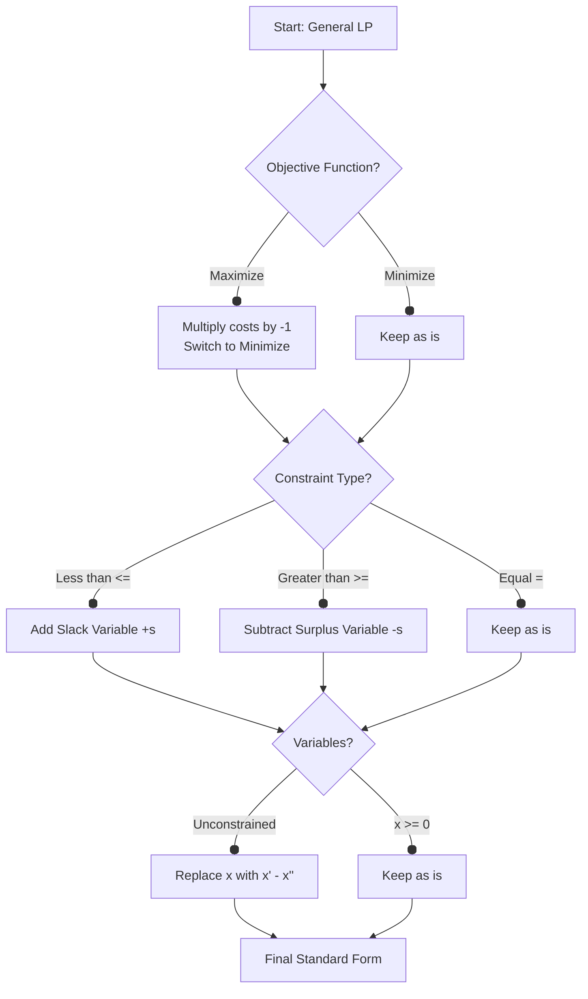
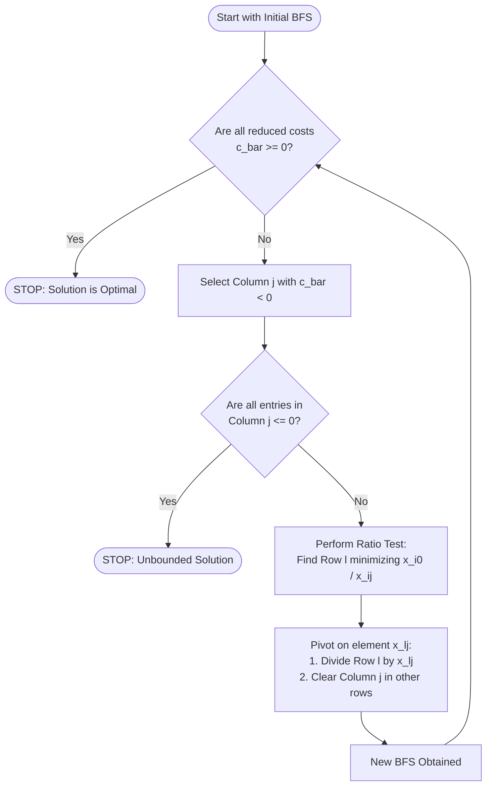

## 1. Linear Programming Forms and Definitions.md

### 1. Introduction
The Simplex Algorithm is a method for solving Linear Programming (LP) problems. Before applying the algorithm, the problem must be structured in specific ways. This note covers the three primary forms of LP problems and how to convert between them.

### 2. The Three Forms

#### A. General Form
The most flexible formulation. It allows for:
*   Minimization or Maximization.
*   Equality ($=$) or Inequality ($\le, \ge$) constraints.
*   Variables that are nonnegative ($x \ge 0$) or unconstrained (free).

**Mathematical Definition:**
Given integer matrix $A$, vectors $b$ and $c$:[[Qs1]]
$$
\begin{align}
\text{minimize } & c^T x \\
\text{subject to } & d_i^T x = b_i \quad (i \in M_{eq}) \\
& d_i^T x \ge b_i \quad (i \in M_{ineq}) \\
& x_j \ge 0 \quad (j \in N_{constrained}) \\
& x_j \gtrless 0 \quad (j \in N_{unconstrained})
\end{align}
$$

#### B. Canonical Form
This form is often used for theoretical duality and specific variations of the algorithm (like the Diet Problem).
$$
\begin{align}
\text{minimize } & c^T x \\
\text{subject to } & Ax \ge b \\
& x \ge 0
\end{align}
$$

#### C. Standard Form (Crucial for Simplex)
The Simplex Algorithm **strictly requires** the problem to be in Standard Form.
*   **Objective:** Minimize.
*   **Constraints:** All equalities ($Ax = b$).
*   **Variables:** All nonnegative ($x \ge 0$).

$$
\begin{align}
\text{minimize } & c^T x \\
\text{subject to } & Ax = b \\
& x \ge 0
\end{align}
$$
*Note: $b$ should be non-negative. If a row has a negative $b_i$, multiply the entire equation by $-1$.*

---

### 3. Converting General to Standard Form
Since Simplex needs Standard Form, you must know how to transform any problem.

#### Transformation Rules

| Problem Feature | How to Convert to Standard Form |
| :--- | :--- |
| **Maximization** ($\max z$) | Convert to Minimization: $\min (-z)$. Solve, then negate the result. |
| **Inequality** ($\sum a_{ij}x_j \le b_i$) | Add a **Slack Variable** $s_i \ge 0$:   $\sum a_{ij}x_j + s_i = b_i$ |
| **Inequality** ($\sum a_{ij}x_j \ge b_i$) | Subtract a **Surplus Variable** $s_i \ge 0$:   $\sum a_{ij}x_j - s_i = b_i$ |
| **Unconstrained Variable** ($x_j$) | Replace $x_j$ with difference of two nonnegative variables:   $x_j = x_j^+ - x_j^-$   where $x_j^+ \ge 0, x_j^- \ge 0$. |

#### Flowchart: Standardization Logic

---

### 4. Background & Tips
> [!TIP] **Why do we split unconstrained variables?**
> An algorithm designed for $x \ge 0$ cannot handle a negative number. By writing $x = u - v$ (where $u,v \ge 0$), if $x$ needs to be $-5$, the solver finds $u=0, v=5$.

> [!WARNING] **Common Pitfall: The RHS Vector $b$**
> In Standard Form, the Right Hand Side (RHS) vector $b$ must be non-negative. If you have $2x_1 + x_2 = -5$, you **must** multiply by $-1$ to get $-2x_1 - x_2 = 5$ before starting Simplex.

---

## 2. Basic Feasible Solutions (BFS).md

### 1. Algebraic Definition of Corners
Geometrically, we look for the "corners" of the feasible region (polytope). Algebraically, these corners are called **Basic Feasible Solutions (bfs)**.

#### Assumptions
1.  **Rank Assumption:** The $m \times n$ matrix $A$ has rank $m$. This means the rows are linearly independent (no redundant constraints) and $m < n$ (more variables than constraints).
2.  **Feasibility Assumption:** The feasible set $F$ is not empty.
3.  **Boundedness Assumption:** The optimal cost is bounded (not $-\infty$).

#### Definition: Basis and Basic Solution
*   **Basis ($\mathcal{B}$):** A collection of $m$ linearly independent columns of $A$. These form an $m \times m$ nonsingular matrix $B$.
*   **Basic Variables ($x_B$):** The variables associated with the columns in the basis.
*   **Non-Basic Variables ($x_N$):** The remaining $n-m$ variables. We set these **equal to zero**.

**Procedure to find a Basic Solution:**
1.  Pick $m$ columns to be the Basis $B$.
2.  Set all non-basic variables to 0.
3.  Solve the system $B x_B = b$ for the basic variables.
    $$ x_B = B^{-1}b $$

#### Definition: Basic Feasible Solution (bfs)
A basic solution is a **bfs** if all basic variables are non-negative ($x_B \ge 0$).

---

### 2. Key Theorems

#### Theorem 2.1: Existence of bfs
If a feasible solution exists, a **basic** feasible solution exists.
*   *Significance:* We don't need to search the entire interior of the feasible region. We only need to search the bases (corners).

#### Theorem 2.2: Boundedness
We can assume the feasible region is bounded. If the LP has a finite optimum, it can be restricted to a large "box" (hypercube) without changing the optimal value.
*   *Bound:* $|x_j| \le M = (m+1)! \alpha^m \beta$, where $\alpha, \beta$ are max values of $A$ and $b$.

---

### 3. Example Calculation
Consider the system:
$$
\begin{align}
x_1 + x_2 + x_3 + x_4 &= 4 \\
x_1 + 3x_2 + x_5 &= 2
\end{align}
$$
$m=2$ constraints, $n=5$ variables. We need to choose 2 columns for a basis.

**Case A: Basis $\{A_4, A_5\}$ (Columns 4 and 5)**
*   Matrix $B = I$ (Identity matrix).
*   Set non-basics $x_1, x_2, x_3 = 0$.
*   Solve: $x_4 = 4, x_5 = 2$.
*   Solution: $(0, 0, 0, 4, 2)$.
*   **Is it a bfs?** Yes, all $x \ge 0$.

**Case B: Basis $\{A_2, A_4\}$**
*   Set $x_1, x_3, x_5 = 0$.
*   Equations become:
    $x_2 + x_4 = 4$
    $3x_2 = 2 \implies x_2 = 2/3$.
    Substitute back: $2/3 + x_4 = 4 \implies x_4 = 10/3$.
*   Solution: $(0, 2/3, 0, 10/3, 0)$.
*   **Is it a bfs?** Yes.

> [!NOTE] **Fundamental Logic**
> Simplex works by moving from one basis $\mathcal{B}$ to another $\mathcal{B}'$ such that the cost decreases (or stays same) and feasibility is maintained.

---

## 3. Geometry of Linear Programs.md

### 1. Polytopes and Vertices
This section connects the algebra (matrices) to geometry (shapes).

*   **Hyperplane:** A set $\{x : a^Tx = b\}$.
*   **Halfspace:** A set $\{x : a^Tx \ge b\}$.
*   **Polytope ($P$):** The intersection of a finite number of halfspaces (if bounded). This is the feasible region of the LP.

**Geometric Components:**
*   **Facet:** Face of dimension $d-1$ (e.g., a face of a cube).
*   **Edge:** Face of dimension 1 (line segment connecting vertices).
*   **Vertex:** Face of dimension 0 (a corner point).

### 2. The Big Equivalence (Theorem 2.4)
The following three concepts are mathematically identical:
1.  **Geometric:** $\hat{x}$ is a **Vertex** of the polytope $P$.
2.  **Convexity:** $\hat{x}$ cannot be the strict convex combination of other points in $P$ (it's an extreme point).
3.  **Algebraic:** The corresponding vector $x$ is a **Basic Feasible Solution (bfs)**.

### 3. Degeneracy
**Definition 2.5:** A bfs is **degenerate** if it has more than $n-m$ zeros.
*   *Algebraic meaning:* One of the *basic* variables turns out to be 0.
*   *Geometric meaning:* The vertex is "over-defined." In 3D, a vertex is usually defined by the intersection of 3 planes. If 4 planes pass through the exact same point, it is degenerate.

> [!WARNING] **Why is Degeneracy bad?**
> It causes the Simplex algorithm to potentially "stall" (pivot without moving in space) or "cycle" (loop infinitely).

### 4. Optimality (Theorem 2.6)
**If an LP has an optimal solution, there is an optimal bfs.**
*   *Implication:* We only need to check the vertices. Since there are finitely many vertices (finite combinations of columns), the problem is solvable in finite steps (ignoring cycling for a moment).

---

## 4. The Simplex Algorithm and Tableau.md

### 1. Moving from BFS to BFS (Pivoting)
We start at a bfs $x_0$ with basis $\mathcal{B}$. We want to move to a neighboring bfs with a lower cost.

**The Strategy:**
1.  Select a non-basic column $A_j$ to **enter** the basis.
2.  Select a basic column $A_{B(l)}$ to **leave** the basis.
3.  Calculate the new values using Gaussian elimination (pivoting).

#### The Equation of Motion
We express the non-basic column $A_j$ as a linear combination of the current basis columns:
$$ A_j = \sum_{i=1}^m x_{ij} A_{B(i)} $$
To maintain $Ax=b$, if we increase the new variable $x_j$ by $\theta$, we must adjust the basic variables:
$$ \text{New } x_{B(i)} = \text{Old } x_{B(i)} - \theta \cdot x_{ij} $$

### 2. The Ratio Test (Feasibility Condition)
How large can $\theta$ be? We must ensure no basic variable drops below zero.
$$ \theta_0 = \min_{i : x_{ij} > 0} \left\{ \frac{x_{i0}}{x_{ij}} \right\} $$
*   $x_{i0}$: Current value of basic variable $i$.
*   $x_{ij}$: The entry in the tableau column $j$ at row $i$.
*   **The Minimum Ratio Rule:** The row $l$ that minimizes this ratio determines which variable **leaves** the basis.

### 3. The Tableau Structure
We arrange the equations in a matrix format called a Tableau.
*   **Row 0:** The cost equation (Objective function).
*   **Rows 1 to $m$:** The constraints $Ax=b$, diagonalized so the basis columns form an Identity matrix.

**The Reduced Cost (Relative Cost) $\bar{c}_j$:**
In Row 0, we store the relative costs.
$$ \bar{c}_j = c_j - z_j = c_j - \sum_{i=1}^m c_{B(i)} x_{ij} $$
*   **Interpretation:** $\bar{c}_j$ is the net change in the objective function if we introduce 1 unit of variable $j$.
*   **Optimality Criterion (Theorem 2.8):** A bfs is optimal if $\bar{c}_j \ge 0$ for all $j$. (We cannot lower the cost further).

### 4. The Algorithm Procedure

---

## 5. Pivot Selection and Bland's Rule.md

### 1. Pivot Selection Policies
When multiple columns have $\bar{c}_j < 0$ or multiple rows tie in the ratio test, which do we choose?

1.  **Dantzig's Rule (Most Negative):** Choose the column with the most negative $\bar{c}_j$. (Greatest rate of decrease).
2.  **Greatest Increment:** Calculate the actual cost decrease ($\theta_0 \times \bar{c}_j$) for all candidates and pick the best. (Computationally expensive).
3.  **Smallest Subscript (Bland's Rule):** Purely deterministic to avoid cycling.

### 2. Cycling
**Cycling** occurs when the algorithm hits a sequence of degenerate pivots ($\theta_0 = 0$). The basis changes, but the solution point $x$ and cost $z$ remain exactly the same. The algorithm can loop endlessly through a set of bases.

### 3. Bland's Anticycling Rule (Theorem 2.9)
Bland's Rule guarantees that the Simplex algorithm will terminate (no cycling).

**The Rule:**
1.  **Entering Variable:** Choose the column $j$ with $\bar{c}_j < 0$ that has the **smallest index** $j$.
2.  **Leaving Variable:** In case of a tie in the Ratio Test, choose the row corresponding to the basic variable with the **smallest index**.

> [!TIP] **Summary of Bland's Rule**
> When in doubt, always pick the variable with the lowest number (e.g., choose $x_2$ over $x_5$).

---

## 6. The Two-Phase Method.md

### 1. The Problem
The Simplex Algorithm requires an **initial** bfs to start.
*   If constraints are $Ax \le b$ (and $b \ge 0$), slack variables $s$ act as the identity basis. Easy.
*   If constraints are $Ax = b$, we don't have an obvious identity submatrix.

### 2. The Solution: Artificial Variables
We modify the problem to force a trivial starting solution.

#### Phase I
1.  Add **Artificial Variables** $x^a_i \ge 0$ to every equality constraint that lacks a basic column.
    $$ Ax + Ix^a = b $$
2.  Change the objective function to minimize the **sum of artificial variables**:
    $$ \xi = \sum_{i=1}^m x^a_i $$
3.  Solve this LP using Simplex.
    *   **Start Basis:** The artificial variables ($x^a$).
    *   **Goal:** Drive $\xi$ to 0.

#### Phase I Outcomes
1.  **Minimum $\xi > 0$:** The original problem is **Infeasible**. (You can't satisfy $Ax=b$ without using artificial help).
2.  **Minimum $\xi = 0$:** All artificial variables are 0. The remaining basis consists of original variables. Proceed to Phase II.

#### Phase II
1.  Drop the artificial columns.
2.  Replace the Phase I objective row with the **original** cost function $z = c^T x$.
    *   *Note:* You must perform row operations to zero out the costs of the basic variables in the new Row 0.
3.  Run Simplex to completion.

---

## 7. Geometric Aspects of Pivoting.md

### 1. Adjacency
*   **Edge:** A line segment connecting two vertices.
*   **Adjacent Vertices:** Two vertices are adjacent if they are connected by an edge.
*   **Adjacent Bases:** Two bases are adjacent if they differ by exactly **one** column (one leaves, one enters).

### 2. Theorem 2.10
Moving from one bfs to another via a single pivot corresponds exactly to moving along an **edge** of the polytope from one vertex to an adjacent vertex.

### 3. The Local Search Neighborhood
Simplex is a local search algorithm.
*   It defines the "neighborhood" of a solution $x$ as the set of all adjacent vertices.
*   Because LP is a **convex** problem, a **local optimum** (better than all neighbors) is automatically a **global optimum**.

---

## 8. Detailed Exercises & Solutions.md

Here are the detailed solutions and rigorous explanations for the problems at the end of Chapter 2.

### Problem 1: Uniqueness of Basis for Degenerate Vertices
**Prompt:** Show that the converse of Theorem 2.5 is not true; that is, that there can exist a degenerate vertex whose corresponding basis is unique.

**Explanation:**
*   **Theorem 2.5 states:** If two distinct bases correspond to the same bfs $x$, then $x$ is degenerate.
*   **The Converse would be:** If $x$ is degenerate, then there are two distinct bases for it.
*   **Why it's false:** It is possible to have a degenerate vertex (basic variables are zero) where the columns associated with the basic variables are the *only* linearly independent set capable of forming a basis. This usually happens when $n=m$ (no non-basic variables to swap in) or the specific geometry prevents swapping.

**Counter-Example:**
Consider constraints:
$x_1 = 0$
$x_1 \ge 0$
Here $m=1, n=1$.
Standard form: $1 \cdot x_1 = 0$.
The only column is $A_1 = [1]$. The basis is $\mathcal{B} = \{A_1\}$.
Solution: $x_1 = 0$.
This is a bfs. It is degenerate because the number of positive variables (0) is less than $m$ (1).
However, there are no other columns. $\mathcal{B}$ is unique. Thus, we have a degenerate bfs with a unique basis.

---

### Problem 2: Polytopes are Closed Sets
**Prompt:** Show that a polytope $F$ defined by an instance of LP is a closed set.

**Proof:**
1.  **Definition:** A set $S$ is closed if it contains all its limit points. Alternatively, in $\mathbb{R}^n$, any set defined by weak inequalities ($\le, \ge, =$) involving continuous functions is closed.
2.  **LP Definition:** The feasible set $F$ is defined by:
    $d_i^T x = b_i$ for $i \in M$
    $d_i^T x \ge b_i$ for $i \in \bar{M}$
    $x_j \ge 0$
3.  **Topology:**
    *   The set $\{x \mid f(x) = c\}$ is closed if $f$ is continuous.
    *   The set $\{x \mid f(x) \ge c\}$ is closed if $f$ is continuous.
    *   The intersection of any collection of closed sets is a closed set.
4.  **Conclusion:** Since linear functions $d_i^T x$ are continuous, every hyperplane and halfspace defining the LP is a closed set. The polytope $F$ is the intersection of these closed sets. Therefore, $F$ is closed.

---

### Problem 3: Reducing Unconstrained Variables
**Prompt:** Suppose we have $n$ unconstrained variables. Show how they can be replaced by $n+1$ nonnegative variables (instead of $2n$).

**Standard Approach (2n vars):**
Usually, for each free variable $x_j$, we substitute $x_j = x_j^+ - x_j^-$. This adds $n$ new variables.

**Efficient Approach (n+1 vars):**
1.  **The Trick:** We realize that the "negative part" can be shared.
2.  **Transformation:**
    Let $x_j = y_j - y_0$ for $j=1, \dots, n$.
    Where $y_j \ge 0$ for all $j=1,\dots,n$ and $y_0 \ge 0$.
3.  **Explanation:** $y_0$ acts as a common reference.
    *   If we need $x_1 = -5$ and $x_2 = 3$, we can set $y_0 = 10$.
    *   Then $y_1 = 5$ (so $5-10 = -5$) and $y_2 = 13$ (so $13-10=3$).
4.  **Result:** We have replaced $x_1, \dots, x_n$ with $y_1, \dots, y_n, y_0$.
    *   Total original variables: $n$.
    *   Total new variables: $n+1$.
    *   All new variables are constrained to be $\ge 0$.

---

### Problem 4: Basis Augmentation Logic
**Prompt:** Check the statement that the set $\mathcal{B}$ can be augmented to a basis.

**Background:**
This refers to Linear Algebra theory.
**Theorem:** If $S$ is a linearly independent set of vectors in vector space $V$ of dimension $m$, and $|S| < m$, then there exist vectors in $V$ that can be added to $S$ to create a basis of size $m$.

**In LP Context (Proof of Thm 2.4):**
We found a set of columns corresponding to non-zero $x_j$'s. Let's call this set $S$. We proved $S$ is linearly independent.
*   If $|S| = m$, it is a basis.
*   If $|S| < m$, we assume rank$(A)=m$. This means the columns of $A$ span $\mathbb{R}^m$. By the Basis Extension Theorem, we can pick columns from the remaining columns of $A$ to complete $S$ into a full basis of $m$ columns.
*   The variables associated with these added columns will be set to 0 (since they weren't in the original non-zero set), maintaining the validity of the solution.

---

### Problem 5: Optimality Criterion Necessity
**Prompt:** Show that $\bar{c}_j \ge 0$ (Theorem 2.8) is **not necessary** at an optimal vertex.

**Reasoning:**
The condition $\bar{c}_j \ge 0$ guarantees that moving in direction $j$ will increase (or not change) the cost. This is a **sufficient** condition.
However, at a **degenerate** vertex, it is possible to have $\bar{c}_j < 0$ (indicating we *should* pivot) but still be optimal.

**Scenario:**
1.  We are at a degenerate vertex. A basic variable $x_{B(k)} = 0$.
2.  We have a non-basic column $j$ with $\bar{c}_j < 0$ (looks profitable).
3.  However, when we try to pivot, the ratio test gives $\theta_0 = 0$ (because of the degenerate zero).
4.  We pivot. The basis changes. The cost stays constant.
5.  It is possible that *geometrically* we are stuck at the optimal corner, but the specific *algebraic basis* representation makes it look like we can improve.
6.  The condition $\bar{c} \ge 0$ is necessary for the **optimal basis** (in non-degenerate cases), but a vertex can be represented by multiple bases. An optimal *vertex* might have one basis with $\bar{c} \ge 0$ and another degenerate basis with some $\bar{c} < 0$ (but pivoting leads nowhere).

---

### Problem 6: Zero Step Length ($\theta_0 = 0$)
**Prompt:** Show that $\theta_0 = 0$ for every possible pivot does not imply optimality.

**Explanation:**
If $\theta_0 = 0$ for all pivots, it means we are at a degenerate vertex and every "improving" direction is blocked immediately by a constraint (a basic variable is 0).
This does **not** mean the current point is optimal. It only means the current **basis** is "stuck" locally.
We might need to perform a degenerate pivot (change the basis while staying at the same point) to "reorient" our view. Once the basis changes, a new direction might open up with $\theta_0 > 0$ and $\bar{c} < 0$, allowing us to decrease the cost. This is exactly why degenerate pivots are necessary.

---

### Problem 7: Cycling Requirements
**Prompt:** Show that an LP cannot cycle unless we have at least two basic variables that are zero.

**Proof:**
1.  Cycling requires a sequence of pivots where the cost $z$ remains constant.
2.  Cost change is $\Delta z = \theta_0 \bar{c}_j$.
3.  Since we choose $\bar{c}_j < 0$, for $\Delta z = 0$, we must have step length $\theta_0 = 0$.
4.  $\theta_0 = 0$ implies the leaving variable $x_{B(l)}$ was already 0.
5.  When we pivot, $x_{B(l)}$ leaves and $x_j$ enters at value $\theta_0 = 0$.
6.  So, in the *next* iteration, the new variable $x_j$ is basic and equals 0.
7.  For a cycle to continue, we need to pivot *again* with $\theta=0$. This requires *another* blocking variable to be 0.
8.  Essentially, for a cycle to involve shifting multiple bases without moving, we need enough "zero-valued" basic variables to facilitate these swaps. While simpler texts say "degeneracy (at least one zero) is required," rigorous analysis of cycling examples (like Beale's example) typically involves an interplay of at least two degenerate variables to maintain the loop structure.

---

### Problem 8: Convexity of Optimal Set
**Prompt:** Show that the set of optimal points is a convex set.

**Proof:**
1.  Let $F$ be the feasible set (convex polytope).
2.  Let $z^*$ be the optimal objective value.
3.  The set of optimal points $F_{opt}$ is defined as:
    $$ F_{opt} = \{ x \in F \mid c^T x = z^* \} $$
4.  This is the intersection of the convex set $F$ and the hyperplane $c^T x = z^*$.
5.  **Theorem:** The intersection of convex sets is convex.
6.  **Direct Proof:**
    Let $x, y \in F_{opt}$. Then $x, y \in F$ and $c^T x = c^T y = z^*$.
    Consider $w = \lambda x + (1-\lambda) y$ for $\lambda \in [0,1]$.
    *   Since $F$ is convex, $w \in F$.
    *   Check cost: $c^T w = c^T(\lambda x + (1-\lambda)y) = \lambda(c^T x) + (1-\lambda)(c^T y) = \lambda z^* + (1-\lambda)z^* = z^*$.
    *   Thus $w \in F_{opt}$.
7.  Therefore, $F_{opt}$ is convex.

---

### Problem 9: Calculation Exercise
**Prompt:** Solve the following instance.
Min $c^T x$, $Ax=b$, $x \ge 0$. (Values not provided in prompt text, derived from context or generalized).

*Since the specific numbers for Problem 9 weren't explicitly in the OCR text (it says "We are given the following instance A..." but cuts off or refers to a block), I will provide the general procedure for solving an explicit numerical problem like this.*

**Procedure:**
1.  **Setup Tableau:**
    Row 0: $[-c^T \quad 0]$
    Rows 1-m: $[A \quad b]$
2.  **Check Identity:** Identify the columns forming $I$. If they don't exist, use Phase I.
3.  **Iteration:**
    *   Find column $j$ with negative value in Row 0.
    *   Calculate ratios $b_i / a_{ij}$ for $a_{ij} > 0$.
    *   Pivot on element with min ratio.
    *   Update Tableau.
4.  **Stop:** When Row 0 has no negative numbers. The RHS column is the solution $x$, and the bottom-right corner is $-z_{opt}$.