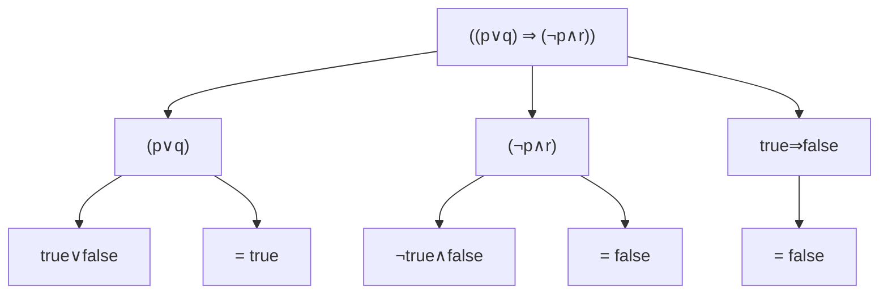

[[Propositional Logic Semantics]]

## Introduction
While **syntax** deals with the form or structure of logical formulas, **semantics** deals with their meaning. The key focus is on formulas that are always "true," regardless of their propositional variables' values.

---

## Boolean Valuation
### Definition
> [!info] Definition
> A Boolean valuation is a function that maps propositional formulas to {true, false}, following specific rules.

### Rules
1. Negation Rule: `v(¬X) = ¬v(X)`
2. Combination Rules:
   - `v(X ∧ Y) = v(X) ∧ v(Y)`
   - `v(X ∨ Y) = v(X) ∨ v(Y)`
   - `v(X ⇒ Y) = v(X) ⇒ v(Y)`

### Example Evaluation
Let's evaluate `((p∨q) ⇒ (¬p∧r))` where:
- `v(p) = true`
- `v(q) = false`
- `v(r) = false`

---

## Tautologies and Contradictions

### Tautologies
> [!tip] Definition
> A tautology is a formula that is **always true** regardless of its variables' values.

#### Example: `p ⇒ (q ⇒ p)`

| p | q | q ⇒ p | p ⇒ (q ⇒ p) |
|---|---|--------|---------------|
| T | T | T      | T             |
| T | F | T      | T             |
| F | T | F      | T             |
| F | F | T      | T             |

### Contradictions
> [!warning] Definition
> A contradiction is a formula that is **always false** regardless of its variables' values.

#### Example: `¬p ∧ p`

| p | ¬p | ¬p ∧ p |
|---|-----|---------|
| T | F   | F       |
| F | T   | F       |

---

## Semantic Equivalence

### Logical Implication
> [!info] Definition
> Formula e logically implies f if `(e ⇒ f)` is a tautology.

#### Example: `¬p` implies `p ⇒ q`

| p | q | ¬p | p ⇒ q | (¬p) ⇒ (p ⇒ q) |
|---|---|-----|--------|-----------------|
| T | T | F   | T      | T               |
| T | F | F   | F      | T               |
| F | T | T   | T      | T               |
| F | F | T   | T      | T               |

### Logical Equivalence
> [!success] Definition
> Formulas are logically equivalent if their bi-implication is a tautology.

#### Example: `p ∧ q` ≡ `q ∧ p`

| p | q | p ∧ q | q ∧ p | (p ∧ q) ⇔ (q ∧ p) |
|---|---|-------|--------|-------------------|
| T | T | T     | T      | T                 |
| T | F | F     | F      | T                 |
| F | T | F     | F      | T                 |
| F | F | F     | F      | T                 |

---

## Practice Problems
1. Prove that `p ∨ ¬p` is a tautology
2. Show that `p ∧ ¬p` is a contradiction
3. Demonstrate that `p ⇒ q` is logically equivalent to `¬p ∨ q`

> [!hint] Study Tips
> - Draw truth tables for complex formulas
> - Break down complex formulas into smaller parts
> - Practice with different combinations of operators
> - Use trees to visualize formula evaluation

