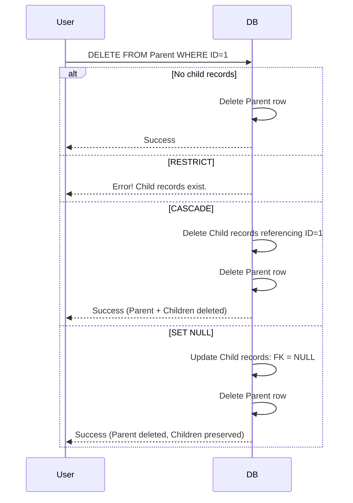

# Foreign Key Behaviors

**Concept:** Ensures that a relationship between two tables remains valid. If `Order` references `Customer`, the `Customer` row must exist unless the foreign-key column is allowed to be `NULL` and is set to `NULL`.

## 1. Child-Side Referential Violations
Referential integrity can fail from the child side when an application tries to:

* insert a child row whose foreign-key value does not exist in the parent table;
* update a child foreign-key value to a non-existent parent key;
* set a foreign key to `NULL` when the column is defined `NOT NULL`.

These operations are rejected unless the new value satisfies the foreign-key rule.

## 2. Parent-Side Referential Violations
A parent key cannot normally be deleted or changed while child rows still reference it. The configured referential action determines what the DBMS does with those dependent rows.

## 3. What happens when the Parent is Deleted?
You must define the behavior for the Child records.

### 1. CASCADE
*   **Action:** Delete the child automatically.
*   **Use Case:** Strong composition. If a `Post` is deleted, its `Comments` should also be deleted.
*   **Risk:** A single parent deletion can recursively affect a very large number of child rows, increasing locking, logging, and execution cost.

### 2. SET NULL
*   **Action:** Keep the child, but remove the link by setting the foreign key to `NULL`.
*   **Use Case:** Loose association. If an `Employee` leaves, their `Tasks` should remain but be unassigned.
*   **Requirement:** The child foreign-key column must permit `NULL`; otherwise the referential action cannot be applied.

### 3. RESTRICT (Default in many systems)
*   **Action:** Block the deletion or update and report a referential-integrity error.
*   **Use Case:** Data protection. You cannot delete a `Category` if `Products` are still using it.

### 4. SET DEFAULT
*   **Action:** Change the foreign key to its declared default value.
*   **Use Case:** Fallback. If a `Teacher` leaves, assign students to a "Substitute Teacher" ID.
*   **Compatibility:** Support for `SET DEFAULT` varies by DBMS, so the exact behavior must be checked against the target engine.

## 4. Referencing a Parent Update
The same actions can apply when a referenced parent key itself is changed. An `ON UPDATE` action can reject the change, propagate it to child keys, set child references to `NULL`, or apply a supported default. In practice, primary keys are usually treated as stable identifiers, so parent-key updates are less common than deletions.

