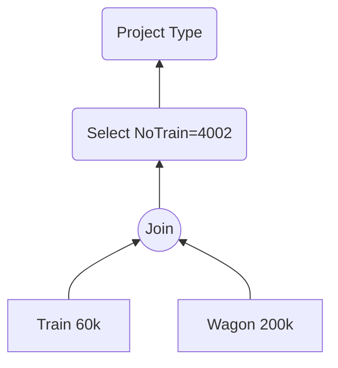
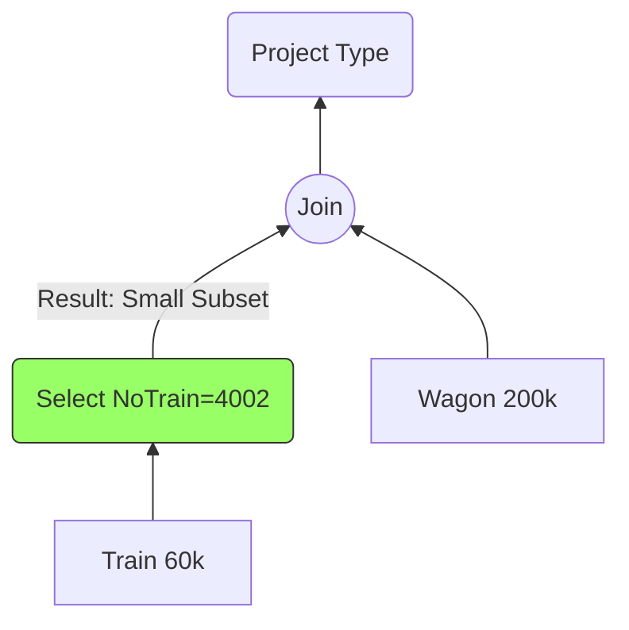

# 6. Exercise Analysis - Trains & Wagons (TD Ex 1)

This exercise demonstrates the concrete application of Heuristic #1 (Push Selections).

## The Context

- **Schema:**
  - `Train(NoTrain, NoWagon)` (Note: The schema in the TD implies a train is a link to wagons).
  - `Wagon(NoWagon, TypeWagon, ...)`
- **Volume:**
  - Trains: 60,000
  - Wagons: 200,000
  - Distinct Trains: 2,000

## The Query

_"Find the type of wagon for Train Number 4002."_

```sql
SELECT W.TypeWagon
FROM Train T
JOIN Wagon W ON T.NoWagon = W.NoWagon
WHERE T.NoTrain = 4002;
```

## Tree Comparison

### Tree (a): The "Bad" Tree



- **Analysis:**
  1. The database builds the **entire** train composition for all 2,000 trains first.
  2. It creates a massive temporary result containing all wagon assignments.
  3. Only then does it filter for #4002.
- **Cost:** High memory/I/O usage and a large intermediate result.

### Tree (b): The "Good" Tree



- **Analysis:**
  1. The database filters `Train` immediately.
  2. Under the uniform-distribution assumption, `NoTrain = 4002` returns approximately:
     $$60,000 / 2,000 = 30\text{ tuples}$$
  3. The Join therefore works with only about 30 qualifying `Train` tuples rather than all 60,000.
  4. If `NoWagon` is indexed in `Wagon`, those qualifying rows can use efficient index lookups.
- **Cost:** Much lower intermediate cardinality and potentially much lower I/O.

## Tree Equivalence

The two trees are logically equivalent because the selection predicate `NoTrain=4002` references only the `Train` relation:

$$\sigma_{NoTrain=4002}(Train \bowtie Wagon)
\equiv
\sigma_{NoTrain=4002}(Train) \bowtie Wagon$$

The optimizer can therefore push the selection downward without changing the result.

## Why the Optimized Tree Is Better

The optimization principle is to reduce the amount of data that later operators must process. Here, one predicate reduces `Train` from roughly 60,000 rows to about 30 before the join.

This does **not** mean that an index lookup is always required: the optimizer can choose a sequential scan if the estimated cost of the scan is lower. The key benefit of the rewrite is the smaller intermediate relation.

## Detailed Answers to TD Questions

**Q1. Are the trees equivalent?**
**Yes.** The selection can be pushed below the join because its predicate uses only attributes from `Train`.

**Q2. Which is better?**
The selection-pushed plan normally has the lower execution cost because it reduces the join input dramatically. The exact physical winner still depends on indexes, statistics, cache state, join algorithm, and available memory.

**Q3. SQL Query:**

```sql
SELECT W.TypeWagon
FROM Train T
JOIN Wagon W ON T.NoWagon = W.NoWagon
WHERE T.NoTrain = 4002;
```
