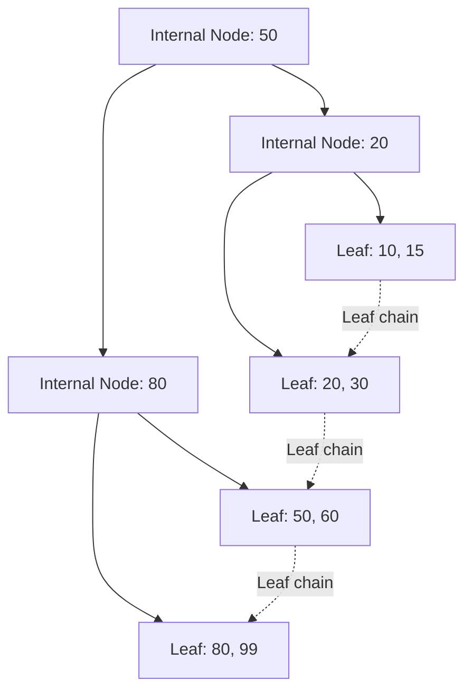

# Database Indexing Deep Dive

While query heuristics dictate the *logical* order of operations, the DBMS relies on **Indexes** to perform the *physical* retrieval. An index is a specialized data structure that takes a search key and quickly returns the location of the matching row or data record.

## 1. Primary vs Secondary Indexes
*   **Primary / Clustered Index:** In systems that use clustered storage, this index determines or strongly influences the physical ordering of table data. Because a table cannot generally be physically ordered in several independent ways, only one clustered organization is practical for a table.
    *   *Advantage:* Efficient range access when matching rows are stored near one another.
*   **Secondary / Non-Clustered Index:** A separate access structure containing key values and row/data pointers. Multiple secondary indexes can normally be defined.

> [!NOTE] Terminology
> "Clustered" is a physical storage organization, not simply a synonym for "primary key". Some DBMSs cluster a table by its primary key by default; others do not.

## 2. B+ Tree Indexes
The **B+ tree** is a balanced multiway tree designed to minimize disk I/O.

### Structure
*   **Internal Nodes:** Contain separator keys and child pointers.
*   **Leaf Nodes:** Contain search keys and row/data pointers (or the actual data in some clustered organizations).
*   **Leaf Links:** Leaves are linked in key order, making sequential range scans efficient once the first matching leaf is located.

### Why B+ Trees?
A binary search tree has only two children per node, which can require many levels. A B+ tree stores many separator keys and pointers in one disk page, producing a much higher fan-out and therefore a shallow tree.

A rough height estimate is:

$$h \approx \lceil \log_f(N) \rceil$$

where $f$ is the effective fan-out and $N$ is the number of indexed entries or leaves being reached. The actual height also depends on page size, key width, pointer width, and fill factor.

## 3. B+ Tree Construction Example

Suppose keys `1001` through `1015` are inserted and leaf nodes can hold at most 3 keys.

### Step 1: Create the leaf blocks

* `Leaf 1`: `[1001, 1002, 1003]`
* `Leaf 2`: `[1004, 1005, 1006]`
* `Leaf 3`: `[1007, 1008, 1009]`
* `Leaf 4`: `[1010, 1011, 1012]`
* `Leaf 5`: `[1013, 1014, 1015]`

### Step 2: Build the root

The root stores separator keys such as:

`[1004, 1007, 1010, 1013]`

with child pointers to the five leaves. The separator interpretation depends on the B+ tree convention used by the DBMS; its purpose is to direct a search to the correct leaf.

## 4. B+ Tree DML Behavior

* **INSERT:** Adds a key to the appropriate leaf. If a node overflows, it is split and the separator information propagates upward. Repeated splits can increase tree height.
* **DELETE:** Removes a key. If the node becomes too empty, the implementation may redistribute entries with a sibling or merge nodes.
* **UPDATE:** If the indexed key changes, the index entry must move from the old key position to the new position; this is logically a delete followed by an insert.

## 5. Bulk Loading and Rebuilding

Loading a very large dataset into an already indexed table can cause many incremental index updates and page splits. For controlled bulk-loading workflows, it can be faster to load the data first and build/rebuild suitable indexes afterward. Whether dropping an index is beneficial depends on the DBMS and workload, so treat this as a bulk-load strategy rather than a universal rule.

## 6. Access Methods

### Full Table Scan
Reads table pages sequentially. It is often preferable when a large proportion of the table must be returned or when sequential I/O is cheaper than many random lookups.

### Index Scan
Traverses the index, finds matching row/data pointers, then fetches the required table data when necessary. It is most useful for selective predicates or useful ordered/range access.

### Index-Only / Covering Access
If the index contains every column needed by the query, the engine may satisfy the query directly from the index without visiting the base table. This can significantly reduce random data-page I/O.

## 7. Hash Indexes

Hash indexes are designed primarily for **exact equality** predicates.

* Typical lookup behavior is close to $O(1)$ on average under suitable assumptions.
* They are not naturally ordered, so range predicates such as `age > 18` cannot exploit the hash ordering the way a B+ tree can.

### Static vs Dynamic Hashing
* **Static hashing:** fixed bucket count; growth can create overflow chains.
* **Dynamic hashing:** bucket structures grow or split as data expands, using techniques such as extendible hashing or linear hashing.

## 8. Bitmap Indexes

Bitmap indexes are particularly useful for **low-cardinality** attributes such as boolean flags or a small status set. Each distinct value can be represented by a bitmap whose bits correspond to rows.

They can make combinations and some aggregations very efficient through bitwise operations, but they are generally less attractive for highly updated OLTP workloads because bitmap maintenance can be expensive.
