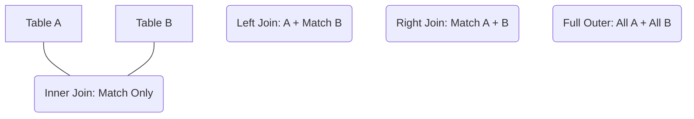

###  Sources
*   *Based on Images: 8, 12*

### 1. SQL Joins (Jointures)
Joins combine data from multiple tables.

*   **INNER JOIN:** Returns rows *only* when there is a match in both tables.
*   **LEFT JOIN (Left Outer):** Returns *all* rows from the Left table, and matched rows from the Right. If no match, Right columns are `NULL`.
*   **RIGHT JOIN:** Opposite of Left Join.
*   **FULL OUTER JOIN:** Returns rows if there is a match in *either* table (Union of Left and Right). *Note: MySQL does not support this directly; use `UNION`.*
*   **CROSS JOIN:** Cartesian Product. Matches every row of A with every row of B.
    *   *Result Size:* Size(A) * Size(B).
*   **SELF JOIN:** Joining a table to itself.
    *   *Example:* An `Employees` table has a `ManagerID`. You join `Employees e1` with `Employees e2` where `e1.ManagerID = e2.ID` to get the manager's name.

> [!TIP] Best Practices
> 1.  **Always use Aliases:** `FROM customers AS c` makes queries readable.
> 2.  **Explicit Joins:** Use `JOIN ... ON` syntax, avoid the old style `FROM tableA, tableB WHERE ...` (implicit cross join).
> 3.  **Filter Early:** Filtering in the `ON` clause is often more efficient than in the `WHERE` clause for Outer Joins.

---

### 2. Subqueries & Aggregation

#### Operators
*   **`IN`:** Checks if value exists in a list. `WHERE id IN (1, 2, 3)`.
*   **`NOT IN`:** Warning: If the list contains a `NULL`, `NOT IN` returns nothing (Unknown).
*   **`ANY` / `SOME`:** Comparison with *at least one* value in the list. `WHERE price > ANY (SELECT price...)`.
*   **`ALL`:** Comparison with *every* value in the list. `WHERE price > ALL (SELECT price...)`.

#### Correlated Subqueries vs. EXISTS
*   **Standard Subquery:** Inner query runs once, returns a list, outer query uses it.
*   **Correlated Subquery:** The inner query references a column from the outer query (`outer.id`).
    *   *Mechanism:* The inner query runs **once for every row** of the outer query. This can be slow.
*   **`EXISTS`:** Used often with correlated subqueries.
    *   Returns `TRUE` as soon as it finds *one* match. It does not scan the whole table.
    *   *Pro Tip:* `SELECT 1` is conventionally used in `EXISTS` (e.g., `WHERE EXISTS (SELECT 1 FROM...)`) because the actual data returned doesn't matter, only the existence of a row.

#### Aggregates
Functions that calculate values on a set of lines:
*   `COUNT(*)`: Counts rows.
*   `COUNT(column)`: Counts non-null values in that column.
*   `SUM()`, `AVG()`, `MIN()`, `MAX()`.

---