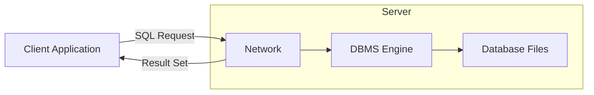

###  Sources
*   *Based on Images: 2, 3*

### 1. The Relational Model & DBMS Fundamentals
A **Database Management System (DBMS/SGBD)** is a software layer that allows users to define, create, maintain, and control access to the database. It acts as an intermediary between the user/application and the physical data.

#### The Relational Model
Data is organized into **Tables** (also called Relations).
*   **Tuples (Rows):** Represent a single entity/record. **Critically**, the order of rows is not significant.
*   **Attributes (Columns):** Represent properties of the entity.
*   **Atomicity:** Each intersection of a row and column must hold a single, atomic value (no lists or arrays inside a cell).
*   **Uniqueness:** No two rows can be identical. This is usually enforced by a **Primary Key**.

#### SQL Language Categories
SQL is not one language, but a suite of commands:
1.  **DDL (Data Definition Language / LDD):** Defines the "skeleton" of the database.
    *   `CREATE` (Table, View), `ALTER` (Modify structure), `DROP` (Delete structure).
2.  **DML (Data Manipulation Language / LMD):** Manages the "flesh" (data) inside the skeleton.
    *   `INSERT`, `UPDATE`, `DELETE`, `SELECT`.
3.  **DCL (Data Control Language / LCD):** Manages access and permissions.
    *   `GRANT` (Give permission), `REVOKE` (Remove permission).

---

### 2. ACID Properties: The Pillars of Reliability
For a relational database to be reliable, it adheres to **ACID**:

| Property | Definition | Why it matters |
| :--- | :--- | :--- |
| **A - Atomicity** | "All or Nothing." A transaction is an indivisible unit. | If you transfer money, the debit and credit must *both* happen, or *neither* happens. |
| **C - Consistency** | The database must move from one valid state to another valid state. | Data must satisfy all integrity constraints (Foreign Keys, NOT NULL) after the transaction. |
| **I - Isolation** | Concurrent transactions should not interfere with each other. | If two people try to book the last seat on a flight, the system handles them sequentially (conceptually). |
| **D - Durability** | Once committed, changes are permanent, even if the power fails. | Data is written to non-volatile storage (disk) and survives crashes. |

---

### 3. Specialized Database Types (NoSQL & Others)
When Relational DBMS (RDBMS) limits performance or flexibility, we use alternative models.

#### NoSQL ("Not Only SQL")
Designed for unstructured data, horizontal scaling, and flexibility.

1.  **Key-Value (Clé-Valeur):**
    *   **Mechanism:** A simple hash map. You provide a key, you get a blob of data.
    *   **Use Case:** Caching (Redis), Session management.
2.  **Document Store:**
    *   **Mechanism:** Stores data as JSON or XML documents. Schema is flexible (schema-less).
    *   **Use Case:** Content management, catalogs (MongoDB).
3.  **Wide-Column (Colonnes Larges):**
    *   **Mechanism:** Stores data in columns rather than rows. Optimized for writing huge amounts of data.
    *   **Use Case:** Big Data analytics (Cassandra, HBase).
4.  **Graph:**
    *   **Mechanism:** Nodes (entities) and Edges (relationships).
    *   **Use Case:** Social networks, Recommendation engines (Neo4j).

#### Other Architectures
*   **Hierarchical:** Tree structure (1 parent -> N children). Very fast for navigation but rigid (cannot easily model N-to-N relationships).
*   **Network:** Graph-like, handles N-to-N, but complex to maintain pointers.
*   **Object-Oriented:** Stores objects directly (inheritance, polymorphism). Good for complex data models in programming.
*   **Real-Time / Time-Series:** Optimized for timestamped data (IoT sensors, financial stock tickers). Features extremely fast insertion.

---

### 4. System Architectures

*   **Client-Server:** Standard 2-tier architecture. Centralized maintenance and security.
*   **Distributed Architecture:** Data or processing is spread across multiple physical sites (machines).
    *   **Motivation:** Load balancing, Fault tolerance (Resilience), Data proximity (users in Europe access the European server).
    *   **Types:**
        *   *Fragmented:* Data is split (A-M on Server 1, N-Z on Server 2).
        *   *Replicated:* Full copy of data on all servers (High availability, but syncing is hard).
        *   *Hybrid:* Mix of both.

---