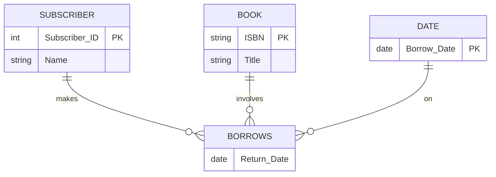

# 1. Advanced ER Concepts and Attribute Normalization

Creating a Conceptual Data Model (MCD) requires strict rules regarding how attributes are assigned to entities and associations. This note breaks down the complex scenarios that often trick students.

## 2. The "Borrowing" Problem: Implicit Identifiers and Ternary Associations

A common trap in database exams involves modeling a library system where a Subscriber borrows a Book.

### The Naive Approach (Incorrect)
If you create a standard Many-to-Many (Maillé) association:
`SUBSCRIBER` (0,n) --- `Borrows` --- (0,n) `BOOK`

*   **The Rule:** The implicit identifier of a Many-to-Many association is the combination of the primary keys of its participating entities.
*   **The Problem:** The key for `Borrows` becomes `(Subscriber_ID, Book_ID)`. Because primary keys must be strictly unique, a subscriber can only borrow a specific book **once in their entire life**. If they try to borrow it again next year, the system will throw a duplicate key error.

### The Correct Approach (Promoting to Ternary)
To allow a subscriber to borrow the same book on different dates, the `Date` must become part of the association's unique identifier. 

To achieve this in standard E/R modeling, we create a "dummy" or abstract entity called `DATE` and turn the association into a **Ternary (3-way) Association**.

*Now, the implicit identifier for `BORROWS` is `(Subscriber_ID, ISBN, Borrow_Date)`. The subscriber can borrow the exact same book multiple times, provided the dates are different.*

## 3. Strict Rules for Normalizing Attributes in E/R

Before moving to the relational model, the attributes on your E/R diagram must be normalized.

1.  **No Composite / Multiple Attributes:**
    *   *Wrong:* Entity `EMPLOYEE` has attribute `Address`.
    *   *Fix:* Explode it into `Street`, `City`, `ZipCode`.
    *   *Wrong:* Entity `EMPLOYEE` has attribute `PhoneNumbers` (containing home, work, and cell).
    *   *Fix:* Create a separate `PHONE` entity and link it to `EMPLOYEE` via an association.

2.  **No Derived / Calculated Attributes:**
    *   *Wrong:* Storing `Total_Price` when you already store `Quantity` and `Unit_Price`.
    *   *Fix:* Remove `Total_Price`. It must be calculated on the fly by the application or a SQL query, never stored physically, to prevent data desynchronization (e.g., someone updates `Quantity` but forgets to update `Total_Price`).

3.  **Attributes in Associations:**
    *   An attribute belongs in an association **if and only if** it depends on ALL entities involved in the association simultaneously.
    *   *Example:* If a `SUPPLIER` supplies an `ARTICLE`, where does the `Quantity` go? It cannot go in `SUPPLIER` (they supply many things in different quantities). It cannot go in `ARTICLE` (it is supplied by many people in different quantities). It goes in the `SUPPLIES` association.

4.  **Enumerated Attributes Become Entities:**
    *   If an attribute takes values from a strict list of categories or types (e.g., `Emission_Type` = "Radio", "TV", "Web"), it should not be a text attribute.
    *   *Fix:* Extract it into a new Entity-Type called `TYPE` with a 1-to-N association to the original entity. This ensures referential integrity (no one can misspell "Radio" as "Rdaio").
