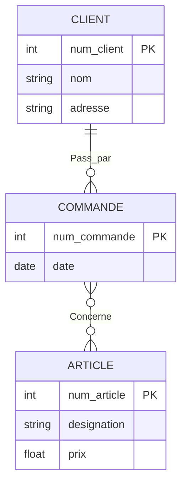

# 1. Complex ER to Relational Translations

While the basic rules of translating E/R to Relational are straightforward (Entities become tables, N:M associations become junction tables), there are complex edge cases involving functional dependencies *on* the associations themselves.

## 2. Dependencies on an Association (The "Command" Example)

Look at this scenario:
An `ARTICLE` is linked to a `COMMANDE` via an association `Concerne` (0,n to 0,n).
A `COMMANDE` is linked to a `CLIENT` via an association `Passée par` (1,1 to 0,n).

**Step-by-Step Translation:**

1.  **Handle the Entities:**
    *   `CLIENT(num_client, nom, adresse)`
    *   `ARTICLE(num_article, designation, prix)`
    *   `COMMANDE(num_commande, date)`

2.  **Handle the N:M Association (`Concerne`):**
    *   Because it is 0,n on both sides, it becomes a new table. It absorbs its own property (`quantité`).
    *   `DETAIL_COMMANDE(num_commande*, num_article*, quantité)` (Both FKs together form the PK).

3.  **Handle the 1:1 / 0,n Association (`Passée par`):**
    *   This is a Functional Dependency. `COMMANDE` has the `1,1` leg. This means every order is placed by exactly ONE client.
    *   Therefore, the primary key of the target (`num_client`) migrates into the source (`COMMANDE`) as a foreign key.
    *   *Updated Table:* `COMMANDE(num_commande, date, num_client*)`

## 3. The "Teaching" Edge Case (Associations pointing to Associations)

A very rare but important concept is when an association acts as a Functional Dependency pointing to another entity. 

**The Scenario:**
*   A `STUDENT` follows a `CLASS` (UV) -> N:M Association (`A suivi`) with a property `note` (grade).
*   A `CLASS` (UV) is taught by a `PROFESSOR` -> 0,n to 1,1 Association (`Enseignant`).

**Why is this complex?**
The association "Enseignant" is a functional dependency originating from the entity `UV`. Every `UV` is taught by exactly one `PROFESSOR` (1,1). 

**The Translation:**
1.  **Entities:**
    *   `ELEVE(code_eleve, nom, prenom)`
    *   `PROFESSEUR(code_professeur, nom, prenom)`
    *   `UV(code_UV, nom, annee)`
2.  **The N:M Association (`A suivi`):**
    *   Becomes a table named `NOTE`.
    *   `NOTE(code_eleve*, code_UV*, note)`
3.  **The 1:1 Association (`Enseignant`):**
    *   Because `UV` has the 1,1 cardinality, it acts as the source of the dependency. We inject the primary key of `PROFESSEUR` into `UV`.
    *   *Updated Table:* `UV(code_UV, nom, annee, code_professeur*)`

> **💡 Key Takeaway for Students:** Never turn a `1,1` or `0,1` association into its own table. It **always** results in a foreign key being added to the entity sitting on the `1,1` or `0,1` side of the relationship line.
