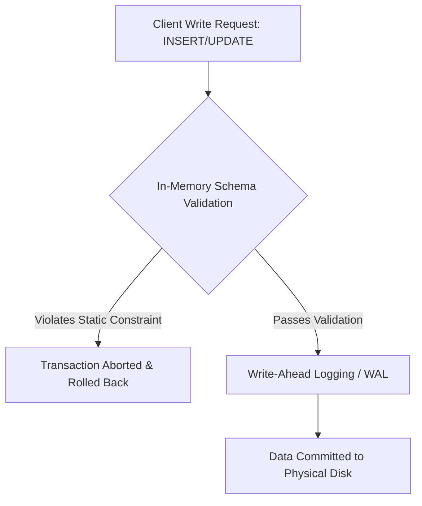
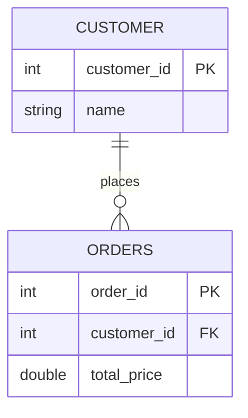
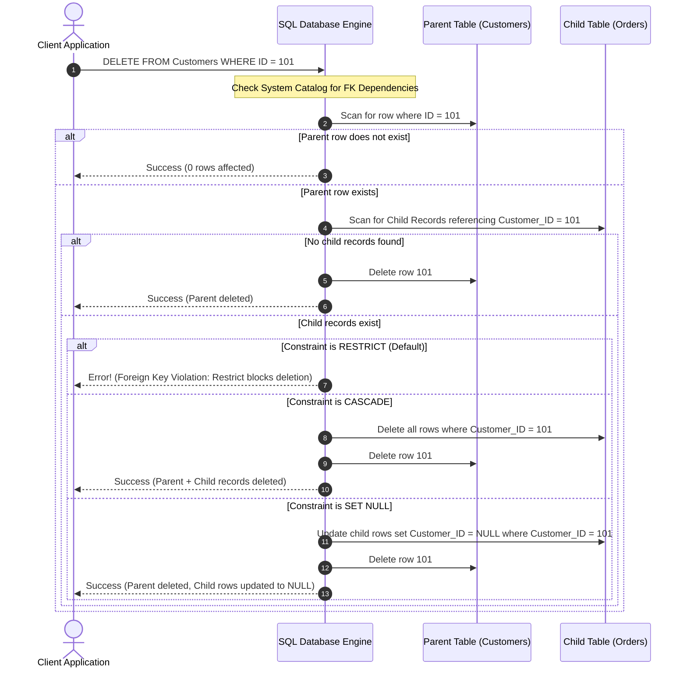
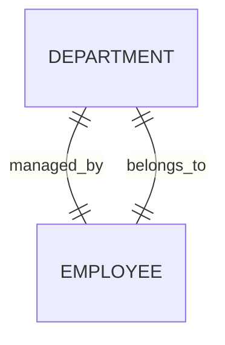
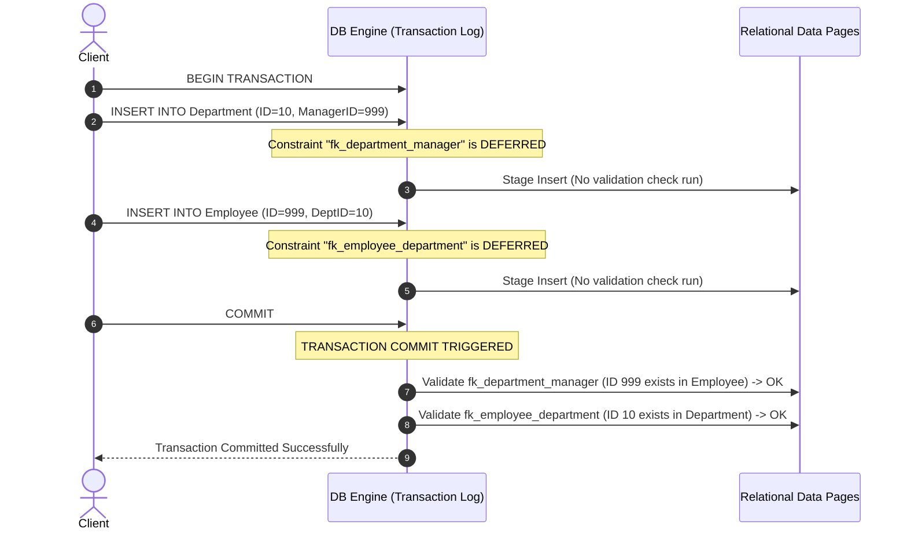
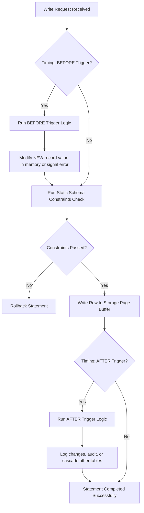
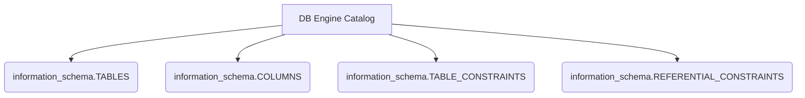
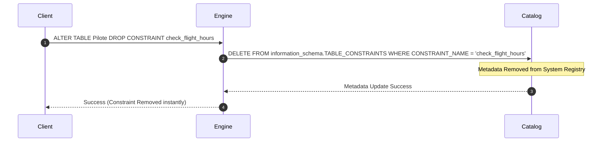

# Course: Advanced Databases (Bases de données avancées)

---

## Chapter 1: Static Integrity Constraints

Static integrity constraints are declarative rules defined directly at the schema level using SQL Data Definition Language (`DDL`). The database management system (DBMS) compiles and registers these rules in the system catalog, checking them in-memory **before** any write operation (such as `INSERT`, `UPDATE`, or `DELETE`) is physically written to the disk's storage pages. 

By enforcing rules at the DBMS layer, static constraints provide a permanent line of defense that prevents application bugs from corrupting the relational state, regardless of the client or language used to access the database.



### 1.1 Entity Integrity (Row Identity)

Entity integrity ensures that every row within a relational table represents a distinct, identifiable real-world entity. Without entity integrity, a database can suffer from duplicate rows, leading to ambiguous queries and loss of historical tracking.

*   **PRIMARY KEY**: The primary key is the unique identifier for a row. Under the hood, the DBMS automatically applies two conditions: every column participating in the primary key is set to `NOT NULL`, and a unique index is built over the primary key columns (typically using a B-Tree structure) to accelerate lookups. A table can have only one primary key.
*   **UNIQUE**: Ensures that all values in a column or set of columns are distinct across all rows in the table. Unlike a primary key, a table can support multiple `UNIQUE` constraints. Crucially, depending on the SQL standard and specific DBMS implementation (such as PostgreSQL or MySQL), `NULL` values are usually treated as distinct from one another. This means a column with a `UNIQUE` constraint can contain multiple `NULL` rows unless it is explicitly paired with a `NOT NULL` constraint.
*   **NOT NULL**: This constraint prevents a column from storing `NULL` values, forcing the application to provide a concrete value during row insertion. At the engine layer, this is checked by evaluating the row's null-bitmap header before writing the tuple.

### 1.2 Domain Integrity (Value Validity)

Domain integrity restricts the values that can be stored in a given column to a valid range or set of values defined by business rules.

*   **CHECK Constraints**: A `CHECK` constraint evaluates a Boolean expression for every row being inserted or modified. If the expression evaluates to `FALSE`, the entire SQL statement is aborted, and a constraint violation error is returned. If the expression evaluates to `TRUE` or `UNKNOWN` (due to the presence of a `NULL` value), the row is accepted.

#### Standard Domain Integrity Implementations
```sql
CREATE TABLE Students (
    ID INT PRIMARY KEY,
    Email VARCHAR(100) UNIQUE NOT NULL,
    Age INT CHECK (Age >= 18),
    Status VARCHAR(20) DEFAULT 'Active' CHECK (Status IN ('Active', 'Inactive', 'Suspended'))
);
```

#### Behavioral Details of CHECK Constraints
*   **The Null-Value Bypass**: Students often assume that a check constraint like `CHECK (Salary > 0)` will block `NULL` values. It does not. In SQL's three-valued logic (3VL), `NULL > 0` evaluates to `UNKNOWN`. Because check constraints only reject values that explicitly evaluate to `FALSE`, `NULL` values pass check constraints without triggering errors. To block nulls, you must pair the check with an explicit `NOT NULL` constraint.
*   **Single-Row Limitation**: Standard `CHECK` constraints can only reference columns within the specific row being written. They cannot execute subqueries, read data from other tables, or access historical data.

### 1.3 Managing Constraints Post-Creation (Altering, Dropping, and Adding Constraints)

As business requirements change, database schemas must evolve. To alter static integrity constraints on a live production table, you must use the `ALTER TABLE` DDL command. Because constraints are compiled database objects, you cannot "edit" them in-place; instead, you must drop the existing constraint and add its replacement.

#### Dropping an Existing Constraint
To drop a constraint, you must know its structural name. If you did not explicitly name the constraint during table creation, the DBMS auto-generated an internal identifier (e.g., `Students_chk_1` or `SYS_C007142`). This name must be retrieved from the database's metadata schema before dropping.

```sql
-- Dropping a CHECK constraint in standard SQL
ALTER TABLE Students DROP CONSTRAINT check_age_limit;

-- Dropping a FOREIGN KEY constraint in MySQL syntax
ALTER TABLE Orders DROP FOREIGN KEY fk_customer_id;
```

#### Adding a New Constraint to Existing Data
When you add a constraint to an existing table, the DBMS performs an instantaneous, full-table scan to verify that all existing rows comply with the new rule.

```sql
-- Adding a named CHECK constraint with a complex pattern check
ALTER TABLE Students 
ADD CONSTRAINT check_valid_email 
CHECK (Email LIKE '%_@__%.__%');

-- Adding a UNIQUE constraint to ensure identifier purity
ALTER TABLE Students 
ADD CONSTRAINT unique_national_id 
UNIQUE (NationalID);
```

> [!WARNING] **DDL Operations on Live Systems**
> Adding a constraint to a table containing millions of rows requires an exclusive schema lock (`X-Lock`). This blocks all incoming writes (`INSERT`/`UPDATE`) while the database engine scans the existing records. If any row violates the new constraint, the `ALTER TABLE` command will roll back entirely, and no change will be saved.

---

## Chapter 2: Referential Integrity and Foreign Key Behaviors

### 2.1 Declarative Referential Integrity (DRI) Concepts

Referential integrity ensures that relationships between tables remain consistent. When a table contains a foreign key pointing to a primary key in another table, the database guarantees that the foreign key value must either reference a valid, existing parent row, or be set to `NULL`.



### 2.2 Foreign Key Violations and Parent-Child Relationship Lifecycle

The parent table contains the primary key referenced by the child table. Referential integrity rules are triggered when:
1.  An application attempts to insert or update a child row with a foreign key value that does not exist in the parent table (**Child-side violation**).
2.  An application attempts to update the primary key of a parent row, or delete a parent row, while child rows are still linked to it (**Parent-side violation**).

### 2.3 Referential Actions

To handle parent-side deletions and updates, you must define referential actions on the foreign key constraint. These actions dictate how the database engine propagates changes to preserve integrity.

#### 1. RESTRICT (The Default Safe Behavior)
The DBMS blocks the deletion or update of the parent row if any referencing child records exist. The transaction is aborted with a foreign key violation error. This is the default option in most relational systems to prevent accidental data loss.

#### 2. CASCADE
The deletion or update of a parent row automatically propagates to all linked child rows. If a parent customer row is deleted, all orders belonging to that customer are automatically deleted by the database engine.
*   *Use Case*: Strong composition relationships. For example, if a `Thread` is deleted from a forum, all related `Post` replies should also be deleted.
*   *Performance Risk*: Deleting a single parent row can trigger a cascading delete across millions of child rows, locking multiple tables and causing significant performance overhead.

#### 3. SET NULL
When the parent row is deleted or updated, the foreign key columns in all linked child rows are automatically set to `NULL`.
*   *Use Case*: Weak associations. If a `ProjectManager` is deleted from the system, the `Project` records should remain active but be marked as unassigned (`manager_id = NULL`).
*   *Constraint Collision*: This action will fail with a database error if the child table's foreign key column is defined with a `NOT NULL` constraint.

#### 4. SET DEFAULT
When the parent row is deleted or updated, the foreign key columns in all linked child rows are reset to their defined default values.
*   *Use Case*: If a `TechnicalSupportAgent` leaves the company, all active support tickets can default to a system fallback account, such as agent ID `1` (representing "Unassigned Queue").

### 2.4 Database Engine Execution Flows for Referential Actions

The following diagram illustrates the path the database engine takes when a user deletes a record from a parent table:



---

## Chapter 3: Assertions and Deferrable Constraints

### 3.1 Limitations of Standard Declarative Constraints

Standard `CHECK` and `FOREIGN KEY` constraints operate at the individual row level within a single table. They cannot validate global business rules that span multiple tables or aggregate data. 

For example, consider a business rule stating: *“The total sum of all employee salaries within the 'Engineering' department must never exceed $2,500,000.”* 
Because validating this rule requires calculating a sum across the `Employees` table and joining it with the `Departments` table, a standard `CHECK` constraint cannot enforce it.

### 3.2 Schema-Level Assertions (Global Constraints and Performance Bottlenecks)

An **Assertion** is a standalone, schema-level integrity constraint. It is table-independent and defines a condition that the entire database must satisfy at all times.

#### SQL Standard Syntax (CREATE ASSERTION)
```sql
CREATE ASSERTION check_department_budget CHECK (
    NOT EXISTS (
        SELECT D.ID
        FROM Departments D
        JOIN Employees E ON D.ID = E.DeptID
        GROUP BY D.ID, D.Budget
        HAVING SUM(E.Salary) > D.Budget
    )
);
```

#### Why Assertions Are Not Supported in Modern DBMS Engines
Although assertions are defined in the ANSI SQL standard, virtually no major database engines (such as Oracle, PostgreSQL, or MySQL) implement them natively. 

To enforce an assertion, the query engine would have to run the check's subquery on every `INSERT`, `UPDATE`, or `DELETE` across any table referenced in the assertion (e.g., modifying either `Employees` or `Departments`). This process degrades write throughput, transforming simple writes into expensive table scans and joins.

*Modern Workaround*: To implement assertions without native support, developers use a combination of database **Triggers** or explicit transactional validation inside **Stored Procedures**.

### 3.3 The Cyclic Dependency Problem

A classic issue in database design is the circular reference deadlock between two tables. Consider the following model:



*   Every **Department** must have a `ManagerID` referencing a valid `Employee`.
*   Every **Employee** must have a `DeptID` referencing a valid `Department`.

#### The Bootstrap Deadlock
If you attempt to write a transaction to insert a new department and its first employee:
1.  Inserting the `Department` first fails because the manager (employee) does not exist yet.
2.  Inserting the `Employee` first fails because their assigned department does not exist yet.

This loop prevents you from inserting any data into either table using standard execution rules.

### 3.4 Deferrable Constraints

To resolve circular reference deadlocks, SQL supports **Deferrable Constraints**. This allows the database engine to pause constraint validation, deferring the checks to the end of the transaction (`COMMIT`) rather than checking them after each individual SQL statement.

#### Constraint Configuration Properties
When creating or altering constraints, you can specify their deferral behaviors:
1.  **`NOT DEFERRABLE`** (Default): The constraint is checked immediately after each SQL statement runs. If it is violated, the statement is rolled back.
2.  **`DEFERRABLE INITIALLY IMMEDIATE`**: The constraint can be deferred, but by default, it acts immediately. You can switch it to deferred mode during a transaction using a session command.
3.  **`DEFERRABLE INITIALLY DEFERRED`**: The constraint is automatically deferred. Validation occurs only when the transaction attempts to `COMMIT`.

#### Solving the Circular Reference Deadlock
```sql
-- Step 1: Define the Employee Table
CREATE TABLE Employee (
    ID INT PRIMARY KEY,
    Name VARCHAR(100),
    DeptID INT
);

-- Step 2: Define the Department Table with a Deferrable Foreign Key
CREATE TABLE Department (
    ID INT PRIMARY KEY,
    Name VARCHAR(100),
    ManagerID INT,
    CONSTRAINT fk_department_manager FOREIGN KEY (ManagerID) REFERENCES Employee(ID)
    DEFERRABLE INITIALLY DEFERRED
);

-- Step 3: Add the back-link constraint to Employee
ALTER TABLE Employee
ADD CONSTRAINT fk_employee_department FOREIGN KEY (DeptID) REFERENCES Department(ID)
DEFERRABLE INITIALLY DEFERRED;
```

### 3.5 Execution Mechanics of Deferred Constraint Verification

With deferral configured, we can successfully complete the transaction:

```sql
BEGIN TRANSACTION;

-- Statement 1: Insert Department (violates ManagerID FK, but validation is deferred)
INSERT INTO Department (ID, Name, ManagerID) VALUES (10, 'Engineering', 999);

-- Statement 2: Insert Employee (violates DeptID FK, but validation is deferred)
INSERT INTO Employee (ID, Name, DeptID) VALUES (999, 'Jane Doe', 10);

-- Statement 3: Commit Transaction
-- The Database Engine now runs constraint validation checks for both FKs.
-- Because both referencing keys now exist, validation passes and the write is finalized.
COMMIT;
```



---

## Chapter 4: Dynamic Integrity and Database Triggers

### 4.1 The Concept of Dynamic Integrity vs Static Declarative Constraints

Static constraints check data without any reference to previous state or external context. Dynamic integrity concerns rules based on **state transitions**, where data validity depends on what the data *used to be* compared to what it is *becoming*.

Examples of dynamic rules include:
*   *“An employee's salary cannot decrease during an update.”*
*   *“The system must record the user ID and timestamp whenever sensitive records are modified.”*
*   *“An update to a transaction's status from 'Pending' to 'Shipped' must automatically trigger a reduction in product inventory.”*

To implement these state-dependent, multi-table behaviors, we use **Database Triggers**.

### 4.2 Anatomy of a Database Trigger (Event-Condition-Action / ECA Model)

A trigger is a database object containing a block of procedural code that runs automatically in response to a specific event on a table.

Every trigger follows the **Event-Condition-Action (ECA)** model:
*   **Event**: The data modification statement (`INSERT`, `UPDATE`, or `DELETE`) that activates the trigger.
*   **Condition**: An optional logic check (such as a `WHEN` clause or an `IF` statement inside the trigger body) that determines whether the trigger's main logic should run.
*   **Action**: The procedural SQL block (`PL/SQL`, `PL/pgSQL`, or procedural Dialects) that executes when the trigger is fired.

### 4.3 Trigger Timing Execution Phases (BEFORE vs AFTER)

Choosing between `BEFORE` and `AFTER` timing is a critical design decision when working with triggers.



#### 1. BEFORE Triggers (The Interceptors)
*   *Execution*: BEFORE triggers run *before* the database engine validates static constraints (such as `NOT NULL` or `CHECK`) and before writing the data to disk.
*   *Capabilities*:
    *   They can intercept and modify the values in the incoming row (`NEW`) before they are committed.
    *   They can cancel the database operation and abort the transaction by throwing a custom exception (e.g., using `SIGNAL SQLSTATE`).
*   *Primary Use Cases*: Dynamic input validation, custom field formatting (e.g., converting emails to lowercase), and assigning default IDs.

#### 2. AFTER Triggers (The Reactives)
*   *Execution*: AFTER triggers run *after* the statement has successfully passed static constraints and been written to the table's memory pages.
*   *Capabilities*:
    *   They cannot modify the incoming row's values (modifying `NEW` at this point is prohibited since the row has already been written).
    *   They can query the modified state and run cascading operations on other tables.
*   *Primary Use Cases*: Audit logging, propagating denormalized aggregate counters, and updating related tables.

### 4.4 State Context Variables (NEW and OLD Pseudo-Records)

Inside the procedural block of a trigger, the database engine provides two context-specific pseudo-rows: `NEW` and `OLD`.

| Modification Event | `OLD` Variable State | `NEW` Variable State | Description |
| :--- | :--- | :--- | :--- |
| **`INSERT`** | `NULL` | **Populated** | Contains the column values proposed for the new row. |
| **`UPDATE`** | **Populated** | **Populated** | `OLD` represents the record before the update; `NEW` represents the proposed modifications. |
| **`DELETE`** | **Populated** | `NULL` | `OLD` contains the values of the row being removed. |

> [!TIP] **Referencing Context Variables**
> Context variables use standard dot notation (e.g., `NEW.ColumnName` or `OLD.ColumnName`). Attempting to read or modify `OLD` during an `INSERT` statement, or `NEW` during a `DELETE` statement, will cause a compilation or runtime error.

### 4.5 Trigger Execution Scopes (Statement-Level vs Row-Level)

Triggers can run at two different scopes:

*   **Row-Level Triggers (`FOR EACH ROW`)**:
    If a single `UPDATE` statement modifies 500 rows, a row-level trigger will execute 500 separate times—once for each individual row. This is the only type of trigger that has access to the `NEW` and `OLD` variables, making it necessary for row-by-row validation.
*   **Statement-Level Triggers**:
    If an `UPDATE` statement modifies 500 rows, a statement-level trigger will run exactly once. This trigger cannot access row-specific `NEW` or `OLD` context variables. It is typically used to validate broad transaction rules, run administrative tasks, or check lock patterns.

### 4.6 Procedural SQL Fundamentals inside Triggers

Triggers are written in procedural SQL, which extends standard declarative SQL with programming constructs like local variables, conditional branches, loops, and custom exceptions.

#### Variables and Assignment
```sql
-- Declaring local variables
DECLARE total_count INT DEFAULT 0;

-- Assigning values
SET total_count = 100;

-- Assigning the result of a query to a variable
SELECT COUNT(*) INTO total_count FROM Orders WHERE CustomerID = NEW.CustomerID;
```

#### Conditional Branching
```sql
IF (NEW.Age < 18) THEN
    -- Throw a custom SQL exception
    SIGNAL SQLSTATE '45000' 
    SET MESSAGE_TEXT = 'Error: Registration requires age 18 or above.';
END IF;
```

#### Looping Structures
```sql
DECLARE iterator INT DEFAULT 1;

WHILE (iterator <= 5) DO
    -- Execute iterative logic here
    SET iterator = iterator + 1;
END WHILE;
```

### 4.7 Advanced Cursor Manipulation and Continue Handlers

When a query inside a trigger returns multiple rows, you cannot load them into a single scalar variable. Instead, you must use a **Cursor** to iterate through the result set one row at a time.

```sql
DELIMITER $$

CREATE TRIGGER Process_Completed_Order
AFTER UPDATE ON Orders
FOR EACH ROW
BEGIN
    -- Declare loop control flags and row variables
    DECLARE finished INT DEFAULT 0;
    DECLARE item_id INT;
    DECLARE qty INT;
    
    -- 1. Declare the Cursor
    DECLARE cursor_items CURSOR FOR 
        SELECT ProductID, Quantity 
        FROM Order_Items 
        WHERE OrderID = NEW.ID;
        
    -- 2. Declare a Continue Handler to catch when cursor rows are exhausted
    DECLARE CONTINUE HANDLER FOR NOT FOUND SET finished = 1;
    
    -- Trigger logic: only run if status changed to 'Completed'
    IF (NEW.Status = 'Completed' AND OLD.Status <> 'Completed') THEN
        
        -- 3. Open the Cursor
        OPEN cursor_items;
        
        -- 4. Loop and Fetch data
        process_loop: LOOP
            FETCH cursor_items INTO item_id, qty;
            
            -- Exit the loop if the handler flipped the finish flag
            IF finished = 1 THEN 
                LEAVE process_loop;
            END IF;
            
            -- Business logic: update stock for each item in the order
            UPDATE Inventory 
            SET StockLevel = StockLevel - qty 
            WHERE ProductID = item_id;
            
        END LOOP process_loop;
        
        -- 5. Close the Cursor to free up database memory
        CLOSE cursor_items;
        
    END IF;
END $$

DELIMITER ;
```

### 4.8 Common Design Patterns

#### Pattern A: The Audit Trail (Historization)
This pattern writes changes to an audit table to track deletes or modifications for security and logging.

```sql
CREATE TRIGGER audit_deleted_employees
AFTER DELETE ON Employees
FOR EACH ROW
BEGIN
    INSERT INTO Audits_Log (Table_Name, Record_Key, Operation, Altered_By, Timestamp)
    VALUES ('Employees', OLD.ID, 'DELETE', CURRENT_USER, NOW());
END;
```

#### Pattern B: Automatic Denormalization Sync
This pattern maintains pre-calculated totals or counters across tables to improve read performance.

```sql
CREATE TRIGGER sync_category_product_count
AFTER INSERT ON Products
FOR EACH ROW
BEGIN
    UPDATE Product_Categories
    SET Active_Product_Count = Active_Product_Count + 1
    WHERE ID = NEW.CategoryID;
END;
```

### 4.9 Architectural Restrictions and Mutating Table Limitations

Triggers execute synchronously as part of the client's transaction. Consequently, they are subject to several architectural limitations:

1.  **No Transaction Control Statements**: Inside a trigger body, you cannot execute `START TRANSACTION`, `COMMIT`, or `ROLLBACK`. The trigger runs inside the transaction of the SQL statement that fired it; attempting to control the transaction manually will cause a runtime exception.
2.  **Mutating Table Error (Table Locking)**: 
    When a trigger is fired on a table, that table is in a *mutating state* (undergoing modification). In many database engines, a row-level trigger is prohibited from querying or modifying the same table it is attached to. Attempting to do so can result in an infinite execution loop or a deadlock.

```mermaid
flowchart TD
    A[Update Row in Table A] --> B[Trigger on Table A Fires]
    B --> C[Trigger updates Table A]
    C --> B
    Note over B,C: Infinite Recursion Stack Overflow / Locked Session
```

---

## Chapter 5: Detailed Practical Exercises and Solutions

This chapter provides detailed, production-grade solutions for the exercises from **TD N°4 (MySQL Procedural/Advanced Triggers)**.

### Target Schema Definition
*   `Pilote (brevet, nom, nbHVol, comp, nbqualif, grade)`
    *   *Columns*: `brevet` (License ID - PK), `nom` (Name), `nbHVol` (Flight Hours), `comp` (Airline Code), `nbqualif` (Count of active qualifications), `grade` (Pilot Rank)
*   `Qualifications (brevet, typa, dateexpiration)`
    *   *Columns*: `brevet` (License ID - FK), `typa` (Aircraft Type - Composite PK), `dateexpiration` (Expiration Date)

---

### 5.1 Exercise 7: Automatic Counter Decrement (AFTER DELETE)

#### Scenario
When a qualification is deleted from the `Qualifications` table, the database must automatically decrement the pilot's qualification counter (`nbqualif`) in the `Pilote` table to keep the total count in sync.

#### Implementation
```sql
DELIMITER $

DROP TRIGGER IF EXISTS TrigDelQualif $

CREATE TRIGGER TrigDelQualif
AFTER DELETE ON Qualifications
FOR EACH ROW
BEGIN
    -- Decrement the qualification count for the pilot who owned the qualification
    UPDATE Pilote 
    SET nbqualif = COALESCE(nbqualif, 1) - 1
    WHERE brevet = OLD.brevet;
END $

DELIMITER ;
```

#### Step-by-Step Logic Analysis
1.  **Execution Timing (`AFTER DELETE`)**:
    We choose `AFTER` because we only want to decrement the pilot's counter if the delete operation successfully passes all referential integrity checks and is written to disk.
2.  **State Context Reference (`OLD.brevet`)**:
    Because this is a `DELETE` event, no `NEW` record exists. We use `OLD.brevet` to identify the pilot whose qualification was just deleted.
3.  **Defensive Programming (`COALESCE`)**:
    If a pilot's `nbqualif` value is `NULL`, subtracting 1 directly would result in `NULL` due to SQL's null propagation rules (`NULL - 1 = NULL`). Using `COALESCE(nbqualif, 1)` ensures that any initial `NULL` safely defaults to a base integer.

---

### 5.2 Exercise 8: Automatic Counter Increment (AFTER INSERT)

#### Scenario
When a new qualification is successfully added to the `Qualifications` table, the database must automatically increment the pilot's qualification counter (`nbqualif`) in the `Pilote` table.

#### Implementation
```sql
DELIMITER $

DROP TRIGGER IF EXISTS TrigInsQualif $

CREATE TRIGGER TrigInsQualif
AFTER INSERT ON Qualifications
FOR EACH ROW
BEGIN
    -- Increment the qualification count for the pilot who received the qualification
    UPDATE Pilote 
    SET nbqualif = COALESCE(nbqualif, 0) + 1
    WHERE brevet = NEW.brevet;
END $

DELIMITER ;
```

#### Step-by-Step Logic Analysis
1.  **Execution Timing (`AFTER INSERT`)**:
    We choose `AFTER` because we should only update the pilot's counter once the qualification record has successfully passed all schema constraints and has been added to the table.
2.  **State Context Reference (`NEW.brevet`)**:
    Because this is an `INSERT` event, no `OLD` record exists. We use `NEW.brevet` to target the pilot ID from the newly added qualification row.
3.  **Null-Handling Strategy**:
    If `nbqualif` starts as `NULL`, `COALESCE` defaults it to `0` and increments it to `1`, preventing `NULL` calculation errors.

---

### 5.3 Exercise 9: Handling Updates and Transfers (AFTER UPDATE)

#### Scenario
An update can change the `brevet` field of a qualification, transferring it from Pilot A to Pilot B. The trigger must handle this by decrementing the count for the old pilot (`OLD.brevet`) and incrementing the count for the new pilot (`NEW.brevet`).

#### Implementation
```sql
DELIMITER $

DROP TRIGGER IF EXISTS TrigUpdQualif $

CREATE TRIGGER TrigUpdQualif
AFTER UPDATE ON Qualifications
FOR EACH ROW
BEGIN
    -- Check if the qualification was transferred to a different pilot
    IF (OLD.brevet <> NEW.brevet) THEN
        -- 1. Decrement the old pilot's qualification count
        UPDATE Pilote 
        SET nbqualif = COALESCE(nbqualif, 1) - 1
        WHERE brevet = OLD.brevet;

        -- 2. Increment the new pilot's qualification count
        UPDATE Pilote 
        SET nbqualif = COALESCE(nbqualif, 0) + 1
        WHERE brevet = NEW.brevet;
    END IF;
END $

DELIMITER ;
```

#### Step-by-Step Logic Analysis
1.  **Why an Update is Treated as a Delete + Insert**:
    An update is conceptually a deletion of the old state and an insertion of the new state. If the qualification is transferred to a different pilot, both counts must be adjusted.
2.  **Condition Validation Check (`OLD.brevet <> NEW.brevet`)**:
    Without this `IF` block, updating other columns of a qualification row (such as changing the expiration date `dateexpiration`) would trigger unnecessary writes to the `Pilote` table, decrementing and then incrementing the same pilot's counter. Wrapping this logic in an `IF` block ensures updates are only processed when a qualification is transferred between pilots.

---

### 5.4 Exercise 10: Complex Rule Validation and Dynamic Correction (BEFORE INSERT)

#### Scenario
Enforce strict business rules for pilot grades based on flight hours (`nbHVol`) during pilot record creation:
*   A Chief Pilot (Commandant de Bord - `CDB`) must have between 1000 and 4000 flight hours.
*   A Copilot (`COPI`) must have between 100 and 1000 flight hours.
*   An Instructor (`INST`) must have at least 3000 flight hours.

If an insert violates these rules (e.g., creating a new pilot as a `CDB` with only 50 hours), the trigger should intercept the write and dynamically set the invalid grade to `NULL` before saving, rather than rejecting the transaction entirely.

#### Implementation
```sql
DELIMITER $

DROP TRIGGER IF EXISTS TrigInsGrade $

CREATE TRIGGER TrigInsGrade
BEFORE INSERT ON Pilote
FOR EACH ROW
BEGIN
    -- Rule A: Validate Chief Pilot (CDB) Hour Range
    IF (NEW.grade = 'CDB') THEN
        IF (NEW.nbHVol < 1000 OR NEW.nbHVol > 4000 OR NEW.nbHVol IS NULL) THEN
            SET NEW.grade = NULL;
        END IF;
    END IF;

    -- Rule B: Validate Copilot (COPI) Hour Range
    IF (NEW.grade = 'COPI') THEN
        IF (NEW.nbHVol < 100 OR NEW.nbHVol > 1000 OR NEW.nbHVol IS NULL) THEN
            SET NEW.grade = NULL;
        END IF;
    END IF;

    -- Rule C: Validate Instructor (INST) Hours
    IF (NEW.grade = 'INST') THEN
        IF (NEW.nbHVol < 3000 OR NEW.nbHVol IS NULL) THEN
            SET NEW.grade = NULL;
        END IF;
    END IF;
END $

DELIMITER ;
```

#### Step-by-Step Logic Analysis
1.  **Execution Timing (`BEFORE INSERT`)**:
    This trigger must run in the `BEFORE` phase. This timing allows the trigger to intercept and modify the values in the incoming row (`NEW.grade`) before the database engine validates static constraints and writes the record to disk.
2.  **State Intervention (`SET NEW.grade = NULL`)**:
    Because the trigger runs in the `BEFORE` phase, we can modify properties of the `NEW` record in-flight. If the hours do not match the grade, we set the grade to `NULL` to correct the record before saving.
3.  **Null-Safety Checking (`OR NEW.nbHVol IS NULL`)**:
    If the insert statement does not specify `nbHVol` (leaving it `NULL`), the database's range evaluation (`NULL < 1000`) would evaluate to `UNKNOWN`. Explicitly checking `OR NEW.nbHVol IS NULL` ensures the trigger handles missing flight hour data safely.

---

### 5.5 Exercise 11: Transaction Aborting and Error Signalling (SIGNAL SQLSTATE and Legacy Workarounds)

#### Scenario
Ensure that no pilot can hold more than three active qualifications. If a user attempts to insert a fourth qualification, the trigger must block the transaction and return a custom error message.

#### Modern Standard Implementation (MySQL 5.5+ & PostgreSQL)
```sql
DELIMITER $

DROP TRIGGER IF EXISTS CheckMaxQualif $

CREATE TRIGGER CheckMaxQualif
BEFORE INSERT ON Qualifications
FOR EACH ROW
BEGIN
    -- Declare local variable to hold current count
    DECLARE current_count INT DEFAULT 0;

    -- Query current count from the parent Pilote record
    SELECT COALESCE(nbqualif, 0) INTO current_count 
    FROM Pilote 
    WHERE brevet = NEW.brevet;

    -- Check if pilot is at the limit
    IF (current_count >= 3) THEN
        -- Abort transaction and signal custom SQL exception
        SIGNAL SQLSTATE '45000' 
        SET MESSAGE_TEXT = 'Transaction Aborted: Pilot has reached the limit of 3 qualifications.';
    END IF;
END $

DELIMITER ;
```

#### Legacy Database Workaround (For Engines Lacking `SIGNAL`)
Older engines (such as MySQL versions prior to 5.5) do not support the `SIGNAL` statement. To abort a transaction in these environments, developers use a workaround: triggering an intentional, fatal system error (such as inserting `NULL` into a non-nullable dummy table) to force a rollback.

```sql
DELIMITER $

DROP TRIGGER IF EXISTS CheckMaxQualifLegacy $

CREATE TRIGGER CheckMaxQualifLegacy
BEFORE INSERT ON Qualifications
FOR EACH ROW
BEGIN
    DECLARE current_count INT DEFAULT 0;

    SELECT COALESCE(nbqualif, 0) INTO current_count 
    FROM Pilote 
    WHERE brevet = NEW.brevet;

    IF (current_count >= 3) THEN
        -- Force a rollback by violating a NOT NULL constraint on a non-existent log
        INSERT INTO NonExistentLogTable (Unused_PK_Column) VALUES (NULL);
    END IF;
END $

DELIMITER ;
```

#### Step-by-Step Logic Analysis
1.  **Execution Timing (`BEFORE INSERT`)**:
    We choose `BEFORE` timing to intercept and validate the insert. If the limit check fails, we abort the write operation before the record is saved to the table.
2.  **Using SIGNAL SQLSTATE**:
    `SIGNAL` is the SQL standard command to throw custom exceptions. The state code `'45000'` is a generic, user-defined state code that represents an unhandled user exception. When raised, the current statement is aborted, and any active transaction is rolled back.

---

## Chapter 6: Metadata and the Information Schema

### 6.1 Role of the Metadata Catalog in Database Administration

When you create tables, define foreign keys, or set up triggers, the database engine does not just compile these rules for immediate execution. It also logs their definitions in a set of read-only system catalog tables known as the **Information Schema**.

The `information_schema` is a virtual metadata database defined by standard ANSI SQL. It contains details about your database's structure, including table names, column datatypes, collation settings, and active constraints.



### 6.2 Deconstructing the TABLE_CONSTRAINTS Table

When you need to drop or modify a constraint, you can query `TABLE_CONSTRAINTS` to find its system-assigned name.

```sql
SELECT 
    CONSTRAINT_CATALOG,
    CONSTRAINT_SCHEMA,
    CONSTRAINT_NAME,
    TABLE_NAME,
    CONSTRAINT_TYPE,
    ENFORCED
FROM 
    information_schema.TABLE_CONSTRAINTS
WHERE 
    TABLE_NAME = 'Pilote' 
    AND CONSTRAINT_SCHEMA = 'Aviation_DB';
```

#### Understanding the Output Fields:
*   **`CONSTRAINT_CATALOG`**: Under standard configurations, this displays `def`. It denotes the primary engine catalog where the database is located.
*   **`CONSTRAINT_SCHEMA`**: The name of the specific database instance or schema (e.g., `Aviation_DB`).
*   **`CONSTRAINT_NAME`**: The internal identifier of the rule. If you do not name your constraints during table creation, this field displays the auto-generated system name (e.g., `Pilote_chk_1`). You must use this exact name when dropping constraints.
*   **`CONSTRAINT_TYPE`**: Identifies the constraint type:
    *   `PRIMARY KEY`
    *   `FOREIGN KEY`
    *   `UNIQUE`
    *   `CHECK`
*   **`ENFORCED`**: Typically displays `YES` or `NO`. Some modern database engines allow you to declare constraints but mark them as unenforced (`ENFORCED = NO`). Unenforced constraints can be useful for performance tuning during large data migrations, as they let you disable constraint checking during bulk loading and re-enable it afterward.

### 6.3 System Internals of Schema Alterations and Drops

When you drop a constraint, the database engine does not need to alter any user data stored on disk. Instead, the operation runs as a metadata transaction inside the system catalog.



Under the hood, dropping a constraint simply deletes its definition from the metadata registry. Once the catalog row is removed, the query engine stops running the associated validation checks when processing write requests, leaving the underlying user data unchanged.