## 1. ACID Properties and Transaction States

A transaction is a **Logical Unit of Work (LUW)**. It is not merely an isolated query; rather, it is a sequence of database operations (Data Manipulation Language - DML, such as `INSERT`, `UPDATE`, `DELETE`) treated as a single, indivisible execution block. The primary goal of a transaction is to transition the database from one consistent state to another consistent state.

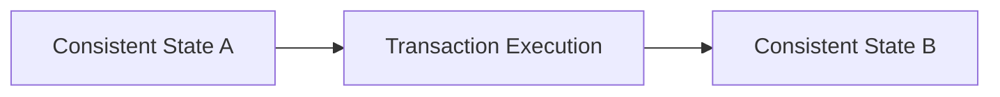

### 1.1 The ACID Properties In-Depth

Every Database Management System (DBMS) must guarantee four fundamental properties, collectively known as **ACID**.

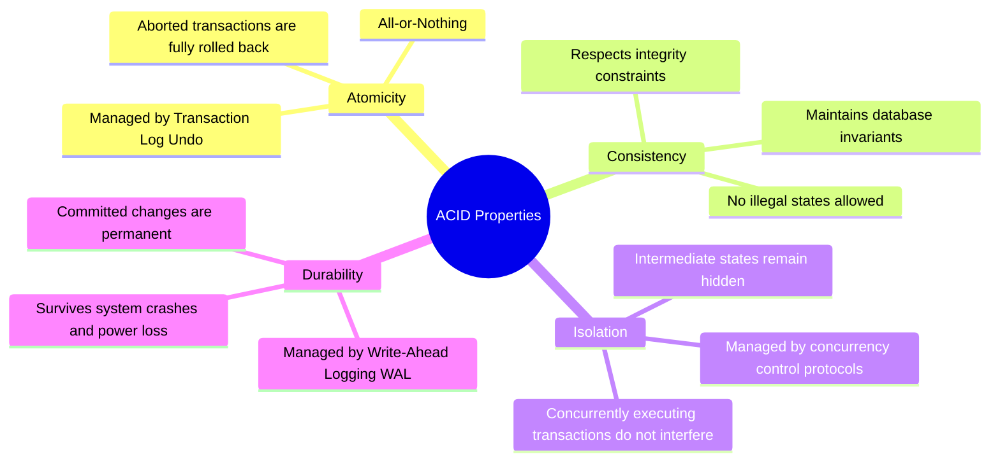

#### A. Atomicity ("All or Nothing")
*   **Definition:** Every single operation within a transaction must succeed for the entire transaction to be applied. If even one statement fails, the entire transaction is aborted, and the database rolls back to its pre-transaction state.
*   **Mechanism:** The DBMS tracks uncommitted changes in memory and log files. When an abort occurs, the system reads these logs in reverse to restore the original values.
*   **Failure Example:** During a bank transfer, account $A$ is successfully debited, but a network disconnect prevents account $B$ from being credited. Atomicity guarantees that the debit on $A$ is undone, preventing money from vanishing.

#### B. Consistency ("Preserving Invariants")
*   **Definition:** A transaction must transition the database from one valid state (respecting all schema invariants) to another valid state. It ensures that no transaction can violate defined constraints.
*   **Invariants Checked:**
    *   **Schema Constraints:** Primary keys, foreign keys, unique indexes, and `CHECK` constraints.
    *   **Application-Level Constraints:** Invariants not explicitly declared in the DDL, such as "the sum of all balances in a banking ledger must remain constant during a transfer."
*   **Failure Example:** If a constraint dictates that a pilot's flight hours cannot be negative, any transaction attempting to write a negative value will be rejected, forcing a rollback to preserve consistency.

#### C. Isolation ("Private Execution")
*   **Definition:** The execution of a transaction must be independent of other concurrent transactions. The intermediate, uncommitted states of a transaction must remain invisible to other operations running in parallel.
*   **Mechanism:** Achieved using locking protocols, multi-version concurrency control (MVCC), or serialization graphs. This prevents parallel transactions from reading partial or inconsistent modifications.
*   **Failure Example:** If Transaction 1 updates a customer's address but has not yet committed, Transaction 2 must not read the new address. If Transaction 1 subsequently aborts, Transaction 2 would have processed invalid data.

#### D. Durability ("Written in Stone")
*   **Definition:** Once a transaction is committed, its changes are permanently written to non-volatile storage. The changes will not be lost, even in the event of a total system crash, OS failure, or power loss immediately following the commit confirmation.
*   **Mechanism:** Relying entirely on disk-write synchronization or flash writes of the transaction log before returning a success signal to the application (Write-Ahead Logging).
*   **Failure Example:** A user receives a "Transfer Complete" notification. One millisecond later, the database server loses power. Upon reboot, the database must recover the transfer data because the commit was acknowledged.

---

### 1.2 Transaction State Machine

During its lifecycle, a transaction moves through several distinct execution states:

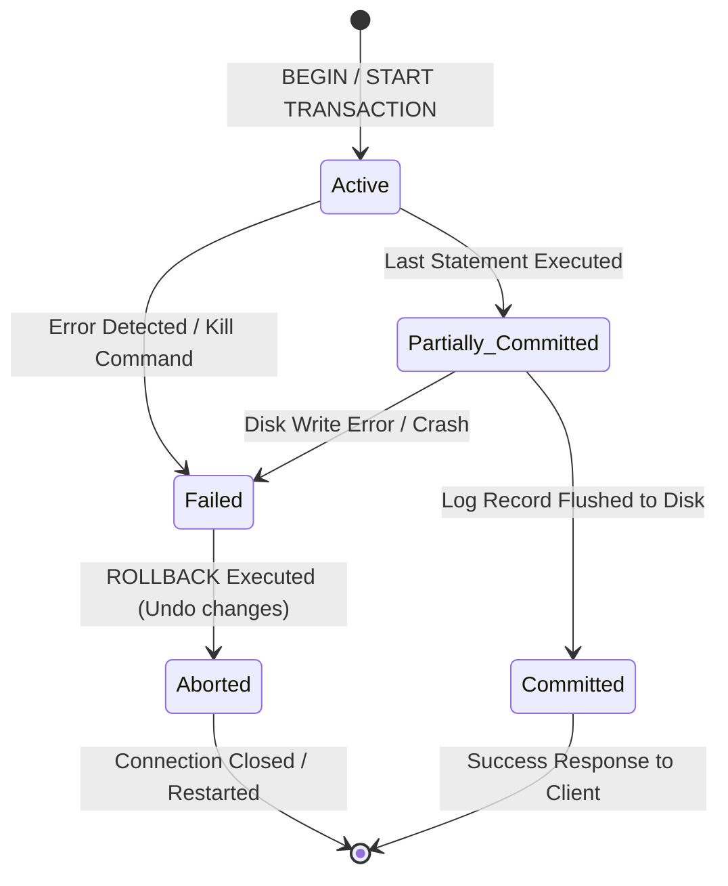

1.  **Active:** The initial state of any transaction. It enters this state when execution begins, and remains here while running its DML statements (`SELECT`, `INSERT`, `UPDATE`, `DELETE`).
2.  **Partially Committed:** This state is reached after the final statement of the transaction has been executed, but before the changes are safely written to disk. The data resides in volatile memory buffers (RAM).
3.  **Committed:** The transaction successfully transitions to this state once all log records representing its modifications—including the final `COMMIT` log entry—have been flushed to non-volatile storage (disk). At this point, durability is guaranteed, and the transaction is complete.
4.  **Failed:** A transaction enters this state if an error is detected during execution (e.g., a constraint violation, deadlock, or disk failure) or if it is aborted while in the active or partially committed states.
5.  **Aborted:** The state reached after the database has finished reversing all modifications made by a failed transaction. The database is restored to its exact pre-transaction state, and any locks held by the transaction are released.

---

## 2. Transaction Control Syntax and Mechanics

### 2.1 The Standard SQL Transaction Skeleton

To manage transactions, databases default to one of two modes: **Auto-Commit Mode** (where every single SQL statement is treated as its own transaction and saved immediately) or **Manual Mode**. To execute multi-line transactions safely, you must disable auto-commit or explicitly start a transaction block.

```sql
-- Disable automatic commits for the current session
SET AUTOCOMMIT = 0;

-- Begin the explicit transaction block
START TRANSACTION; -- Alternatively: BEGIN;

-- DML Operation 1: Debit account 1
UPDATE Comptes 
SET solde = solde - 100 
WHERE id = 1;

-- DML Operation 2: Credit account 2
UPDATE Comptes 
SET solde = solde + 100 
WHERE id = 2;

-- Checkpoint / Error Evaluation Block (Typically evaluated by the application layer)
-- If any operation failed or returned an error:
-- ROLLBACK; 

-- If all operations succeeded:
COMMIT;
```

---

### 2.2 Deep Dive into Savepoints

A **Savepoint** acts as a localized, named checkpoint within a transaction. It allows partial rollbacks: you can undo modifications made after the savepoint was created without losing the work completed before it.

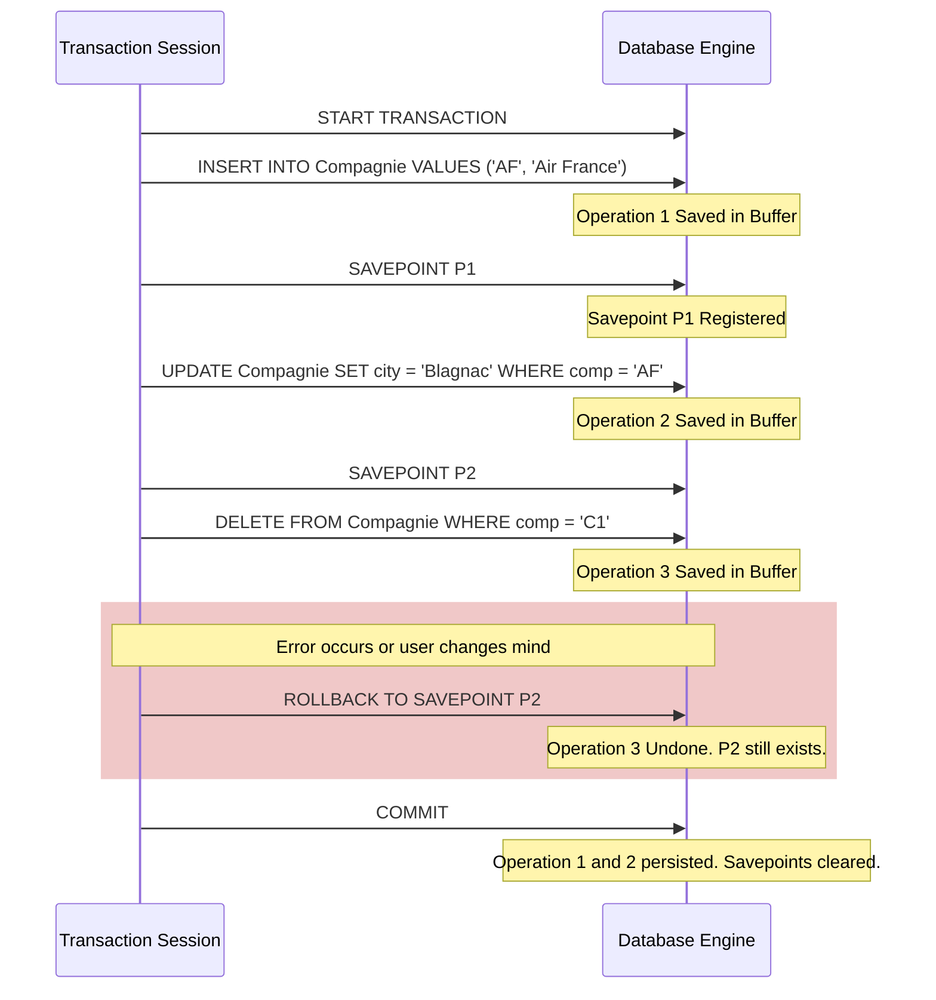

#### Savepoint Lifecycle Mechanics
*   **Creation:** `SAVEPOINT savepoint_name;` initializes a named rollback target.
*   **Rollback Target:** `ROLLBACK TO SAVEPOINT savepoint_name;` reverts the database state to the moment the savepoint was created. It does *not* terminate the transaction; the transaction remains open and active.
*   **Destruction Event 1 (Explicit Release):** `RELEASE SAVEPOINT savepoint_name;` destroys the savepoint. It does not roll back or commit any data; it simply frees up the system resources used to track that savepoint.
*   **Destruction Event 2 (Commit/Full Rollback):** Executing `COMMIT` or a global `ROLLBACK` terminates the transaction, which automatically destroys all savepoints created within it.
*   **Overwriting Rules:** If you declare a savepoint with an existing name (e.g., creating a second `SAVEPOINT P1;` inside the same transaction), the new savepoint overwrites the old one. Any rollback to `P1` will jump to the most recently declared checkpoint.

---

### 2.3 Crash Behaviors at Different Execution Stages

The following table details how the database handles system crashes (such as power losses or OS freezes) at various points in a transaction's execution.

| Crash Location | Data State on Disk | Recovery Action on Reboot | Explanation |
| :--- | :--- | :--- | :--- |
| **Before Commit Command** | Uncommitted (dirty) changes may exist in RAM and sometimes on disk. | **Implicit ROLLBACK** | The transaction is treated as incomplete. The recovery manager scans the log, finds no `COMMIT` record, and executes an `UNDO` pass to reverse any partial changes written to disk. |
| **During Commit (Log Write Missing)** | Log entry not yet written. | **Implicit ROLLBACK** | If the crash occurs before the `COMMIT` record is written to the log on disk, the commit is considered incomplete. The transaction is rolled back on reboot to protect data integrity. |
| **During Commit (Log Write Complete)** | Log entry successfully written to disk, but data files are not yet updated. | **REDO (Roll Forward)** | The transaction is considered complete. Even if the updated database pages were not yet written to disk, the log contains a durable commit record. The recovery engine replays the log entries to update the database pages. |
| **During Rollback Operation** | Partial undo has occurred. | **Resume & Complete ROLLBACK** | The recovery engine detects an uncommitted transaction that was in the process of aborting. It resumes the `UNDO` pass from the log, ensuring all remaining changes are reversed and the database is left clean. |

---

## 3. Concurrency Anomalies and Isolation Levels

When multiple transactions execute concurrently, their DML statements can interleave. Without proper isolation, this interleaving can introduce data anomalies.

### 3.1 Step-by-Step Traces of Classical Anomalies

#### A. Dirty Read (Lecture Sale)
A dirty read occurs when Transaction 1 ($T_1$) reads data modified by Transaction 2 ($T_2$) before $T_2$ has committed. If $T_2$ subsequently aborts, the data read by $T_1$ never officially existed in the database.

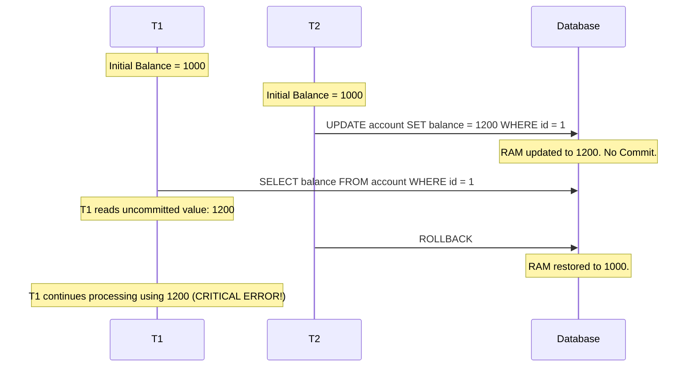

#### B. Non-Repeatable Read (Fuzzy Read)
A non-repeatable read occurs when Transaction 1 ($T_1$) reads a row, and Transaction 2 ($T_2$) modifies or deletes that row and commits. If $T_1$ reads the same row again within the same transaction, it receives a different value or finds the row deleted.

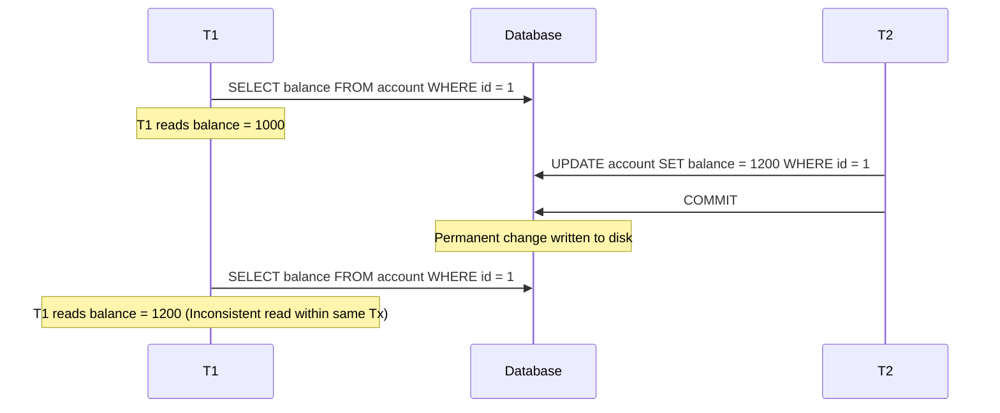

#### C. Phantom Read (Lecture Fantôme)
A phantom read is similar to a non-repeatable read, but it applies to ranges of rows. It occurs when Transaction 1 ($T_1$) executes a query with a range condition (e.g., `WHERE balance > 1000`), and Transaction 2 ($T_2$) inserts or deletes a row that matches that condition and commits. When $T_1$ runs the query a second time, it receives a different set of rows.

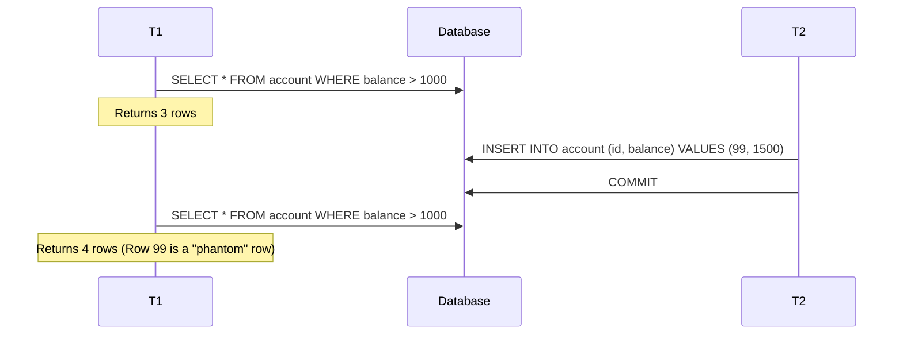

#### D. Lost Update (Mise à Jour Perdue)
A lost update occurs when two transactions read the same data, calculate a new value based on that data, and then attempt to write their updates back to the database. Without proper locking, the second write can overwrite the first write, causing one of the updates to be lost.

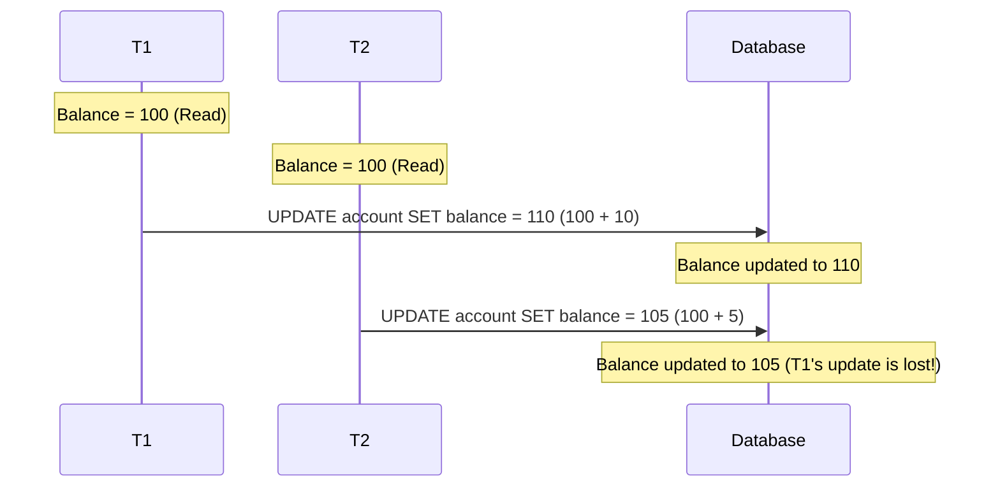

---

### 3.2 SQL Standard Isolation Levels

To prevent these anomalies, the SQL standard defines four isolation levels. These levels determine how isolated a transaction is from the changes made by concurrent transactions.

| Isolation Level | Prevents Dirty Reads? | Prevents Non-Repeatable Reads? | Prevents Phantom Reads? | Typical Lock Mechanism Employed |
| :--- | :---: | :---: | :---: | :--- |
| **READ UNCOMMITTED** | No | No | No | No shared locks are acquired for reads. Fast, but dangerous. |
| **READ COMMITTED** | Yes | No | No | Short-lived shared locks (released immediately after the read statement completes). |
| **REPEATABLE READ** | Yes | Yes | No | Long-lived shared locks (held until the end of the transaction). |
| **SERIALIZABLE** | Yes | Yes | Yes | Range-locks / Predicate locks on the index, or complete table locking. |

> [!IMPORTANT] Engine-Specific Behavior (e.g., MySQL InnoDB)
> It is important to note that databases can differ from the standard SQL specification. For example, MySQL's default storage engine, **InnoDB**, uses Multi-Version Concurrency Control (MVCC) and next-key locking. This allows its **REPEATABLE READ** isolation level to prevent phantom reads without the high overhead of full serializability.

---

## 4. Concurrency Control Protocols (Pessimistic vs. Optimistic)

Concurrency control protocols are the internal mechanisms a database engine uses to enforce transaction isolation. They fall into two main paradigms: **Pessimistic** and **Optimistic**.

### 4.1 Pessimistic Concurrency Control (Locking)

Pessimistic protocols assume that data conflicts are common. To prevent them, they block access to data items using locks as soon as they are touched.

#### Lock Types and Compatibility
*   **Shared Lock (S-Lock):** Acquired for read operations. Multiple transactions can hold shared locks on the same data item simultaneously, allowing concurrent reads.
*   **Exclusive Lock (X-Lock):** Acquired for write operations (`INSERT`, `UPDATE`, `DELETE`). Only one transaction can hold an exclusive lock on a data item. It blocks all other lock requests (both shared and exclusive) on that item.

| Lock Requested | Shared (S) | Exclusive (X) |
| :--- | :---: | :---: |
| **Shared (S) Held** | **Granted (Compatible)** | Blocked (Incompatible) |
| **Exclusive (X) Held** | Blocked (Incompatible) | Blocked (Incompatible) |

---

#### Two-Phase Locking (2PL) Protocols
To guarantee that concurrent transactions are serializable (meaning their execution yields the same results as running them sequentially), database engines use **Two-Phase Locking (2PL)**.

Under 2PL, a transaction must acquire and release locks in two distinct, sequential phases:

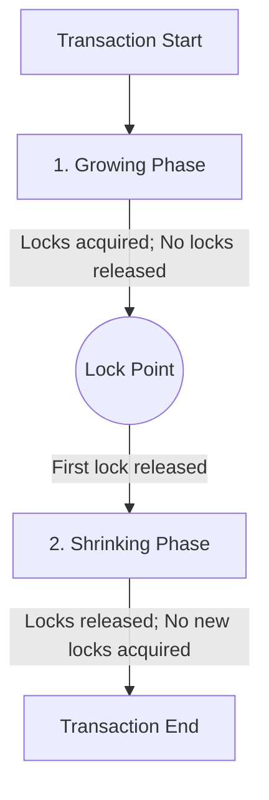

1.  **Growing Phase:** The transaction may acquire any locks it needs, but it cannot release any locks. The moment the transaction releases its first lock, the growing phase ends.
2.  **Shrinking Phase:** The transaction may release locks, but it cannot acquire any new ones.

##### Variations of 2PL
*   **Basic 2PL:** Transactions can release locks at any time during the shrinking phase. This can lead to **cascading rollbacks**: if $T_1$ updates a row, releases its lock, and then aborts, any transaction $T_2$ that read the modified row while the lock was released must also be rolled back.
*   **Strict 2PL (S2PL):** To prevent cascading rollbacks, strict 2PL requires transactions to hold all **Exclusive (X) locks** until the transaction completes (`COMMIT` or `ROLLBACK`).
*   **Rigid / Strong Strict 2PL (SS2PL):** The most restrictive variation. It requires transactions to hold **both Shared (S) and Exclusive (X) locks** until the transaction completes. This guarantees that transactions can be serialized in the order they commit.

---

### 4.2 Optimistic Concurrency Control (OCC)

Optimistic protocols assume that data conflicts are rare. Instead of using locks to block access, transactions perform read and write operations on private, local memory buffers. Conflicts are checked only when the transaction attempts to commit.

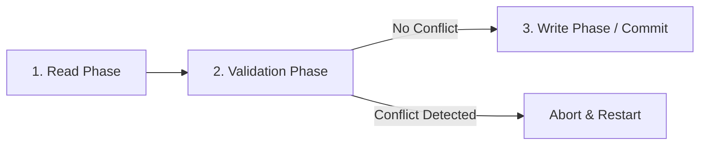

1.  **Read Phase:** The transaction reads data from the database and performs updates on private, local copies in memory. No locks are acquired.
2.  **Validation Phase:** The DBMS checks if any other transaction modified the same data while this transaction was running.
    *   *Backward Validation:* Compares the transaction's read set against the write sets of recently committed transactions.
    *   *Forward Validation:* Compares the transaction's write set against the read sets of currently active transactions.
3.  **Write Phase:** If validation succeeds, the transaction's private updates are written back to the database. If a conflict is detected, the transaction aborts and restarts.

---

### 4.3 Timestamp Ordering (TO) Protocols

In a timestamp ordering protocol, the database assign a unique, monotonically increasing timestamp $TS(T_i)$ to each transaction $T_i$ when it starts. These timestamps are used to order transactions and resolve conflicts.

Each data item $Q$ in the database maintains two timestamp values:
*   $W\_TS(Q)$: The largest timestamp of any transaction that successfully updated $Q$.
*   $R\_TS(Q)$: The largest timestamp of any transaction that successfully read $Q$.

#### The Timestamp Ordering Algorithm

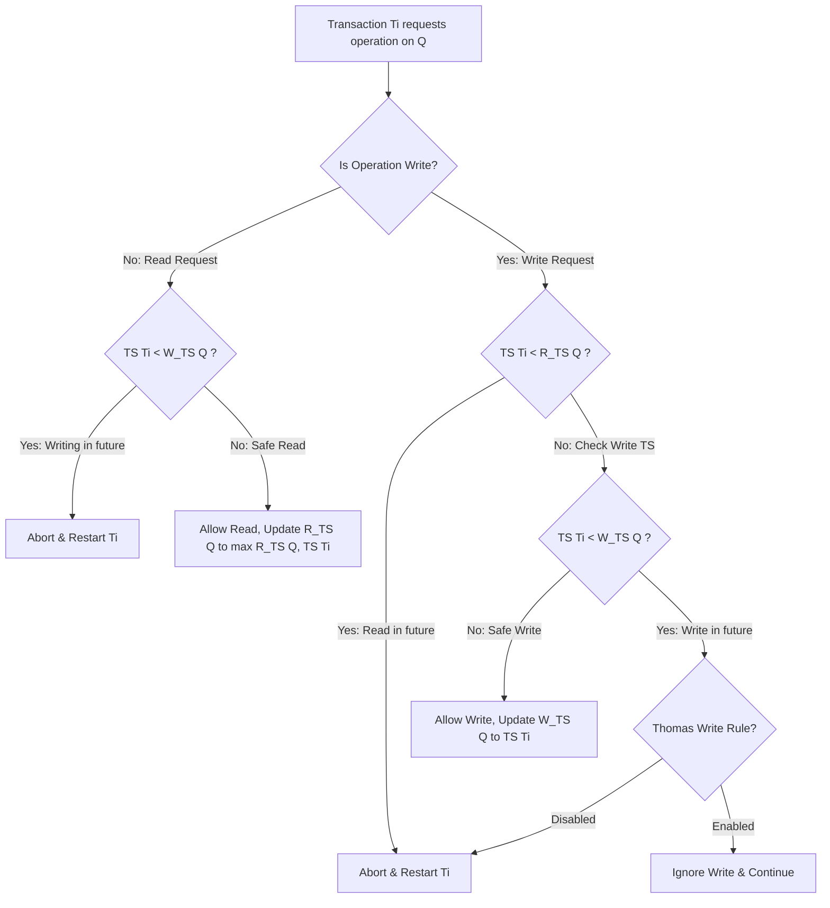

##### 1. Read Protocol for Transaction $T_i$ on Data Item $Q$
*   If $TS(T_i) < W\_TS(Q)$, it means a younger transaction (which should be ordered after $T_i$) has already updated $Q$. This would result in $T_i$ reading an inconsistent, "future" value.
    *   **Action:** Abort $T_i$ and restart it with a new timestamp.
*   If $TS(T_i) \ge W\_TS(Q)$, the read is safe.
    *   **Action:** Execute the read. Set $R\_TS(Q) = \max(R\_TS(Q), TS(T_i))$.

##### 2. Write Protocol for Transaction $T_i$ on Data Item $Q$
*   If $TS(T_i) < R\_TS(Q)$, it means a younger transaction has already read $Q$'s value. If $T_i$ were to update $Q$ now, that younger transaction would have read an outdated value, violating serializability.
    *   **Action:** Abort $T_i$ and restart it.
*   If $TS(T_i) < W\_TS(Q)$, it means a younger transaction has already updated $Q$. This write operation is trying to overwrite a newer value with an older one.
    *   **Action:** Under the standard protocol, abort $T_i$. Under the **Thomas Write Rule** optimization, this write is simply ignored, and the transaction is allowed to continue. This is safe because the younger transaction's write would have overwritten $T_i$'s write anyway.
*   If neither condition is met, the write is safe.
    *   **Action:** Execute the write. Set $W\_TS(Q) = TS(T_i)$.

---

### 4.4 Multi-Version Concurrency Control (MVCC)

Multi-Version Concurrency Control (MVCC) is an optimization technique used to prevent read operations from blocking write operations, and vice versa.

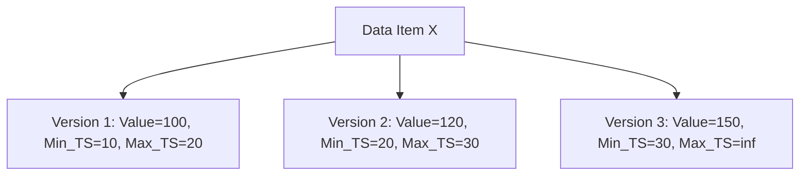

*   **Mechanism:** When a transaction updates a data item, the database does not overwrite the existing value. Instead, it creates a new, timestamped version of that item.
*   **Reads:** When a transaction reads a data item, the database determines which version of the item was current when the transaction started. The transaction reads this historical version, ensuring a consistent view of the data without needing to acquire locks.
*   **Writes:** Write operations create new versions of data items. These new versions are not visible to older, currently running transactions, preventing conflicts.
*   **Garbage Collection:** An background process periodically removes old versions of data items that are no longer needed by any active transactions.

---

### 4.5 Deadlocks (Interblocage)

A deadlock occurs when two or more transactions are blocked because each is waiting for a lock held by another. This creates a cycle of dependency where no transaction can proceed.

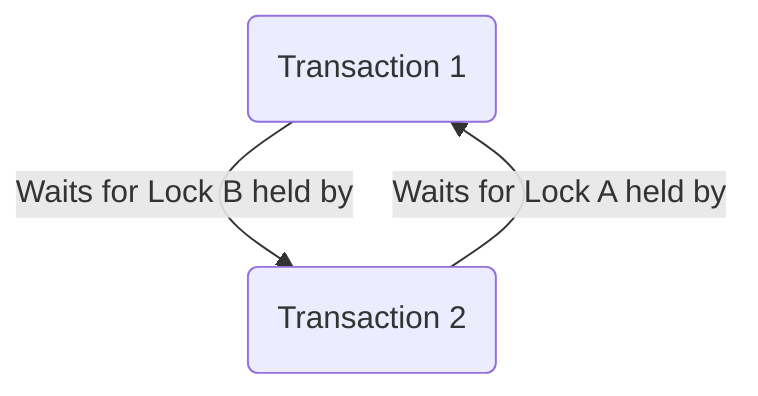

To resolve deadlocks, databases use two main strategies: **Prevention** and **Detection & Resolution**.

#### A. Deadlock Prevention (Timestamp-Based)
Deadlock prevention schemes use transaction timestamps to decide which transaction should wait or abort when a lock conflict occurs.

*   **Wait-Die (Non-Preemptive Scheme):**
    *   If an older transaction $T_{old}$ requests a lock held by a younger transaction $T_{young}$: $T_{old}$ is allowed to **wait**.
    *   If $T_{young}$ requests a lock held by $T_{old}$: $T_{young}$ is forced to abort and release its locks (**dies**).
*   **Wound-Wait (Preemptive Scheme):**
    *   If $T_{old}$ requests a lock held by $T_{young}$: $T_{old}$ aborts $T_{young}$ (**wounds** it) and takes the lock.
    *   If $T_{young}$ requests a lock held by $T_{old}$: $T_{young}$ is allowed to **wait**.

#### B. Deadlock Detection and Resolution
Instead of trying to prevent deadlocks, this strategy allows them to occur, detects them using background processes, and resolves them.

```mermaid
graph TD
    subgraph Wait-For Graph (WFG)
    T1((T1)) -->|Waits for lock held by| T2((T2))
    T2 -->|Waits for lock held by| T3((T3))
    T3 -->|Waits for lock held by| T1
    end
    
    style T1 fill:#f9f,stroke:#333,stroke-width:2px
    style T2 fill:#f9f,stroke:#333,stroke-width:2px
    style T3 fill:#f9f,stroke:#333,stroke-width:2px
```

*   **Wait-For Graph (WFG):** The DBMS maintains a directed graph where nodes represent active transactions, and edges represent wait conditions (e.g., $T_1 \to T_2$ means $T_1$ is waiting for a lock held by $T_2$).
*   **Detection Cycle:** A background process periodically checks this graph for cycles. Any cycle indicates a deadlock.
*   **Resolution (Victim Selection):** Once a deadlock is detected, the DBMS breaks the cycle by selecting a "victim" transaction to abort and roll back.
    *   *Victim Selection Criteria:* The database considers several factors to minimize recovery costs, including transaction age, the number of updates performed, and the number of locks held.

---

## 5. Crash Recovery and Write-Ahead Logging (WAL)

To ensure durability and atomicity, a database must be able to recover from crashes (such as power losses or system failures) and restore the database to a consistent state on reboot.

### 5.1 Buffer Pool Management Policies

The database engine manages data in memory (RAM) using a **Buffer Pool** before writing it to physical storage. The recovery engine's design depends on two key buffer management decisions: **Steal** and **Force**.

```mermaid
grid
  row
    col
      %% Column for STEAL/NO-STEAL
      html "<b>Steal Policy (Uncommitted RAM Flushes)</b>"
      html "<br>Can uncommitted data frames be written to disk?"
      html "<ul><li><b>STEAL:</b> Yes. Offers better RAM utilization but requires an <b>UNDO</b> phase during recovery to reverse changes from aborted transactions.</li><li><b>NO-STEAL:</b> No. Simplifies recovery but limits performance because dirty pages must be kept in RAM until commit.</li></ul>"
    col
      %% Column for FORCE/NO-FORCE
      html "<b>Force Policy (Commit Flushing)</b>"
      html "<br>Must all updated pages be written to disk immediately upon commit?"
      html "<ul><li><b>FORCE:</b> Yes. Slows down transaction processing because of random disk writes.</li><li><b>NO-FORCE:</b> No. Commits are logged instantly, and data pages are written to disk in batches. Requires a <b>REDO</b> phase during recovery.</li></ul>"
```

To maximize performance, modern high-performance database engines use a **STEAL / NO-FORCE** policy. Because this policy allows uncommitted changes on disk and committed changes to remain in volatile memory, the recovery engine must support both **UNDO** and **REDO** operations.

---

### 5.2 The Write-Ahead Logging (WAL) Protocol

The **Write-Ahead Logging (WAL)** protocol is the core mechanism used to implement the STEAL / NO-FORCE recovery strategy.

*   **The WAL Rule:** The database must write the log record describing a modification to disk **before** the corresponding data page in the buffer pool is written to disk.
*   **The Commit Rule:** A transaction is not considered committed until its log records—including the final `COMMIT` record—have been safely written to non-volatile storage.

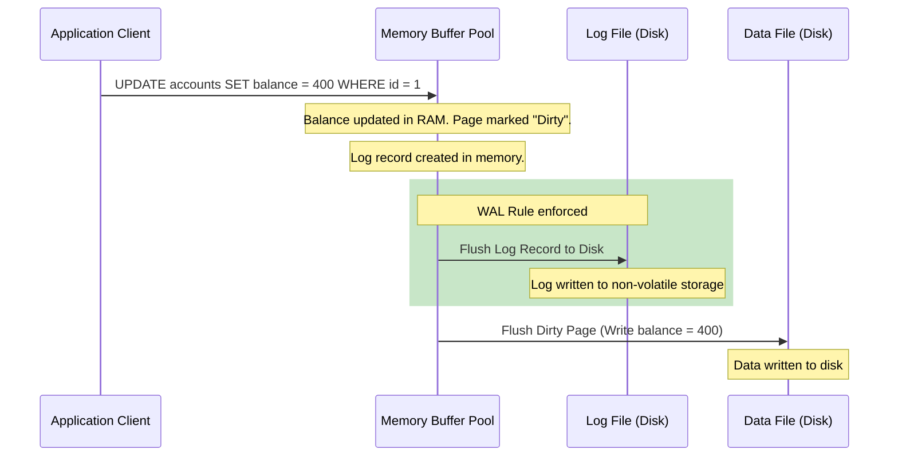

---

### 5.3 The Log Record Structure

The transaction log is an append-only file containing sequence records. Each log entry is assigned a unique, monotonically increasing **Log Sequence Number (LSN)**.

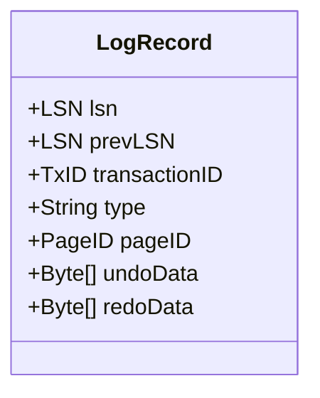

*   **LSN (Log Sequence Number):** A unique identifier for the log record.
*   **PrevLSN:** A link to the previous log record written by this transaction. This creates a backwards-linked list of records for each transaction, allowing the recovery engine to trace and undo its actions during recovery.
*   **TxID:** The ID of the transaction that performed the modification.
*   **Type:** The type of log record (e.g., `START`, `UPDATE`, `COMMIT`, `ABORT`, or `CLR` - Compensating Log Record used during rollbacks).
*   **PageID:** The identifier of the physical database page that was modified.
*   **Undo Data:** The original values of the modified data (used to reverse changes during an `UNDO` pass).
*   **Redo Data:** The new values of the modified data (used to reapply changes during a `REDO` pass).

---

### 5.4 Checkpoints

If a database runs for a long time, its transaction log will grow very large. Scanning the entire log during a recovery process would take too long, delaying database startup.

To keep log sizes manageable, the database uses **Checkpoints**:

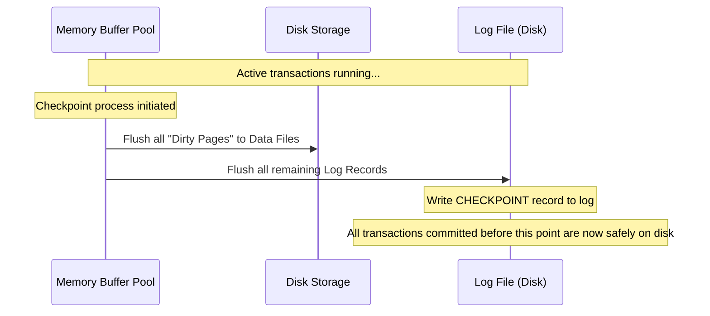

During a checkpoint, the database:
1.  Flushes all dirty data pages in the buffer pool to disk.
2.  Writes a `CHECKPOINT` record to the log. This record includes a list of all active transactions and dirty pages at the time of the checkpoint.
3.  Flushes all log records to disk.

When recovering from a crash, the database engine only needs to scan the log starting from the last known checkpoint. Any transactions that committed before the checkpoint can be ignored because their changes are guaranteed to be saved on disk.

---

### 5.5 Recovery Phases (Simplified ARIES Style)

When a database restarts after a crash, the recovery manager scans the log and performs a three-phase recovery process to restore database consistency.

```mermaid
graph TD
    A[Database Crash] --> B[1. Analysis Phase]
    B -->|Identify active transactions & dirty pages| C[2. REDO Phase (Roll Forward)]
    C -->|Replay all changes from oldest uncommitted write| D[3. UNDO Phase (Roll Back)]
    D -->|Reverse uncommitted transactions| E[Consistent Database Restored]
```

1.  **Analysis Phase:**
    *   Scans the log forward starting from the last checkpoint.
    *   Identifies all active transactions (transactions without a `COMMIT` or `ABORT` record) and dirty pages at the time of the crash.
2.  **REDO Phase (Roll Forward):**
    *   Replays all log records starting from the oldest unwritten page identified during the analysis phase.
    *   This "repeats history," reapplying changes for both committed and uncommitted transactions to restore the database to its exact state at the moment of the crash.
3.  **UNDO Phase (Roll Back):**
    *   Scans the log backward from the crash point to reverse the changes of all transactions that were active (uncommitted) at the time of the crash.
    *   For each reversed operation, the recovery manager writes a **Compensating Log Record (CLR)** to ensure the rollback itself can survive subsequent crashes.

---

## 6. Disasters and High Availability

While transaction logs and checkpoints protect against system crashes and power losses, they cannot protect against physical disk damage or catastrophic events (such as fire or flooding). To ensure high availability and prevent data loss, databases use redundancy and replication.

```mermaid
graph TD
    subgraph Primary Site
    Master[(Master DB)] -->|1. Write Transaction| WAL1[Local WAL]
    end
    
    subgraph Secondary Site
    Slave[(Replica / Slave)] <--|2. Stream WAL| WAL1
    Slave -->|3. Replay WAL| WAL2[Local DB Replica]
    end
```

### 6.1 Replication Models
*   **Synchronous Replication:** The master database waits for confirmation from the replica before acknowledging a commit to the client. This guarantees zero data loss if the master fails, but it increases transaction latency.
*   **Asynchronous Replication:** The master commits transactions locally and streams the log records to replicas in the background. This has minimal impact on performance, but any unsynced transactions can be lost if the master fails.

### 6.2 Failover Strategy
If the primary (master) database fails, a monitoring system detects the outage and promotes a replica (slave) to become the new master. A load balancer then redirects client traffic to this promoted instance, minimizing downtime.

---

## 7. Comprehensive Solved Exercises and Scenarios

This section provides detailed solutions and trace analyses for standard transaction and database security problems.

---

### 7.1 Exercise 1: ACID Concepts

#### Question 1
Define the four ACID properties and provide a non-IT, real-life analogy for each.

#### Solution
*   **Atomicity:**
    *   *Definition:* A transaction is an indivisible unit of work. Either all of its operations succeed, or none do.
    *   *Analogy:* **A Vending Machine.** You insert coins and select a beverage. The machine must either complete the transaction by dispensing the drink and keeping the coins, or cancel the transaction by returning your coins. It cannot keep your coins without dispensing the drink.
*   **Consistency:**
    *   *Definition:* A transaction must transition the database from one valid state to another, respecting all constraints and invariants.
    *   *Analogy:* **Double-Entry Bookkeeping.** Every financial transaction must be recorded as both a debit and a credit. The total assets must always balance with liabilities plus equity. Money cannot appear or disappear without a balancing entry.
*   **Isolation:**
    *   *Definition:* Concurrently executing transactions must not interfere with each other. Their intermediate states must remain invisible to other transactions.
    *   *Analogy:* **Fitting Rooms in a Clothing Store.** Multiple customers can try on clothes at the same time. Each customer has their own private space. What happens inside a fitting room is invisible to other customers until they step out with their final selections.
*   **Durability:**
    *   *Definition:* Once a transaction is committed, its changes are permanently saved and will not be lost, even if a system failure occurs.
    *   *Analogy:* **Signing a Notarized Contract.** Once a contract is signed by all parties and notarized, it is legally binding and permanent. Even if the office building later burns down, the legal agreement remains in effect because duplicate records are safely stored.

---

#### Question 2
Why do banking systems require strict adherence to Atomicity and Durability? Explain the financial consequences of violating these properties.

#### Solution
*   **Atomicity Violation Consequences:**
    *   *Scenario:* A customer transfers \$500 from Account A to Account B. The system debits Account A but crashes before crediting Account B.
    *   *Financial Consequence:* If atomicity is violated, \$500 is lost from Account A but never credited to Account B. This results in an incorrect ledger, balancing errors, and legal liability for the bank.
*   **Durability Violation Consequences:**
    *   *Scenario:* A customer deposits \$10,000 in cash. The teller confirms the deposit, and the system displays a success message. Shortly after, the database server loses power before flushing the transaction to disk.
    *   *Financial Consequence:* Upon reboot, the \$10,000 deposit is missing from the database. The customer holds a physical receipt, but the bank has no electronic record of the money. This leads to a loss of customer trust, regulatory audits, and financial disputes.

---

### 7.2 Exercise 2: Basic SQL Transaction & Crash Trace

#### Scenario Context
Consider a database table `Comptes(id, titulaire, solde)` containing two accounts:
*   `id = 1` (Ali): Balance = 500
*   `id = 2` (Sara): Balance = 300

We want to execute a transaction that transfers 100 from Ali's account to Sara's account.

#### Question 1
Write the complete, explicit SQL transaction code to perform this transfer.

#### Solution
```sql
START TRANSACTION;

-- Step 1: Debit 100 from Ali's account
UPDATE Comptes 
SET solde = solde - 100 
WHERE id = 1;

-- Step 2: Credit 100 to Sara's account
UPDATE Comptes 
SET solde = solde + 100 
WHERE id = 2;

-- Step 3: Complete and save the transaction
COMMIT;
```

---

#### Question 2
Suppose the server loses power after Step 1 (debiting Ali) completes, but before Step 2 (crediting Sara) can execute. Detail the state of the database before the crash, during reboot, and after the recovery process completes.

#### Trace Analysis
```mermaid
gantt
    title Transaction Interruption Timeline
    dateFormat  X
    axisFormat %s
    section Server Memory
    Ali=400, Sara=300 (Dirty RAM) :active, 1, 3
    Power Loss (RAM Lost) :crit, milestone, 3, 3
    section Database Recovery
    Scan Log for active Tx : 4, 5
    Identify incomplete Tx : 5, 6
    Execute UNDO pass : 6, 7
    Restore initial balances : 7, 8
```

1.  **Before the Crash (In Volatile Memory):**
    *   The transaction is marked as **Active** in the log.
    *   Ali's account balance in RAM is updated to 400.
    *   The database writes an update log record for Ali to disk (enforcing the WAL rule).
    *   Sara's account balance remains 300.
2.  **During the Crash:**
    *   Power is lost. All uncommitted updates residing only in RAM are lost.
3.  **On Reboot (Recovery Phase):**
    *   The database engine scans the transaction log.
    *   It finds the `START TRANSACTION` record and the update record for Ali (id=1).
    *   It scans forward but does **not** find a `COMMIT` record for this transaction.
    *   The recovery engine identifies this transaction as incomplete.
4.  **Recovery Action (UNDO):**
    *   The engine performs an **UNDO** pass, using the pre-image data from the log to restore Ali's balance to its original value of 500.
5.  **Final Recovered State (Consistent):**
    *   Ali's balance = 500, Sara's balance = 300.
    *   The database is restored to a consistent state, and the partial transfer is reverted.

---

### 7.3 Exercise 3: Concurrency Problems (Products Table Trace)

#### Scenario Context
We have a table `Produits(id, stock)` containing a single row:
*   `id = 1`, current stock = 100.

Two transactions ($T_1$ and $T_2$) run concurrently:
*   $T_1$ attempts to purchase 10 units (reducing stock by 10).
*   $T_2$ attempts to query the current stock.

---

#### Question 1: Dirty Read Trace
Show how a dirty read can occur if $T_1$ and $T_2$ interleave without isolation.

#### Solution Trace Table

| Time | Transaction 1 ($T_1$) | Transaction 2 ($T_2$) | Stock value in Database | Explanation |
| :--- | :--- | :--- | :---: | :--- |
| **$t_1$** | `START TRANSACTION;` | | 100 | $T_1$ begins execution. |
| **$t_2$** | `UPDATE Produits SET stock = stock - 10 WHERE id=1;` | | 90 (Uncommitted) | $T_1$ updates stock in RAM. |
| **$t_3$** | | `SELECT stock FROM Produits WHERE id=1;` | 90 (Uncommitted) | $T_2$ reads uncommitted stock value (90). |
| **$t_4$** | `ROLLBACK;` | | 100 | $T_1$ encounters an error and aborts, reverting changes. |
| **$t_5$** | | *Processing decisions based on stock = 90* | 100 | $T_2$ processes decisions using an invalid stock level. |

---

#### Question 2: Lost Update Trace
Suppose $T_1$ tries to subtract 10 units, and $T_2$ tries to subtract 5 units concurrently. Show how a lost update can occur if no locks are used.

#### Solution Trace Table

| Time | Transaction 1 ($T_1$) | Transaction 2 ($T_2$) | Stock value in Database | Explanation |
| :--- | :--- | :--- | :---: | :--- |
| **$t_1$** | `SELECT stock FROM Produits WHERE id=1;` (Reads 100) | | 100 | $T_1$ reads current stock (100). |
| **$t_2$** | | `SELECT stock FROM Produits WHERE id=1;` (Reads 100) | 100 | $T_2$ reads current stock (100). |
| **$t_3$** | `UPDATE Produits SET stock = 90 WHERE id=1;` | | 90 (Uncommitted) | $T_1$ updates stock based on its read. |
| **$t_4$** | | `UPDATE Produits SET stock = 95 WHERE id=1;` | 95 (Uncommitted) | $T_2$ overwrites $T_1$'s update based on its read. |
| **$t_5$** | `COMMIT;` | | 95 | $T_1$ commits its changes. |
| **$t_6$** | | `COMMIT;` | **95** | $T_2$ commits. $T_1$'s update is permanently lost. |

*Correct Value:* The final stock should be 85 ($100 - 10 - 5$). Because of the lost update, the final stock is 95.

---

#### Question 3: Prevention Strategy
How does a database engine prevent these anomalies?

#### Solution
1.  **To prevent Dirty Reads:** Set the isolation level to at least **READ COMMITTED**. This ensures that read queries can only access committed data, typically by acquiring short-lived shared locks that block until any concurrent exclusive locks are released.
2.  **To prevent Lost Updates:** Use **Pessimistic Locking** during read operations. Instead of a standard select, use `SELECT ... FOR UPDATE` to acquire an exclusive lock on the row immediately. This forces concurrent transactions to wait until the lock is released.

```sql
-- Secure update pattern using pessimistic locking
START TRANSACTION;
SELECT stock FROM Produits WHERE id = 1 FOR UPDATE; -- Acquires an Exclusive (X) lock
-- Calculate new stock locally: 100 - 10 = 90
UPDATE Produits SET stock = 90 WHERE id = 1;
COMMIT; -- Lock is released here, allowing other transactions to proceed
```

---

### 7.4 Exercise 4: Log Recovery Analysis

#### Scenario Context
A database server crashes. On restart, the recovery manager scans the log and finds the following sequence of events:

```
[LSN 101] T1: START
[LSN 102] T1: UPDATE Comptes SET solde = solde - 200 WHERE id = 1
[LSN 103] T2: START
[LSN 104] T2: UPDATE Comptes SET solde = solde + 200 WHERE id = 2
[LSN 105] T1: COMMIT
=== SYSTEM CRASH === (Before T2 could commit)
```

#### Question 1
Explain the recovery actions (REDO and UNDO) performed by the database engine upon restart.

#### Solution
During recovery, the database engine scans the log to determine the status of all active transactions:
*   **Transaction $T_1$:** The log contains a `COMMIT` record at LSN 105. This transaction is committed, so its changes must be made durable.
*   **Transaction $T_2$:** The log does **not** contain a `COMMIT` record before the crash. This transaction is uncommitted, so its changes must be reversed to ensure atomicity.

#### Recovery Actions
1.  **Analysis Pass:** The engine scans the log forward, identifying $T_1$ as committed and $T_2$ as active/uncommitted.
2.  **REDO Pass (Roll Forward):** The engine re-applies all logged updates starting from the oldest unwritten page (LSN 102). It re-applies the update for $T_1$ (LSN 102) and the update for $T_2$ (LSN 104) to restore the database to its state at the moment of the crash.
3.  **UNDO Pass (Roll Back):** The engine scans the log backward to reverse the changes of uncommitted transactions. It finds the update for $T_2$ at LSN 104 and reverses it, writing a Compensating Log Record (CLR) to disk. The change made by $T_1$ is left intact.

---

#### Question 2
What is the final state of Account 1 and Account 2 after recovery?

#### Solution
*   **Account 1 (Ali):** Balance remains decreased by 200. This update was committed by $T_1$ and is successfully recovered during the REDO pass.
*   **Account 2 (Sara):** Balance remains unchanged (restored to its original pre-transaction value). The update was made by the uncommitted transaction $T_2$, which was successfully reversed during the UNDO pass.

---

### 7.5 Exercise 5: Case Study (Inscriptions)

#### Scenario Context
An online university enrollment system must execute a three-step enrollment process:
1.  Debit the student's account for the course fee.
2.  Insert a record into the `Inscriptions` table.
3.  Decrement the number of available seats (`places`) in the `Cours` table.

---

#### Question 1
Model this process as a single, secure SQL transaction block.

#### Solution
```sql
START TRANSACTION;

-- Step 1: Debit the student account
UPDATE Compte_Etudiant 
SET solde = solde - 250 
WHERE etudiant_id = 412;

-- Step 2: Insert the registration record
INSERT INTO Inscriptions (etudiant_id, cours_id, date_inscription) 
VALUES (412, 'CS-301', CURRENT_DATE);

-- Step 3: Decrement available seats
UPDATE Cours 
SET places = places - 1 
WHERE cours_id = 'CS-301' AND places > 0;

-- Commit if all steps completed successfully
COMMIT;
```

---

#### Question 2
Suppose the server crashes after Step 2 completes, but before Step 3 (updating available seats) can execute. What happens to the data?

#### Solution
*   **Database Action:** When the server restarts, the recovery engine scans the log and detects that the transaction was active but uncommitted at the time of the crash (since no `COMMIT` record exists).
*   **Recovery Action:** The engine performs an **UNDO** pass, reversing both Step 1 and Step 2.
*   **Result:** The registration record is removed from the `Inscriptions` table, and the course fee is refunded to the student's account. This prevents inconsistent states where a student is charged but not registered, or registered without updating available seats.

---

#### Question 3
Which database properties and constraints must be guaranteed during this process, and how does the engine enforce them?

#### Solution
1.  **Consistency (Invariants):** The database must prevent enrollment if the course has no available seats (`places > 0`). This is enforced by including a check in the update statement: `WHERE cours_id = 'CS-301' AND places > 0`.
2.  **Atomicity (All-or-Nothing):** The engine uses the **Write-Ahead Log (WAL)** to track all modifications. If a crash occurs mid-process, the engine uses the log to roll back any partial changes, ensuring the enrollment steps either all succeed or all fail together.
3.  **Isolation:** The database must prevent two students from concurrently taking the last available seat in a course. The engine guarantees this by acquiring **Exclusive (X) locks** on the updated rows during the transaction, forcing concurrent updates to queue until the transaction commits.

---

### 7.6 Exercise 6: Cursor Locking (Pilots)

#### Scenario Context
We need to write a database procedure that updates flight hours for pilots based on their company, processing rows one-by-one using a cursor.

While this batch update is running, other users may attempt to concurrently update or delete pilot records. We need to prevent these concurrent updates to avoid lost updates and ensure consistency.

---

#### Question 1
Write a PL/SQL or procedural SQL block that uses a cursor with **pessimistic locking** to securely update these records.

#### Solution
```sql
DELIMITER $

CREATE PROCEDURE Gestion_Pilotes()
BEGIN
    -- Declare loop control and data variables
    DECLARE done INT DEFAULT 0;
    DECLARE v_brevet VARCHAR(6);
    DECLARE v_comp VARCHAR(4);
    
    -- Declare the cursor. 
    -- The "FOR UPDATE" clause tells the engine to acquire exclusive locks on selected rows.
    DECLARE cur_pilote CURSOR FOR 
        SELECT brevet, comp FROM Pilote FOR UPDATE;
        
    -- Handle the end of the cursor loop
    DECLARE CONTINUE HANDLER FOR NOT FOUND SET done = 1;

    -- Disable auto-commit and start a transaction
    SET AUTOCOMMIT = 0;
    START TRANSACTION;
    
    OPEN cur_pilote;

    read_loop: LOOP
        FETCH cur_pilote INTO v_brevet, v_comp;
        IF done THEN 
            LEAVE read_loop; 
        END IF;

        -- Apply updates based on the pilot's company
        IF v_comp = 'AF' THEN
            UPDATE Pilote 
            SET nbHVol = nbHVol + 100 
            WHERE brevet = v_brevet;
        ELSEIF v_comp = 'SING' THEN
            UPDATE Pilote 
            SET nbHVol = nbHVol - 100 
            WHERE brevet = v_brevet;
        ELSE
            -- Delete records for pilots from other companies
            DELETE FROM Pilote 
            WHERE brevet = v_brevet;
        END IF;
    END LOOP;

    CLOSE cur_pilote;
    
    -- Commit the transaction, saving changes and releasing all exclusive locks
    COMMIT;
END $

DELIMITER ;
```

---

#### Question 2
Explain how the locking mechanism in this procedure handles concurrent updates.

#### Solution
1.  **Acquiring Locks:** When the cursor is opened, the `FOR UPDATE` clause tells the database engine to acquire an **Exclusive Lock (X-Lock)** on each row selected by the query.
2.  **Blocking Concurrent Updates:** If another transaction attempts to update or delete any of these locked rows while the cursor loop is running, the database engine suspends that transaction and forces it to wait.
3.  **Ensuring Consistency:** This lock prevents other transactions from modifying rows while they are being processed by the cursor, avoiding lost updates and ensuring the batch process executes consistently.
4.  **Releasing Locks:** All exclusive locks held by the procedure are maintained until the final `COMMIT` statement is executed. Once committed, the changes are saved permanently, and the locks are released, allowing any waiting transactions to proceed.