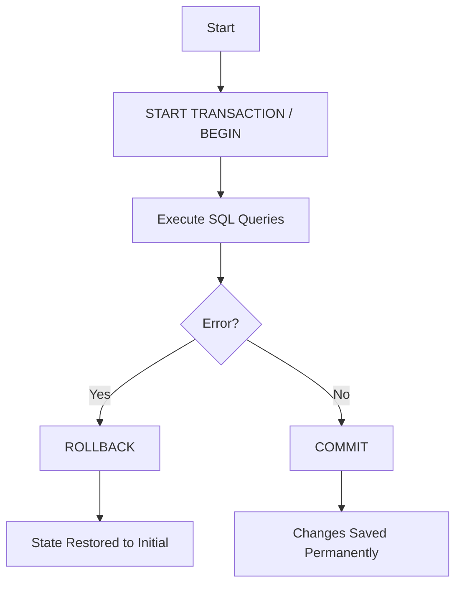

# Rollback and Commit

Here is a detailed breakdown of **COMMIT** and **ROLLBACK**, what they do, their effects, and the difference between using them inside a transaction versus functioning "outside" of one.

---

### 1. What are they? (The Simple Definitions)

Think of a Transaction as **"Draft Mode."**

*   **COMMIT:** This is the **"Save"** button. It takes everything you did in "Draft Mode" and makes it permanent on the hard drive. Once you Commit, everyone else can see the changes.
*   **ROLLBACK:** This is the **"Undo"** (Ctrl+Z) button. It takes everything you did in "Draft Mode," deletes it, and returns the database to exactly how it looked before you started.

---

### 2. Detailed Breakdown: COMMIT

**What it does:**
1.  **Persistence:** It moves your changes from temporary memory (RAM/Logs) to the permanent database storage.
2.  **Visibility:** Before you commit, *only you* can see your changes. After you commit, *all other users* can see the new data.
3.  **Unlocking:** While you are changing data, the database often "locks" that specific row so no one else can touch it. `COMMIT` releases that lock so others can use the data.

**The "Point of No Return":**
Once you issue a `COMMIT`, you **cannot** Rollback. The transaction is over. If you made a mistake, you have to write a new transaction to fix it.

---

### 3. Detailed Breakdown: ROLLBACK

**What it does:**
1.  **Reversion:** It discards all pending changes made since the `START TRANSACTION` command.
2.  **Cleanup:** It cleans up temporary memory logs.
3.  **Unlocking:** Like Commit, it releases any locks on the data so other users can access the rows again.

**When is it used?**
*   **Manual:** You realize you updated the wrong user's password, so you type `ROLLBACK`.
*   **Automatic:** You try to insert a duplicate ID or the power fails. The database performs an automatic rollback to keep data safe.

---

### 4. Inside vs. Outside a Transaction Scope

This is the most critical difference in how SQL behaves.

#### Scenario A: Inside a Transaction Scope
**Structure:**
`START TRANSACTION` -> `UPDATE...` -> `DELETE...` -> `COMMIT/ROLLBACK`

*   **Effect:** You are in a "Safe Bubble." You can run 50 different queries. If the 50th one fails, you can `ROLLBACK`, and the previous 49 are canceled. The database does not save anything until you explicitly say so.
*   **Why use this?** For **Data Integrity**. Example: Transferring money. You must deduct from Account A *and* add to Account B. Both must happen, or neither. You use a transaction to ensure you don't delete money from A without adding it to B.

#### Scenario B: Outside a Transaction Scope (Auto-Commit)
**Structure:**
`UPDATE...` (No `START` command used).

*   **Effect:** Most databases run in **Auto-Commit Mode** by default. This means every single line of SQL you write is treated as a tiny transaction that Commits *immediately* and automatically.
*   **What happens if you type ROLLBACK here?**
    *   Nothing happens (or you get an error saying "No Transaction is active").
    *   Because the database already "Auto-Committed" your previous line, it is too late to go back.
*   **Why use this?** For quick, single changes where safety is less of a concern, or for reading data (`SELECT`).

---

### 5. Summary: The Difference When Using vs. Not Using

| Feature | Using Transactions (`START`... `COMMIT`) | Not Using Transactions (Auto-Commit) |
| :--- | :--- | :--- |
| **Control** | High. You decide when data is saved. | None. Data is saved immediately after every line. |
| **Error Handling** | **Safe.** If an error happens halfway, you `ROLLBACK` and nothing is corrupted. | **Dangerous.** If an error happens halfway through a script, the first half is saved, the second half failed. Your data is now broken/incomplete. |
| **Visibility** | Other users cannot see your changes until you finish. | Other users see your changes instantly, line by line. |
| **The "Oops" Factor** | You can fix mistakes before saving. | Mistakes are permanent immediately. |

### Real World Scenario Example

**Scenario:** An online store order.
You need to do two things:
1. Create an Order Record.
2. Subtract 1 item from the Inventory.

**Without Transaction (Auto-Commit):**
*   You run SQL to Create Order. (Success! Saved!)
*   *System Error happens.*
*   You fail to run SQL to Subtract Inventory.
*   **Result:** You sold an item, but your inventory count is wrong. Your database is corrupted.

**With Transaction (Commit/Rollback):**
*   `START TRANSACTION`
*   You run SQL to Create Order. (Pending...)
*   *System Error happens.*
*   Because you never hit `COMMIT`, the database looks at the pending order, sees the error, and performs a `ROLLBACK`.
*   **Result:** The Order is deleted. The Inventory is untouched. The database is clean.

# Savepoint

Based on **Source 20 (SQL PROCEDURAL.pdf, Section 3.11.4, Page 11-12)**, here is the explanation of **Savepoints**.

Think of a **Savepoint** as a **"Bookmark"** or a **"Checkpoint"** inside a transaction. It allows you to save your progress temporarily so that if an error occurs later, you don't have to restart the *entire* transaction from zero—you can just go back to the bookmark.

### 1. The Syntax ("On" and "Back")

According to the document, there are two main commands:

*   **Creating a Bookmark ("ON"):**
    To creates a savepoint at the current moment.
    ```sql
    SAVEPOINT my_marker;
    ```

*   **Jumping Back ("Rollback To"):**
    To undo everything done *after* the marker, but keep everything done *before* it.
    ```sql
    ROLLBACK TO SAVEPOINT my_marker;
    ```

---

### 2. How it works (The Timeline)

Imagine a transaction with 3 steps. Here is how Savepoints allow you to jump back to specific moments.

**The Script:**
```sql
START TRANSACTION;

-- Step 1: Insert a Pilot (This is good)
INSERT INTO Pilote VALUES ('PL-100', 'Mario', ...);

-- CREATE SAVEPOINT A (We are happy with Step 1)
SAVEPOINT checkpoint_A;

-- Step 2: Update Salaries (This is risky)
UPDATE Pilote SET salaire = salaire * 2;

-- CREATE SAVEPOINT B (We tried step 2)
SAVEPOINT checkpoint_B;

-- Step 3: Delete a Company (This is a mistake!)
DELETE FROM Compagnie WHERE comp = 'AF';
```

**The Scenarios (Jumping):**

1.  **Scenario: "Undo only Step 3"**
    *   Command: `ROLLBACK TO SAVEPOINT checkpoint_B;`
    *   **Result:** The DELETE is cancelled. The UPDATE (Step 2) and INSERT (Step 1) are still there. The transaction is still open.

2.  **Scenario: "Undo Step 2 and Step 3"**
    *   Command: `ROLLBACK TO SAVEPOINT checkpoint_A;`
    *   **Result:** The DELETE and UPDATE are cancelled. The INSERT (Step 1) is still there.

3.  **Scenario: "Undo Everything"**
    *   Command: `ROLLBACK;` (No savepoint name)
    *   **Result:** Everything is gone. Steps 1, 2, and 3 are cancelled.

---

### 3. "Off and On" (Lifecycle of a Savepoint)

*   **ON (Alive):** A savepoint exists as soon as you type `SAVEPOINT Name;`.
*   **OFF (Dead):** A savepoint disappears (is destroyed) in three cases:
    1.  **Commit:** If you type `COMMIT`, the transaction ends, and all savepoints are deleted.
    2.  **Full Rollback:** If you type `ROLLBACK` (without a name), the transaction ends, and savepoints are deleted.
    3.  **Overwriting:** If you type `ROLLBACK TO SAVEPOINT A`, any savepoints created *after* A (like B or C) are destroyed because you went back in time before they existed.

### 4. Example from Course (Source 20, Page 12)

The document provides a specific example using the `Compagnie` table to illustrate this:

```sql
BEGIN;
    -- Operation 1: Insert 'Easy Jet'
    INSERT INTO Compagnie VALUES (... 'Easy Jet');

    SAVEPOINT P1; -- Bookmark 1

    -- Operation 2: Update address to 'Blagnac'
    UPDATE Compagnie SET city = 'Blagnac' ...;

    SAVEPOINT P2; -- Bookmark 2

    -- Operation 3: Delete a company
    DELETE FROM Compagnie WHERE comp = 'C1';

    -- CHOICES:
    -- 1. To keep everything except the DELETE:
    -- ROLLBACK TO SAVEPOINT P2;
    
    -- 2. To keep only the INSERT (undo Update and Delete):
    -- ROLLBACK TO SAVEPOINT P1;

    -- 3. To save whatever is currently active:
    COMMIT; 
END;
```

# Stopping BEFORE Transaction

Here is an explanation of what happens to your data if a crash (power loss, network failure, or application error) occurs at different stages of an SQL transaction.

To understand this, you must understand the **ACID** rule of databases, specifically **Atomicity** (All or Nothing).

Here is the breakdown of the three specific scenarios you asked about:

---

### 1. Stopping BEFORE Commit (The "Draft" Phase)
**Scenario:** You ran `START TRANSACTION`, executed several `INSERT` or `UPDATE` queries, but the connection was lost or the system crashed **before** the `COMMIT` command reached the database.

*   **What happens?** The database performs an **Automatic Rollback**.
*   **The Result:** None of your changes are saved. The database looks exactly as it did before you started.
*   **Why:** Until you say `COMMIT`, the changes exist only in temporary memory (or temporary log files). If the connection dies, the database treats the transaction as "abandoned" and discards it to ensure data safety.
*   **Analogy:** You are typing a long email. You type 5 paragraphs, but your computer crashes **before** you click "Send." When you restart, the email is gone.

### 2. Stopping AT / DURING Commit (The "Critical Moment")
**Scenario:** You issued the `COMMIT` command. The crash happens exactly at that split second—while the database is trying to write the changes to the hard drive.

*   **What happens?** This depends entirely on the **Transaction Log (Write-Ahead Log)**.
    *   **Case A (Crash just before log write):** If the crash happens before the "Commit Record" is safely written to the transaction log, the database treats it as if it never happened. **Result: Rolled Back (Data Lost).**
    *   **Case B (Crash just after log write):** If the crash happens immediately after the "Commit Record" hits the disk, but before the database confirms success to you. **Result: Rolled Forward (Data Saved).**
*   **The Mechanism:** When the database restarts, it looks at its logs.
    *   If it sees a "Commit" entry for your ID, it "Re-does" the changes to make sure they are there.
    *   If it does *not* see a "Commit" entry, it "Un-does" (Rolls back) any partial changes.
*   **Analogy:** You click "Pay Now" on a banking app. The screen spins. Then your phone dies.
    *   *Case A:* The bank server didn't get the signal before the crash. Money stays in your account.
    *   *Case B:* The bank server recorded the signal, but your phone died before showing "Success." The money is gone/transferred.

### 3. Stopping AT / DURING Rollback (The "Cleanup" Phase)
**Scenario:** You realized you made a mistake (or an error occurred), and the `ROLLBACK` command was issued. The system crashes *while* the database is busy undoing your changes.

*   **What happens?** The result is exactly the same as a successful Rollback.
*   **The Result:** The changes are gone. The data is restored to its original state.
*   **Why:** The goal of a rollback is to revert changes. If the system crashes halfway through reverting, when it restarts, the recovery process sees that the transaction was never committed. It simply finishes the job of wiping out those changes.
*   **Analogy:** You decide to delete a file. You click "Delete." The progress bar gets to 50% and the computer crashes. When you restart, the computer sees the file is corrupted/incomplete and finishes deleting it (or marks the space as free). The result is the same: the file is gone.

---

### Summary Comparison Table

| Scenario | Status of Data | Technical Action on Restart |
| :--- | :--- | :--- |
| **Stop BEFORE Commit** | **Not Saved** | Database sees an incomplete transaction and performs an **Implicit Rollback**. |
| **Stop DURING Commit** | **It Depends** | **If Log is written:** Database "Rolls Forward" (Saves data).<br>**If Log is missing:** Database "Rolls Back" (Discards data). |
| **Stop DURING Rollback**| **Not Saved** | The goal was to destroy the changes. The crash just pauses the destruction; the restart completes it. |

**The Golden Rule:** In SQL, data is considered "Safe" only after the `COMMIT` command has successfully returned a confirmation message to your application.

# Transaction Skeleton MySQL

Based on your provided documents, specifically **"Source_18_Chapitre 1 Partie 2- Gestion de l'intégrité.pdf"** (Slides 49-50) and **"Source_20_SQL PROCEDURAL.pdf"** (Section 3.11), here is the standard skeleton and syntax for a database transaction.

### The Transaction Skeleton

A transaction groups multiple SQL operations into a single atomic unit. The standard syntax follows this 4-step structure:

```sql
-- 1. Start the Transaction
START TRANSACTION; -- Or simply BEGIN;

-- 2. Execute SQL Operations (The "Work")
UPDATE accounts SET balance = balance - 100 WHERE id = 1;
UPDATE accounts SET balance = balance + 100 WHERE id = 2;

-- 3. Check for Errors (Logic usually handled in application code or Stored Proc)
-- If everything is correct:
COMMIT;

-- 4. If an error occurs:
-- ROLLBACK;
```

---

### Detailed Explanations of the Syntax

Based on **Source_18 (Slide 49)** and **Source_20 (Section 3.11)**, here is the breakdown of the commands:

#### 1. Initialization
*   **Command:** `START TRANSACTION` or `BEGIN`
*   **Context:** This command explicitly marks the beginning of a transaction.
*   **Note:** In MySQL (as noted in **Source_20**), executing `START TRANSACTION` implicitly commits any current transaction before starting a new one.

#### 2. Operations (LMD)
*   **Commands:** `INSERT`, `UPDATE`, `DELETE`, `SELECT`
*   **Context:** These are the modifications you want to perform. At this stage, changes are **not yet permanent**. They are visible only to the current session (Isolation).

#### 3. Validation (Success)
*   **Command:** `COMMIT`
*   **Context:** Validates all changes made since `START TRANSACTION`.
*   **Effect:** The data is physically written to the database (Durability) and becomes visible to other users.

#### 4. Cancellation (Failure)
*   **Command:** `ROLLBACK`
*   **Context:** Cancels all changes made since `START TRANSACTION`.
*   **Effect:** The database returns to the exact state it was in before the transaction started (Atomicity).

---

### Transaction Flow Diagram

Here is a visual representation of the transaction lifecycle based on **Source_18 Slide 49**:



---

### Concrete Example (Bank Transfer)

Based on **Source_16 (TD n°5, Exercice 2)** and **Source_18 (Slide 50)**, here is how a standard transfer transaction is written:

**Scenario:** Transfer 100 DA from Account 1 (Ali) to Account 2 (Sara).

```sql
-- 1. Start
START TRANSACTION;

-- 2. Debit Ali (Account 1)
UPDATE Comptes 
SET solde = solde - 100 
WHERE id = 1;

-- 3. Credit Sara (Account 2)
UPDATE Comptes 
SET solde = solde + 100 
WHERE id = 2;

-- 4. Validate
COMMIT;
```

### Advanced Control: Savepoints
**Source_20 (Section 3.11.4)** mentions an advanced feature for partial rollbacks:

*   **Skeleton with Savepoints:**
    ```sql
    BEGIN;
    UPDATE ...;
    SAVEPOINT step1; -- Create a marker
    
    UPDATE ...;
    -- If something goes wrong here, you can go back to step1 without losing the first update
    ROLLBACK TO SAVEPOINT step1; 
    
    COMMIT;
    ```

### Important Setting: Auto-Commit
**Source_20** highlights that by default, databases (like MySQL) are in `autocommit` mode.
*   To use transactions effectively, you can disable this globally for the session:
    ```sql
    SET AUTOCOMMIT = 0;
    ```
    When this is set to 0, you **must** issue a `COMMIT` to save your changes; otherwise, they will be lost when you disconnect.

