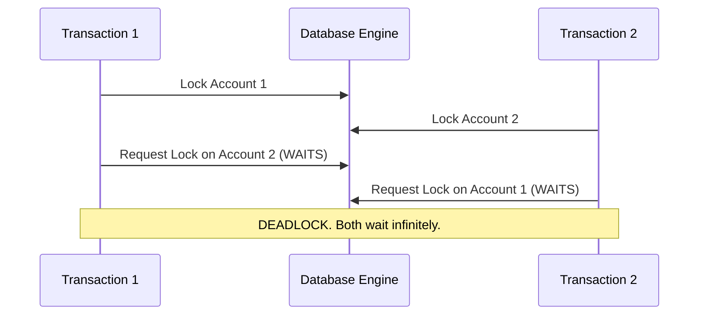

# 6. Concurrency Anomalies and Locking Mechanisms

Understanding exactly *how* concurrency fails is critical for database engineering. Here is the step-by-step breakdown of the classical anomalies and how the database engine resolves them.

## 1. Deep Dive into Concurrency Anomalies

### A. Dirty Read
Occurs when Transaction 1 (T1) reads data written by Transaction 2 (T2) before T2 has committed. If T2 rolls back, T1 is left processing data that never officially existed.

| Time | Transaction 1 (T1) | Transaction 2 (T2) | State of Database |
| :--- | :--- | :--- | :--- |
| 1 | | `UPDATE account SET balance = 1200 WHERE id = 1;` | Balance = 1200 (Uncommitted) |
| 2 | `SELECT balance FROM account WHERE id = 1;` (Reads 1200) | | T1 thinks balance is 1200 |
| 3 | | `ROLLBACK;` | Balance reverts to 1000 |
| 4 | T1 makes decisions based on 1200. **(CRITICAL ERROR)** | | |

### B. Non-Repeatable Read
T1 reads a row. T2 modifies that exact row and commits. T1 reads the row again and sees a different value. The read is not repeatable.

| Time | Transaction 1 (T1) | Transaction 2 (T2) | State of Database |
| :--- | :--- | :--- | :--- |
| 1 | `SELECT balance...` (Reads 1000) | | Balance = 1000 |
| 2 | | `UPDATE account SET balance = 1200; COMMIT;` | Balance = 1200 (Committed) |
| 3 | `SELECT balance...` (Reads 1200) **(INCONSISTENCY)** | | |

### C. Phantom Read
Similar to a Non-Repeatable Read, but involves *ranges* of data. T1 queries a set of rows. T2 inserts or deletes a row in that range and commits. T1 runs the exact same query and gets a different number of rows.

| Time | Transaction 1 (T1) | Transaction 2 (T2) | State of Database |
| :--- | :--- | :--- | :--- |
| 1 | `SELECT * WHERE balance > 1000;` (Finds 3 rows) | | 3 matching rows exist |
| 2 | | `INSERT INTO account (balance) VALUES (1500); COMMIT;` | 4 matching rows exist |
| 3 | `SELECT * WHERE balance > 1000;` (Finds 4 rows) **(PHANTOM ROW)** | | |

### D. Deadlocks (Interblocage)
A mutual blockage where T1 holds Resource A and waits for Resource B, while T2 holds Resource B and waits for Resource A.

*Solution:* The DBMS detects the circular wait, picks one transaction as the "victim", kills it (Rollback), and lets the other proceed.

## 2. Managing Concurrency

Databases use two primary philosophies to prevent these anomalies: Pessimistic and Optimistic management.

### Pessimistic Locking
Assumes conflicts *will* happen frequently. It locks data as soon as it is touched.
*   **Shared Lock (Read Lock):** Multiple transactions can hold a shared lock on a row. They can all read it, but nobody can write to it until all shared locks are released.
*   **Exclusive Lock (Write Lock):** Only one transaction can hold this. If T1 holds an exclusive lock, no other transaction can read or write to that row.
*   *Pros:* Extremely safe, guarantees consistency.
*   *Cons:* Reduces parallelism; transactions spend a lot of time waiting in line.

### Optimistic Concurrency Control (OCC)
Assumes conflicts are *rare*. It does not use immediate locks.
*   Every row has a hidden `version` number or `timestamp`.
*   T1 reads the row (Version 1) and modifies it in local memory.
*   When T1 tries to `COMMIT`, the DBMS checks the live database. If the row is still Version 1, the commit succeeds, and the row becomes Version 2.
*   If T2 sneaked in and already committed changes (making the row Version 2), T1's commit will **fail** and T1 must restart.
*   *Pros:* Massive performance boost for read-heavy applications.
*   *Cons:* In write-heavy applications, transactions will constantly fail and retry, killing performance.
