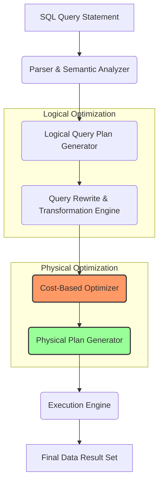
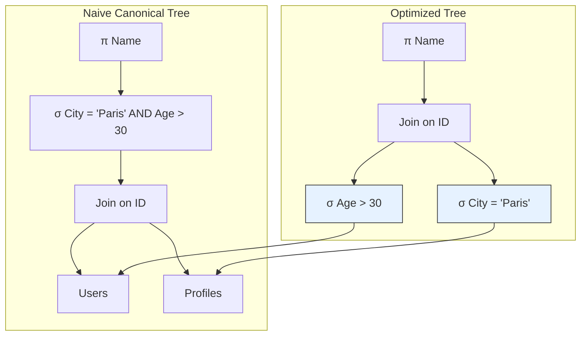
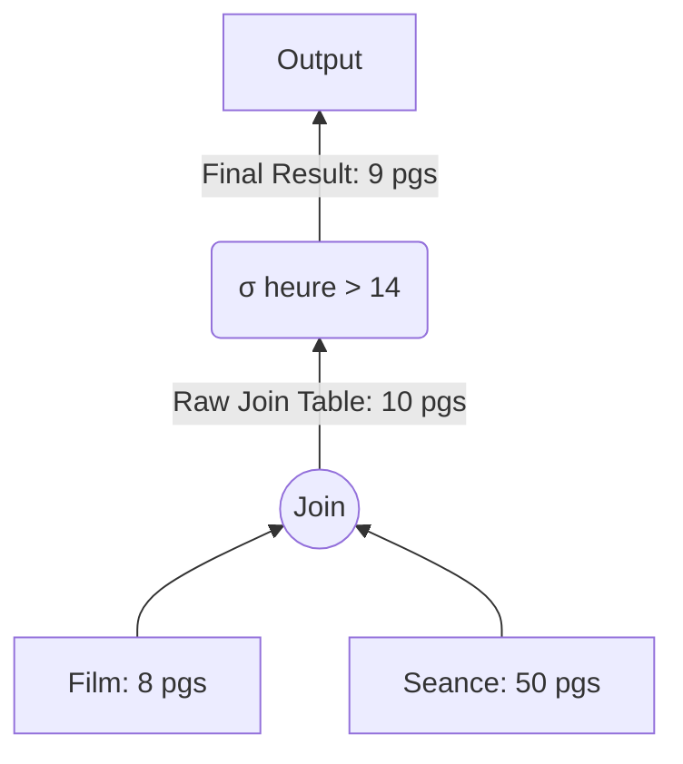
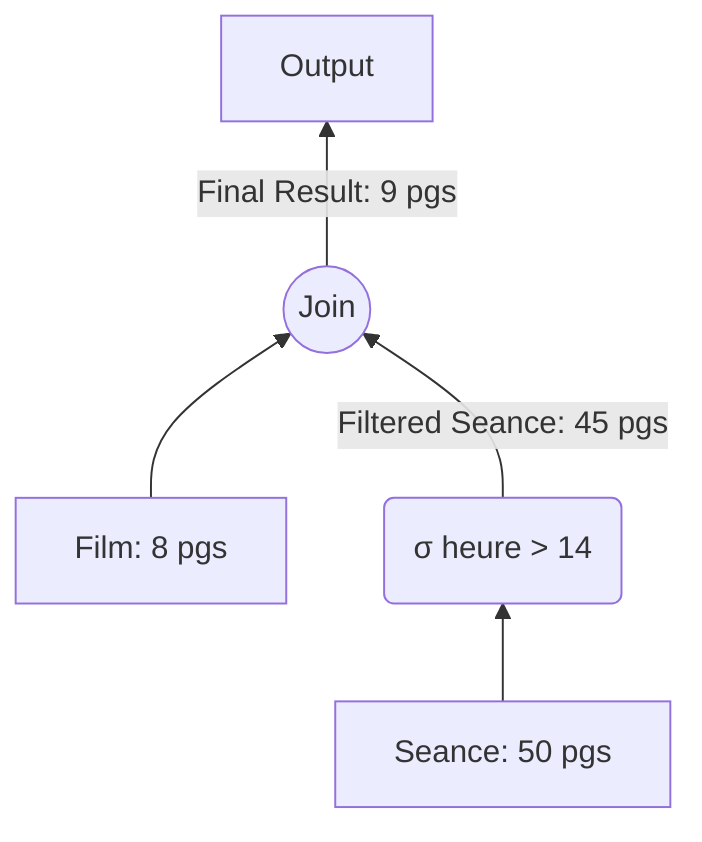
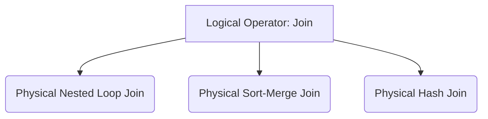
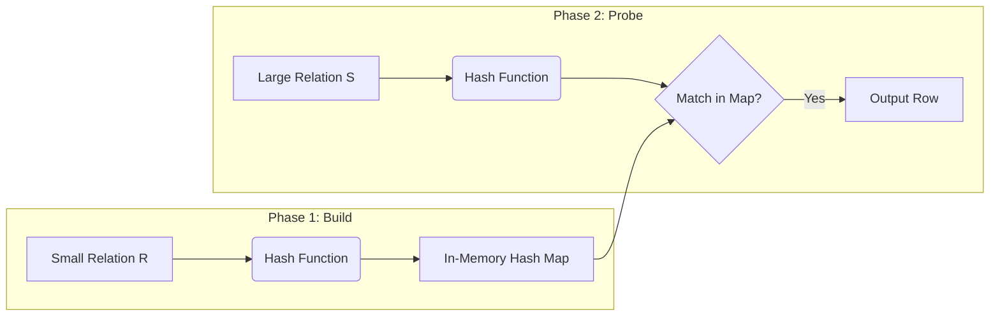
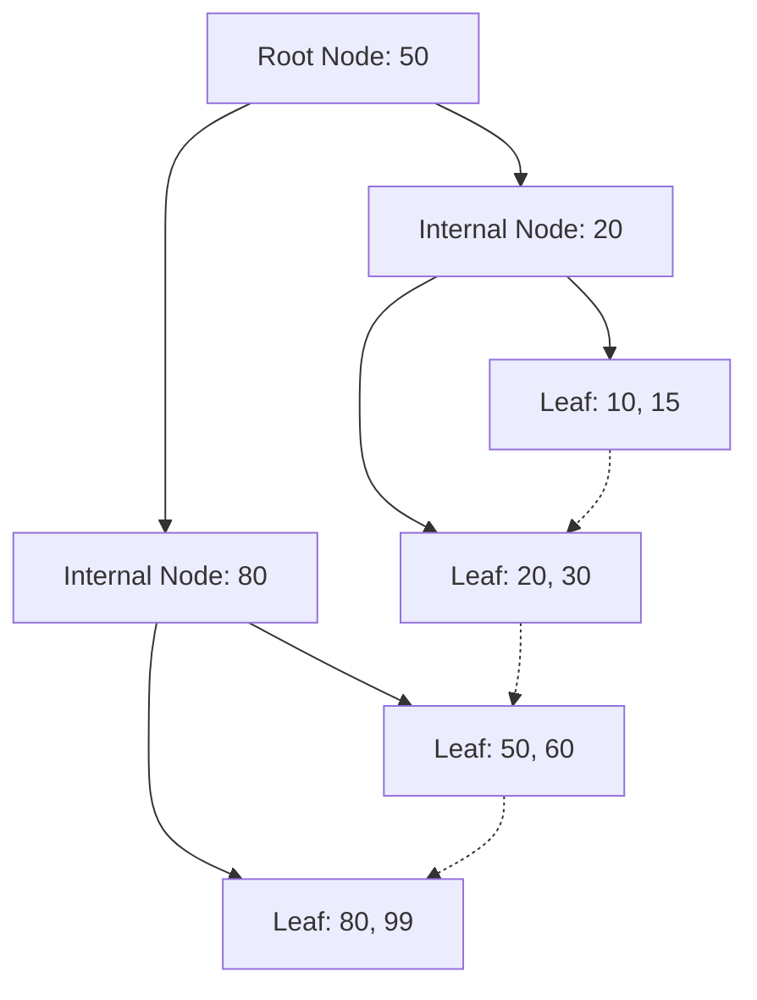
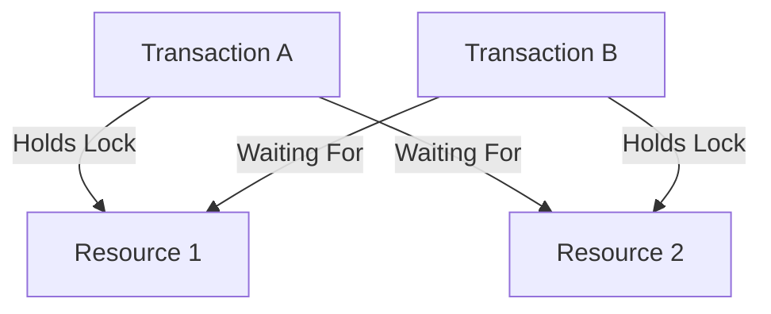
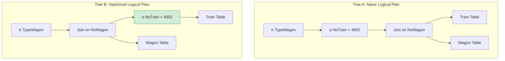
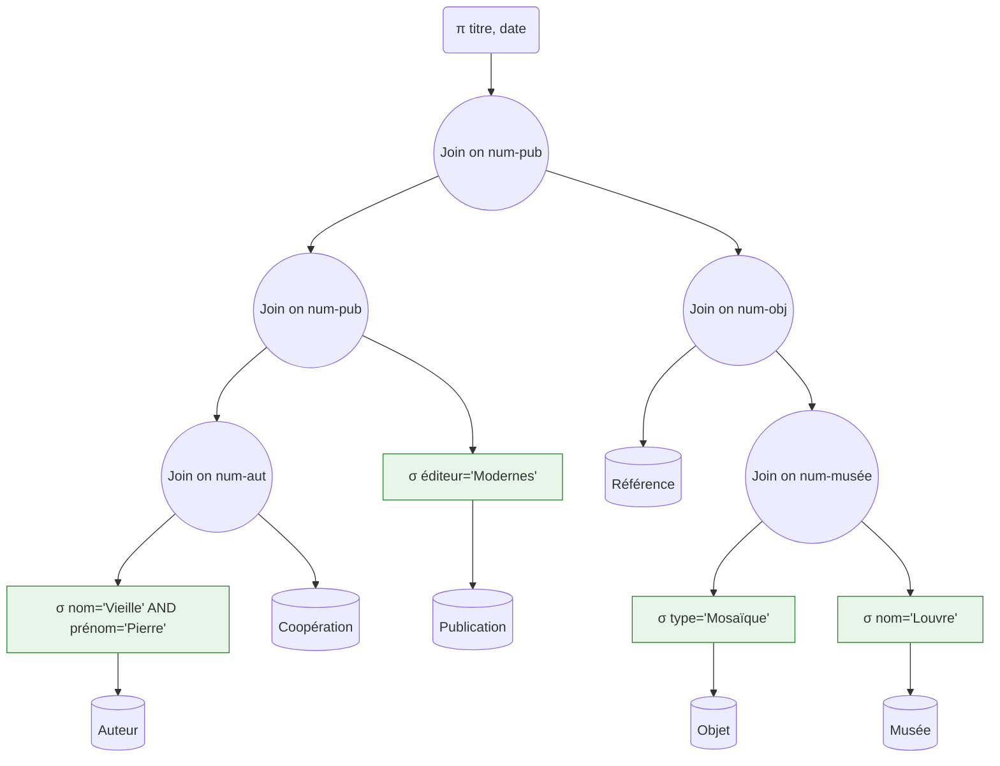

# 1. Query Processing Architecture and Lifecycle

When a user writes and submits a SQL query, they are utilizing a **declarative programming language**. This means the query defines *what* data to retrieve rather than specifying the operational procedures for *how* to access, filter, and combine the underlying datasets. The database management system (DBMS) relies on its internal **Query Processing Engine** and **Query Optimizer** to translate this declarative statement into an efficient procedural execution plan. 

The lifecycle of a query consists of distinct phases that transform raw text into physical machine instructions.



---

### 1.1 The Parser and Semantic Analyzer
The query text is first ingested by the Parser, which performs two primary tasks:
1. **Syntactic Analysis (Parsing):** The parser checks the query string against the formal grammar of the SQL dialect. If the syntax is invalid (e.g., misspelled keywords like `SELEC`, missing commas, or unbalanced parentheses), the parser immediately terminates execution and throws a syntax error. It constructs a **Parse Tree**, which represents the structure of the query.
2. **Semantic Analysis:** The parser validates the parse tree against the database schema catalog. It checks:
   * **Relation and Attribute Existence:** Do the specified tables and columns actually exist in the database?
   * **Data Type Compatibility:** Are the operations performed on compatible data types (e.g., comparing an integer column with a date)?
   * **Security and Authorization:** Does the active user session possess the privileges (`SELECT`, `UPDATE`, etc.) necessary to access these objects?

#### Procedural Parsing Mechanics and Delimiters
In standard SQL execution, individual statements are separated by a delimiter, typically a semicolon (`;`). However, during the definition of procedural schema objects—such as stored procedures, triggers, or functions—the object body itself contains internal semicolons. If the client parser does not intercept these, it will interpret the first internal semicolon as the end of the creation statement, leading to an incomplete parse tree and a syntax error.

To circumvent this, procedural parsing requires changing the delimiter. For example, in MySQL:

```sql
DELIMITER //

CREATE PROCEDURE GetActiveUsers(IN MinConcurrence INT)
BEGIN
    SELECT user_id, last_login 
    FROM user_sessions 
    WHERE active_connections >= MinConcurrence;
END //

DELIMITER ;
```

* **The `DELIMITER //` Directive:** Instructs the parsing engine to ignore standard semicolons as statement endings and instead wait for the occurrence of the custom character sequence `//`.
* **The Procedural Body:** The internal semicolons inside the `BEGIN ... END` block are safely bundled into the procedure's definitions without triggering early execution.
* **The Reset (`DELIMITER ;`):** Restores the default statement delimiter for subsequent queries.

---

### 1.2 The Logical Query Plan Generator
Once validated, the parse tree is translated into an initial **Logical Query Plan**. This plan is represented as an algebraic tree where nodes are operators from **Relational Algebra** (such as Selection $\sigma$, Projection $\pi$, and Join $\bowtie$) and leaves are the physical database relations (tables). 

At this stage, the logical plan is often **canonical** (or naive). It directly mimics the written structure of the SQL statement without any performance-based optimizations.

---

### 1.3 The Query Rewrite and Transformation Engine
Using algebraic rewrite rules, the optimizer restructures the logical query plan. This transformation phase applies heuristics to simplify operations and reduce the size of intermediate data sets before any cost calculations are made. 

Key actions in this phase include:
* Simplifying boolean expressions (e.g., rewriting `WHERE 1=1 AND status = 'Active'` to `WHERE status = 'Active'`).
* Simplifying subqueries into joins where possible.
* Pushing selections ($\sigma$) and projections ($\pi$) as deep as possible down the tree.

---

### 1.4 The Cost-Based Optimizer (CBO)
The logical plan only specifies *what* relational operations must happen, not *how* they are executed. The **Cost-Based Optimizer** evaluates multiple physical execution alternatives for the logical plan. 

It calculates an estimated cost for each alternative based on:
* **Physical Access Paths:** Should the engine perform a Sequential Scan, an Index Scan, or a RowID lookup?
* **Physical Join Algorithms:** Should it employ a Nested Loop Join, a Sort-Merge Join, or a Hash Join?
* **Database Statistics:** Catalog metadata regarding table sizes, column cardinalities, and value distributions.

The cost metric represents the estimated execution time, which is heavily dominated by the number of **Disk I/O Operations** (specifically page reads and writes) and, to a lesser extent, CPU cycles.

---

### 1.5 The Physical Plan Generator and Execution Engine
The optimizer selects the physical plan with the lowest estimated cost and translates it into an executable structure. The **Execution Engine** then steps through this physical plan, pulling data blocks from disk or the buffer pool, processing the rows through the designated physical operators, and returning the final result set to the client.

---

# 2. Relational Algebra and Logical Query Plans

Relational algebra serves as the formal mathematical foundation for relational databases. Every logical execution plan is mathematically represented as an algebraic expression.

### 2.1 Core Relational Operators

#### Selection ($\sigma$)
Filters tuples (rows) from a relation based on a specified selection predicate $C$.
* **Mathematical Notation:** $\sigma_{C}(R)$
* **SQL Mapping:** Evaluated in the `WHERE` clause and `ON` join conditions.
* **Characteristics:** It is a unary operator (acts on one relation). It preserves the input relation's schema (columns) but reduces its cardinality (number of rows).

#### Projection ($\pi$)
Extracts specified attributes (columns) from a relation, discarding all others.
* **Mathematical Notation:** $\pi_{A_1, A_2, \dots, A_n}(R)$
* **SQL Mapping:** Defined in the `SELECT` list.
* **Characteristics:** It is a unary operator. It modifies the schema of the relation by reducing its width. In pure relational algebra, projection eliminates duplicate tuples to maintain set properties, though standard SQL does not do this unless the `DISTINCT` keyword is specified.

#### Join ($\bowtie$)
Combines tuples from two relations that satisfy a join condition. The most common variant is the **Equi-Join** or **Theta-Join**.
* **Mathematical Notation:** $R \bowtie_{C} S$ (where $C$ is the join predicate, e.g., $R.id = S.id$).
* **Characteristics:** It is a binary operator. The resulting schema is the union of the schemas of $R$ and $S$.

#### Cartesian Product ($\times$)
Pairs every tuple of relation $R$ with every tuple of relation $S$.
* **Mathematical Notation:** $R \times S$
* **SQL Mapping:** Triggered by a comma-separated list of tables in the `FROM` clause without a matching join condition, or explicitly via `CROSS JOIN`.
* **Complexity:** If $R$ contains $|R|$ rows and $S$ contains $|S|$ rows, the Cartesian product results in $|R| \times |S|$ rows. Because of this exponential growth, optimizers try to rewrite Cartesian products into direct joins ($\bowtie$) early in the planning stage.

---

### 2.2 Advanced Subquery Operators: ANY, ALL, and SOME
SQL supports advanced logical operators that quantify comparison evaluations over the outputs of nested subqueries.

#### The ANY / SOME Operators
These operators return `TRUE` if the comparison predicate evaluates to true for **at least one** row returned by the subquery. Logically, this behaves like existential quantification ($\exists$).

```sql
SELECT employee_id 
FROM employees 
WHERE salary > ANY (SELECT salary FROM employees WHERE department_id = 10);
```

* **Algebraic Translation:** The optimizer translates `> ANY` by determining the minimum value of the subquery. If the subquery is empty, the operator evaluates to `FALSE`. 
* **Equivalence:** `SOME` is a direct synonym for `ANY`. The relational expression utilizes a **Semi-Join** ($\ltimes$), which returns rows from the outer relation as soon as a single match is discovered in the inner relation, eliminating the need to process all comparisons.

#### The ALL Operator
This operator returns `TRUE` if the comparison predicate evaluates to true for **every** row returned by the subquery. Logically, this behaves like universal quantification ($\forall$).

```sql
SELECT employee_id 
FROM employees 
WHERE salary > ALL (SELECT salary FROM employees WHERE department_id = 10);
```

* **Algebraic Translation:** The optimizer translates `> ALL` by evaluating the condition against the maximum value of the subquery. If the subquery contains even a single `NULL` value, the result of `> ALL` evaluates to `UNKNOWN` due to three-valued logic.
* **Equivalence:** Relational algebra maps `ALL` queries either through **Relational Division** or an **Anti-Join** ($\bar{\ltimes}$), filtering out any row that fails to satisfy the condition for even one element of the subquery set.

---

# 3. Algebraic Rewrite Rules and Optimization Heuristics

The transformation engine applies mathematical properties of relational algebra to restructure query plans. These transformations preserve logical equivalence while significantly reducing physical execution costs.

### 3.1 Mathematical Equivalence Rules

#### Commutativity of Joins
$$ R \bowtie S \equiv S \bowtie R $$
The logical result is identical regardless of which table is evaluated first. However, physically, the optimizer will assign the smaller relation to be the "outer" or "build" relation depending on the join algorithm chosen.

#### Associativity of Joins
$$ (R \bowtie S) \bowtie T \equiv R \bowtie (S \bowtie T) $$
This property allows the optimizer to evaluate multiple join order permutations for queries involving three or more tables, helping it find the order that minimizes intermediate result sets.

#### Commutativity of Selection and Join (Pushing Selections Down)
If the selection predicate $C$ contains only attributes belonging to relation $R$, then:
$$ \sigma_{C}(R \bowtie S) \equiv (\sigma_{C}(R)) \bowtie S $$
This is a critical heuristic in database optimization. Rather than joining two entire tables and then filtering the resulting large dataset, the selection is applied directly to the base table. This reduces the size of the input relation before it ever reaches the expensive join operation.

#### Cascading of Projections
$$ \pi_{L_1}(\pi_{L_2}(R)) \equiv \pi_{L_1}(R) \quad \text{if } L_1 \subseteq L_2 $$
Applying successive projections can be simplified to a single projection containing the final target attribute list $L_1$.

---

### 3.2 The Core Heuristics of Optimization

The optimization engine applies these rules of thumb to rewrite a query tree:

#### Heuristic 1: Push Selections Down ($\sigma$)
Filters should be applied as close to the physical disk reads as possible. This minimizes the cardinality of the datasets flowing up through subsequent operators.



#### Heuristic 2: Push Projections Down ($\pi$)
Discard columns that are not needed for the final output or intermediate join keys as early as possible. This reduces the byte width of the rows (tuples), which in turn:
* Saves memory space in the buffer pools.
* Reduces Disk I/O when writing intermediate temporary tables.
* Allows more records to fit inside a single memory page.

#### Heuristic 3: Replace Cartesian Products with Joins
A Cartesian product followed by a selection condition should always be rewritten as a single, explicit inner join:
$$ \sigma_{R.id = S.id}(R \times S) \equiv R \bowtie_{R.id = S.id} S $$
This transformation prevents the engine from generating a massive intermediate cartesian space, running a direct join instead.

#### Heuristic 4: Restrictive Join Ordering
When joining multiple tables, the optimizer orders the operations to join the smallest or most highly restricted tables first. This keeps the intermediate datasets as small as possible throughout the execution pipeline.

---

# 4. Cost-Based Optimization and Database Statistics

While algebraic heuristics produce a more efficient logical structure, selecting the best physical execution plan requires a quantitative **Cost Model**.

### 4.1 The Cost Model Core Variables
The physical cost of an operation is measured in **Input/Output (I/O) page transfers**, which represent the cost of reading or writing database blocks on storage disk.
* **$E$ (Disk Reads / Entrées):** The process of locating and loading a page from disk into the RAM buffer pool.
* **$S$ (Disk Writes / Sorties):** The process of writing modified pages or temporary intermediate tables from RAM back to the disk.

Disk operations are several orders of magnitude slower than CPU cycles, making them the primary factor in the cost equations.

---

### 4.2 Statistical Metadata in the Catalog
The cost optimizer relies on metadata stored in the database's internal system catalog. These statistics are updated periodically:
* **$N_R$ (Cardinality):** The total number of rows (tuples) in relation $R$.
* **$P_R$ (Page Count):** The physical number of disk pages (blocks) occupied by $R$.
* **$V(A, R)$ (Distinct Value Count):** The number of unique values present in attribute $A$ within relation $R$. If $A$ is a primary key, then $V(A, R) = N_R$.

---

### 4.3 Selectivity Estimation Formulas
The **Selectivity ($Sel$)** of a predicate is the estimated fraction of rows that will satisfy that condition.

#### Equality Selection on Attribute $A$ ($\sigma_{A = val}(R)$)
Under the assumption of a uniform distribution of values:
$$ Sel(A = val) = \frac{1}{V(A, R)} $$
The estimated size of the output is:
$$ \text{Size} = N_R \times \frac{1}{V(A, R)} $$

#### Inequality Selection on Attribute $A$ ($\sigma_{A > val}(R)$)
Assuming a uniform distribution between the minimum value ($Min$) and maximum value ($Max$) of the attribute on record in the catalog:
$$ Sel(A > val) = \frac{Max - val}{Max - Min} $$

#### Join Size Estimation ($R \bowtie_{R.A = S.A} S$)
If we assume that every value of the join attribute $A$ in the smaller relation has a matching value in the larger relation (containment assumption):
$$ \text{Estimated Size} = \frac{N_R \times N_S}{\max(V(A, R), V(A, S))} $$

#### Histogram Representations
Real-world data is rarely distributed uniformly. To handle skewed data distributions, database systems construct histograms:
* **Equi-Width Histograms:** The range between the minimum and maximum values is divided into equal intervals. The database then tracks the number of rows that fall into each interval.
* **Equi-Depth (or Height-Balanced) Histograms:** The intervals are dynamically sized so that each contains approximately the same number of rows. This approach provides much higher accuracy when dealing with highly skewed data distributions.

```text
Equi-Width Histogram:                       Equi-Depth Histogram:
Rows                                        Rows
 |   [ 100 ]                                 |   [ 50 ]  [ 50 ]  [ 50 ]
 |   |     |                                 |   |    |  |    |  |    |
 |   |     |  [  10 ]                        |   |    |  |    |  |    |
 +---+-----+-----+---->                      +---+----+--+----+--+---->
    1-10  11-20 21-30 Values                    1-3     4-18   19-30 Values
```

---

### 4.4 Statistics Acquisition Strategies

Because gathering perfect statistics requires scanning entire tables, databases use one of two main strategies to collect this data without hurting database performance:

#### Strategy A: Periodic Triggering
The database runs background statistics gathering jobs during off-peak hours (e.g., using `ANALYZE TABLE` in PostgreSQL or `DBMS_STATS` in Oracle).
* **Advantages:** It provides highly accurate and complete statistics, which helps the optimizer generate high-quality execution plans.
* **Disadvantages:** If the table experiences massive data modifications (e.g., bulk loading) between scheduled runs, the statistics become stale. This can lead to suboptimal execution plans because the optimizer is working with outdated information.

#### Strategy B: Real-Time Sampling
The engine estimates statistics on the fly by reading a small, randomized sample of disk pages (e.g., InnoDB in MySQL samples 8 random pages when a table is opened or queried).
* **Advantages:** This approach keeps statistics fresh with minimal overhead, preventing severe execution plan regressions after sudden massive data changes.
* **Disadvantages:** Because it relies on a small sample, the estimates can be inaccurate if the sampled pages do not represent the overall distribution of the dataset.

---

### 4.5 The Metadata Catalog and the INFORMATION_SCHEMA
Modern databases store this metadata inside system tables, which are exposed to administrators through standard SQL views. The `INFORMATION_SCHEMA` provides a standardized way to inspect table and column statistics across different database engines.

```sql
-- Querying schema and table statistics from the standard Information Schema
SELECT 
    TABLE_SCHEMA, 
    TABLE_NAME, 
    TABLE_ROWS, 
    DATA_LENGTH, 
    INDEX_LENGTH
FROM 
    INFORMATION_SCHEMA.TABLES 
WHERE 
    TABLE_SCHEMA = 'production_db';
```

---

# 5. Mathematical Proof of Optimization Heuristic Exceptions

A common assumption in database design is that pushing selections down the query tree is always the most efficient choice. However, in scenarios where join selectivity is high and write operations ($S$) are expensive, executing the join first can actually be the more efficient execution plan.

The following mathematical proof demonstrates this behavior.

### 5.1 System Variables and Parameters
Consider two relations, $Film$ and $Seance$:
* **$P_{Film}$ (Size of Film):** $8$ pages on disk.
* **$P_{Seance}$ (Size of Seance):** $50$ pages on disk.
* **$Sel(heure > 14)$ (Selectivity of the selection on Seance):** $0.90$. This means $90\%$ of the sessions happen after 14h, leaving the filtered table highly populated.
* **$Sel(Join)$ (Join Selectivity):** $0.20$. Only $20\%$ of the cross-matched rows survive the join operation.

We assume that writing a page of an intermediate result to disk/buffer memory is an expensive operation ($S$), and we compare the total cost of two physical execution plans.

---

### 5.2 Plan A: The Naive Plan (Join First, Filter Later)



#### Step 1: Execute the Block Nested Loop Join
* We load the entire $Film$ table ($8$ pages) into memory as the outer relation.
* We then read the $Seance$ table ($50$ pages) to find matches.
* **Read Cost ($E_{A1}$):** 
  $$ E_{A1} = 8 \times 50 = 400 \text{ reads} $$
* **Write Cost ($S_{A1}$):** The join condition is highly selective ($20\%$). It eliminates $80\%$ of the data immediately. The size of the resulting joined table is:
  $$ 50 \text{ pages} \times 0.20 = 10 \text{ pages written} $$
  $$ S_{A1} = 10 \text{ writes} $$

#### Step 2: Apply the Filter ($\sigma_{heure > 14}$) to the Intermediate Table
* We read the $10$-page intermediate table from Step 1.
* **Read Cost ($E_{A2}$):** 
  $$ E_{A2} = 10 \text{ reads} $$
* **Write Cost ($S_{A2}$):** Applying the $90\%$ selectivity filter yields the final output:
  $$ 10 \text{ pages} \times 0.90 = 9 \text{ pages written} $$
  $$ S_{A2} = 9 \text{ writes} $$

#### Total Cost for Plan A:
$$ \text{Total Cost}_A = (E_{A1} + E_{A2}) + (S_{A1} + S_{A2}) $$
$$ \text{Total Cost}_A = (400 + 10)E + (10 + 9)S = 410E + 19S $$
$$ \text{Total Cost}_A = 410 + 19 = \mathbf{429 \text{ I/O operations}} $$

---

### 5.3 Plan B: The "Optimized" Plan (Filter First, Join Later)



#### Step 1: Apply the Filter ($\sigma_{heure > 14}$) directly to Seance
* We read all $50$ pages of the $Seance$ table.
* **Read Cost ($E_{B1}$):** 
  $$ E_{B1} = 50 \text{ reads} $$
* **Write Cost ($S_{B1}$):** Because the selectivity is low ($90\%$ of rows survive), the size of the filtered intermediate table is:
  $$ 50 \text{ pages} \times 0.90 = 45 \text{ pages written} $$
  $$ S_{B1} = 45 \text{ writes} $$

#### Step 2: Execute the Join of Film and the Filtered Seance Table
* We join the $8$-page $Film$ table with the $45$-page filtered intermediate $Seance$ table.
* **Read Cost ($E_{B2}$):**
  $$ E_{B2} = 8 \times 45 = 360 \text{ reads} $$
* **Write Cost ($S_{B2}$):** Applying the $20\%$ join selectivity to the $45$-page table yields the final output:
  $$ 45 \text{ pages} \times 0.20 = 9 \text{ pages written} $$
  $$ S_{B2} = 9 \text{ writes} $$

#### Total Cost for Plan B:
$$ \text{Total Cost}_B = (E_{B1} + E_{B2}) + (S_{B1} + S_{B2}) $$
$$ \text{Total Cost}_B = (50 + 360)E + (45 + 9)S = 410E + 54S $$
$$ \text{Total Cost}_B = 410 + 54 = \mathbf{464 \text{ I/O operations}} $$

---

### 5.4 Conclusion and Heuristic Violation Rule
Comparing the two plans:
* **Plan A (Join First):** $429 \text{ I/O operations}$
* **Plan B (Filter First):** $464 \text{ I/O operations}$

Plan B is **35 I/O operations more expensive** than Plan A, violating the "Filter First" heuristic.

#### Why Plan B Failed:
1. **The Write Penalty ($S$):** The filter on $Seance$ had high selectivity ($90\%$), which meant almost all rows survived. Forcing this selection first required writing a large $45$-page intermediate table to memory/disk.
2. **The Join as a Filter:** The join operator was highly restrictive (only $20\%$ of rows survived). By running the join first (Plan A), the dataset was reduced from $50$ pages down to $10$ pages. This made the subsequent write costs for the selection step negligible.

#### The Heuristic Violation Exception Rule:
> [!IMPORTANT] Heuristic Violation Exception
> Do not push selections down the query tree if:
> 1. The selection filter has low selectivity (it filters out very few rows).
> 2. The join operator is highly restrictive (it filters out a large percentage of rows).
> 3. The write cost ($S$) of storing the filtered intermediate relation is larger than the read savings achieved by joining a smaller table.

---

# 6. Physical Access Paths and Execution Algorithms

Once the logical optimization phase is complete, the engine translates each logical operator into a concrete physical algorithm.



---

### 6.1 Physical Scan Types
* **Sequential Scan (Table Scan):** The engine reads every data page of a table from disk sequentially. This is the fallback access method when no matching indexes exist or when a query retrieves a large percentage of the table.
* **Index Scan:** The engine traverses an index structure (like a B+ Tree) to locate specific keys. It then uses the associated physical pointers (RowIDs) to fetch only the matching pages. This is highly efficient for targeted lookups (high selectivity).
* **Index-Only Scan:** If the index structure contains all the columns requested by the query, the engine can return the data directly from the index. This avoids the extra step of reading the actual table pages from disk.

---

### 6.2 Simple Nested Loop Join (SNLJ)
This is the baseline algorithm for joining two tables. It uses two nested loops to compare every row in the outer table with every row in the inner table.

```text
Algorithm: Simple Nested Loop Join
Inputs: Outer Relation R, Inner Relation S
Output: Joined Relation J

J := Ø
FOR EACH row r IN R DO:
    FOR EACH row s IN S DO:
        IF r.key == s.key THEN
            J := J ∪ { r || s }
        END IF
    END FOR
END FOR
RETURN J
```

#### Complexity Analysis:
* **Time Complexity:** $\mathcal{O}(N_R \times N_S)$ (where $N_R$ and $N_S$ represent the number of tuples).
* **I/O Disk Cost:** $P_R + (N_R \times P_S)$ (where $P_R$ and $P_S$ represent the page counts on disk).
* **Memory Requirement:** $\mathcal{O}(1)$ frames. This is a very low memory footprint, requiring only enough RAM to hold one row of $R$ and one row of $S$ at a time.
* **Flaw:** If the inner table $S$ is large, this algorithm is extremely slow because it must scan the entire inner table from disk for every single row in the outer table.

---

### 6.3 Index Nested Loop Join (INLJ)
If the inner table has an index on the join attribute, we can replace the expensive inner scan with a targeted index lookup.

```text
Algorithm: Index Nested Loop Join
Inputs: Outer Relation R, Inner Relation S, Index_S on S.key
Output: Joined Relation J

J := Ø
FOR EACH row r IN R DO:
    s_rows := Index_Search(Index_S, r.key)
    FOR EACH s IN s_rows DO:
        J := J ∪ { r || s }
    END FOR
END FOR
RETURN J
```

#### Complexity Analysis:
* **Time Complexity:** $\mathcal{O}(N_R \times \log N_S)$ (assuming a B+ Tree index on the inner table).
* **I/O Disk Cost:** $P_R + (N_R \times \text{Cost of Index Lookup})$.
* **Advantage:** Highly efficient when joining a small outer table with a large, well-indexed inner table.

---

### 6.4 Sort-Merge Join (SMJ)
This algorithm is used when both tables are sorted by the join attribute, or can be sorted easily. It processes both tables in a single parallel pass (similar to the merge phase of a mergesort).

```text
Algorithm: Sort-Merge Join
Inputs: Relation R, Relation S (both pre-sorted on join key)
Output: Joined Relation J

J := Ø
r_idx := 0, s_idx := 0
N_R := length(R), N_S := length(S)

WHILE r_idx < N_R AND s_idx < N_S DO:
    IF R[r_idx].key == S[s_idx].key THEN
        -- Handle matches and duplicates
        match_start_s := s_idx
        WHILE r_idx < N_R AND R[r_idx].key == S[match_start_s].key DO:
            s_idx := match_start_s
            WHILE s_idx < N_S AND R[r_idx].key == S[s_idx].key DO:
                J := J ∪ { R[r_idx] || S[s_idx] }
                s_idx++
            END WHILE
            r_idx++
        END WHILE
    ELSE IF R[r_idx].key < S[s_idx].key THEN
        r_idx++
    ELSE
        s_idx++
    END IF
END WHILE
RETURN J
```

#### Complexity Analysis:
* **Time Complexity:** $\mathcal{O}(N_R \log N_R + N_S \log N_S)$ if sorting is required; $\mathcal{O}(N_R + N_S)$ linear scan time if the relations are pre-sorted.
* **I/O Disk Cost:** $P_R + P_S$ once the tables are sorted.
* **Advantage:** Highly efficient for large datasets when the inputs are already sorted (e.g., from a clustered index scan) or when the query contains an explicit `ORDER BY` on the join column.

---

### 6.5 Hash Join (HJ)
The default join choice for large, unsorted analytical datasets. It works in two distinct phases:



```text
Algorithm: Classical In-Memory Hash Join
Inputs: Relation R (smaller Build relation), Relation S (larger Probe relation)
Output: Joined Relation J

J := Ø
hash_table := NewHashTable()

-- Phase 1: Build Phase
FOR EACH row r IN R DO:
    hash_bucket := hash(r.key)
    hash_table.insert(hash_bucket, r)
END FOR

-- Phase 2: Probe Phase
FOR EACH row s IN S DO:
    hash_bucket := hash(s.key)
    IF hash_table.contains(hash_bucket) THEN
        FOR EACH matching_row r IN hash_table.get(hash_bucket) DO:
            IF r.key == s.key THEN
                J := J ∪ { r || s }
            END IF
        END FOR
    END IF
END FOR
RETURN J
```

#### Complexity Analysis:
* **Time Complexity:** $\mathcal{O}(N_R + N_S)$ (Linear time complexity).
* **Memory Requirement:** $\mathcal{O}(P_R)$ pages. The database must have enough RAM to hold the entire hash table of the build relation $R$. If the build relation exceeds the available RAM, the engine must spill the partition buckets to disk (a process known as a **Grace Hash Join**), which increases the overall I/O cost to approximately $3 \times (P_R + P_S)$.

---

### 6.6 Execution Strategies: Pipelining vs. Materialization

When executing a multi-step physical plan, the engine can pass intermediate results between operators in one of two ways:

#### Materialization
Each operator in the execution tree must run to completion, writing its entire intermediate result to a temporary table on disk before passing it to the next step.
* **Disadvantages:** High I/O overhead due to constant disk writes and reads.
* **When it is used:** Necessary for blocking operators like `SORT` or `GROUP BY` that require seeing the entire dataset before producing the first output row.

#### Pipelining
The system processes data using a streaming model, typically implementing the **Iterator (Volcano) Model**. Each physical operator exposes an interface with three primary methods:
1. `open()`: Initializes the operator and prepares its state.
2. `next()`: Processes and returns a single matching tuple. It pulls data from its child operators on demand, passing rows up the execution tree one by one without writing intermediate results to disk.
3. `close()`: Cleans up resources once all data has been read.

```text
           [Project Operator]  <-- pulls row via next()
                  ^
                  |
            [Join Operator]     <-- pulls row via next()
                  ^
                  |
           [Filter Operator]   <-- pulls row via next()
```

* **Advantages:** Minimizes memory consumption and eliminates disk I/O for intermediate steps.
* **When it is used:** The preferred execution strategy for non-blocking operations like Selections and Projections.

---

# 7. Database Indexing Deep Dive and Storage Schemas

An index is a specialized physical structure designed to accelerate data retrieval. It maps search keys to the physical disk locations of their matching records.

### 7.1 Primary (Clustered) vs. Secondary Indexes
The physical layout of the data on disk determines the index type:

#### Primary (Clustered) Index
* Determines the actual physical order of the data blocks on disk. 
* Because physical data can only be sorted in one order, a table can have **at most one** clustered index (typically assigned to the primary key).
* **Advantage:** Highly efficient for range queries (`WHERE age BETWEEN 25 AND 35`) because matching data pages are physically contiguous on disk, minimizing disk head movement during reads.

#### Secondary (Non-Clustered) Index
* A completely separate physical structure that maps key values to physical pointers (**RowIDs** or Clustered Keys). The underlying table data remains unsorted on disk.
* **Advantage:** Multiple secondary indexes can be created on different columns to speed up various search paths.
* **Disadvantage:** Range queries using secondary indexes can be slow. Reading non-contiguous pages can trigger random disk I/O, which is much slower than sequential reads.

---

### 7.2 B+ Tree Index Mechanics
The **B+ Tree** is a self-balancing search tree designed to work efficiently with block-based storage systems like hard drives and SSDs.



#### Key Architecture Principles:
1. **Node Sizing:** Every node in the tree is sized to match a physical disk block (typically 4KB to 16KB). This ensures that reading a node requires exactly one disk I/O operation.
2. **Key-Pointer Separators:** Internal nodes contain only routing keys and child pointers. This maximizes the node's **Fan-Out** (the number of branches split from each node).
3. **Data Storage:** All actual data rows (or RowID pointers) are stored exclusively in the leaf nodes.
4. **Doubly-Linked Leaf List:** Leaf nodes are connected horizontally via a doubly-linked list. This allows range scans to run in linear time across the leaves once the starting key is located, bypassing the need to traverse up and down the tree structure.

#### Fan-Out Mathematical Comparison:
Consider a dataset of $1,000,000$ records.
* **Binary Search Tree (BST):** Has a fan-out of 2. Locating a record requires traversing approximately $\log_2(1,000,000) \approx 20$ levels. In a database, this would translate to 20 separate disk I/O reads.
* **B+ Tree:** Assuming a page size of 8KB, a routing key of 8 bytes, and a pointer of 8 bytes, a single internal node can achieve a fan-out of around $500$. Traversing a tree with a fan-out of 500 requires only $\log_{500}(1,000,000) \approx 3$ levels. The database can locate any record with just 3 disk I/O reads, significantly reducing execution times.

---

### 7.3 Hash Index Mechanics
Hash indexes use a hash function $h(K)$ to map keys directly to a specific array of bucketing slots.

#### Performance Characteristics:
* **Lookup Time:** $\mathcal{O}(1)$ constant-time lookup for exact-match equality queries (`WHERE id = 100`).
* **Drawbacks:** Hash indexes cannot help with range queries (`WHERE age > 25`). Because hashing scatters keys randomly across bucket addresses, contiguous ranges cannot be scanned sequentially. Additionally, they cannot assist with sorting (`ORDER BY`) or partial string matching (`LIKE 'Sm%'`).

#### Static vs. Dynamic Hashing

##### Static Hashing
The directory size (number of buckets) is fixed during creation.
* **Problem:** As the database grows, many keys can hash to the same bucket. This causes **hash collisions**, which forces the engine to chain overflow pages using linked lists. This degrades the lookup performance from $\mathcal{O}(1)$ towards a slow $\mathcal{O}(N)$ sequential search.

##### Dynamic (Extendible) Hashing
The hash directory dynamically doubles or halves in size using a prefix bit-mask of the hash values.

```text
Directory (Global Depth 2):
 [ 00 ] ----> Bucket A (Local Depth 2): [ 4, 8 ]
 [ 01 ] ----> Bucket B (Local Depth 1): [ 1, 5 ]
 [ 10 ] ----> Bucket C (Local Depth 2): [ 2, 6 ]
 [ 11 ] ----> Bucket B (Local Depth 1) (shared reference)
```

* If a bucket overflows, only that specific bucket splits. The directory depth increases (using more prefix bits) without requiring a full re-hash of the entire database. This preserves the constant-time $\mathcal{O}(1)$ lookup performance as the dataset scales.

---

### 7.4 Bitmap Indexes
A bitmap index represents the presence or absence of a value across rows using an array of bits ($0$ or $1$).

```text
Table Data:
Row 0: Gender='M'
Row 1: Gender='F'
Row 2: Gender='M'

Bitmap Index:
Value 'M': [ 1, 0, 1 ]
Value 'F': [ 0, 1, 0 ]
```

* **Best Use Case:** High-volume columns with **low cardinality** (columns with few distinct values, such as `Gender`, `Status`, or `Boolean` flags) in read-heavy data warehouses.
* **Bitwise Operations:** The database can evaluate complex boolean filters using native CPU bitwise instructions (e.g., performing a bitwise `AND` on the status and region bitmaps). This is extremely fast and avoids reading the actual data pages.
* **Disadvantage:** Highly inefficient for write-heavy (OLTP) databases. Modifying a single row requires locking the entire bitmap segment, which can block concurrent writes.

---

### 7.5 NoSQL Physical Storage Layouts

Non-relational databases use alternative physical structures optimized for scalability and semi-structured datasets.

#### Column-Family (Wide-Column) Storage
Used by systems like Apache Cassandra and HBase. Instead of storing data as contiguous rows, related columns are grouped into **Column Families** and stored together on disk.

```text
Row-Oriented Physical Layout:
[ Row 1: ID, Name, Email ] -> [ Row 2: ID, Name, Email ]

Wide-Column Physical Layout:
[ Column Family - Profile: Row1(ID, Name), Row2(ID, Name) ]
[ Column Family - Contact: Row1(ID, Email), Row2(ID, Email) ]
```

* **Write Path Optimization:** Writes are appended directly to an in-memory buffer called a **MemTable** and a write-ahead log (WAL). The MemTable is periodically flushed to immutable disk files called **SSTables (Sorted String Tables)**. Background **compaction** processes merge and deduplicate these SSTables.
* **Query Performance:** Reading specific attributes across millions of rows is highly efficient because the engine only loads the column families required by the query. This avoids the overhead of reading entire rows from disk.

#### Document Storage and JSONiq Context
Document databases (like MongoDB) store data as semi-structured JSON or BSON documents. To query these structures declaratively without traditional SQL parsers, databases use engines like **JSONiq**.

JSONiq provides declarative syntax designed for querying nested semi-structured data:

```jsoniq
for $user in collection("users")
where $user.profile.age > 30 and $user.status eq "active"
return {
    "name": $user.name,
    "email": $user.contact.email
}
```

* **Parsing and Execution:** The parser translates the JSONiq expression into a logical plan that supports nested path traversal (`$user.profile.age`). The query optimizer can then map these paths directly to nested indexes built on the JSON sub-documents, speeding up lookups on semi-structured data.

---

# 8. Advanced Physical Design and Concurrency Control

To achieve high throughput, databases must balance physical index designs with concurrency control mechanisms that prevent data corruption during simultaneous user updates.

### 8.1 Indexing Heuristics and Trade-offs
* **Selectivity Rule:** Create secondary indexes only on columns that filter out a high percentage of rows (high selectivity, such as unique IDs or email addresses). Creating an index on a low-selectivity column (like a status flag) is often slower than a full table scan because of the overhead of reading the index and performing random disk access.
* **Covering Indexes:** If an index contains both the filter column and all other columns requested by a query, the query engine can return the data directly from the index. This is known as an **Index-Only Scan**, which avoids the extra step of reading the actual table pages from disk.
* **Write Overhead:** Every index speeds up reads but slows down write operations (`INSERT`, `UPDATE`, `DELETE`), because the database must update both the table data and all associated index structures inside a transaction.

---

### 8.2 Pessimistic Concurrency Control (Locking)
Pessimistic concurrency control uses locks to block conflicting transactions and prevent data anomalies.

#### Lock Modes:
* **Shared Lock (S):** Required for read operations. Multiple transactions can hold shared locks on the same row concurrently.
* **Exclusive Lock (X):** Required for write operations. Only one transaction can hold an exclusive lock, blocking all other readers and writers.

#### Deadlock Handling:
A deadlock occurs when Transaction A holds a lock on Resource 1 and waits for Resource 2, while Transaction B holds a lock on Resource 2 and waits for Resource 1. Neither can proceed.



To resolve deadlocks, databases assign transaction timestamps ($TS$) and apply one of two preventive schemes:
* **Wait-Die Scheme (Non-preemptive):** If an older transaction ($TS(T_i)$ is smaller) requests a lock held by a younger transaction ($TS(T_j)$ is larger), $T_i$ is allowed to wait. If a younger transaction requests a lock held by an older transaction, the younger transaction immediately dies (is rolled back and restarted).
* **Wound-Wait Scheme (Preemptive):** If an older transaction requests a lock held by a younger transaction, the older transaction "wounds" (forces a rollback of) the younger transaction. If a younger transaction requests a lock held by an older transaction, the younger transaction is allowed to wait.

---

### 8.3 Optimistic Concurrency Control and MVCC
Modern high-performance databases avoid using locks for read operations by implementing **Multi-Version Concurrency Control (MVCC)**.

#### Core Principle:
Instead of overwriting existing table data, an update operation creates a new, timestamped version of the row.
* **Non-Blocking Reads:** When a reader queries the database, the engine uses the transaction's start timestamp to reconstruct the correct historical version of the data. This allows readers to access the database without being blocked by active write transactions.
* **Heuristic:** "Readers do not block writers, and writers do not block readers." This approach maximizes transaction throughput, making it ideal for high-volume database workloads.

---

# 9. Applied Exercise Analysis: Trains and Wagons

This exercise demonstrates how the optimizer applies algebraic rewrite heuristics to improve query execution costs.

### 9.1 Database Schema and Context
Consider a database that tracks train compositions:
* **`Train(NoTrain, NoWagon)`**
  * $N_{Train} = 60,000$ rows.
  * $P_{Train} = 1,200$ pages on disk.
  * $V(NoTrain, Train) = 2,000$ distinct trains.
* **`Wagon(NoWagon, TypeWagon, Status)`**
  * $N_{Wagon} = 200,000$ rows.
  * $P_{Wagon} = 5,000$ pages on disk.

#### The Target Query:
Find the wagon types assigned to train number `4002`.

```sql
SELECT W.TypeWagon
FROM Train T
JOIN Wagon W ON T.NoWagon = W.NoWagon
WHERE T.NoTrain = 4002;
```

---

### 9.2 Relational Algebra Representation
This query is modeled using two different query trees:



---

### 9.3 Equivalence Proof
To prove that Tree A and Tree B produce identical results, we apply the relational algebra rule for the **Commutativity of Selection and Join**:
$$ \sigma_{NoTrain = 4002}(Train \bowtie_{NoWagon} Wagon) \equiv (\sigma_{NoTrain = 4002}(Train)) \bowtie_{NoWagon} Wagon $$

#### Proof Steps:
1. The selection condition `NoTrain = 4002` references the column `NoTrain`, which belongs exclusively to the `Train` table.
2. The join condition connects the two tables using the `NoWagon` attribute.
3. Because the selection condition does not reference any attributes from the `Wagon` table, we can apply the filter directly to the `Train` table before performing the join.
4. The two algebraic expressions are logically equivalent, ensuring that both plans will return the exact same output.

---

### 9.4 Cost Estimation and Performance Analysis

#### Execution Cost of Tree A (Join First, Filter Later):
1. **Join Phase:** The engine joins the entire `Train` table ($60,000$ rows) with the `Wagon` table ($200,000$ rows).
   * Joining these tables without filtering first requires a massive nested loop or sorting operation over all $200,000$ wagon records.
   * **Intermediate Result Size:** The join yields an intermediate dataset of $60,000$ rows representing the complete train compositions.
2. **Filter Phase:** The engine performs a full scan of this $60,000$-row intermediate dataset to locate records where `NoTrain = 4002`.
3. **Total Cost:** This plan is highly inefficient, consuming significant CPU and memory resources to build and process the large intermediate dataset.

#### Execution Cost of Tree B (Filter First, Join Later):
1. **Filter Phase:** The engine applies the selection `NoTrain = 4002` directly to the `Train` table.
   * Under a uniform distribution assumption across the $2,000$ distinct trains, the number of matching records is:
     $$ \text{Output Rows} = \frac{60,000}{2,000} = 30 \text{ rows} $$
   * Applying this filter immediately reduces the dataset from $60,000$ rows down to just $30$ rows.
2. **Join Phase:** The engine joins only those $30$ matching rows with the `Wagon` table.
   * Using an index on `Wagon.NoWagon`, the join requires only $30$ quick index lookups.
3. **Total Cost:** This plan is extremely efficient, running in milliseconds while consuming minimal CPU and disk I/O. Pushing the selection down the tree achieved a massive performance improvement.

---

# 10. Applied Exercise Analysis: Archaeology Database

This exercise analyzes a complex, multi-table join operation to show how the optimizer designs an efficient execution plan for real-world schemas.

### 10.1 Schema Definition
We are working with an archaeology database containing six tables:
* **`Objet(num-obj, type, num-musée)`**
* **`Musée(num-musée, nom)`**
* **`Publication(num-pub, titre, date, éditeur)`**
* **`Auteur(num-aut, nom, prénom)`**
* **`Coopération(num-aut, num-pub)`**
* **`Référence(num-pub, num-obj)`**

#### The Query Goal:
Find the titles and publication dates of books written by the author **'Pierre Vieille'** (published by the editor **'Modernes'**) that reference objects of type **'Mosaïque'** located in the **'Louvre'** museum.

---

### 10.2 The Naive Canonical Query Tree
A naive translation of this query results in a massive execution plan:
1. Performs a six-table Cartesian product:
   $$ Objet \times Musée \times Publication \times Auteur \times Coopération \times Référence $$
2. Applies a single, massive filter in the `WHERE` clause containing all the join conditions and search criteria.
3. Projects the final `titre` and `date` columns.

If each of the six tables contained just $1,000$ rows, the initial Cartesian product would produce $1,000^6 = 10^{18}$ intermediate rows. This query would exhaust system resources and fail to complete.

---

### 10.3 Step-by-Step Construction of the Optimized Tree

To optimize this execution plan, we apply heuristic rewrite rules step-by-step.

#### Step 1: Push Selections Down to the Base Tables
We extract all search filters from the global `WHERE` clause and apply them directly to the base tables. This filters out non-matching rows before any join operations occur:
* Filter **`Auteur`** to locate the target author:
  $$ \sigma_{nom = 'Vieille' \land prénom = 'Pierre'}(Auteur) $$
* Filter **`Publication`** to locate the target editor:
  $$ \sigma_{éditeur = 'Modernes'}(Publication) $$
* Filter **`Objet`** to find the target object type:
  $$ \sigma_{type = 'Mosaïque'}(Objet) $$
* Filter **`Musée`** to find the target museum:
  $$ \sigma_{nom = 'Louvre'}(Musée) $$

#### Step 2: Convert Cartesian Products to Explicit Inner Joins
We replace all Cartesian products with explicit, structured inner joins using the relational link keys defined in the schema:
* Connect the author to their publications:
  $$ Auteur \bowtie_{num-aut} Coopération \bowtie_{num-pub} Publication $$
* Connect the museum to its objects:
  $$ Musée \bowtie_{num-mus\acute{e}e} Objet $$
* Connect publications to objects using the references table:
  $$ Publication \bowtie_{num-pub} R\acute{e}f\acute{e}rence \bowtie_{num-obj} Objet $$

#### Step 3: Build the Optimized Query Tree Structure
The query plan splits naturally into two separate branches that are processed in parallel and merged at the end:
* **Left Branch (Publications):** Identifies all publications by 'Pierre Vieille' that were published by the editor 'Modernes'.
* **Right Branch (Museum Objects):** Identifies all 'Mosaïque' objects currently stored in the 'Louvre' museum.
* **Root Join:** Joins the two branches using the `Référence` table to identify which of those publications reference the museum's objects.

#### Step 4: Push Projections Down to Reduce Row Widths
We apply projections along each branch to discard unused columns early, keeping only the attributes needed for the final output (`titre`, `date`) and the keys required to perform the joins (`num-pub`, `num-obj`, `num-aut`).

---

### 10.4 Final Optimized Physical Query Tree

The following diagram represents the final, optimized physical query execution plan:



This optimized query plan runs efficiently by filtering datasets early, performing targeted joins on small intermediate relations, and avoiding Cartesian products entirely.