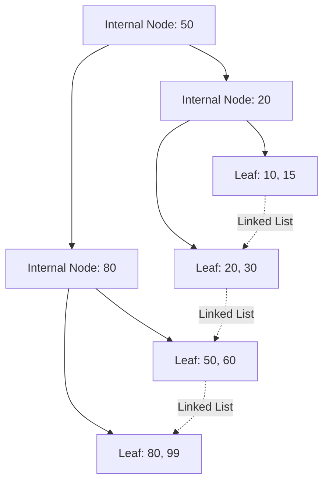

# Database Indexing Deep Dive

While query heuristics dictate the *logical* order of operations, the DBMS relies on **Indexes** to perform the *physical* retrieval. An index is a specialized data structure that takes a search key and quickly returns the physical disk location (Page ID / Slot) of the matching row.

## 1. Primary vs Secondary Indexes
*   **Primary (Clustered) Index:** Determines the physical order of data on the disk. Because data can only be physically sorted one way, a table can only have **one** clustered index (usually the Primary Key). 
    *   *Advantage:* Lightning fast for range queries (`WHERE age BETWEEN 20 AND 30`) because the blocks are contiguous on disk.
*   **Secondary (Non-Clustered) Index:** A separate structure that holds the key and a pointer to the physical row. The data is not sorted by this key. You can have multiple secondary indexes.

## 2. B+ Tree Indexes
The **B+ Tree** is the undisputed king of database indexing. It is a balanced tree specifically designed to minimize disk I/O operations.

### Structure
*   **Internal Nodes:** Contain only keys and pointers to child nodes. They act purely as a navigation roadmap.
*   **Leaf Nodes:** Contain the actual keys and the physical pointers to the database rows (or the data itself in a clustered index). 
    *   *Crucial Feature:* All leaf nodes are linked together in a **doubly-linked list**. This makes traversing sequential ranges completely trivial once you find the starting point.

### Why B+ Trees instead of Binary Search Trees?
A Binary Tree only has 2 children per node. To store 1 million records, the tree is approximately 20 levels deep. That means 20 disk I/O reads just to find an ID. 
A B+ Tree node matches the size of a disk block (e.g., 8KB) and can branch to hundreds of children. A B+ tree with a fan-out of 100 can store 1 million records in just **3 levels**. This means only 3 disk reads.

## 3. Hash Indexes
While B+ Trees are great for range searches (`<`, `>`, `BETWEEN`), Hash Indexes are unbeatable for **exact match equality** (`=`).

A Hash function $h(K)$ converts the search key into a bucket structure. 
*   **Lookup time:** $O(1)$. It finds the data instantly without traversing a tree.
*   **Drawback:** It is absolutely useless for range queries. If you ask `WHERE age > 18`, a hash map cannot help you because 18 and 19 hash to completely random, unrelated buckets.

### Static vs Dynamic Hashing
*   **Static Hashing:** The number of buckets is fixed. Problematic for growing databases because it leads to "overflow buckets" (linked lists attached to a bucket), destroying performance.
*   **Dynamic (Linear/Extendible) Hashing:** The hash directory grows dynamically. As buckets fill up, the system splits them and updates the directory to point to the new buckets, maintaining $O(1)$ performance regardless of database size.

## 4. Bitmap Indexes
Used specifically for data with **low cardinality** (columns with very few distinct values, like `Gender`, `Boolean flags`, or `Status`).
Instead of storing pointers, it creates an array of bits for each value.
*   *Fast aggregations:* `COUNT()` operations can be performed using native bitwise `AND/OR` CPU instructions directly on the bitmaps, bypassing the data completely.
