# 5. PLSQL and Database Programming

This comprehensive guide covers database programming paradigms, comparing Oracle's PL/SQL and MySQL's Procedural SQL. It details procedural mechanics, execution state control, transaction boundaries, and advanced cursor strategies.

---

## 1. Paradigms of Database Programming: Declarative SQL vs. Procedural SQL

Relational databases rely on structured paradigms. Understanding where declarative SQL ends and procedural SQL begins is necessary for designing database applications.

### Limitations of Standard Declarative SQL
Standard SQL (`SELECT`, `INSERT`, `UPDATE`, `DELETE`) is **declarative**. The developer defines *what* data is required, leaving the database query optimizer to determine *how* to retrieve or modify it. 

While declarative SQL is highly optimized for set-based operations, it has key limitations:
* **No Control Flow:** It cannot natively execute conditional branches (`IF-THEN-ELSE`) that control execution flow. Although `CASE` expressions exist, they are restricted to evaluating values within a query rather than directing program execution.
* **No Iterative Processing:** It lacks loops (`WHILE`, `FOR`) to execute code blocks repeatedly based on dynamic states.
* **No State Management:** It cannot store temporary calculation results in local, strongly-typed variables outside the execution of a single statement.
* **No Robust Error Handling:** It cannot catch database errors, execute fallback routines, or raise custom application-level exceptions.
* **High Network Overhead:** Without procedural blocks, an application must execute a query, transmit the results over the network to the application server, run procedural logic in a language like Java or Python, and then send updates back to the database. This causes significant network latency and serialization overhead.

### Procedural Extensions: Oracle PL/SQL vs. MySQL Procedural SQL
To address these limitations, database engines use procedural extensions. These compile procedural code directly inside the database, executing logic close to the storage engine.

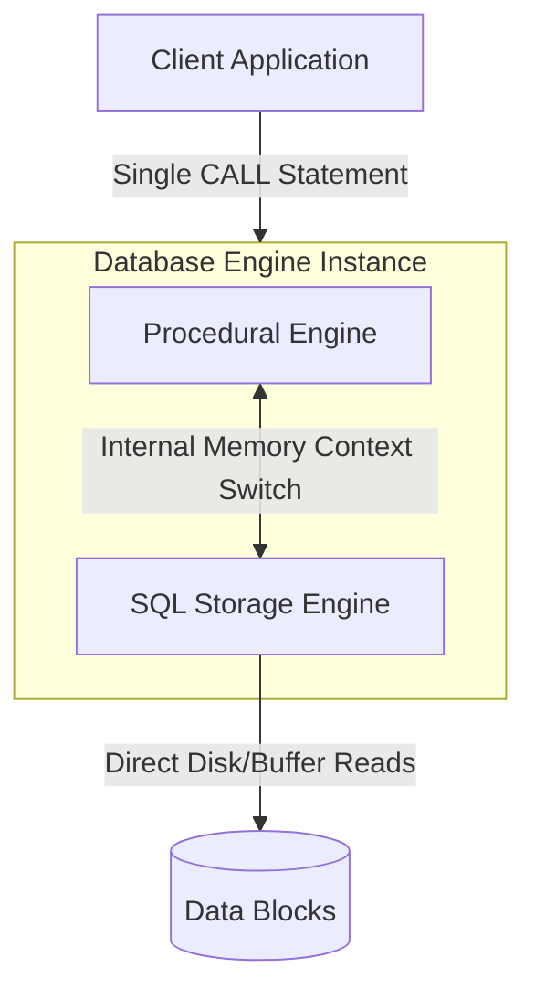

* **Oracle PL/SQL (Procedural Language/SQL):** A mature, highly structured, proprietary language modeled on Ada. It features compiler optimizations, packages, object-oriented concepts, and robust exception propagation models. It runs within a dedicated engine inside Oracle Database.
* **MySQL Procedural SQL:** A lighter procedural dialect implementing parts of the SQL/PSM (Stored Planned Subprograms) standard. It provides the same essential logic controls as Oracle PL/SQL but lacks advanced features like package compilation, custom collection types, and object-oriented features.

### Comparison Table: Language Capabilities

| Feature | Standard Declarative SQL | Oracle PL/SQL | MySQL Procedural SQL |
| :--- | :--- | :--- | :--- |
| **Execution Paradigm** | Set-oriented (all at once) | Procedural (row-by-row or set-based) | Procedural (row-by-row or set-based) |
| **Variables & Assignment** | No | Yes (via `DECLARE` or assignment `:=`) | Yes (via `DECLARE` or `SET`) |
| **Conditionals & Loops** | No (only inline `CASE` values) | Yes (`IF`, `ELSIF`, `LOOP`, `WHILE`, `FOR`) | Yes (`IF`, `ELSEIF`, `WHILE`, `LOOP`, `REPEAT`) |
| **Subroutines** | None | Stored Procedures, Functions, Packages | Stored Procedures, Functions, Events |
| **Exception Handling** | None | `EXCEPTION` block with propagation | `DECLARE ... HANDLER FOR ...` |
| **Execution Context** | Client parses/sends statements | Server engine compiles and caches | Server engine compiles and caches |

### Side-by-Side Loop Syntax Comparison

To illustrate the syntactic and structural differences, here is a loop that increments a counter and outputs its value in both dialects:

#### Oracle PL/SQL Block
```sql
DECLARE
    v_counter NUMBER := 0;
BEGIN
    WHILE v_counter < 5 LOOP
        v_counter := v_counter + 1;
        DBMS_OUTPUT.PUT_LINE('Counter: ' || v_counter);
    END LOOP;
END;
/
```

#### MySQL Procedural SQL Block
```sql
CREATE PROCEDURE SimpleLoop()
BEGIN
    DECLARE v_counter INT DEFAULT 0;
    
    WHILE v_counter < 5 DO
        SET v_counter = v_counter + 1;
        SELECT CONCAT('Counter: ', v_counter) AS Output;
    END WHILE;
END;
```

---

## 2. Delimiters and Procedural Parsing Mechanics

One common pitfall when transitionining to database programming is the compilation failure of procedural blocks due to semicolon parsing conflicts.

### The Role of the Semicolon `;`
In declarative SQL, the semicolon `;` serves as the end-of-statement terminator. When an interactive SQL client (like the `mysql` CLI, DBeaver, or pgAdmin) parses a script, it reads the input character-by-character. 

As soon as it encounters a `;`, it stops parsing, packages the text up to that point, and transmits it to the database engine as a single, independent command.

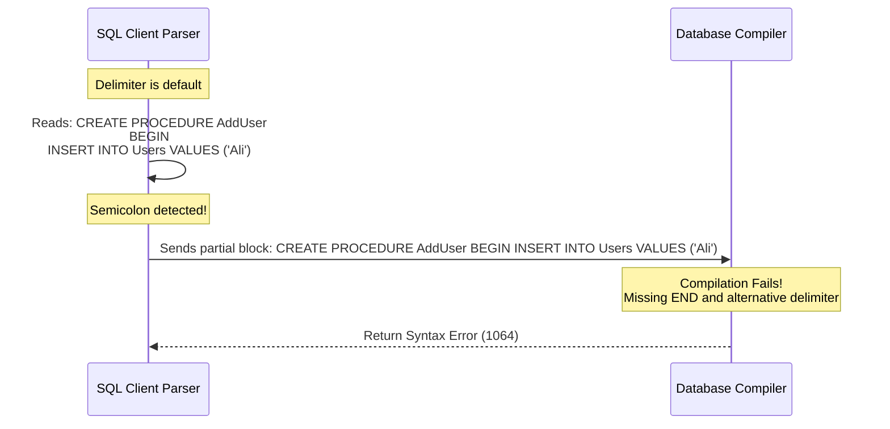

### The Procedural Conflict
Stored procedures, functions, and triggers are composed of nested statements, each requiring a terminating semicolon.

If you attempt to execute the following block without altering the client-side parsing behavior:

```sql
CREATE PROCEDURE InsertAndAudit()
BEGIN
    INSERT INTO users (name) VALUES ('Ali'); -- Client stops reading here!
    INSERT INTO audit_log (action) VALUES ('User Ali added');
END;
```

The client parser will read up to `INSERT INTO users (name) VALUES ('Ali');`. It will treat this statement as the end of the DDL definition, sending a truncated code segment to the compiler. The compiler will reject this with a syntax error, as the `BEGIN` block lacks its corresponding `END`.

### The `DELIMITER` Directive
To solve this issue, we must instruct the SQL client parser to temporarily ignore semicolons within procedural blocks. This is done using the `DELIMITER` directive. 

This directive tells the client parser to use a different sequence (such as `//` or `$$`) to identify the absolute end of the DDL block.

```sql
-- 1. Instruct the client parser to ignore ';' and split blocks only on '$$'
DELIMITER $$

-- 2. Define the procedure. Semicolons inside are ignored by the client parser.
CREATE PROCEDURE InsertAndAudit()
BEGIN
    INSERT INTO users (name) VALUES ('Ali');
    INSERT INTO audit_log (action) VALUES ('User Ali added');
END $$ -- 3. The parser sees '$$' and sends the entire block to the server.

-- 4. Restore the default statement terminator
DELIMITER ;
```

> [!IMPORTANT]
> The `DELIMITER` command is a client-side directive used by command-line interfaces and design tools. It is not an executable SQL statement. Database abstraction layers (such as JDBC, PDO, or ADO.NET) compile program strings directly without needing delimiters.

---

## 3. State Management: Variables and Scopes

State management in procedural SQL requires defining variables with appropriate lifecycles, scopes, and memory structures.

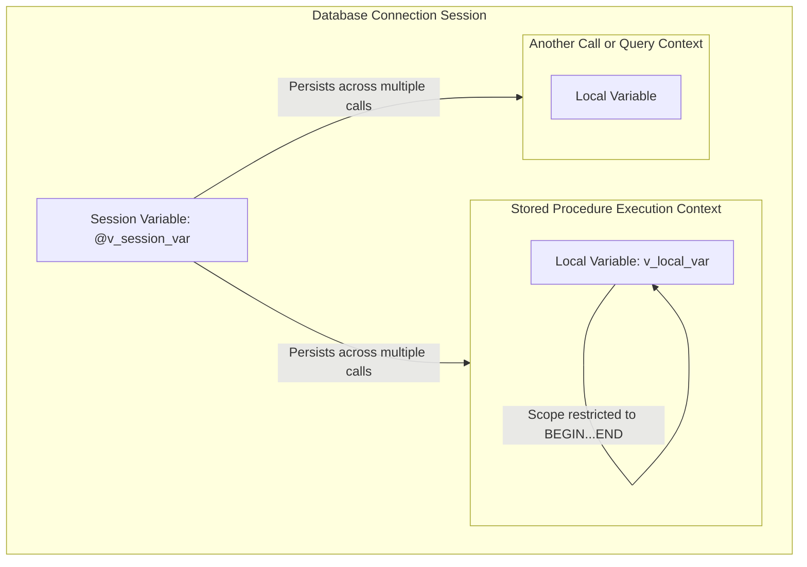

### Local Variables (`DECLARE`)
Local variables are strongly typed, declared explicitly at the start of a `BEGIN...END` block, and exist only during the execution of that specific block.

* **Syntax:** `DECLARE variable_name data_type [DEFAULT default_value];`
* **Allocation:** Allocated on the thread's execution stack when the block is entered.
* **Deallocation:** Automatically reclaimed from memory when execution leaves the block's `END` boundary.
* **Access Control:** Isolated from concurrent database sessions and nested outer contexts.

```sql
BEGIN
    DECLARE v_limit INT DEFAULT 100;
    DECLARE v_name VARCHAR(50);
    
    -- Sub-block (nested scope)
    BEGIN
        DECLARE v_nested_score DECIMAL(5,2);
        -- Inner block can access v_limit and v_name
        SET v_nested_score = v_limit * 0.95;
    END;
    -- v_nested_score is no longer accessible here
END;
```

### User-Defined Session Variables (`@var`)
Session variables (also called user variables) are loosely typed, connection-specific variables that persist across statements for the lifetime of the database connection.

* **Syntax:** `SET @variable_name = value;`
* **Declaration:** No explicit declaration is needed. They are dynamically initialized on first assignment. If referenced before assignment, they return `NULL`.
* **Scope:** Global to the current database session (connection). They are invisible to other concurrent user sessions.
* **Typing:** Weakly and dynamically typed. A session variable can hold an integer, then be reassigned to a string or date.

### System Variables (Global vs. Session)
System variables control the behavior of the database instance.
* **Session System Variables:** Configure behaviors for the current connection (e.g., `SET SESSION sql_mode = 'STRICT_TRANS_TABLES';`).
* **Global System Variables:** Configure global behaviors across all connections (e.g., `SET GLOBAL max_connections = 1000;`). Modifying these usually requires administrator privileges.

### Variable Comparison Table

| Property | Local Variables (`DECLARE`) | Session Variables (`@var`) | System Variables (`@@var`) |
| :--- | :--- | :--- | :--- |
| **Prefix Requirement** | No prefix | Must start with `@` | Must start with `@@` (or use system syntax) |
| **Declaration Scope** | Only inside `BEGIN...END` blocks | Anywhere within a session | Global or Session system-wide |
| **Lifespan** | Duration of the enclosing block | Duration of the database connection | Until instance restarts (unless persisted) |
| **Type Checking** | Strongly and statically typed | Weakly and dynamically typed | Strongly typed |
| **Declaration Statement**| Explicit `DECLARE` required | Dynamic assignment | Modified via `SET GLOBAL` or `SET SESSION` |
| **Default Value** | `NULL` (unless `DEFAULT` is declared)| `NULL` | Pre-configured by engine defaults |

### Assignment Syntax and Pitfalls
There are two ways to assign values to variables:

#### 1. Using the `SET` Statement
```sql
SET v_local_var = 10;
SET @v_session_var = 'Airlines';
```

#### 2. Using `SELECT ... INTO`
This approach assigns values directly from a query result.

```sql
SELECT COUNT(*) INTO v_pilot_count 
FROM Pilote 
WHERE comp = 'AF';
```

> [!WARNING]
> When using `SELECT ... INTO`, the query **must return exactly one row**. 
> * If the query returns **zero rows**, the database engine raises a `NOT FOUND` exception (SQLSTATE `02000`), terminating execution unless a handler is registered.
> * If the query returns **multiple rows**, the engine raises a `TOOMANYROWS` exception (SQLSTATE `21000`), causing a runtime crash.
> Always use aggregate functions (like `COUNT`, `SUM`) or apply limiting conditions (such as `LIMIT 1` or filtering on primary keys) to guarantee a single-row result.

---

## 4. Procedural Control Structures

Control structures allow you to implement complex logic, routing, and loops inside the database engine.

### Conditional Logic
Procedural SQL supports multi-branch decision-making using `IF-THEN-ELSE` and `CASE` structures.

#### `IF-THEN-ELSEIF-ELSE`
```sql
IF v_flight_hours > 5000 THEN
    SET v_rank = 'Senior Captain';
ELSEIF v_flight_hours BETWEEN 1500 AND 5000 THEN
    SET v_rank = 'First Officer';
ELSE
    SET v_rank = 'Junior Cadet';
END IF;
```

#### Search `CASE` Statement
A cleaner alternative for managing multiple distinct condition branches:

```sql
CASE 
    WHEN v_flight_hours > 5000 THEN SET v_rank = 'Senior Captain';
    WHEN v_flight_hours BETWEEN 1500 AND 5000 THEN SET v_rank = 'First Officer';
    ELSE SET v_rank = 'Junior Cadet';
END CASE;
```

### Iterative Structures
Loops allow you to execute logic repeatedly. MySQL Procedural SQL supports three loop types:

#### 1. The `WHILE` Loop (Pre-tested Condition)
Executes as long as the evaluation condition remains true. The condition is checked *before* entering the loop body.

```sql
DECLARE v_counter INT DEFAULT 0;

WHILE v_counter < 10 DO
    SET v_counter = v_counter + 1;
END WHILE;
```

#### 2. The `REPEAT` Loop (Post-tested Condition)
Executes the loop body first, then evaluates the test condition. This guarantees the loop body runs **at least once**.

```sql
DECLARE v_counter INT DEFAULT 0;

REPEAT
    SET v_counter = v_counter + 1;
UNTIL v_counter >= 10
END REPEAT;
```

#### 3. The Standard `LOOP` (Infinite Loop with Labels and `LEAVE`)
Runs indefinitely until it is explicitly terminated using a flow-control keyword like `LEAVE`.

```sql
DECLARE v_counter INT DEFAULT 0;

counter_loop: LOOP
    SET v_counter = v_counter + 1;
    
    IF v_counter >= 10 THEN
        LEAVE counter_loop; -- Equivalent to 'break'
    END IF;
    
    IF v_counter % 2 = 0 THEN
        ITERATE counter_loop; -- Equivalent to 'continue'
    END IF;
    
    -- Additional logic for odd numbers
END LOOP counter_loop;
```

---

## 5. Subroutines: Stored Procedures vs. User-Defined Functions (UDFs)

Subroutines are reusable procedural modules stored in the database catalog. They are divided into Stored Procedures and User-Defined Functions (UDFs).

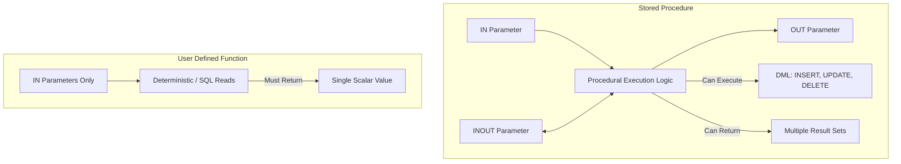

### Stored Procedures
Stored procedures perform operational tasks, manage transactional boundaries, and modify database states.

* **Invocation:** Called explicitly using the `CALL` statement: `CALL GetPilotStats('AF', @total_pilots);`
* **Return Values:** Do not return a direct value. Instead, they pass results back to the caller using `OUT` or `INOUT` parameters, or by generating direct result sets (which are streamed back to the client application as dynamic grids).
* **Transaction Control:** Can initiate, commit, or roll back database transactions (`START TRANSACTION`, `COMMIT`, `ROLLBACK`).

#### Parameter Modes Explained
1. **`IN` (Default):** Passes a read-only value into the procedure. The procedure works with a local copy of this value. Any changes made inside the procedure do not affect the original variable outside.
2. **`OUT`:** Passes an uninitialized variable into the procedure. It enters as `NULL`. The procedure assigns a value to it, which is returned to the caller when the procedure exits.
3. **`INOUT`:** Passes an initialized variable to the procedure. The procedure can read its input value, modify it, and write a new value back to it. This new value is returned to the caller.

### User-Defined Functions (UDFs)
Functions calculate and return a single scalar value. They are designed for computational tasks.

* **Invocation:** Integrated directly into standard SQL queries: `SELECT GetAge(birthdate), GetTax(salary) FROM employees;`
* **Return Values:** Must define a return data type with `RETURNS type` and return a single value using the `RETURN` keyword.
* **Side-Effect Constraints:** To ensure query safety, functions cannot contain statements that modify database state or return active result sets (such as unassigned `SELECT` queries or `INSERT`/`UPDATE`/`DELETE` statements on physical tables).

### Comparison Matrix

| Property | Stored Procedure | Stored Function (UDF) |
| :--- | :--- | :--- |
| **Execution Call** | Standalone statement via `CALL` | Embedded inside SQL expressions |
| **Return Mechanism** | Via zero or more `OUT`/`INOUT` parameters | Via a single scalar `RETURN` value |
| **DML Operations Allowed** | Yes (fully supported) | Restrictive (generally prohibited on physical tables) |
| **Result Sets** | Can return multiple active query grids | Prohibited (cannot return row sets) |
| **Transaction Control** | Can use `COMMIT` and `ROLLBACK` | Prohibited from executing transaction commands |
| **SQL Integration** | Cannot be used inside a `SELECT` statement | Fully integrated within `SELECT`, `WHERE`, `HAVING` |

### Deterministic vs. Non-Deterministic Attributes
When compiling a function, you must declare its execution behavior. This metadata helps the query optimizer make safe, performant decisions.

* **`DETERMINISTIC`:** The function always returns the same output for a given set of input arguments (e.g., mathematical formulas like `SQUARE(x)`).
* **`NOT DETERMINISTIC` (Default):** The function's output can vary between calls, even with the exact same inputs. This happens when the function relies on external states, system clocks, or random number generators (e.g., functions using `NOW()`, `RAND()`, or reading dynamic database rows).

Other classifications include:
* **`CONTAINS SQL`:** The function contains SQL statements but does not read or write data (e.g., executing `SELECT 1 + 1`).
* **`NO SQL`:** The function contains no SQL code.
* **`READS SQL DATA`:** The function reads data from tables (e.g., running `SELECT` queries) but does not modify it.
* **`MODIFIES SQL DATA`:** The function executes DML statements (`INSERT`, `UPDATE`, `DELETE`) to modify tables.

### The Binary Log and Replication Hazard
In distributed database setups using statement-based replication, the master server writes all executed SQL queries to a binary log (`binlog`). The standby (replica) servers then read and replay these queries to keep their data in sync.

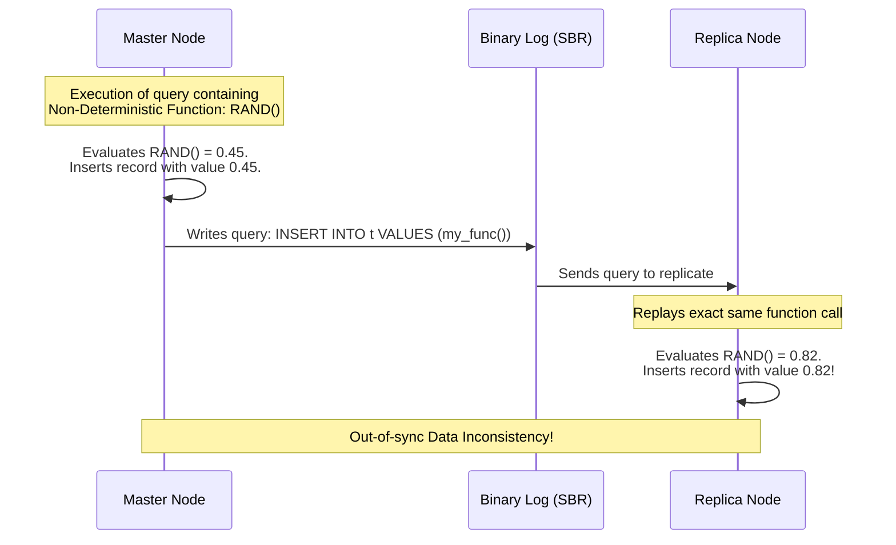

If a master executes a non-deterministic function (e.g., inserting a row with a value calculated from `RAND()`), logging the *statement itself* to the replica causes a problem. When the replica replays the statement, `RAND()` will produce a different value, leading to out-of-sync data between the master and replica.

To prevent this, MySQL enforces strict rules on function creation when binary logging is active.

```
Error 1418: This function has none of DETERMINISTIC, NO SQL, or READS SQL DATA in its declaration and binary logging is enabled (you *might* want to use the less safe log_bin_trust_function_creators variable)
```

#### Resolving the Safety Error
1. **Explicit Declaration:** If the function is deterministic, declare it as such:
   ```sql
   CREATE FUNCTION CalculateTax(v_subtotal DECIMAL(10,2)) 
   RETURNS DECIMAL(10,2)
   DETERMINISTIC
   BEGIN
       RETURN v_subtotal * 0.20;
   END;
   ```
2. **Trust Creators Override:** If you must deploy a non-deterministic function and understand the replication risks (or are using Row-Based Replication `RBR` instead of Statement-Based `SBR`), you can bypass this safety check by changing a system variable:
   ```sql
   SET GLOBAL log_bin_trust_function_creators = 1;
   ```

---

## 6. Error Handling and Exception Control

Robust procedural programs must handle runtime errors gracefully, manage transactions safely, and provide informative feedback when issues arise.

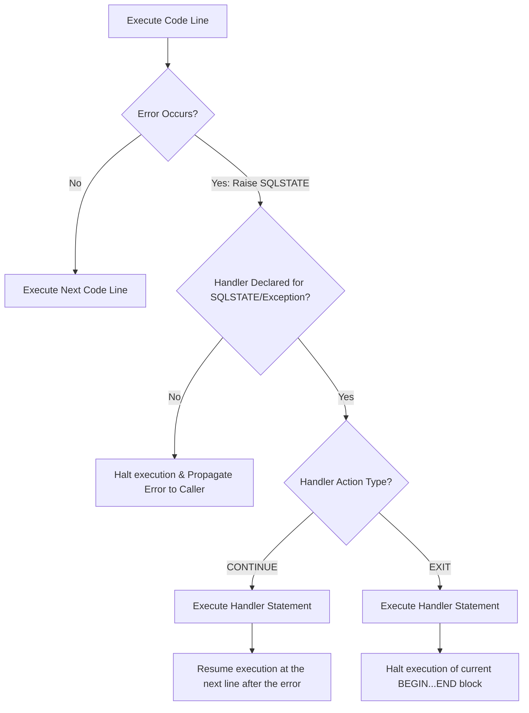

### Sources of Database Errors
1. **Constraint Violations:** Attempts to insert duplicate primary keys (SQLSTATE `23000`), violate foreign key rules, or write `NULL` into restricted columns.
2. **Data Anomalies:** Arithmetic errors (such as division by zero) or string truncations caused by exceeding column lengths.
3. **Resource Issues:** Lock wait timeouts or connection losses.
4. **Business Logic Failures:** Custom errors raised by the application logic (e.g., attempting to withdraw money when the account balance is insufficient).

### Declaring Handlers
Handlers define how the program responds when an error occurs during execution.

* **Syntax:**
  ```sql
  DECLARE handler_action HANDLER FOR condition_value [, condition_value] ... statement;
  ```

#### Handler Actions
* **`CONTINUE`:** Catches the error, executes the handler statement, and then resumes execution at the line immediately following the one that caused the error. This is useful for logging warnings or setting status flags without interrupting the flow of the program.
* **`EXIT`:** Catches the error, executes the handler statement, and immediately terminates execution of the current `BEGIN...END` block. This is ideal for handling critical errors where you need to roll back transactions and exit safely.

#### Condition Values
* **`SQLWARNING`:** Catches warning conditions (SQLSTATE classes starting with `01`).
* **`NOT FOUND`:** Catches data retrieval warnings (SQLSTATE classes starting with `02`). This is commonly used to detect when a cursor has reached the end of its dataset or when a `SELECT INTO` query returns no rows.
* **`SQLEXCEPTION`:** Catches all database error conditions (SQLSTATE classes excluding those starting with `01` or `02`).
* **Specific SQLSTATE:** Targets a precise error code. For example, SQLSTATE `'23000'` specifically handles integrity constraint violations.

### Throwing and Propagating Exceptions (`SIGNAL` and `RESIGNAL`)
You can use `SIGNAL` to raise custom exceptions, and `RESIGNAL` to modify and propagate caught errors up the execution stack.

#### The `SIGNAL` Statement
`SIGNAL` allows you to stop execution and throw a custom error to the calling application, complete with a standardized SQLSTATE and custom message.

```sql
IF v_balance < v_withdrawal_amount THEN
    SIGNAL SQLSTATE '45000'
    SET MESSAGE_TEXT = 'Insufficient Funds: Withdrawal amount exceeds current balance';
END IF;
```

> [!NOTE]
> SQLSTATE class `'45000'` is the industry standard code for user-defined, generic exceptions.

#### The `RESIGNAL` Statement
`RESIGNAL` is used within an error handler. It catches an exception, performs cleanup actions (such as logging or rolling back transactions), and then passes the exception up to the caller so they are notified of the failure.

```sql
DECLARE EXIT HANDLER FOR SQLEXCEPTION
BEGIN
    -- 1. Roll back changes to keep data consistent
    ROLLBACK;
    -- 2. Log the failure to an audit table
    INSERT INTO error_log (log_time, error_desc) VALUES (NOW(), 'Transaction aborted');
    -- 3. Pass the exception back up to the calling application
    RESIGNAL;
END;
```

### Standardized SQLSTATE Class Codes

| SQLSTATE Class Code | Meaning | Typical Scenario |
| :--- | :--- | :--- |
| **`00000`** | Success | Query executed with no issues |
| **`01000`** | General Warning | Data truncated during insert |
| **`02000`** | Not Found | Cursor has no more rows, or `SELECT INTO` returned nothing |
| **`23000`** | Integrity Constraint Violation | Duplicate key entered, or foreign key check failed |
| **`45000`** | Generic User-Defined Exception | Custom validation error thrown by business logic |

### Best Practice: Transaction Control and Handler Architecture
When writing procedures that modify data, organize your code to separate variable declarations, handler setups, and transaction logic.

```sql
CREATE PROCEDURE RegisterBooking(
    IN p_pilot_id INT, 
    IN p_flight_id INT,
    OUT p_status_msg VARCHAR(100)
)
BEGIN
    -- 1. Declare local state variables
    DECLARE v_already_booked INT DEFAULT 0;
    DECLARE v_tx_error INT DEFAULT 0;
    
    -- 2. Set up exception handlers
    -- If a database exception occurs, record the error and continue to the rollback phase
    DECLARE CONTINUE HANDLER FOR SQLEXCEPTION SET v_tx_error = 1;
    
    -- 3. Run validation checks before starting the transaction
    SELECT COUNT(*) INTO v_already_booked 
    FROM Bookings 
    WHERE pilot_id = p_pilot_id AND flight_id = p_flight_id;
    
    IF v_already_booked > 0 THEN
        SIGNAL SQLSTATE '45000'
        SET MESSAGE_TEXT = 'Pilot is already assigned to this flight.';
    END IF;
    
    -- 4. Start the transaction
    START TRANSACTION;
    
    -- Perform database updates
    INSERT INTO Bookings (pilot_id, flight_id, booking_date) 
    VALUES (p_pilot_id, p_flight_id, NOW());
    
    UPDATE Pilote 
    SET nbHVol = nbHVol + 2.50 
    WHERE brevet = p_pilot_id;
    
    -- 5. Commit or Roll Back based on the transaction status
    IF v_tx_error = 1 THEN
        ROLLBACK;
        SET p_status_msg = 'Transaction failed. All changes rolled back.';
    ELSE
        COMMIT;
        SET p_status_msg = 'Booking registered successfully.';
    END IF;
END;
```

---

## 7. Cursors: Row-by-Row Processing

SQL is fundamentally designed to work with *sets* of data. However, there are times when you need to process rows individually, executing complex calculations or calling external systems for each record. Cursors bridge this gap by letting you step through a query's results row-by-row.

### Implicit vs. Explicit Cursors

#### Implicit Cursors
Every time you run a single DML statement (`INSERT`, `UPDATE`, `DELETE`) or a `SELECT INTO` query, the database engine creates an implicit cursor behind the scenes to track its state. You can monitor the execution of the most recent implicit cursor using these attributes:

* `SQL%FOUND`: Returns true if the query affected or retrieved at least one row.
* `SQL%NOTFOUND`: Returns true if the query did not affect any rows.
* `SQL%ROWCOUNT`: Returns the total number of rows affected by the statement.

#### Explicit Cursors
For queries that return multiple rows, you must declare an explicit cursor to manage and step through the active dataset in memory.

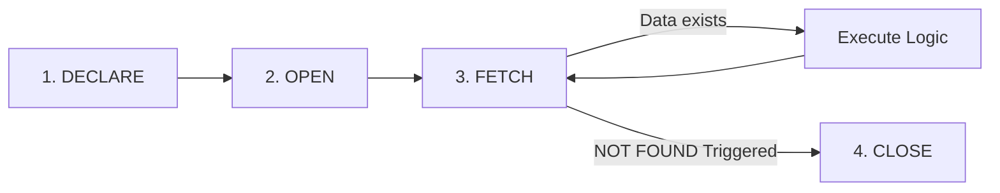

### The 4-Step Explicit Cursor Lifecycle
1. **`DECLARE`:** Defines the cursor's name and its associated `SELECT` query. No resources are allocated yet.
   ```sql
   DECLARE pilot_cursor CURSOR FOR 
       SELECT brevet, nom, nbHVol FROM Pilote WHERE comp = 'AF';
   ```
2. **`OPEN`:** Executes the query, retrieves the matching rows, and reserves memory (the active set) to hold the results.
   ```sql
   OPEN pilot_cursor;
   ```
3. **`FETCH`:** Pulls the data from the current row into local variables and advances the internal row pointer to the next record.
   ```sql
   FETCH pilot_cursor INTO v_brevet, v_nom, v_hours;
   ```
4. **`CLOSE`:** Frees the reserved memory. Once closed, you cannot fetch data from the cursor again without reopening it.
   ```sql
   CLOSE pilot_cursor;
   ```

### Concurrency Control: Cursor Locking (`FOR UPDATE` and `WHERE CURRENT OF`)
When looping through rows with the intention of updating or deleting them, you need to ensure that no other transactions modify those records while your cursor is processing them. This is managed using row-level locking.

#### The `FOR UPDATE` Clause
Adding `FOR UPDATE` to your cursor's query puts an **Exclusive Lock (X-Lock)** on the matching rows as soon as the cursor is opened. This prevents other connections from modifying or acquiring locks on these rows until your transaction finishes.

```sql
DECLARE cur_pilotes CURSOR FOR 
    SELECT brevet, nbHVol FROM Pilote WHERE comp = 'AF' FOR UPDATE;
```

#### The `WHERE CURRENT OF` Statement
In databases like Oracle PL/SQL, you can update or delete the row your cursor is currently pointing to by using the `WHERE CURRENT OF` clause. This tells the database to modify the exact row last retrieved by the `FETCH` statement, without needing to match its primary key again.

```sql
UPDATE Pilote 
SET nbHVol = nbHVol + 10 
WHERE CURRENT OF cur_pilotes;
```

> [!NOTE]
> Since MySQL does not natively support the `WHERE CURRENT OF` syntax, you achieve the same result by storing the row's primary key in a variable during the `FETCH` and using that key in your `UPDATE` or `DELETE` statement.

---

## 8. Dynamic SQL

Standard SQL requires query structures to be known and validated when the program is compiled. However, some scenarios require building and executing queries on the fly at runtime. This is known as **Dynamic SQL**.

```mermaid
graph TD
    subgraph Compilation Phase
        StaticCode[Static SQL Checked at Compile Time]
    end
    subgraph Execution Phase (Runtime)
        DS_String[1. Build SQL String: 'UPDATE Table SET Col = ?']
        DS_Prep[2. PREPARE Statement from String]
        DS_Exec[3. EXECUTE Statement USING Bind Variables]
        DS_Dealloc[4. DEALLOCATE PREPARE to Free Memory]
        
        DS_String --> DS_Prep --> DS_Exec --> DS_Dealloc
    end
```

### Static SQL vs. Dynamic SQL
* **Static SQL:** The query structure is fully defined when the code is compiled. The compiler checks that tables and columns exist, verifies data types, and generates an optimized execution plan ahead of time.
* **Dynamic SQL:** The SQL statement is built as a text string while the program is running. It is compiled, optimized, and executed on the fly. This is useful when database object names (like table or column names) are determined dynamically by user input or runtime conditions.

### Dynamic Compilation and Prep Commands
In MySQL, Dynamic SQL is implemented using the `PREPARE`, `EXECUTE`, and `DEALLOCATE PREPARE` statements.

```sql
CREATE PROCEDURE DeleteRowDynamic(IN p_table_name VARCHAR(64), IN p_row_id INT)
BEGIN
    -- 1. Build the SQL statement as a text string
    -- Note: Object names (like table names) cannot be parameterized using bind arguments.
    SET @v_sql = CONCAT('DELETE FROM ', p_table_name, ' WHERE id = ?');
    
    -- 2. Compile and optimize the statement string
    PREPARE stmt_dynamic FROM @v_sql;
    
    -- 3. Execute the statement, passing values into the parameter placeholders (?)
    SET @v_param_id = p_row_id;
    EXECUTE stmt_dynamic USING @v_param_id;
    
    -- 4. Clean up and free the compiled statement's memory
    DEALLOCATE PREPARE stmt_dynamic;
END;
```

### Security and SQL Injection Risks
Dynamic SQL can open security vulnerabilities if not implemented carefully. The main risk is **SQL Injection**, which occurs when untrusted user input is directly concatenated into a dynamic SQL string instead of using parameterized inputs.

#### Vulnerable Code Example (High Risk)
```sql
-- Direct string concatenation is vulnerable to SQL injection
SET @v_sql = CONCAT('SELECT * FROM Users WHERE username = ''', p_user_input, '''');
PREPARE stmt FROM @v_sql;
EXECUTE stmt; -- If p_user_input is "admin' OR '1'='1", the execution plan is compromised!
```

#### Secure Code Example (Using Bind Variables)
To write secure dynamic queries, always use bind parameters (`?`) for values and pass data safely using the `USING` clause.

```sql
-- Parameterize values using '?' placeholders
SET @v_sql = 'SELECT * FROM Users WHERE username = ?';
PREPARE stmt FROM @v_sql;
SET @v_username = p_user_input;
EXECUTE stmt USING @v_username; -- Safely treated as a literal value, preventing injection
DEALLOCATE PREPARE stmt;
```

---

## 9. Deep-Dive Solved Exercises

### Exercise 1: Scalar Function (`EffectifsHeure`)

#### Business Requirement
Write a stored function named `EffectifsHeure` that counts the number of pilots in a company who have logged more than a specified number of flight hours.
* **Filter Conditions:**
  * If a company code is provided, count only the pilots within that specific company.
  * If the company parameter is passed as `NULL`, count all pilots across the entire database who meet the flight hour threshold.

#### Database Schema Reference
* `Compagnie (comp VARCHAR(4), nom VARCHAR(30), ...)`
* `Pilote (brevet VARCHAR(6), nom VARCHAR(15), nbHVol DECIMAL(7,2), comp VARCHAR(4))`

#### Procedural Implementation
```sql
DELIMITER $$

CREATE FUNCTION EffectifsHeure(
    pcomp VARCHAR(4),
    pheuresVol DECIMAL(7,2)
) 
RETURNS SMALLINT
DETERMINISTIC
READS SQL DATA
BEGIN
    -- 1. Declare a local variable to hold the calculated count
    DECLARE v_resultat SMALLINT DEFAULT 0;

    -- 2. Check if the company filter is NULL
    IF (pcomp IS NULL) THEN
        -- Case A: Count all pilots matching the hours threshold across all companies
        SELECT COUNT(*) INTO v_resultat 
        FROM Pilote 
        WHERE nbHVol > pheuresVol;
    ELSE
        -- Case B: Count pilots matching both the hours threshold and the specified company code
        SELECT COUNT(*) INTO v_resultat 
        FROM Pilote 
        WHERE nbHVol > pheuresVol AND comp = pcomp;
    END IF;

    -- 3. Return the calculated value
    RETURN v_resultat;
END $$

DELIMITER ;
```

#### Detailed Execution Walkthrough
Let's trace what happens step-by-step when the function is called with specific parameters:

##### Execution Scenario 1: `SELECT EffectifsHeure('AF', 1500.00);`
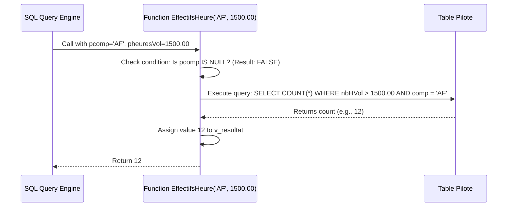

##### Execution Scenario 2: `SELECT EffectifsHeure(NULL, 2000.00);`
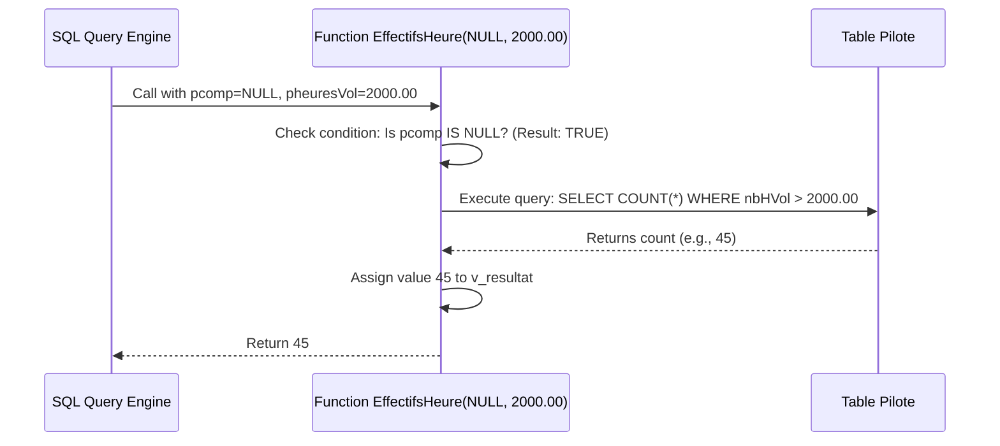

#### Key Considerations & Best Practices
* **Function Optimization:** The function is declared as `DETERMINISTIC` and `READS SQL DATA`. This tells the query optimizer that the function is safe to call inline within wider queries, and will not modify database state.
* **Handling NULL Safely:** Explicitly checking `IF pcomp IS NULL` prevents common comparison issues. In SQL, comparing a value to NULL using an operator like `=` (e.g., `comp = NULL`) always evaluates to `UNKNOWN` rather than `TRUE` or `FALSE`.
* **Database Indexes:** To optimize the performance of this function, ensure there is a compound index on `Pilote(comp, nbHVol)`. This allows the `COUNT(*)` queries to run using quick index-only scans, avoiding slow full table scans.

---

### Exercise 2: Stored Procedure with INOUT (`PlusExperimente`)

#### Business Requirement
Create a stored procedure named `PlusExperimente` that identifies the most experienced pilot (the one with the highest number of flight hours).
* **Behavior:**
  * **Input/Output (`INOUT`):** Passes a company code (`pcomp`) as a filter. If a company is specified, the procedure finds the top pilot within that company. If the input is passed as `NULL`, the procedure finds the top pilot across all companies, and updates the `pcomp` variable with the company code of the pilot who won.
  * **Output (`OUT`):** Returns the winning pilot's name (`pnom`) and their total flight hours (`pheuresVol`).

#### Procedural Implementation
```sql
DELIMITER $$

CREATE PROCEDURE PlusExperimente(
    INOUT pcomp VARCHAR(4),
    OUT pnom VARCHAR(15),
    OUT pheuresVol DECIMAL(7,2)
)
BEGIN
    -- 1. Determine which search branch to execute
    IF (pcomp IS NOT NULL) THEN
        -- Case A: Find the most experienced pilot within the specified company
        SELECT nom, nbHVol INTO pnom, pheuresVol
        FROM Pilote
        WHERE comp = pcomp
        ORDER BY nbHVol DESC
        LIMIT 1;
    ELSE
        -- Case B: Find the overall most experienced pilot and update pcomp with their company code
        SELECT nom, nbHVol, comp INTO pnom, pheuresVol, pcomp
        FROM Pilote
        ORDER BY nbHVol DESC
        LIMIT 1;
    END IF;
END $$

DELIMITER ;
```

#### Detailed Execution Walkthrough
Let's look at how the variable bindings and values change during execution:

##### Call Protocol: Calling for a Specific Company
```sql
-- 1. Initialize a session variable with the target company code
SET @v_comp = 'AF';

-- 2. Execute the procedure, passing the session variable to the INOUT parameter
CALL PlusExperimente(@v_comp, @v_name, @v_hours);

-- 3. Inspect the returned values
SELECT @v_comp, @v_name, @v_hours;
```

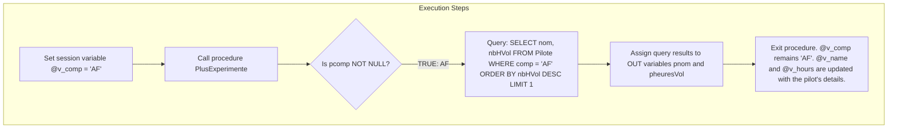

##### Call Protocol: Calling Globally (Finding the Overall Top Pilot)
```sql
-- 1. Initialize the company variable to NULL to search globally
SET @v_comp = NULL;

-- 2. Execute the procedure
CALL PlusExperimente(@v_comp, @v_name, @v_hours);

-- 3. Inspect the results. @v_comp will be updated with the winner's company code.
SELECT @v_comp, @v_name, @v_hours;
```

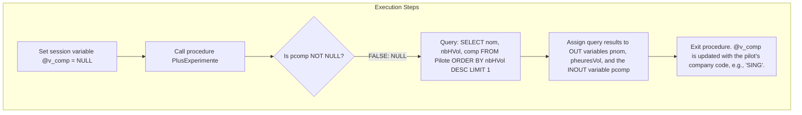

#### Key Considerations & Best Practices
* **Limiting Query Results:** Using `ORDER BY nbHVol DESC LIMIT 1` is an efficient way to find the record with the maximum value. It allows the database engine to quickly identify the top record and avoids the need for slower subqueries like `WHERE nbHVol = (SELECT MAX(nbHVol)...)`.
* **Ensuring Index Support:** To make this query run as quickly as possible, ensure there is an index on the `nbHVol` column. This allows the database engine to find the top pilot with a quick index order scan, avoiding a full table sort.
* **Handling Empty Tables:** If the table is empty, the `SELECT ... INTO` query will return zero rows and trigger a `NOT FOUND` exception. In production environments, add an exception handler or verify the table has data first to prevent the procedure from crashing.

---

### Exercise 3: Recursive Function (Factorial)

#### Business Requirement
Write a recursive function named `factorielle` that calculates the factorial of a positive integer ($n!$).

$$\text{Factorial Definition: } n! = \begin{cases} 1 & \text{if } n \leq 1 \\ n \times (n-1)! & \text{if } n > 1 \end{cases}$$

#### Procedural Implementation
```sql
DELIMITER $$

CREATE FUNCTION factorielle(n INT) 
RETURNS INT
DETERMINISTIC
BEGIN
    -- Base Case: If n is 1 or less, return 1
    IF n <= 1 THEN
        RETURN 1;
    ELSE
        -- Recursive Step: Multiply n by the factorial of (n - 1)
        RETURN n * factorielle(n - 1);
    END IF;
END $$

DELIMITER ;
```

#### Detailed Call Stack Trace for $n = 4$
Let's step through the recursive execution of `factorielle(4)`:

```mermaid
graph TD
    Level1[Call: factorielle(4)] --> Level2[Evaluate: 4 * factorielle(3)]
    Level2 --> Level3[Evaluate: 3 * factorielle(2)]
    Level3 --> Level4[Evaluate: 2 * factorielle(1)]
    Level4 --> Level5[Base Case: factorielle(1) returns 1]
    Level5 -->|Returns 1| Level4
    Level4 -->|Returns 2 * 1 = 2| Level3
    Level3 -->|Returns 3 * 2 = 6| Level2
    Level2 -->|Returns 4 * 6 = 24| Level1
```

#### Engine Limitations & Safety Safeguards
Recursive functions can consume significant resources. Each nested call adds a new layer to the database execution stack, consuming thread memory. If left unchecked, deep recursion can lead to server crashes or stack overflow errors.

To safeguard system resources, databases impose strict controls on recursive routines:

* **MySQL Limitations:** By default, MySQL restricts recursive functions to prevent system abuse. Attempting to execute recursive functions on older or default configurations may result in a compilation error:
  ```
  Error 1424: Recursive stored functions and triggers are not allowed.
  ```
* **Stored Procedure Alternative:** While recursive *functions* are heavily restricted, you can implement recursive *stored procedures*. This recursion depth is governed by a system variable:
  ```sql
  -- Check or raise the allowed recursion depth before running recursive procedures
  SET max_sp_recursion_depth = 255;
  ```
* **Performance Best Practice:** For performance-critical calculations, iterative loops (`WHILE`, `LOOP`) are generally preferred over recursion. Iterative solutions execute within a single memory frame, avoiding stack overhead and running much faster.

---

### Exercise 4: Basic Cursor Implementation (`total_hvol_AF`)

#### Business Requirement
Write a stored procedure named `total_hvol_AF` that calculates the sum of all flight hours for pilots working at company `'AF'`.
* **Design Constraint:** Do not use the SQL `SUM()` aggregate function. Instead, use an explicit cursor to loop through the records and calculate the sum procedurally.

#### Procedural Implementation
```sql
DELIMITER $$

CREATE PROCEDURE total_hvol_AF()
BEGIN
    -- 1. Declare local variables for calculations
    DECLARE v_done INT DEFAULT FALSE;
    DECLARE v_nbHv DECIMAL(7,2);
    DECLARE v_total DECIMAL(10,2) DEFAULT 0.00;
    
    -- 2. Declare the explicit cursor
    DECLARE cur_pilotes CURSOR FOR 
        SELECT nbHVol FROM Pilote WHERE comp = 'AF';
        
    -- 3. Declare a CONTINUE HANDLER to manage the end of the dataset
    -- When the cursor runs out of rows, the database raises a NOT FOUND warning (SQLSTATE 02000),
    -- which triggers this handler and sets v_done to TRUE.
    DECLARE CONTINUE HANDLER FOR NOT FOUND SET v_done = TRUE;

    -- 4. Open the cursor to run the query and populate the active dataset
    OPEN cur_pilotes;

    -- 5. Start the processing loop
    sum_loop: LOOP
        -- Retrieve the next row's value into our local variable
        FETCH cur_pilotes INTO v_nbHv;
        
        -- Check if the handler set v_done to TRUE, indicating there are no more rows
        IF v_done THEN
            LEAVE sum_loop; -- Exit the loop
        END IF;
        
        -- Accumulate the flight hours
        SET v_total = v_total + v_nbHv;
    END LOOP sum_loop;

    -- 6. Clean up by closing the cursor and freeing memory
    CLOSE cur_pilotes;

    -- 7. Output the final calculation
    SELECT v_total AS 'Total Heures AF';
END $$

DELIMITER ;
```

#### Detailed Execution Walkthrough
Let's trace how the variables and execution state change during the cursor lifecycle. For this trace, assume the `Pilote` table contains the following records for company `'AF'`:

| brevet | comp | nbHVol |
| :--- | :--- | :--- |
| `P01` | `AF` | `1200.00` |
| `P02` | `AF` | `850.50` |

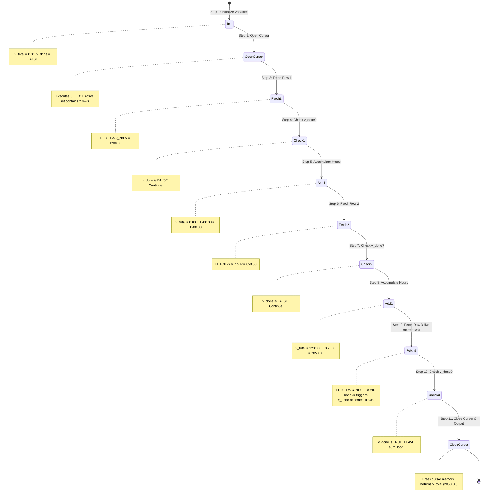

#### Crucial Architectural Guidelines
* **Declaration Order Rule:** In procedural SQL, declarations must follow a strict order. Violating this sequence will result in compilation errors:
  1. Local variables (`DECLARE var_name...`)
  2. Cursors (`DECLARE cursor_name CURSOR FOR...`)
  3. Condition handlers (`DECLARE CONTINUE HANDLER FOR...`)
* **The Loop Terminating Condition Pattern:** Always place your termination check (`IF v_done THEN LEAVE...`) **immediately after** the `FETCH` statement. If you place the calculation step before checking `v_done`, the loop will execute one extra time using stale data from the previous fetch, resulting in incorrect calculations.

---

### Exercise 5: Advanced Cursor with Row-Level Locking and DML (`Gestion_Pilotes`)

#### Business Requirement
Write an administrative database routine named `Gestion_Pilotes` that loops through all pilots and updates their flight hours based on their assigned company:
* **Update Rules:**
  * If the pilot's company is `'AF'`, add `100` flight hours.
  * If the pilot's company is `'SING'`, deduct `100` flight hours.
  * For all other companies, delete the pilot's record from the database.
* **Technical Constraints:**
  * Lock the rows as the cursor processes them to prevent other connections from making concurrent updates.
  * Wrap the entire execution in a transaction to ensure database consistency.

#### Procedural Implementation
```sql
DELIMITER $$

CREATE PROCEDURE Gestion_Pilotes()
BEGIN
    -- 1. Declare state variables
    DECLARE v_done INT DEFAULT FALSE;
    DECLARE v_brevet VARCHAR(6);
    DECLARE v_comp VARCHAR(4);
    DECLARE v_error_flag INT DEFAULT FALSE;
    
    -- 2. Declare the cursor with a FOR UPDATE clause to lock records
    DECLARE cur_pilotes CURSOR FOR 
        SELECT brevet, comp FROM Pilote FOR UPDATE;
        
    -- 3. Declare condition handlers
    -- Handler to detect when the cursor has processed all rows
    DECLARE CONTINUE HANDLER FOR NOT FOUND SET v_done = TRUE;
    
    -- Handler to detect database errors, marking a flag to trigger a rollback
    DECLARE CONTINUE HANDLER FOR SQLEXCEPTION SET v_error_flag = TRUE;

    -- 4. Begin the transaction boundary
    START TRANSACTION;

    -- 5. Open the cursor (this executes the query and locks the rows)
    OPEN cur_pilotes;

    -- 6. Start the processing loop
    pilot_loop: LOOP
        FETCH cur_pilotes INTO v_brevet, v_comp;
        
        -- Exit the loop if there are no more rows or if a database error occurred
        IF v_done OR v_error_flag THEN
            LEAVE pilot_loop;
        END IF;

        -- 7. Execute business logic based on the company code
        IF v_comp = 'AF' THEN
            -- Update AF pilots
            UPDATE Pilote 
            SET nbHVol = nbHVol + 100.00 
            WHERE brevet = v_brevet;
            
        ELSEIF v_comp = 'SING' THEN
            -- Update SING pilots
            UPDATE Pilote 
            SET nbHVol = nbHVol - 100.00 
            WHERE brevet = v_brevet;
            
        ELSE
            -- Delete pilots from other companies
            DELETE FROM Pilote 
            WHERE brevet = v_brevet;
        END IF;
        
    END LOOP pilot_loop;

    -- 8. Close the cursor to free resources
    CLOSE cur_pilotes;

    -- 9. Complete the transaction
    IF v_error_flag THEN
        -- If an error occurred, discard all changes to maintain consistency
        ROLLBACK;
        SELECT 'An error occurred. Execution aborted and all changes were rolled back.' AS Status;
    ELSE
        -- If all updates completed successfully, commit them to disk
        COMMIT;
        SELECT 'Updates completed successfully. Transaction committed.' AS Status;
    END IF;
END $$

DELIMITER ;
```

#### Detailed Architectural Walkthrough
Let's break down the technical patterns used in this procedure:

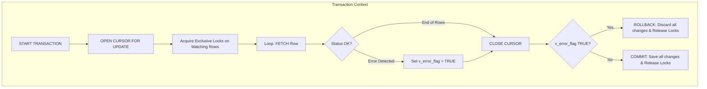

##### 1. Concurrency Control (`FOR UPDATE`)
By defining the cursor with the `FOR UPDATE` clause, the database immediately places an **Exclusive Lock (X-Lock)** on every row returned by the query as soon as `OPEN cur_pilotes` is executed.
* **Why this is important:** This prevents other connections from reading or modifying these rows while our loop is running. This protects against **Lost Updates** or **Phantom Reads** that could occur if another process modified a pilot's company code while this procedure was executing.
* **Release Timing:** These exclusive locks are held for the duration of the transaction and are released only when the transaction is explicitly ended using a `COMMIT` or `ROLLBACK` statement.

##### 2. Transaction Safety (Atomicity)
This procedure uses an **All-or-Nothing** transaction pattern. By wrapping the logic within a `START TRANSACTION` boundary and monitoring execution using a `SQLEXCEPTION` handler, we ensure that the database remains in a consistent state. If any single update or delete statement fails (for example, if a database error occurs or a connection is lost), the procedure catches the failure, exits the loop, and rolls back every change made during the run.

##### 3. Processing Updates Safely
Because MySQL does not support the `WHERE CURRENT OF` cursor clause, the procedure achieves the same result by fetching the primary key (`brevet`) into a local variable (`v_brevet`) and using it as a precise filter in the `UPDATE` and `DELETE` statements. This guarantees that only the exact row currently being processed is modified.