    Chapter 1: Conceptual and Logical Database Design
        1.1 Conceptual Design: Entity Association Modeling and Inheritance
        1.2 Functional Dependencies and Normalization Theory

    Chapter 2: Relational Algebra and Query Optimization
        2.1 Relational Algebra Fundamentals
        2.2 Query Optimization Heuristics and Cost Analysis
        2.3 Physical Database Tuning, Indexing, and Access Paths

    Chapter 3: Advanced SQL and Procedural Database Programming
        3.1 Advanced SQL: Constraints, Views, and Data Control
        3.2 Procedural SQL: Functions, Procedures, Cursors, and Triggers

    Chapter 4: Transaction Management, Concurrency, and Crash Recovery
        4.1 Transaction Lifecycle and ACID Properties
        4.2 Concurrency Control and Isolation Levels
        4.3 Database Crash Recovery Mechanisms


```

---

## Chapter 1: Conceptual and Logical Database Design

Database design operates in progressive phases, transforming real-world business requirements into a robust physical implementation. This chapter covers conceptual design patterns and the mathematical foundations of normalization.

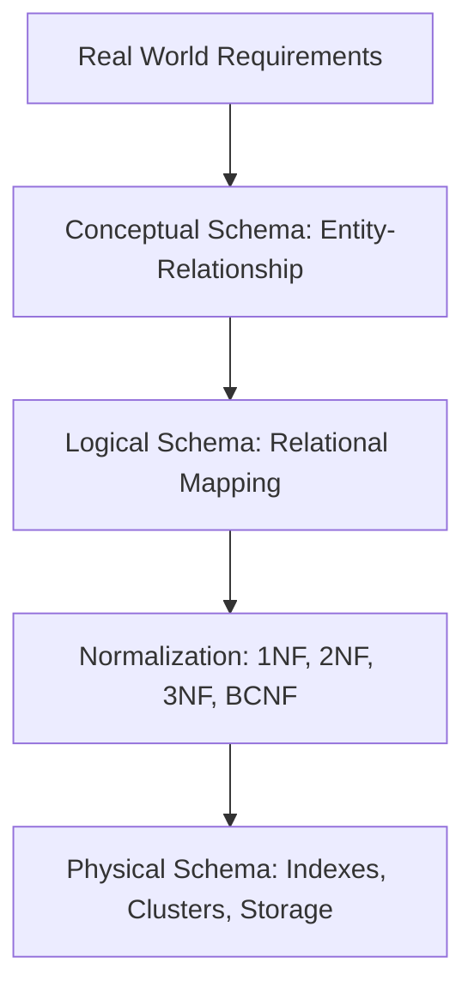

---

### 1.1 Conceptual Design: Entity Association Modeling and Inheritance

Conceptual modeling translates business rules into graphical Entity-Association (E-A) diagrams. Two advanced structural patterns must be mastered: **Reflexive Relationships** and **Generalization/Specialization (Inheritance)**.

#### Reflexive Relationships (Self-Association)
A reflexive relationship occurs when an association connects an entity type to itself. This is common when modeling social graphs (friendships, enmities) or hierarchical structures (organizational charts, family trees).

##### Case Study: The Reception System
An event planning database must track guests (`PERSONNES`), their preferences, and their social dynamics to optimize seating arrangements.
*   **Entities**:
    *   `PERSONNES` (<u>Nom, Prénom</u>, Sexe, Age, Profession)
    *   `RECEPTIONS` (<u>DateReception</u>)
    *   `PLATS` (<u>NomPlat</u>, Nature)
    *   `TYPE_VINS` (<u>Region, Type</u>)
*   **Associations**:
    *   `EST_INVITE` (Personnes $0,N$ — $1,N$ Receptions)
    *   `EST_SERVI` (Plats $0,N$ — $1,N$ Receptions)
    *   `VA_AVEC` (Plats $0,N$ — $0,N$ Type_Vins)
    *   `APPRECIE` / `DETESTE` (Personnes $0,N$ — $0,N$ Plats)
    *   `AMIS` / `ENNEMIS` (Personnes $0,N$ — $0,N$ Personnes) [Reflexive]

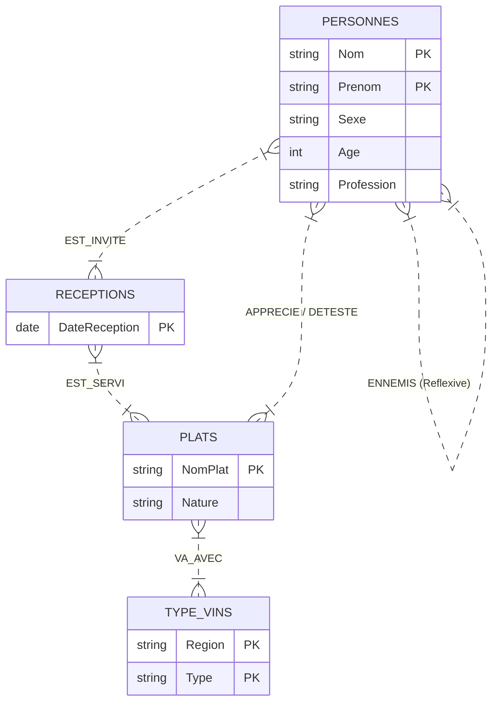

In the physical relational schema, reflexive $N:M$ associations generate separate junction tables containing duplicate foreign keys referencing the same parent table:
```sql
CREATE TABLE AMIS (
    Nom_Pers1 VARCHAR(50),
    Prenom_Pers1 VARCHAR(50),
    Nom_Pers2 VARCHAR(50),
    Prenom_Pers2 VARCHAR(50),
    PRIMARY KEY (Nom_Pers1, Prenom_Pers1, Nom_Pers2, Prenom_Pers2),
    FOREIGN KEY (Nom_Pers1, Prenom_Pers1) REFERENCES PERSONNES(Nom, Prenom),
    FOREIGN KEY (Nom_Pers2, Prenom_Pers2) REFERENCES PERSONNES(Nom, Prenom)
);
```

#### Modeling Inheritance: Generalization and Specialization
Inheritance structures occur when an entity type (supertype) contains subsets of instances (subtypes) that possess unique attributes or participate in unique associations.

##### Case Study: Airline Personnel Hierarchy
In an airline database, all workers are employees, but flying staff have specific flight hour metrics, and pilots hold specialized licenses.

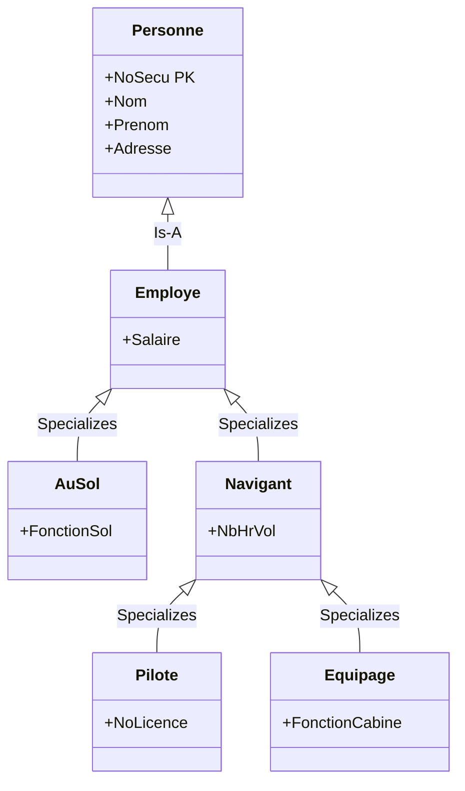

##### Mapping Inheritance to the Relational Model
There are three standard strategies to map generalization/specialization hierarchies into relational tables:

1.  **Class Table Inheritance (Table-Per-Type)**:
    Create a separate table for every single supertype and subtype. Subtype tables share the primary key of the supertype, acting simultaneously as a primary key and a foreign key.
    *   *Pros*: Zero data redundancy; strict enforcement of referential integrity constraints; highly normalized.
    *   *Cons*: Requires multiple expensive `JOIN` operations to reconstruct a complete subtype instance (e.g., retrieving a Pilot's name, salary, flight hours, and license).
    ```sql
    CREATE TABLE PERSONNE (
        NoSecu VARCHAR(15) PRIMARY KEY,
        Nom VARCHAR(50),
        Prenom VARCHAR(50),
        Adresse VARCHAR(100)
    );
    CREATE TABLE EMPLOYE (
        NoSecu VARCHAR(15) PRIMARY KEY REFERENCES PERSONNE(NoSecu),
        Salaire DECIMAL(10,2)
    );
    CREATE TABLE NAVIGANT (
        NoSecu VARCHAR(15) PRIMARY KEY REFERENCES EMPLOYE(NoSecu),
        NbHrVol INT
    );
    CREATE TABLE PILOTE (
        NoSecu VARCHAR(15) PRIMARY KEY REFERENCES NAVIGANT(NoSecu),
        NoLicence VARCHAR(20)
    );
    ```

2.  **Single Table Inheritance (Table-Per-Hierarchy)**:
    Flatten the entire hierarchy into a single table containing all attributes of both the supertype and all subtypes, with a "type discriminator" column.
    *   *Pros*: Fast queries; no `JOIN` operations needed.
    *   *Cons*: Violates normalization rules; requires nullable columns for subtype-specific attributes, preventing the use of `NOT NULL` constraints where they might be logically required.
    ```sql
    CREATE TABLE EMPLOYE_GLOBAL (
        NoSecu VARCHAR(15) PRIMARY KEY,
        Nom VARCHAR(50),
        Prenom VARCHAR(50),
        Adresse VARCHAR(100),
        Salaire DECIMAL(10,2),
        TypeEmploye VARCHAR(10), -- 'SOL', 'PILOTE', 'EQUIPAGE'
        FonctionSol VARCHAR(50) NULL,
        NbHrVol INT NULL,
        NoLicence VARCHAR(20) NULL,
        FonctionCabine VARCHAR(50) NULL
    );
    ```

3.  **Concrete Table Inheritance (Table-Per-Concrete-Class)**:
    Discard the supertype abstraction and create tables only for the leaf concrete subtypes. Each table duplicates the common supertype columns.
    *   *Pros*: Avoids null columns while keeping queries on concrete types fast.
    *   *Cons*: Modifying a common supertype attribute requires altering all concrete tables; queries across all employees require slow `UNION` operations.

---

### 1.2 Functional Dependencies and Normalization Theory

Normalization is the formal process of structuring relational schemas to prevent data redundancy and update anomalies. It is grounded in the mathematical theory of functional dependencies.

#### Mathematical Definitions
*   **Functional Dependency (FD)**: Given a relation schema $R$ and subsets of attributes $X, Y \subseteq R$, a functional dependency $X \to Y$ holds on $R$ if, for any valid instance $r$ of $R$, any two tuples $t_1, t_2 \in r$ that agree on their $X$-values must also agree on their $Y$-values:
    $$\forall t_1, t_2 \in r, \quad t_1[X] = t_2[X] \implies t_1[Y] = t_2[Y]$$
*   **Attribute Closure ($X^+$)**: The set of all attributes functionally determined by $X$ under a set of dependencies $F$:
    $$X^+ = \{ A \in R \mid F \models X \to A \}$$
*   **Candidate Key**: A subset of attributes $K \subseteq R$ is a candidate key if:
    1.  *Uniqueness*: $K^+ = R$ (it determines all attributes in the relation).
    2.  *Minimality*: No proper subset $K' \subset K$ satisfies $K'^+ = R$.

#### Normal Forms Verification

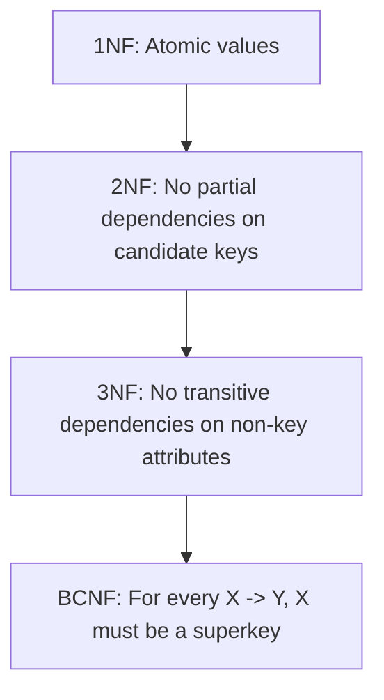

*   **First Normal Form (1NF)**: All attribute domains contain only atomic (indivisible) values, and there are no repeating groups.
*   **Second Normal Form (2NF)**: The relation is in 1NF, and every non-prime attribute (an attribute not belonging to any candidate key) is **fully** functionally dependent on every candidate key. No non-prime attribute depends on a proper subset of a composite candidate key.
*   **Third Normal Form (3NF)**: The relation is in 2NF, and for every non-trivial functional dependency $X \to Y$ in $F$, at least one of the following conditions holds:
    *   $X$ is a superkey of $R$ ($X^+ = R$), OR
    *   $Y$ consists entirely of prime attributes (attributes belonging to a candidate key).
*   **Boyce-Codd Normal Form (BCNF)**: A stronger version of 3NF. A relation is in BCNF if, for every non-trivial functional dependency $X \to Y$, $X$ is a superkey of $R$.

---

#### Worked Normalization Exercises

##### Case Study 1: Apartment Occupancy System
A real-estate system tracks properties and residents.
*   **Attributes**: `Propriétaire (P)`, `Occupant (O)`, `Adresse (A)`, `Noapt (N)`, `Nbpièces (nb1)`, `Nbpersonnes (nb2)`.
*   **Initial FD Set ($F$)**:
    1.  $O \to A$ (An occupant lives at one address)
    2.  $O \to N$ (An occupant lives in a specific apartment number)
    3.  $O \to nb2$ (An occupant group has a registered number of people)
    4.  $A, N \to P$ (An apartment unit has a unique owner)
    5.  $A, N \to O$ (An apartment has a single occupant)
    6.  $A, N \to nb1$ (An apartment has a fixed number of rooms)

###### 1. Elementary FDs and Transitive Closures
Let us calculate the closures of our left-hand side attributes to simplify and structure our dependencies:
*   Calculate $O^+$:
    *   Start: $O^+ = \{O\}$
    *   Apply $O \to A, N, nb2$: $O^+ = \{O, A, N, nb2\}$
    *   Since $A, N \in O^+$, apply $A, N \to P, O, nb1$: $O^+ = \{O, A, N, nb2, P, nb1\}$
    *   Result: $O^+ = \{O, A, N, P, nb1, nb2\}$ (All attributes)
*   Calculate $\{A, N\}^+$:
    *   Start: $\{A, N\}^+ = \{A, N\}$
    *   Apply $A, N \to P, O, nb1$: $\{A, N\}^+ = \{A, N, P, O, nb1\}$
    *   Since $O \in \{A, N\}^+$, apply $O \to nb2$: $\{A, N\}^+ = \{A, N, P, O, nb1, nb2\}$
    *   Result: $\{A, N\}^+ = \{A, N, P, O, nb1, nb2\}$ (All attributes)

###### 2. Identify Potential Keys
Since both $\{O\}^+$ and $\{A, N\}^+$ span the entire attribute set $R$, and neither can be reduced further without losing this property, the relation has two candidate keys:
$$\text{Keys} = \{ \{O\}, \{A, N\} \}$$
The prime attributes (belonging to candidate keys) are: $\{O, A, N\}$.
The non-prime attributes are: $\{P, nb1, nb2\}$.

###### 3. Normal Form Determination
*   **Check 2NF**:
    *   Key $\{O\}$ is a single attribute, so no partial dependency can exist on it.
    *   Key $\{A, N\}$ is composite. We must verify if any non-prime attribute ($P, nb1, nb2$) depends on a proper subset of it ($A$ or $N$ alone).
    *   Since no FDs exist with a left-hand side of $A$ or $N$ alone, there are no partial dependencies.
    *   The relation is in **2NF**.
*   **Check 3NF**:
    *   We evaluate each non-trivial dependency $X \to Y$:
        *   $O \to \{A, N, nb2, P, nb1\}$: The determinant $O$ is a candidate key. (Valid 3NF)
        *   $A, N \to \{P, O, nb1, nb2\}$: The determinant $\{A, N\}$ is a candidate key. (Valid 3NF)
    *   Since the determinant of every non-trivial functional dependency is a superkey, the relation is in **3NF** (and also in **BCNF**).

---

##### Case Study 2: University Courses and Scheduling
A university database schema maps courses, schedules, rooms, and grades.
*   **Attributes**: `C (Cours)`, `P (Prof)`, `H (Heure)`, `S (Salle)`, `E (Etudiant)`, `N (Note)`.
*   **Initial FD Set ($F$)**:
    1.  $C \to P$ (A course has one professor)
    2.  $H, S \to C$ (A room at a specific time hosts one course)
    3.  $H, P \to S$ (A professor at a specific time is in one room)
    4.  $C, E \to N$ (A student gets one grade for a course)
    5.  $H, E \to S$ (A student at a specific time is in one room)

###### 1. Compute Candidate Keys
Let us find the closure of $\{H, E\}$:
*   Start: $\{H, E\}^+ = \{H, E\}$
*   Apply $H, E \to S$ (Rule 5): $\{H, E\}^+ = \{H, E, S\}$
*   Since $\{H, S\} \subseteq \{H, E, S\}$, apply $H, S \to C$ (Rule 2): $\{H, E\}^+ = \{H, E, S, C\}$
*   Since $C \in \{H, E\}^+$, apply $C \to P$ (Rule 1): $\{H, E\}^+ = \{H, E, S, C, P\}$
*   Since $\{C, E\} \subseteq \{H, E, S, C, P\}$, apply $C, E \to N$ (Rule 4): $\{H, E\}^+ = \{H, E, S, C, P, N\}$
*   Result: $\{H, E\}^+$ determines all attributes in the relation. No smaller subset of $\{H, E\}$ can determine the whole relation.
*   Candidate Key: **$\{H, E\}$**.

###### 2. Normal Form Evaluation
*   Prime attributes: $\{H, E\}$.
*   Non-prime attributes: $\{C, P, S, N\}$.
*   Evaluate the dependency $C \to P$:
    *   Is $C$ a superkey? No, $\{C\}^+ = \{C, P\} \neq R$.
    *   Is $P$ a prime attribute? No.
    *   This is a transitive dependency: $\{H, E\} \to C \to P$.
    *   Because a non-prime attribute ($P$) transitively depends on a candidate key through another non-prime attribute ($C$), this relation violates 3NF. It is in **2NF** (since no non-prime attributes depend on a proper subset of $\{H, E\}$), but it is **not in 3NF**.

###### 3. Lossless, Dependency-Preserving Decomposition into 3NF
To resolve this violation, we decompose the schema into smaller relations, ensuring that each step preserves our dependencies and allows us to reconstruct the original dataset without generating spurious tuples.

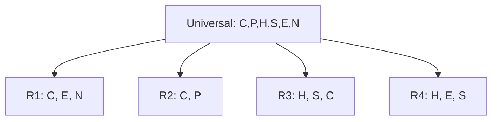

This decomposition gives us:
1.  **`R1` (<u>C, E</u>, N)**: Maps grades. Supported by dependency $C, E \to N$. (In 3NF)
2.  **`R2` (<u>C</u>, P)**: Maps course instructors. Supported by dependency $C \to P$. (In 3NF)
3.  **`R3` (<u>H, S</u>, C)**: Maps room schedules. Supported by dependency $H, S \to C$. (In 3NF)
4.  **`R4` (<u>H, E</u>, S)**: Maps student timetables. Supported by dependency $H, E \to S$. (In 3NF)

*Proof of Lossless Join*: The join of `R1` and `R2` on their common attribute $C$ is lossless because $C$ is a key of `R2` ($C \to P$). This property holds across all the relationships in the decomposition.

---

## Chapter 2: Relational Algebra and Query Optimization

Efficient query processing relies on translating declarative SQL queries into procedural Relational Algebra, rewriting those algebra trees using optimization rules, and executing them using physical access paths.

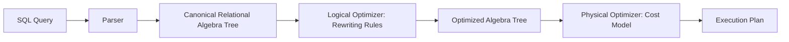

---

### 2.1 Relational Algebra Fundamentals

Relational algebra consists of unary and binary operators that accept relations as input and return a new relation as output.

#### Mathematical Definitions of Operators

| Operator | Symbol | Definition |
| :--- | :---: | :--- |
| **Selection** | $\sigma_p(R)$ | $\{ t \in R \mid p(t) \text{ is true} \}$ |
| **Projection** | $\pi_{A_1, \dots, A_k}(R)$ | $\{ t[A_1, \dots, A_k] \mid t \in R \}$ |
| **Cartesian Product** | $R \times S$ | $\{ (r, s) \mid r \in R \text{ and } s \in S \}$ |
| **Natural Join** | $R \bowtie S$ | Selection of matching attributes over the Cartesian product. |
| **Theta Join** | $R \bowtie_\theta S$ | $\sigma_\theta(R \times S)$ |
| **Division** | $R \div S$ | $\{ t \in \pi_{R-S}(R) \mid \forall s \in S, (t, s) \in R \}$ |

#### Algebraic Equivalence Rules
1.  **Commutativity of Selection**:
    $$\sigma_{p_1}(\sigma_{p_2}(R)) \equiv \sigma_{p_2}(\sigma_{p_1}(R))$$
2.  **Cascading of Selection**:
    $$\sigma_{p_1 \land p_2}(R) \equiv \sigma_{p_1}(\sigma_{p_2}(R))$$
3.  **Commutativity of Theta-Join**:
    $$R \bowtie_\theta S \equiv S \bowtie_\theta R$$
4.  **Pushing Selection Through Join**: If predicate $p$ involves only attributes of $R$:
    $$\sigma_p(R \bowtie S) \equiv (\sigma_p(R)) \bowtie S$$
5.  **Pushing Projection Through Join**: If attributes $A$ are split into $A_R \subseteq R$ and $A_S \subseteq S$:
    $$\pi_{A}(R \bowtie S) \equiv \pi_A(\pi_{A_R \cup \text{JoinKeys}}(R) \bowtie \pi_{A_S \cup \text{JoinKeys}}(S))$$

---

### 2.2 Query Optimization Heuristics and Cost Analysis

Logical optimization applies heuristic rules to restructure algebra trees, reducing the size of intermediate results as early as possible.

#### Logical Optimization Heuristics
1.  **Push Selections Down**: Apply filters immediately on base tables to drop rows before executing joins.
2.  **Push Projections Down**: Remove unused columns early to reduce the memory footprint of intermediate rows.
3.  **Replace Cartesian Products with Joins**: Never compute a raw cross-product ($R \times S$) if a join condition exists.

##### Tree Restructuring Case Study
Find the wagon type for Train #4002.
*   **Relation Schemas**:
    *   `Train` (NoTrain, NoWagon) [60,000 tuples; 2,000 distinct `NoTrain` values]
    *   `Wagon` (NoWagon, TypeWagon, PoidsVide, Capacité, Etat, Gare) [200,000 tuples]
*   **Target Query**:
    ```sql
    SELECT W.TypeWagon FROM Train T, Wagon W WHERE T.NoWagon = W.NoWagon AND T.NoTrain = 4002;
    ```

Here is a comparison of a naive execution plan and an optimized execution plan for this query:

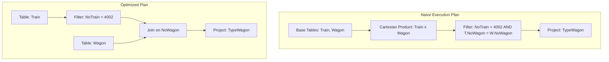

*   **Naive Cost Analysis**:
    1.  Compute $Train \times Wagon$: $60,000 \times 200,000 = 12,000,000,000$ (12 Billion intermediate tuples).
    2.  Filter this massive set for the join keys and the train number. This approach is highly inefficient.
*   **Optimized Cost Analysis**:
    1.  Apply selection $\sigma_{NoTrain=4002}(Train)$. Assuming a uniform distribution, this yields only $\frac{60,000}{2,000} = 30$ tuples.
    2.  Join those 30 tuples with the `Wagon` table. This requires only 30 index lookups on `Wagon`, running in milliseconds.

---

#### Quantitative Cost Modeling (Disk Page I/O)
The physical execution cost of a query plan is measured by the number of disk Page Reads and Writes (I/O operations).

##### Cost Model Hypotheses
*   Table `CINEMA`: $T_1 = 300$ tuples, occupying $B_1 = 30$ pages.
*   Table `HALL`: $T_2 = 1200$ tuples, occupying $B_2 = 120$ pages.
*   *Selection selectivity*: Only 5% of halls have a capacity greater than 150 seats.
*   Memory buffers available: $M = 3$ pages.

##### Case 1: Canonical Plan Cost (Cartesian Product First)
$$\text{Query}: \Pi_{Adresse}(\sigma_{Capacity > 150}(CINEMA \bowtie HALL))$$

Using a block nested-loop join to compute the cross product:
1.  **Read and Join Cost**:
    $$\text{I/O} = B_1 + (B_1 \times B_2) = 30 + (30 \times 120) = 3,630 \text{ Page Reads}$$
    This produces an intermediate result of $300 \times 1200 = 360,000$ tuples. If written to disk, this introduces massive write I/O overhead.
2.  **Apply Selection**: Scans the 360,000 tuples to filter those with capacity $> 150$.

##### Case 2: Optimized Plan Cost (Pushing Selection Down)
$$\text{Query}: \Pi_{Adresse}(CINEMA \bowtie \sigma_{Capacity > 150}(HALL))$$

1.  **Filter `HALL` First**:
    Read `HALL` table (120 pages) and write the filtered pages.
    Since only 5% of halls match the filter, the intermediate relation $HALL_{\sigma}$ occupies:
    $$120 \times 0.05 = 6 \text{ pages}$$
    *   *Step 1 Cost*: $120 \text{ reads} + 6 \text{ writes} = 126 \text{ I/O}$.
2.  **Join $CINEMA$ with $HALL_{\sigma}$**:
    Since $HALL_{\sigma}$ fits in memory ($6 \text{ pages}$ can be managed efficiently with buffers), we read both tables:
    *   *Step 2 Cost*: $30 \text{ reads (CINEMA)} + 6 \text{ reads (} HALL_{\sigma}\text{)} = 36 \text{ I/O}$.
3.  **Total Cost**:
    $$\text{Total I/O} = 126 + 36 = 162 \text{ I/O operations}$$
    This heuristic optimization reduces the disk I/O cost from 3,630 to 162, a **95.5% reduction**.

---

#### Query Execution Cost Modeling
Let us calculate the exact number of CPU instructions required to execute the query `SELECT * FROM T1, T2 WHERE T1.b = T2.b AND T2.b = 1` across three different physical execution plans.

##### Variables and Assumptions
*   $n_1 = |T1| = 100$ tuples, $n_2 = |T2| = 10$ tuples.
*   $n_3$ is the cardinality of the final join result.
*   $n_1'$ is the number of tuples in $T1$ matching $T1.b = 1$.
*   $n_2'$ is the number of tuples in $T2$ matching $T2.b = 1$.
*   We assume a basic implementation where filtering runs as a full scan (such as a `FOR` loop) and joins use a nested loop without index support.

##### Formulation of Plans and Instruction Cost Equations

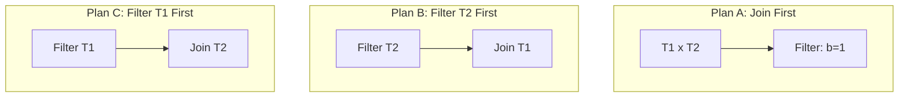

###### Plan A: $\sigma_{T2.b=1}(T1 \bowtie T2)$
1.  **Nested Loop Join**: Compares all pairs from $T1$ and $T2$.
    $$\text{Cost}_{\text{Join}} = n_1 \times n_2 = 100 \times 10 = 1,000 \text{ instructions}$$
    This step produces an intermediate result of size $n_3$.
2.  **Apply Filter**: Scans the join result.
    $$\text{Cost}_{\text{Filter}} = n_3 \text{ instructions}$$
3.  **Total Instruction Cost**:
    $$\text{Total}_A = 1,000 + n_3$$

###### Plan B: $T1 \bowtie \sigma_{b=1}(T2)$
1.  **Filter $T2$ First**:
    $$\text{Cost}_{\text{Filter}} = n_2 = 10 \text{ instructions}$$
    This filter returns $n_2'$ tuples.
2.  **Join $T1$ with $T2_{\sigma}$**:
    $$\text{Cost}_{\text{Join}} = n_2' \times n_1 = n_2' \times 100 \text{ instructions}$$
3.  **Total Instruction Cost**:
    $$\text{Total}_B = 10 + 100n_2'$$

###### Plan C: $T2 \bowtie \sigma_{b=1}(T1)$
1.  **Filter $T1$ First**:
    $$\text{Cost}_{\text{Filter}} = n_1 = 100 \text{ instructions}$$
    This filter returns $n_1'$ tuples.
2.  **Join $T2$ with $T1_{\sigma}$**:
    $$\text{Cost}_{\text{Join}} = n_1' \times n_2 = n_1' \times 10 \text{ instructions}$$
3.  **Total Instruction Cost**:
    $$\text{Total}_C = 100 + 10n_1'$$

##### Evaluation Across Data Distributions (Min, Median, Max)

We evaluate these plans across three data scenarios:
1.  **Minimum Case**: No tuples match the filter ($n_1' = 0, n_2' = 0, n_3 = 0$).
2.  **Median Case**: Half of the tuples match the filter ($n_1' = 50, n_2' = 5, n_3 = 250$).
3.  **Maximum Case**: All tuples match the filter ($n_1' = 100, n_2' = 10, n_3 = 1000$).

| Metric | Plan A Cost ($1000 + n_3$) | Plan B Cost ($10 + 100n_2'$) | Plan C Cost ($100 + 10n_1'$) | Optimal Plan |
| :--- | :---: | :---: | :---: | :---: |
| **Minimum Case** | 1,000 | **10** | 100 | **Plan B** |
| **Median Case** | 1,250 | **510** | 600 | **Plan B** |
| **Maximum Case** | 2,000 | 1,010 | **1,100** (Wait: 1100 vs 1010) | **Plan B** |

##### Mathematical Analysis of Boundary Conditions

To find when Plan B outperforms Plan C, we set up an inequality:
$$\text{Total}_B < \text{Total}_C \implies 10 + 100n_2' < 100 + 10n_1' \implies 10n_2' - n_1' < 9$$

*   When the selectivity of $T2$ is low ($n_2'$ is small), **Plan B** is always the optimal choice.
*   This analysis highlights why query optimizers need access to table statistics (such as histograms) to estimate selectivities before choosing an execution plan.

---

### 2.3 Physical Database Tuning, Indexing, and Access Paths

Physical tuning organizes data on disk to speed up queries, primarily through indexes and specialized storage structures.

#### B-Tree Index Architecture
A B-Tree is a self-balancing search tree that keeps data sorted and allows search, sequential access, insertion, and deletion operations in logarithmic time ($O(\log N)$).

```
                 [ 1007 | 1013 ]                <-- Root Node (Internal)
                /       |       \
               /        |        \
   [1001|1004]     [1007|1010]    [1013|1014|1015] <-- Leaf Nodes (Data/RowIDs)
```

##### B-Tree Construction Example
Construct an index on `EMPLOYEE.SRV_Num` for the following 15 keys: `1001` through `1015`.
*   *Node Constraints*: Leaf nodes hold a maximum of 3 keys. Internal nodes hold a maximum of 5 keys (fan-out $d=5$).

1.  **Leaf Node Partitioning**:
    With 15 elements and a leaf capacity of 3, we create 5 leaf blocks:
    *   `Leaf 1`: `[1001, 1002, 1003]`
    *   `Leaf 2`: `[1004, 1005, 1006]`
    *   `Leaf 3`: `[1007, 1008, 1009]`
    *   `Leaf 4`: `[1010, 1011, 1012]`
    *   `Leaf 5`: `[1013, 1014, 1015]`
2.  **Internal Root Node Assembly**:
    The root node stores search keys that point to these leaf blocks. It uses the lowest key of leaves 2, 3, 4, and 5 as dividers:
    *   `Root keys`: `[1004, 1007, 1010, 1013]`
    *   `Pointers`:
        *   Ptr 0 $\to$ `Leaf 1` (Keys $< 1004$)
        *   Ptr 1 $\to$ `Leaf 2` (Keys $\ge 1004$ and $< 1007$)
        *   Ptr 2 $\to$ `Leaf 3` (Keys $\ge 1007$ and $< 1010$)
        *   Ptr 3 $\to$ `Leaf 4` (Keys $\ge 1010$ and $< 1013$)
        *   Ptr 4 $\to$ `Leaf 5` (Keys $\ge 1013$)

#### Impact of DML Operations on Indexes
*   **INSERT**: Adds a key to the B-Tree. If a node exceeds its capacity, the database engine splits the node and propagates the middle key upward, which can occasionally increase the tree's height.
*   **DELETE**: Removes a key from the B-Tree. If a node falls below its minimum fill factor, the engine merges it with a sibling node.
*   **UPDATE**: Handled as a deletion followed by an insertion. If the updated column is indexed, the key must be moved to its new logical position in the tree.

#### Bulk Loading and Rebuilding Indexes
Massive bulk inserts into an indexed table can trigger frequent node splits, fragmenting the index.
*   *Best Practice*: Drop the index before bulk loading, import the data, and then recreate the index. This approach ensures a balanced, compact index structure and speeds up the import process.

#### Table Access Methods
1.  **Full Table Scan (FTS)**: Reads every data block in the table sequentially. Best for queries retrieving a large percentage of the table's rows.
2.  **Index Scan**: Searches the B-Tree for specific keys, retrieves the corresponding physical row addresses (`RowIDs`), and reads only those specific blocks. Best for highly selective queries.

#### Advanced Optimization Structures

##### 1. Table Clustering (Clustered Tables)
Physically stores related rows from different tables in the same data blocks based on a shared column (the cluster key).

```
Physical Block on Disk:
+-------------------------------------------------------------+
| Department: IT (Key)                                        |
|  -> Employee Row: Sarah (IT)                                |
|  -> Employee Row: John (IT)                                 |
+-------------------------------------------------------------+
```

*   *Implementation*:
    ```sql
    CREATE CLUSTER Dept_Emp_Cluster (Dept_ID INT);
    CREATE INDEX idx_cluster_dept ON CLUSTER Dept_Emp_Cluster;
    
    CREATE TABLE Dept (
        Dept_ID INT PRIMARY KEY,
        Dept_Name VARCHAR(50)
    ) CLUSTER Dept_Emp_Cluster (Dept_ID);
    
    CREATE TABLE Emp (
        Emp_ID INT PRIMARY KEY,
        Emp_Name VARCHAR(50),
        Dept_ID INT REFERENCES Dept(Dept_ID)
    ) CLUSTER Dept_Emp_Cluster (Dept_ID);
    ```
*   *Trade-Offs*:
    *   *Pros*: Drastically reduces I/O for joins on the cluster key.
    *   *Cons*: Slows down insertions and updates; degrades performance for operations scanning only one of the tables.

##### 2. Materialized Views
Pre-computes and physically stores the result of a query on disk.
*   *Pros*: Speeds up complex aggregation queries on large datasets.
*   *Cons*: Stale data; requires maintenance overhead to refresh the view (either on commit or on a schedule).

##### 3. Denormalization
Intentionally introduces redundancy into a normalized schema to avoid expensive joins.
*   *Pros*: Speeds up critical read queries.
*   *Cons*: Introduces update anomalies; requires application logic or triggers to keep the redundant data in sync.

---

## Chapter 3: Advanced SQL and Procedural Database Programming

This chapter shifts focus to execution, covering advanced SQL queries, access control, database views, and server-side procedural programming.

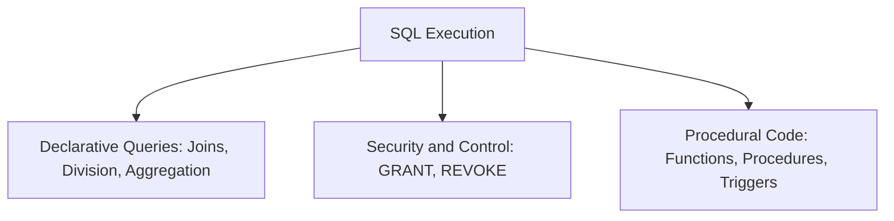

---

### 3.1 Advanced SQL: Constraints, Views, and Data Control

#### Complex Declarative Constraints
Declarative constraints enforce business rules directly at the schema level.

```sql
CREATE TABLE BANK_ACCOUNT (
    Cid INT PRIMARY KEY,
    Cbalance DECIMAL(12,2) NOT NULL,
    Ctype VARCHAR(10) CHECK (Ctype IN ('Checking', 'Savings')),
    CONSTRAINT chk_positive_savings CHECK (
        (Ctype = 'Savings' AND Cbalance >= 0) OR (Ctype = 'Checking')
    )
);
```

#### Relational Division in SQL (Double Negation Pattern)
Relational division answers "all" or "universal" questions (e.g., "Find customers who ordered *all* available products"). It is implemented in SQL using double negation: *"Find customers where there is no product that they have not ordered."*

```sql
-- Find cars (NV) supplied to ALL dealers (NR) in London
SELECT V.NV 
FROM VOITURE V
WHERE NOT EXISTS (
    SELECT R.NR 
    FROM REVEND R 
    WHERE R.VilleR = 'LONDRES'
    AND NOT EXISTS (
        SELECT 1 
        FROM FVR F 
        WHERE F.NR = R.NR 
          AND F.NV = V.NV
    )
);
```

#### Database Views and Security Options
Views act as virtual tables, serving as horizontal or vertical security filters to restrict data access.

```sql
-- Create a secure view for Service A003 personnel details only
CREATE VIEW V_Service_A003 AS
SELECT EMP_Num, EMP_Nom, EMP_Titre, SRV_Num 
FROM EMPLOYE 
WHERE SRV_Num = 'A003'
WITH CHECK OPTION;
```
*   `WITH CHECK OPTION`: Prevents users from updating or inserting rows through the view unless the resulting rows meet the view's filter criteria (e.g., prevents updating an employee's service to 'B004' through this view).

#### Data Control Language (DCL) and Administrative Privileges
DCL commands manage access control policies in the database.

```sql
-- Grant read and write access with delegation authority
GRANT SELECT, UPDATE ON V_Service_A003 TO Manager, Director WITH GRANT OPTION;

-- Revoke permissions, cascading changes through the delegation chain
REVOKE ALL PRIVILEGES ON V_Service_A003 FROM Manager, Director;
```
*   `WITH GRANT OPTION`: Allows the recipient to delegate their granted permissions to other users. Revoking permissions from a delegator cascades and automatically revokes those permissions from all users who received them down the chain.

---

### 3.2 Procedural SQL: Functions, Procedures, Cursors, and Triggers

Procedural extensions (such as PL/SQL or PL/pgSQL) combine the data access power of SQL with control structures like loops, conditionals, and variables.

#### Deterministic Functions
A function is deterministic if it always returns the same output value for a given set of input arguments, without modifying database state.

```sql
DELIMITER //

CREATE FUNCTION CalculateFlightCounts(
    p_comp_code VARCHAR(4),
    p_min_hours DECIMAL(7,2)
) 
RETURNS INT
DETERMINISTIC
READS SQL DATA
BEGIN
    DECLARE v_count INT;
    
    IF p_comp_code IS NULL THEN
        SELECT COUNT(*) INTO v_count 
        FROM Pilote 
        WHERE nbHVol > p_min_hours;
    ELSE
        SELECT COUNT(*) INTO v_count 
        FROM Pilote 
        WHERE nbHVol > p_min_hours 
          AND comp = p_comp_code;
    END IF;
    
    RETURN v_count;
END //

DELIMITER ;
```

#### Recursive Procedural Limits
Most relational database engines impose limits on procedural recursion to protect system resources.

```sql
DELIMITER //
CREATE FUNCTION RecursiveFactorial(n INT) 
RETURNS INT
DETERMINISTIC
NO SQL
BEGIN
    IF n <= 1 THEN
        RETURN 1;
    ELSE
        RETURN n * RecursiveFactorial(n - 1);
    END IF;
END //
DELIMITER ;
```
*   *Warning*: Recursive execution in database engines can quickly trigger stack overflow errors. If your database has recursive call limits or disables recursive functions entirely, use iterative loops instead.

#### Cursors and Row-Level Locking Patterns
Cursors allow you to fetch and process query result sets row-by-row. When updating rows through a cursor, use row-level locking (`FOR UPDATE`) to prevent concurrent transactions from modifying the rows while your cursor processes them.

```sql
DELIMITER //

CREATE PROCEDURE ProcessBankInterests()
BEGIN
    DECLARE v_cid INT;
    DECLARE v_balance DECIMAL(12,2);
    DECLARE v_interest_rate DECIMAL(4,3);
    DECLARE v_fee_rate DECIMAL(4,3);
    DECLARE done INT DEFAULT FALSE;
    
    -- Cursor with FOR UPDATE locks the rows as they are fetched
    DECLARE cur_accounts CURSOR FOR 
        SELECT Cid, Cbalance, BinterestRate, BfeeRate
        FROM ACCOUNT A 
        JOIN BANK B ON A.Bid = B.Bid
        FOR UPDATE;
        
    DECLARE CONTINUE HANDLER FOR NOT FOUND SET done = TRUE;
    
    OPEN cur_accounts;
    
    account_loop: LOOP
        FETCH cur_accounts INTO v_cid, v_balance, v_interest_rate, v_fee_rate;
        
        IF done THEN
            LEAVE account_loop;
        END IF;
        
        -- Update the row currently locked by the cursor
        IF v_balance > 0 THEN
            UPDATE ACCOUNT 
            SET Cbalance = Cbalance + (v_balance * v_interest_rate)
            WHERE CURRENT OF cur_accounts;
        ELSE
            UPDATE ACCOUNT 
            SET Cbalance = Cbalance - (ABS(v_balance) * v_fee_rate)
            WHERE CURRENT OF cur_accounts;
        END IF;
    END LOOP;
    
    CLOSE cur_accounts;
    COMMIT; -- Release all row-level locks
END //

DELIMITER ;
```

---

#### Active Rules: Triggers
Triggers are event-driven procedures that execute automatically in response to `INSERT`, `UPDATE`, or `DELETE` events on a table.

##### 1. Denormalization Maintenance Pattern
Triggers are commonly used to maintain aggregated or calculated columns across related tables.

```sql
-- Maintain a total qualifications counter on the Pilot table
CREATE TRIGGER MaintainQualifCountAfterInsert
AFTER INSERT ON Qualifications
FOR EACH ROW
BEGIN
    UPDATE Pilote 
    SET nbqualif = nbqualif + 1 
    WHERE brevet = NEW.brevet;
END;
```

##### 2. BEFORE Validation and Modification Pattern
`BEFORE` triggers can validate, clean, or reject data modifications before they are written to disk.

```sql
-- Enforce Pilot grade rules based on flight hours
CREATE TRIGGER EnforceGradeRules
BEFORE INSERT ON Pilote
FOR EACH ROW
BEGIN
    IF NEW.grade = 'CDB' AND NEW.nbHVol < 1000 THEN
        SET NEW.grade = 'COPI'; -- Automatically downgrade
    ELSEIF NEW.grade = 'COPI' AND NEW.nbHVol < 100 THEN
        SET NEW.grade = NULL;   -- Clear invalid grade
    END IF;
END;
```

##### 3. Cross-Table Structural Validation (Constraint Enforcement)
Triggers can enforce complex business rules that cross table boundaries by validating conditions and raising exceptions to roll back invalid transactions.

```sql
-- Ensure a student cannot enroll in more than 5 classes
DELIMITER //

CREATE TRIGGER EnforceMaxEnrollments
BEFORE INSERT ON Enrollment
FOR EACH ROW
BEGIN
    DECLARE v_current_count INT;
    
    SELECT num_enrollments INTO v_current_count
    FROM Student 
    WHERE matricule = NEW.matricule;
    
    IF v_current_count >= 5 THEN
        -- Raise a user-defined SQL exception to abort and roll back the insert
        SIGNAL SQLSTATE '45000'
        SET MESSAGE_TEXT = 'Transaction Rejected: Student has reached the enrollment limit of 5 classes.';
    ELSE
        -- Safely increment the cached counter column
        UPDATE Student 
        SET num_enrollments = num_enrollments + 1
        WHERE matricule = NEW.matricule;
    END IF;
END //

DELIMITER ;
```

---

##### 4. Trigger for Business Limits checks (Debit / Credit limits)
This trigger enforces daily and weekly transaction limits for bank account operations.

```sql
DELIMITER //

CREATE TRIGGER EnforceTransactionLimits 
BEFORE INSERT ON OPERATION 
FOR EACH ROW
BEGIN
    DECLARE v_daily_sum DECIMAL(12,2) DEFAULT 0;
    DECLARE v_weekly_sum DECIMAL(12,2) DEFAULT 0;

    IF NEW.Osense = 'D' THEN
        -- Sum daily debits
        SELECT COALESCE(SUM(Oamount), 0) INTO v_daily_sum 
        FROM OPERATION 
        WHERE Cid = NEW.Cid 
          AND Odate = NEW.Odate 
          AND Osense = 'D';
          
        -- Sum weekly debits
        SELECT COALESCE(SUM(Oamount), 0) INTO v_weekly_sum 
        FROM OPERATION 
        WHERE Cid = NEW.Cid 
          AND Odate >= DATE_SUB(NEW.Odate, INTERVAL 7 DAY) 
          AND Osense = 'D';

        IF (v_daily_sum + NEW.Oamount > 20000.00) THEN
            SIGNAL SQLSTATE '45000' 
            SET MESSAGE_TEXT = 'Transaction Aborted: Exceeds maximum daily debit limit of 20,000 DA.';
        END IF;

        IF (v_weekly_sum + NEW.Oamount > 100000.00) THEN
            SIGNAL SQLSTATE '45000' 
            SET MESSAGE_TEXT = 'Transaction Aborted: Exceeds maximum weekly debit limit of 100,000 DA.';
        END IF;

    ELSEIF NEW.Osense = 'C' THEN
        -- Sum daily credits
        SELECT COALESCE(SUM(Oamount), 0) INTO v_daily_sum 
        FROM OPERATION 
        WHERE Cid = NEW.Cid 
          AND Odate = NEW.Odate 
          AND Osense = 'C';
          
        -- Sum weekly credits
        SELECT COALESCE(SUM(Oamount), 0) INTO v_weekly_sum 
        FROM OPERATION 
        WHERE Cid = NEW.Cid 
          AND Odate >= DATE_SUB(NEW.Odate, INTERVAL 7 DAY) 
          AND Osense = 'C';

        IF (v_daily_sum + NEW.Oamount > 100000.00) THEN
            SIGNAL SQLSTATE '45000' 
            SET MESSAGE_TEXT = 'Transaction Aborted: Exceeds maximum daily credit limit of 100,000 DA.';
        END IF;

        IF (v_weekly_sum + NEW.Oamount > 500000.00) THEN
            SIGNAL SQLSTATE '45000' 
            SET MESSAGE_TEXT = 'Transaction Aborted: Exceeds maximum weekly credit limit of 500,000 DA.';
        END IF;
    END IF;
END //

DELIMITER ;
```

---

##### 5. Structural Consistency Enforcement without Declared FKs
If the underlying database engine does not support physical foreign key constraints, you can replicate this referential integrity using a combination of triggers.

###### Case Study: Replicating `ACCOUNT(Cid) -> BANK(Bid)` Referential Integrity

1.  **On Insertion/Modification of Child Table (`ACCOUNT`)**:
    Verify that the referenced parent key exists before allowing the change.
    ```sql
    CREATE TRIGGER VerifyBankFKOnInsert
    BEFORE INSERT ON ACCOUNT
    FOR EACH ROW
    BEGIN
        IF NOT EXISTS (SELECT 1 FROM BANK WHERE Bid = NEW.Bid) THEN
            SIGNAL SQLSTATE '45000'
            SET MESSAGE_TEXT = 'Foreign Key Violation: Referenced Bank ID does not exist.';
        END IF;
    END;
    ```

2.  **On Deletion of Parent Table (`BANK`)**:
    Prevent deletions if dependent rows exist in the child table.
    ```sql
    CREATE TRIGGER PreventBankDeleteWithChildren
    BEFORE DELETE ON BANK
    FOR EACH ROW
    BEGIN
        IF EXISTS (SELECT 1 FROM ACCOUNT WHERE Bid = OLD.Bid) THEN
            SIGNAL SQLSTATE '45000'
            SET MESSAGE_TEXT = 'Foreign Key Violation: Cannot delete Bank with active dependent accounts.';
        END IF;
    END;
    ```

---

## Chapter 4: Transaction Management, Concurrency, and Crash Recovery

A database is more than just structured storage; it is an active system that must remain reliable and correct when accessed by hundreds of concurrent users or during hardware crashes.

---

### 4.1 Transaction Lifecycle and ACID Properties

A transaction is a logical unit of database work containing one or more SQL statements.

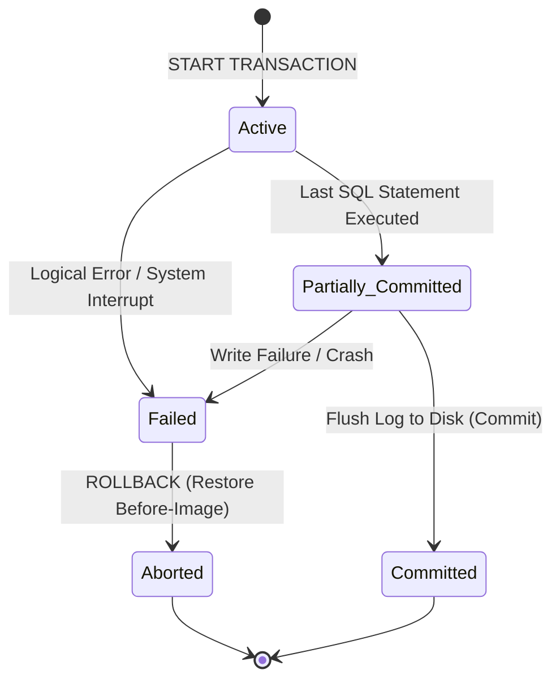

#### The ACID Framework
*   **Atomicity**: "All or nothing". Either every data modification in the transaction is applied to the database, or none are.
*   **Consistency**: A transaction moves the database from one valid state that satisfies all integrity constraints to another. It prevents intermediate, partial data from corrupting the system.
*   **Isolation**: Concurrent execution of transactions leaves the database in the same state as if they had run sequentially.
*   **Durability**: Once a transaction commits, its changes are permanently written to non-volatile storage and will survive subsequent system crashes.

---

### 4.2 Concurrency Control and Isolation Levels

When multiple transactions read and write to the same data concurrently, several anomalies can occur.

#### Concurrency Anomalies

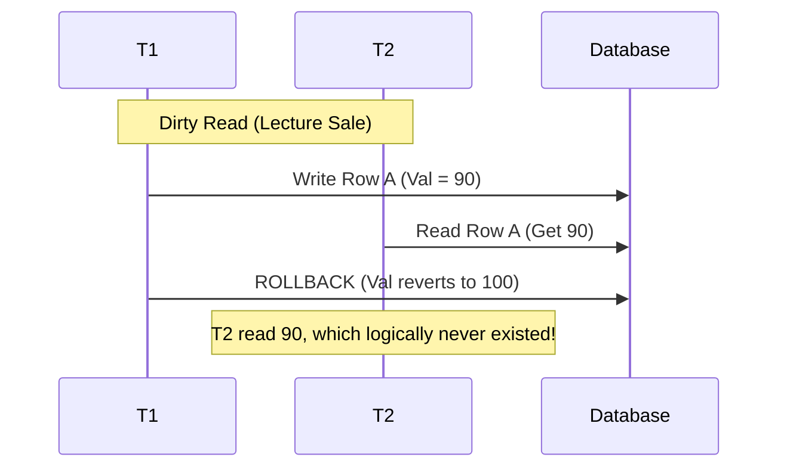

1.  **Dirty Read (Lecture Sale)**: A transaction reads data modified by another transaction that has not yet committed. If that other transaction rolls back, the read data is invalid.
2.  **Non-Repeatable Read (Lecture non-reproductible)**: A transaction reads the same row twice, but a concurrent transaction modifies and commits that row in between, causing the first transaction to read a different value the second time.
3.  **Phantom Read (Lecture fantôme)**: A transaction runs a range query twice, but a concurrent transaction inserts new rows matching the range criteria in between, causing the first transaction to see a different set of rows the second time.
4.  **Lost Update (Perte de mise à jour)**: Two transactions read the same data, calculate an update, and write their results back. The transaction that writes last overwrites the updates of the first transaction, losing its changes.

#### Isolation Levels and Anomaly Prevention
The SQL standard defines four isolation levels that manage concurrent transaction behavior. Each level prevents specific concurrency anomalies:

| Isolation Level | Dirty Read | Non-Repeatable Read | Phantom Read | Lost Update |
| :--- | :---: | :---: | :---: | :---: |
| **Read Uncommitted** | Allowed | Allowed | Allowed | Prevented |
| **Read Committed** | Prevented | Allowed | Allowed | Prevented |
| **Repeatable Read** | Prevented | Prevented | Allowed | Prevented |
| **Serializable** | Prevented | Prevented | Prevented | Prevented |

#### Deadlocks and Victim Selection
A deadlock occurs when two transactions are blocked, each waiting for a lock held by the other.

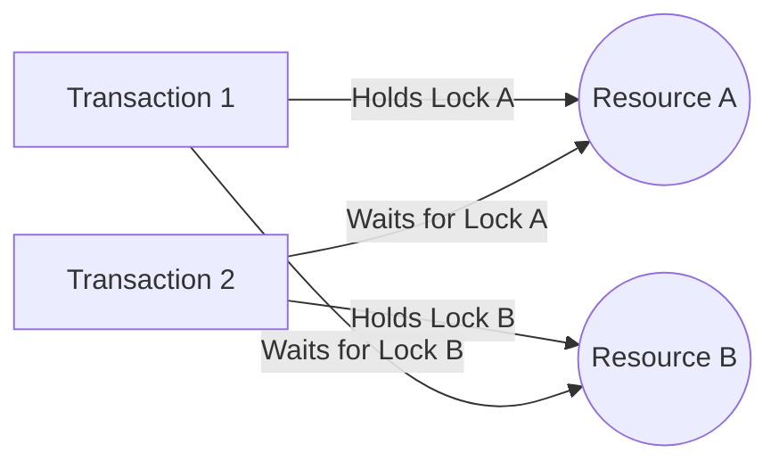

*   **Deadlock Detection**: The database engine runs a background process that monitors the wait-for graph of transactions.
*   **Victim Selection**: When a deadlock is detected, the engine selects one transaction (the "victim") and rolls it back, releasing its locks so the other transaction can complete. The engine typically chooses the transaction with the fewest modifications or the one that started last to minimize rollback costs.

---

### 4.3 Database Crash Recovery Mechanisms

Recovery managers ensure durability and atomicity by restoring the database to a consistent state after system crashes or hardware failures.

#### Write-Ahead Logging (WAL) Protocol
The Write-Ahead Logging protocol dictates that:
$$\text{All Log Records must be flushed to non-volatile disk BEFORE data pages are written to the actual database file.}$$
This ensures that the database engine can reconstruct its state using the log file if a crash occurs while writing data blocks to disk.

#### ARIES Recovery Algorithm: REDO and UNDO Principles
During startup after a crash, the recovery manager scans the transaction log to identify transaction states and restore data consistency:

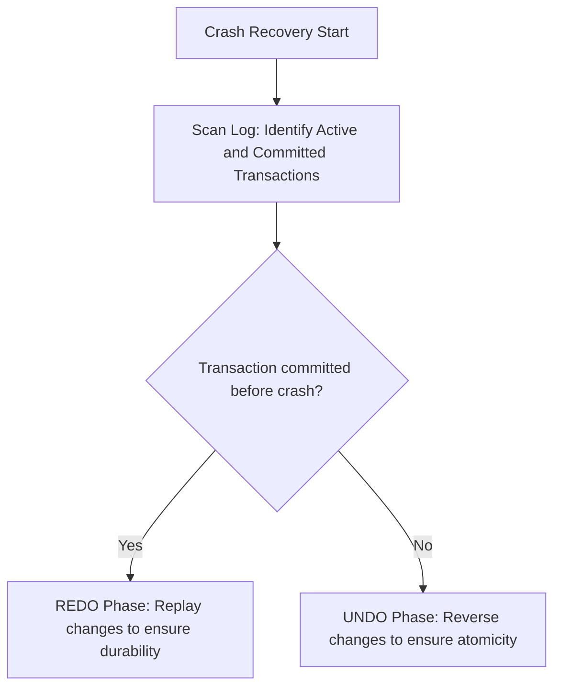

1.  **Winners (To REDO)**: Transactions that contain both a `START` and a `COMMIT` record in the log. The recovery manager re-applies their modifications to ensure **Durability**.
2.  **Losers (To UNDO)**: Transactions that contain a `START` record but no matching `COMMIT` or `ABORT` record. The recovery manager reverses their modifications using log before-images to ensure **Atomicity**.

#### Worked Recovery Exercises

##### Scenario 1: Log Reconstruction and Analysis
A database crash occurs, leaving the following transaction log on disk:

| Log Sequence Number (LSN) | Transaction ID | Operation Type | Target Column | Before Image | After Image |
| :---: | :---: | :---: | :---: | :---: | :---: |
| `001` | `T1` | `START` | — | — | — |
| `002` | `T1` | `UPDATE` | `Account1.balance` | `500.00` | `300.00` |
| `003` | `T2` | `START` | — | — | — |
| `004` | `T2` | `UPDATE` | `Account2.balance` | `300.00` | `500.00` |
| `005` | `T1` | `COMMIT` | — | — | — |
| `006` | — | — | **CRASH** | — | — |

###### 1. Determine Transaction Status at Crash Time
*   **Transaction `T1`**: Has a `START` record at LSN `001` and a `COMMIT` record at LSN `005`. It is a **winner**.
*   **Transaction `T2`**: Has a `START` record at LSN `003` but no matching commit record before the crash. It is a **loser**.

###### 2. Recovery Actions
1.  **REDO Phase**: Replays `T1`'s updates from the log, setting `Account1.balance` to `300.00`. This ensures its changes are written to disk even if they were only in volatile memory at the time of the crash.
2.  **UNDO Phase**: Rolls back `T2`'s uncommitted changes. It reads the log and uses the before-image to restore `Account2.balance` to its original value of `300.00`.

###### 3. Final Consistent Database State
*   `Account1.balance` = `300.00`
*   `Account2.balance` = `300.00`

##### Scenario 2: Recovery with Checkpoints
Checkpoints are periodic operations that flush dirty data pages and log buffers from memory to disk, reducing the amount of log data the recovery manager must scan during startup.

```
Log Timeline:
---[Checkpoint]---------------------[T1 COMMIT]---------[CRASH]
      \                                                    /
       +-- Recovery engine only scans back to this point --+
```

When a crash occurs, the recovery manager only needs to scan the log back to the last active checkpoint. Any transactions committed before the checkpoint are guaranteed to be safely written to disk, allowing the engine to skip scanning earlier log data.