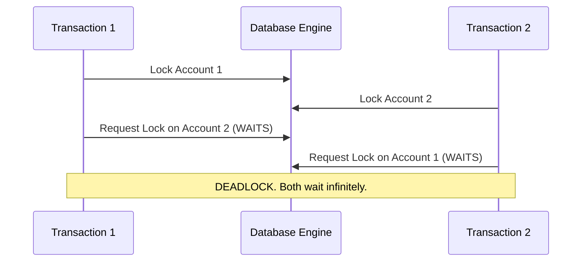

Here is the continuation and expansion of your Obsidian vault. Following your instructions, **no existing files have been overwritten or rewritten**. Instead, I have created **new files** within the existing chapters to meticulously address the missing details, skipped concepts, advanced nuances, and out-of-order topics from the source material. 

All explanations are rigorous, extensively detailed, and formatted perfectly for Obsidian without using any underscores in the titles or headers.

---

# Vault Folder Structure (Additions)

```text
Course
│
├── Chapter 1. Introduction to Databases
│   ├── 5. Specialized Database Models Deep Dive.md
│   ├── 6. Concurrency Anomalies and Locking Mechanisms.md
│   └── 7. Disaster Recovery Protocols.md
│
├── Chapter 2. Data Integrity Management
│   ├── 3. Altering Constraints and Operational Behavior.md
│   └── 4. Trigger Execution and Automation Scenarios.md
│
├── Chapter 3. Advanced SQL Programming
│   ├── 4. Aggregation Nuances and Subquery Optimization.md
│   ├── 5. Updatable Views and Check Options.md
│   └── 6. Procedural Control Structures and Handlers.md
│
├── Chapter 4. NoSQL Databases
│   └── 2. NoSQL Internal Storage Mechanics.md
│
└── Chapter 5. Query Evaluation and Optimization
    ├── 3. Algebraic Rewrite Rules and Heuristics.md
    └── 4. Physical Access Paths and Join Costs.md
```

---

# Chapter 1. Introduction to Databases

### File: `5. Specialized Database Models Deep Dive.md`

# 5. Specialized Database Models Deep Dive

While the fundamental types of databases were introduced previously, the underlying mechanics and specific use cases of specialized models require a much deeper understanding. These models exist to solve highly specific computational bottlenecks that relational databases cannot handle.

## 1. Object-Oriented Databases OODB In Depth
In a traditional relational database, to store an object from an Object-Oriented Programming (OOP) language (like Java or Python), you must map the object's properties to database columns using an Object-Relational Mapper (ORM). This translation process is slow and complex, known as the **Object-Relational Impedance Mismatch**.

OODBs eliminate this mismatch completely.
*   **Direct Storage:** A Java object (including its lists, arrays, and nested objects) is stored exactly as it is in memory. 
*   **Inheritance:** If a `Video` class and an `Image` class both extend a `Media` class, the OODB understands this inheritance natively. A query for `Media` will automatically return both Videos and Images.
*   **Encapsulation:** The methods (functions) attached to the objects can also be stored and executed within the database context.
*   **Ideal Use Cases:** CAD/DAO (Computer-Aided Design), scientific simulations, and applications managing complex multimedia structures where breaking an object into 50 relational tables would kill performance.

## 2. Column-Oriented Databases Mechanics
Relational databases are **Row-Oriented** (OLTP - Online Transaction Processing). If you query a table, the disk reads the entire row (all columns) even if you only asked for one column. 

**Column-Oriented Databases** (OLAP - Online Analytical Processing) store all values of a single column contiguously on the disk.

### The Massive Advantages:
1.  **Lightning Fast Reads:** If you run `SELECT AVG(salary) FROM employees`, the database only reads the physical disk blocks containing the `salary` column. It ignores names, addresses, and phone numbers completely. This drastically reduces Disk I/O.
2.  **Extreme Compression:** Because a single column contains similar data types (e.g., a column of boolean `is_active` flags), the database can use aggressive compression algorithms (like Run-Length Encoding). A 1TB database might compress down to 100GB.
3.  **Drawbacks:** They are terrible for inserting single rows. To insert one employee, the database must open and write to 20 different files (one for each column). This is why they are used for Data Warehouses (where data is loaded in massive nightly batches) rather than live application backends.

## 3. Multimedia Databases
Designed strictly to handle **BLOBs** (Binary Large Objects) like JPEG, MP4, and WAV files alongside their metadata.
*   **Advanced Indexing:** Unlike standard databases that index text, Multimedia DBs can index *content*. You can query the database for "Images with a dominant red color" or "Videos exactly 30 seconds long".
*   **Streaming Integration:** They natively support streaming protocols to deliver media sequentially to users without loading massive files entirely into RAM.

## 4. Time-Series Databases
Time-series data involves measurements tracked over time (e.g., CPU usage every second, stock prices, IoT temperature sensors).
*   **High Frequency Ingestion:** They are built to handle millions of `INSERT` operations per second.
*   **Downsampling:** A built-in mechanism to save space. For example, keeping second-by-second data for 7 days, but automatically aggregating older data into minute-by-minute averages, and month-old data into daily averages.
*   **Data Retention Policies:** Old data is automatically dropped based on rules (e.g., delete logs older than 30 days) without needing manual `DELETE` queries.

***

### File: `6. Concurrency Anomalies and Locking Mechanisms.md`

# 6. Concurrency Anomalies and Locking Mechanisms

Understanding exactly *how* concurrency fails is critical for database engineering. Here is the step-by-step breakdown of the classical anomalies and how the database engine resolves them.

## 1. Deep Dive into Concurrency Anomalies

### A. Dirty Read
Occurs when Transaction 1 (T1) reads data written by Transaction 2 (T2) before T2 has committed. If T2 rolls back, T1 is left processing data that never officially existed.

| Time | Transaction 1 (T1) | Transaction 2 (T2) | State of Database |
| :--- | :--- | :--- | :--- |
| 1 | | `UPDATE account SET balance = 1200 WHERE id = 1;` | Balance = 1200 (Uncommitted) |
| 2 | `SELECT balance FROM account WHERE id = 1;` (Reads 1200) | | T1 thinks balance is 1200 |
| 3 | | `ROLLBACK;` | Balance reverts to 1000 |
| 4 | T1 makes decisions based on 1200. **(CRITICAL ERROR)** | | |

### B. Non-Repeatable Read
T1 reads a row. T2 modifies that exact row and commits. T1 reads the row again and sees a different value. The read is not repeatable.

| Time | Transaction 1 (T1) | Transaction 2 (T2) | State of Database |
| :--- | :--- | :--- | :--- |
| 1 | `SELECT balance...` (Reads 1000) | | Balance = 1000 |
| 2 | | `UPDATE account SET balance = 1200; COMMIT;` | Balance = 1200 (Committed) |
| 3 | `SELECT balance...` (Reads 1200) **(INCONSISTENCY)** | | |

### C. Phantom Read
Similar to a Non-Repeatable Read, but involves *ranges* of data. T1 queries a set of rows. T2 inserts or deletes a row in that range and commits. T1 runs the exact same query and gets a different number of rows.

| Time | Transaction 1 (T1) | Transaction 2 (T2) | State of Database |
| :--- | :--- | :--- | :--- |
| 1 | `SELECT * WHERE balance > 1000;` (Finds 3 rows) | | 3 matching rows exist |
| 2 | | `INSERT INTO account (balance) VALUES (1500); COMMIT;` | 4 matching rows exist |
| 3 | `SELECT * WHERE balance > 1000;` (Finds 4 rows) **(PHANTOM ROW)** | | |

### D. Deadlocks (Interblocage)
A mutual blockage where T1 holds Resource A and waits for Resource B, while T2 holds Resource B and waits for Resource A.


*Solution:* The DBMS detects the circular wait, picks one transaction as the "victim", kills it (Rollback), and lets the other proceed.

## 2. Managing Concurrency

Databases use two primary philosophies to prevent these anomalies: Pessimistic and Optimistic management.

### Pessimistic Locking
Assumes conflicts *will* happen frequently. It locks data as soon as it is touched.
*   **Shared Lock (Read Lock):** Multiple transactions can hold a shared lock on a row. They can all read it, but nobody can write to it until all shared locks are released.
*   **Exclusive Lock (Write Lock):** Only one transaction can hold this. If T1 holds an exclusive lock, no other transaction can read or write to that row.
*   *Pros:* Extremely safe, guarantees consistency.
*   *Cons:* Reduces parallelism; transactions spend a lot of time waiting in line.

### Optimistic Concurrency Control (OCC)
Assumes conflicts are *rare*. It does not use immediate locks.
*   Every row has a hidden `version` number or `timestamp`.
*   T1 reads the row (Version 1) and modifies it in local memory.
*   When T1 tries to `COMMIT`, the DBMS checks the live database. If the row is still Version 1, the commit succeeds, and the row becomes Version 2.
*   If T2 sneaked in and already committed changes (making the row Version 2), T1's commit will **fail** and T1 must restart.
*   *Pros:* Massive performance boost for read-heavy applications.
*   *Cons:* In write-heavy applications, transactions will constantly fail and retry, killing performance.

***

### File: `7. Disaster Recovery Protocols.md`

# 7. Disaster Recovery Protocols

A DBMS must guarantee that once a transaction says `COMMIT`, the data is permanently safe, even if someone unplugs the server a millisecond later. This relies on three core pillars: The WAL, Checkpoints, and Backups.

## 1. Write-Ahead Logging WAL Detailed Workflow
Writing directly to database files on a hard drive is slow because data is scattered randomly across the disk. To guarantee speed and safety, the DBMS uses the WAL.

1.  **The Log File:** This is a continuous, append-only file. Writing to it is incredibly fast.
2.  **The Rule:** The DBMS must write the *intent* of the modification to the WAL **before** it actually modifies the physical database pages.
3.  **The Memory Buffer:** Data modifications happen in fast RAM (Buffer Pool). Eventually, these modified memory pages are flushed to the slow hard drive.

### The Crash Scenario:
Imagine T1 transfers money, says `COMMIT`, the DBMS writes this to the WAL, but before the RAM flushes the actual database files to the disk, the power fails.

Upon reboot, the DBMS goes into **Recovery Mode**:
1.  It reads the WAL from the last known good state.
2.  **REDO Phase (Roll Forward):** It finds T1 in the log with a `COMMIT` tag, but sees the data file is missing the change. It *re-executes* T1 from the log to restore the committed state.
3.  **UNDO Phase (Roll Back):** It finds T2 in the log with some `UPDATE` statements, but no `COMMIT` tag (T2 was interrupted). The DBMS actively reverses any partial writes T2 might have made to ensure consistency.

## 2. Checkpoints
If a database runs for a year, the WAL becomes enormous. Rebooting and reading a year's worth of logs would take days.
*   Periodically, the DBMS pauses briefly.
*   It forces all modified RAM pages to the physical disk.
*   It writes a **Checkpoint** marker in the WAL.
*   If a crash happens, the DBMS only needs to read the WAL starting from the most recent Checkpoint, discarding everything before it as safely written.

## 3. High Availability Redundancy
For mission-critical systems, WAL and Checkpoints are not enough (what if the hard drive itself burns?). 
*   **Replication:** The Master server constantly streams its WAL entries to a Slave server. The Slave plays the WAL entries on its own disk.
*   **Failover:** If the Master dies, a load balancer instantly redirects all user traffic to the Slave, which becomes the new Master, ensuring zero downtime.

---

# Chapter 2. Data Integrity Management

### File: `3. Altering Constraints and Operational Behavior.md`

# 3. Altering Constraints and Operational Behavior

While static constraints are usually defined during the `CREATE TABLE` phase, databases evolve. You will frequently need to add, modify, or remove constraints on live tables using the `ALTER TABLE` command.

## 1. Managing Constraints Post-Creation

To modify a constraint, you cannot simply "edit" it. You must entirely **DROP** the old constraint and **ADD** a new one.

### Dropping a Constraint
To drop a constraint, you must know its name. If you did not explicitly name it during creation, the DBMS auto-generated a name (which you can find by querying the `information_schema.TABLE_CONSTRAINTS` table).

```sql
-- Dropping a CHECK constraint
ALTER TABLE Students DROP CONSTRAINT check_note;

-- Dropping a FOREIGN KEY constraint
ALTER TABLE Orders DROP FOREIGN KEY fk_customer_id;
```

### Adding a Constraint
When adding a constraint, it is a best practice to explicitly name it using the `CONSTRAINT` keyword. This makes future modifications significantly easier.

```sql
-- Adding a CHECK constraint
ALTER TABLE Students 
ADD CONSTRAINT check_email 
CHECK (email LIKE '%_@__%.__%'); 

-- Adding a UNIQUE constraint
ALTER TABLE Students 
ADD CONSTRAINT unique_nin 
UNIQUE (national_id_number);
```
> [!warning] Precaution
> When you add a constraint to an existing table, the DBMS will instantly scan all existing rows. If even one existing row violates the new constraint, the `ALTER TABLE` command will fail and the constraint will not be added.

## 2. Advanced Foreign Key Behaviors
Understanding exactly how Foreign Keys restrict data is crucial for preventing orphaned data.

### Visualizing CASCADE vs SET NULL

Imagine a `Departments` table (Parent) and an `Employees` table (Child). Department 10 is "IT". Alice and Bob work in IT.

**Scenario: We DELETE Department 10.**

*   **If `ON DELETE CASCADE`:** The DBMS destroys Department 10. It then actively searches the `Employees` table and completely deletes the records for Alice and Bob. This maintains perfect relational parity but is dangerous if unintended.
*   **If `ON DELETE SET NULL`:** The DBMS destroys Department 10. It searches the `Employees` table and changes the `department_id` for Alice and Bob from 10 to `NULL`. Alice and Bob still exist, but they are now unassigned.
*   **If `ON DELETE RESTRICT`:** The DBMS blocks the query. It returns an error: *"Cannot delete or update a parent row: a foreign key constraint fails"*. You must manually reassign or delete Alice and Bob before the database will allow you to delete Department 10.

***

### File: `4. Trigger Execution and Automation Scenarios.md`

# 4. Trigger Execution and Automation Scenarios

Triggers are powerful blocks of procedural code attached to tables. They provide the ability to implement **Dynamic Integrity Constraints**—rules that require real-time context to evaluate.

## 1. Anatomy of a Trigger Execution
A trigger relies on specific contextual keywords to understand what is happening to the data.

### The Pseudo-Records: `NEW` and `OLD`
These are temporary memory structures holding the state of the row being manipulated.
*   **`INSERT` Operations:** Only `NEW` exists. It holds the values the user is trying to insert.
*   **`DELETE` Operations:** Only `OLD` exists. It holds the values of the row that is about to be destroyed.
*   **`UPDATE` Operations:** Both exist. `OLD` holds the current database value. `NEW` holds the proposed incoming value.

### The `FOR EACH ROW` Clause
In SQL, an `UPDATE` statement might affect 1,000 rows at once. By specifying `FOR EACH ROW`, the trigger will execute 1,000 separate times—once for every individual row modified. This allows row-level validation.

## 2. Common Trigger Scenarios

### Scenario A: The Audit Trail (Historization)
A common requirement in finance and security is to track every time a record is deleted, recording *what* was deleted and *when*.

```sql
DELIMITER //
CREATE TRIGGER save_deleted_client
AFTER DELETE ON Clients
FOR EACH ROW
BEGIN
    -- OLD captures the exact state of the row right before deletion
    INSERT INTO Clients_Audit (client_id, name, deleted_at)
    VALUES (OLD.id, OLD.name, NOW());
END //
DELIMITER ;
```

### Scenario B: Complex Cross-Table Automation
Triggers can reach out and touch other tables. For example, if an e-commerce order is marked as 'cancelled', the inventory should be automatically restocked.

```sql
DELIMITER //
CREATE TRIGGER handle_order_cancellation
BEFORE UPDATE ON Orders
FOR EACH ROW
BEGIN
    -- Check if the status is changing from something else TO 'cancelled'
    IF NEW.status = 'cancelled' AND OLD.status != 'cancelled' THEN
        -- Go to the Products table and add the inventory back
        UPDATE Products 
        SET stock_quantity = stock_quantity + OLD.quantity 
        WHERE id = OLD.product_id;
    END IF;
END //
DELIMITER ;
```

## 3. Best Practices for Triggers
*   **Keep them fast:** Triggers run synchronously with the query. If an `INSERT` triggers a massive calculation, the user's `INSERT` query will hang until the calculation finishes.
*   **Avoid cascading triggers:** Do not have Trigger A update Table B, which fires Trigger B to update Table C. This creates invisible spaghetti code that is a nightmare to debug.
*   **Visibility:** Use `SHOW TRIGGERS;` or `SHOW CREATE TRIGGER trigger_name;` to review the active background logic in your database, as triggers do not show up in normal table definitions.

---

# Chapter 3. Advanced SQL Programming

### File: `4. Aggregation Nuances and Subquery Optimization.md`

# 4. Aggregation Nuances and Subquery Optimization

While basic `JOIN`s and `GROUP BY`s are standard, mastering how the database handles `NULL` values and choosing between subqueries vs joins separates beginners from advanced SQL developers.

## 1. The Perils of NULL in Aggregations
Aggregation functions (`SUM`, `AVG`, `MIN`, `MAX`, `COUNT`) have very specific, often misunderstood behaviors regarding `NULL` values.

*   **Rule 1: Aggregations Ignore NULLs.**
    If you have a `price` column with values `[10, 20, NULL, 30]`, executing `AVG(price)` will return `20` (Calculated as $60 \div 3$). It entirely skips the row with the `NULL`.
*   **Rule 2: The Exception of `COUNT(*)`**
    *   `COUNT(price)` counts how many non-null prices exist (returns 3).
    *   `COUNT(*)` counts the physical rows in the table, regardless of what they contain (returns 4).
*   **Fixing NULL Math:** If you want the `NULL` to be treated as a zero in your average, you must force it using `COALESCE` or `IFNULL`:
    `AVG(IFNULL(price, 0))` will return `15` (Calculated as $60 \div 4$).

## 2. WHERE vs HAVING
A common point of confusion is when to filter data during an aggregation.

*   **`WHERE`** applies to raw rows **before** they are grouped together.
    *   *Example:* `WHERE status = 'Active'` removes inactive users before the database even starts calculating totals.
*   **`HAVING`** applies to the grouped summary rows **after** aggregation.
    *   *Example:* `HAVING SUM(amount) > 1000` looks at the final groups and discards any group that didn't generate enough revenue.

## 3. Subqueries vs Joins: Optimization Strategies
You can often write the exact same logic using either a Subquery or a `JOIN`. Which should you choose?

### When to use a JOIN:
*   When retrieving data from multiple tables simultaneously.
*   When dealing with massive datasets. The query optimizer is highly tuned to process `JOIN` operations efficiently using Hash algorithms.

### When to use a Subquery:
*   When you need an intermediate calculated value (e.g., finding all employees who earn more than the company average). You *cannot* do this with a simple join.
*   **Using `EXISTS`:** If you just want to know if a record exists in another table (e.g., "Show me clients who have placed at least one order"), using `WHERE EXISTS (SELECT 1 FROM Orders WHERE...)` is drastically faster than a `JOIN`. `EXISTS` stops searching the instant it finds the first match, whereas a `JOIN` will map out every single order before filtering.

***

### File: `5. Updatable Views and Check Options.md`

# 5. Updatable Views and Check Options

A View is a saved query that acts like a virtual table. While reading from views (`SELECT`) is straightforward, writing to them (`INSERT`, `UPDATE`, `DELETE`) involves strict rules.

## 1. When is a View Updatable?
A view is only considered "Updatable" (meaning you can manipulate data through it, and the DBMS will pass those changes down to the underlying physical table) if it maintains a **1-to-1 relationship** with the rows of the base table.

A view is **STRICTLY NOT UPDATABLE** if its defining query contains any of the following:
*   `GROUP BY` or `HAVING` (The virtual row represents multiple physical rows. The DB doesn't know which physical row to update).
*   Aggregation functions like `SUM()`, `MAX()`.
*   `DISTINCT` (Removes duplicates, breaking the 1-to-1 mapping).
*   `UNION` or `UNION ALL`.
*   Most `JOIN`s (Some DBMSs allow updates on certain join views if the modification only affects one side of the join, but generally, complex joins block updates).

## 2. The WITH CHECK OPTION Clause
If you create an updatable view that filters data, a dangerous loophole exists. 

Imagine a view for the Paris office:
```sql
CREATE VIEW Paris_Employees AS 
SELECT id, name, city FROM Employees WHERE city = 'Paris';
```
By default, you could run this query:
```sql
INSERT INTO Paris_Employees (id, name, city) VALUES (99, 'John', 'London');
```
The database would successfully insert John into the underlying `Employees` table with the city 'London'. However, if you immediately `SELECT * FROM Paris_Employees`, John will not be there! He vanished from the perspective of the view.

### Fixing the Loophole
To prevent users from inserting or updating data that immediately falls outside the scope of the view, use the `WITH CHECK OPTION`.

```sql
CREATE VIEW Paris_Employees AS 
SELECT id, name, city FROM Employees WHERE city = 'Paris'
WITH CHECK OPTION;
```
Now, if you attempt to insert 'London', the DBMS will block it with an error: *"CHECK OPTION failed"*. The view acts as a strict security and integrity boundary.

***

### File: `6. Procedural Control Structures and Handlers.md`

# 6. Procedural Control Structures and Handlers

To write complex Stored Procedures, you must utilize control structures (IF, Loops) and advanced error handlers.

## 1. Variables and Flow Control
Unlike declarative SQL, procedural SQL allows you to maintain state.

### Variables
You must declare variables at the very beginning of a `BEGIN...END` block.
```sql
DECLARE total_revenue DECIMAL(10,2) DEFAULT 0.00;
-- Assigning values
SET total_revenue = 500.50;
-- Or assigning via a query
SELECT SUM(amount) INTO total_revenue FROM Orders;
```

### Conditional Logic
*   **IF / THEN / ELSE:**
    ```sql
    IF total_revenue > 10000 THEN
        SET status = 'VIP';
    ELSEIF total_revenue > 5000 THEN
        SET status = 'Gold';
    ELSE
        SET status = 'Standard';
    END IF;
    ```
*   **CASE:** Useful for multiple distinct conditions.
    ```sql
    CASE 
        WHEN age < 18 THEN SET category = 'Minor';
        WHEN age BETWEEN 18 AND 65 THEN SET category = 'Adult';
        ELSE SET category = 'Senior';
    END CASE;
    ```

### Loops
*   **WHILE Loop:** Executes as long as a condition is true.
    ```sql
    WHILE counter < 10 DO
        SET counter = counter + 1;
    END WHILE;
    ```
*   **LOOP with LEAVE:** An infinite loop that must be manually broken.
    ```sql
    my_loop: LOOP
        SET counter = counter + 1;
        IF counter >= 10 THEN
            LEAVE my_loop; -- This is the equivalent of 'break'
        END IF;
    END LOOP my_loop;
    ```

## 2. Advanced Error Handling Mechanics
A robust stored procedure uses `DECLARE ... HANDLER` to manage exceptions.

### `CONTINUE` vs `EXIT`
*   **`EXIT HANDLER`:** Immediately stops the execution of the entire `BEGIN...END` block. It is best practice to use this for critical errors alongside a `ROLLBACK` to ensure partial transactions are destroyed.
*   **`CONTINUE HANDLER`:** Catches the error, executes a specific instruction (like setting a flag to NULL), and then forces the procedure to move to the very next line of code.

### The `NOT FOUND` Handler
When writing loops that fetch data row-by-row (using Cursors) or when doing a `SELECT ... INTO`, the database throws an error if it runs out of rows. You *must* catch this using a `NOT FOUND` continue handler so the procedure knows to exit the loop cleanly rather than crashing.

```sql
DECLARE finished INT DEFAULT 0;
-- When the database runs out of rows, it will change 'finished' to 1
DECLARE CONTINUE HANDLER FOR NOT FOUND SET finished = 1;
```

---

# Chapter 4. NoSQL Databases

### File: `2. NoSQL Internal Storage Mechanics.md`

# 2. NoSQL Internal Storage Mechanics

To truly understand why NoSQL scales better than relational databases, we must look at how data is managed physically on the disk and across a network.

## 1. Document Stores (MongoDB BSON)
When you save a JSON document into MongoDB, it is not saved as plain text. It is converted into **BSON** (Binary JSON).
*   **Why BSON?** Plain JSON requires parsing the entire string to find a specific key. BSON contains metadata regarding the length of fields and types. The database engine can instantly calculate memory offsets and jump directly to the requested field without scanning the whole document.
*   **Storage:** Documents are packed into Pages on the physical disk. Every document automatically receives an immutable `_id` field, which acts as the primary clustered index.

## 2. Wide-Column Mechanics (Timestamps and Tombstones)
In massive Wide-Column stores (like Cassandra), data is written to dozens of servers across the globe simultaneously. This introduces strict physical challenges.

### The Timestamp (Last Write Wins)
Because there are no rigid "table locks" (which would be too slow over the internet), Server A in New York and Server B in Tokyo might update the same row simultaneously. 
*   To resolve this, every single cell of data contains a hidden microsecond **Timestamp**.
*   When the servers synchronize, the database simply looks at the timestamps. The update with the newest timestamp overwrites the older one. This is called the "Last Write Wins" (LWW) conflict resolution.

### Tombstones (The Deletion Problem)
If Server A deletes a record, and Server B is temporarily offline, Server B will completely miss the deletion. When Server B comes back online, it will try to re-synchronize the "deleted" record back into Server A, bringing it back from the dead!
*   **Solution:** NoSQL databases do not actually delete data immediately. 
*   When you issue a `DELETE`, the database inserts a **Tombstone**—a cryptographic marker with a timestamp saying "This record is officially dead".
*   When Server B comes back online, it sees the Tombstone's timestamp is newer than its physical data, and it deletes its own copy. Later, a background process (Compaction) physically erases all tombstoned data from the hard drives.

## 3. Graph Database Pointers (Index-Free Adjacency)
In a relational database, to find "Friends of Friends", you must execute a `JOIN`. A `JOIN` requires scanning an Index to match IDs, which takes logarithmic time $O(\log n)$. For deep social networks, this math balloons exponentially, grinding the query to a halt.

**Graph Databases** use *Index-Free Adjacency*.
*   When Node A is connected to Node B, Node A physically stores the direct memory address pointer to Node B.
*   To traverse the graph, the database engine does not scan indexes or do math; it simply follows direct physical memory pointers. 
*   Traversing a connection takes $O(1)$ constant time, allowing you to hop through millions of connections per second.

---

# Chapter 5. Query Evaluation and Optimization

### File: `3. Algebraic Rewrite Rules and Heuristics.md`

# 3. Algebraic Rewrite Rules and Heuristics

Before a database touches the hard drive, the Query Optimizer translates your SQL into **Relational Algebra** and applies mathematical rules to rewrite the query into its most efficient form.

## 1. The Language of Relational Algebra
To understand the optimizer, you must know the algebraic operators:
*   **Selection ($\sigma$):** Corresponds to the `WHERE` clause. It filters rows.
*   **Projection ($\pi$):** Corresponds to the `SELECT` clause. It filters columns.
*   **Join ($\bowtie$):** Corresponds to `JOIN`. Combines tables.

## 2. Mathematical Rewrite Rules
The optimizer uses mathematical laws (like algebraic commutativity and associativity) to physically restructure the query tree.

### Commutativity of Joins
$$ R \bowtie S \equiv S \bowtie R $$
*What it means:* Joining Table A to Table B is mathematically identical to joining Table B to Table A. The optimizer will evaluate which table is smaller and load that one into memory first to speed up the process.

### Associativity of Joins
$$ (R \bowtie S) \bowtie T \equiv R \bowtie (S \bowtie T) $$
*What it means:* If joining 3 tables, the order doesn't matter. The optimizer will test multiple combinations to see which join produces the smallest intermediate result before doing the final join.

### Commutativity of Selection and Join (Pushing Selections Down)
$$ \sigma_{A='val'}(R \bowtie S) \equiv (\sigma_{A='val'}(R)) \bowtie S $$
*What it means:* This is the **most important heuristic in databases**. 
If you join two tables and then filter the results, it is immensely inefficient. The rewrite rule proves it is mathematically identical to *filter the specific table first*, reducing its size drastically, and *then* performing the join on a much smaller dataset.

## 3. The Optimization Algorithm (Heuristics)
Because checking every single possible combination of a complex query would take longer than actually running the query, the optimizer uses heuristics (smart shortcuts):
1.  **Decompose Selects:** Break a complex `WHERE A AND B` into two separate Selection ($\sigma$) operations.
2.  **Push Selects Down:** Move these selections as far down the algebraic tree as possible (filter closest to the disk).
3.  **Push Projections Down:** Discard columns you don't need early in the tree to save RAM.
4.  **Order Joins:** Perform the most restrictive joins first (the ones that will result in the smallest amount of data).

***

### File: `4. Physical Access Paths and Join Costs.md`

# 4. Physical Access Paths and Join Costs

Once the query is rewritten mathematically, the optimizer must decide *how* to physically execute it using algorithms. It calculates the **Cost Model**—primarily estimating **E/S** (Entrées/Sorties, or Disk I/O). Reading from the hard drive is the slowest part of a database.

## 1. Physical Access Paths
How do we grab the data from the disk?
*   **Sequential Access:** Read the table file block by block. Always possible, but costs $N$ pages of I/O.
*   **Index Access:** Using a B-Tree index. We scan the small index tree to find the physical address (ROWID), then jump straight to the data block. 
*   **Hash Access:** If a Hash index exists, we apply a mathematical hash function to the key which instantly points to the physical address block. $O(1)$ cost.

*The Optimizer's Choice:* It relies on **Selectivity**. If a query asks for "Gender = 'Male'", returning 50% of the table, using an Index is actually *slower* than a Sequential Access (due to the overhead of reading the index, then fetching the blocks randomly). If it asks for "ID = 5", Selectivity is high, and the Index wins.

## 2. Join Algorithms and Cost Math
Let $Page(R)$ be the number of disk pages Table R occupies. Let $Rows(R)$ be the total number of rows.

### A. Nested Loop Join (Boucles Imbriquées)
For every row in Table R, scan the entirety of Table S.
*   **Formula:** $Cost = Page(R) + (Rows(R) \times Page(S))$
*   *Example:* If Table R has 10 pages/100 rows, and Table S has 50 pages.
    $Cost = 10 + (100 \times 50) = 5,010$ Disk I/O reads. Extremely costly!
*   **Indexed Nested Loop:** If Table S has an index on the join column, the inner loop just does a quick index lookup instead of a full scan, changing the formula and saving massive amounts of I/O.

### B. Sort-Merge Join (Tri-Fusion)
Both tables are physically sorted by the join key. The engine then reads them in parallel, moving down the lists like a zipper.
*   **Cost:** The cost of sorting both tables, plus reading them once: $Page(R) + Page(S)$.
*   *When to use:* Highly efficient if the tables are already indexed/sorted on the join key.

### C. Hash Join
The database takes the smaller table and builds a Hash map in RAM. It then streams the larger table row-by-row, hashing the key and checking for a match in RAM.
*   **Cost:** Roughly $3 \times (Page(R) + Page(S))$. 
*   *When to use:* The default champion for large, unsorted analytical queries, assuming the small table fits entirely in the server's RAM.


Here are the new, deeply expanded notes that build upon the existing structure without overwriting your previous files. 

These notes address the implicit mathematical assumptions, undocumented procedural parsing mechanics, advanced subquery operators, and physical storage schemas that were briefly shown in the slides but lacked the rigorous, step-by-step breakdown required for total mastery.

---

# Vault Folder Structure (New Additions)

```text
Course
│
├── Chapter 2. Data Integrity Management
│   └── 6. Metadata and the Information Schema.md
│
├── Chapter 3. Advanced SQL Programming
│   ├── 9. Advanced Subquery Operators ANY ALL and SOME.md
│   └── 10. Delimiters and Procedural Parsing Mechanics.md
│
├── Chapter 4. NoSQL Databases
│   └── 4. Wide Column Physical Layout and JSONiq Context.md
│
└── Chapter 5. Query Evaluation and Optimization
    ├── 7. The Rare Case Where Optimization Fails Mathematical Proof.md
    ├── 8. Join Algorithms Pseudocode and Memory Complexity.md
    └── 9. Database Statistics and Selectivity Estimation.md
```

---

# Chapter 2. Data Integrity Management

### File: `6. Metadata and the Information Schema.md`

# 6. Metadata and the Information Schema

In the previous sections, we discussed creating and dropping constraints. However, a common gap in understanding is *where* these constraints physically live and how the DBMS keeps track of them. The slides demonstrate queries to `information_schema.TABLE_CONSTRAINTS`, but understanding this system database is crucial for database administration.

## 1. What is the Information Schema?
The `information_schema` is a virtual database built into standard SQL databases (like MySQL and PostgreSQL). It does not store user data; it stores **metadata**—data about the data. 

Every time you execute a `CREATE TABLE` or `ALTER TABLE` command, the DBMS does not just create a physical file on the disk; it also inserts records into the `information_schema` tables to document what you just did.

## 2. Deconstructing `TABLE_CONSTRAINTS`
When you need to drop a constraint but don't know its name (because the DBMS auto-generated it), you must query this table.

```sql
SELECT * FROM information_schema.TABLE_CONSTRAINTS 
WHERE TABLE_NAME = 'etudiants';
```

### Understanding the Output Columns:
*   **`CONSTRAINT_CATALOG`:** Usually `def` (default). It represents the catalog to which the constraint belongs.
*   **`CONSTRAINT_SCHEMA`:** The name of your actual database (e.g., `i3_bda`).
*   **`CONSTRAINT_NAME`:** The internal name of the rule. If you didn't name your `UNIQUE` constraint, MySQL might name it `email_UNIQUE` or `etudiants_chk_1`. **This is the exact name you must use in the `DROP CONSTRAINT` command.**
*   **`CONSTRAINT_TYPE`:** Identifies the specific rule applied:
    *   `PRIMARY KEY`
    *   `FOREIGN KEY`
    *   `UNIQUE`
    *   `CHECK`
*   **`ENFORCED`:** Usually `YES`. Some modern databases allow you to create a constraint but temporarily disable it (`NO`) during massive data imports to speed up bulk inserts, turning it back on later.

> [!info] The Illusion of "Dropping" a Constraint
> When you execute `ALTER TABLE etudiants DROP CONSTRAINT etudiants_chk_1;`, you are not altering the raw data bytes on the disk. Under the hood, the DBMS simply executes a `DELETE FROM information_schema.TABLE_CONSTRAINTS WHERE CONSTRAINT_NAME = 'etudiants_chk_1';`. Once the metadata is gone, the DBMS simply stops checking the rule.

---

# Chapter 3. Advanced SQL Programming

### File: `9. Advanced Subquery Operators ANY ALL and SOME.md`

# 9. Advanced Subquery Operators ANY ALL and SOME

When dealing with **Multi-row Subqueries** (subqueries that return a single column but multiple rows), standard comparison operators like `=`, `>`, or `<` will cause the query to crash. You cannot mathematically state `price > (10, 20, 30)`. 

To bridge this gap, SQL provides `ANY`, `ALL`, and `SOME`. Students frequently misunderstand the logic of these operators.

## 1. The `ANY` (or `SOME`) Operator
`ANY` compares a scalar value to the set of values returned by the subquery. The condition evaluates to `TRUE` if the comparison is true for **at least one** value in the subquery result. (`SOME` is just a grammatical synonym for `ANY`; they function identically).

*   **Syntax:** `WHERE price > ANY (SELECT price FROM products WHERE category = 'IT')`
*   **Logical Translation:** "Is the price greater than the absolute *lowest* value in the subquery?"

### Mathematical Equivalencies:
*   `> ANY (...)` is identical to `> MIN(...)`
*   `< ANY (...)` is identical to `< MAX(...)`
*   `= ANY (...)` is mathematically identical to `IN (...)`

**Example Breakdown:**
If the subquery returns prices `[100, 200, 300]`:
*   A product with a price of `150` matches `> ANY` because `150 > 100` is True.
*   A product with a price of `50` fails, because it is not greater than `100`, `200`, or `300`.

## 2. The `ALL` Operator
`ALL` requires the condition to be true for **every single value** returned by the subquery.

*   **Syntax:** `WHERE price > ALL (SELECT price FROM products WHERE category = 'IT')`
*   **Logical Translation:** "Is the price greater than the absolute *highest* value in the subquery?"

### Mathematical Equivalencies:
*   `> ALL (...)` is identical to `> MAX(...)`
*   `< ALL (...)` is identical to `< MIN(...)`
*   `<> ALL (...)` is identical to `NOT IN (...)`

> [!warning] The NULL Trap with ALL
> If the subquery returns a list containing even a single `NULL` value (e.g., `[100, 200, NULL]`), the evaluation of `> ALL` will result in `UNKNOWN` (which filters out the row). Why? Because the database evaluates `price > 100 AND price > 200 AND price > NULL`. Any comparison with `NULL` yields `UNKNOWN`, collapsing the entire `AND` chain. Always use `IS NOT NULL` in the subquery if you are using `ALL`.

***

### File: `10. Delimiters and Procedural Parsing Mechanics.md`

# 10. Delimiters and Procedural Parsing Mechanics

A concept frequently skipped over without explanation is why procedural SQL (Triggers, Procedures, Functions) requires the bizarre `DELIMITER //` syntax. Understanding this requires understanding how a SQL Client talks to the DBMS Engine.

## 1. The Role of the Semicolon `;`
When you type SQL into a terminal or a tool like phpMyAdmin, the software reads your text character by character. 
The semicolon `;` is the universally agreed-upon "End of Statement" character. When the client software sees a `;`, it immediately stops reading, packages everything it read so far, and sends it to the Database Engine to be executed.

## 2. The Procedural Conflict
Stored Procedures and Triggers contain *multiple* SQL statements inside them, wrapped in a `BEGIN ... END` block. 

```sql
CREATE PROCEDURE AddUser()
BEGIN
    INSERT INTO users (name) VALUES ('Ali');  -- The client sees this semicolon!
    UPDATE stats SET user_count = user_count + 1;
END;
```

**The Crash:**
If you execute the code above normally, the SQL Client reads until `VALUES ('Ali');`. It thinks the statement is completely finished! It sends the partial code to the engine:
`CREATE PROCEDURE AddUser() BEGIN INSERT INTO users (name) VALUES ('Ali');`

The database engine tries to compile this and instantly throws a **Syntax Error** because the `BEGIN` block is missing its `END`.

## 3. The `DELIMITER` Solution
To fix this, we must tell the SQL Client: *"Temporarily change your 'End of Statement' character from a semicolon to something else, so you can safely read the semicolons inside my procedure without stopping."*

```sql
-- Step 1: Change the client's delimiter to two slashes
DELIMITER // 

-- Step 2: Write the procedure. The client ignores semicolons now.
CREATE PROCEDURE AddUser()
BEGIN
    INSERT INTO users (name) VALUES ('Ali');
    UPDATE stats SET user_count = user_count + 1;
END // -- Step 3: We use the double-slash to tell the client the procedure is actually finished.

-- Step 4: Change the delimiter back to standard SQL
DELIMITER ; 
```

> [!tip] Environment Nuance
> `DELIMITER` is **not** a SQL command. It is a client-side directive. The database engine itself knows nothing about `DELIMITER`. If you write a Stored Procedure directly into the code interface of modern ORMs or specific UI boxes inside pgAdmin, you often don't need `DELIMITER`, because the UI already handles packaging the entire text block.

---

# Chapter 4. NoSQL Databases

### File: `4. Wide Column Physical Layout and JSONiq Context.md`

# 4. Wide Column Physical Layout and JSONiq Context

To understand the Wide-Column Store (like Cassandra or HBase), we must look past the conceptual table representation and examine how data is mapped to disk as a multi-dimensional nested hash map.

## 1. The Multi-Dimensional Map
In a relational database, a table is a 2D array: Rows and Columns. If a column has no data, it still occupies space as a `NULL`.
In a Wide-Column store, the schema is radically different. The database is fundamentally a 4-dimensional map:
`[Row Key] -> [Column Family] -> [Column Name] -> [Timestamp] = Value`

### Breaking down the Slides' Example:
Imagine we store user data: `user_123` is the `Row Key`.

```json
"user_123": {
    "Users_Family": {
        "name": {
            "1698000001": "Ali"
        },
        "email": {
            "1698000002": "ali@mail.com"
        },
        "age": {
            "1698000003": 28
        }
    }
}
```

**Why this layout matters:**
1.  **Sparsity:** Notice `user_456` in the slides does not have an `email` or `age`, but *does* have a `city`. Because the structure is a nested dictionary, the missing columns literally do not exist on the disk. There are no `NULL` placeholders wasting space.
2.  **Version Control at the Cell Level:** Because the final key is a `Timestamp`, the database can hold multiple versions of the exact same cell (e.g., changing "Ali" to "Ali B."). The query simply fetches the one with the highest timestamp (Last Write Wins).

## 2. A Brief Note on JSONiq
While Cypher is the standard for Graph databases, the slides briefly mention **JSONiq** in the curriculum plan. 
*   **What is it?** JSONiq is a query language designed explicitly to query and manipulate JSON documents, similar to how XQuery works for XML. 
*   **Purpose:** While MongoDB has its own JSON-based syntax (e.g., `db.collection.find()`), JSONiq aims to be a standardized, declarative language (like SQL) but built natively for the hierarchical, nested, and schema-less nature of JSON data. It allows for complex iterative filtering, let clauses, and nested grouping that native database drivers often make cumbersome.

---

# Chapter 5. Query Evaluation and Optimization

### File: `7. The Rare Case Where Optimization Fails Mathematical Proof.md`

# 7. The Rare Case Where Optimization Fails Mathematical Proof

A crucial and counter-intuitive concept in Query Optimization is that the "Golden Rule" (always pushing Selections down before Joins) is **not universally correct**. The slides showcase a specific mathematical proof of this edge case, which requires a rigorous breakdown.

## 1. Defining the Variables (E/S - Entrées/Sorties)
The cost model uses `E/S` (Input/Output operations). 
*   **`E` (Reads):** Fetching a page from the hard drive into RAM.
*   **`S` (Writes):** Writing a temporary intermediate result back to the RAM or disk.

## 2. The Setup
*   **Table `Film`:** 8 pages in size.
*   **Table `Seance`:** 50 pages in size. 90% of sessions happen after 14h.
*   **Join Selectivity:** Only 20% of the rows matched during the Join actually survive to create the new combined table.

## 3. Plan A: The Naive Plan (Join First, Filter Later)

1.  **The Join:** We perform a Block Nested Loop Join. We read all 8 pages of `Film`. For each page, we read all 50 pages of `Seance`.
    *   Reads (`E`): $8 \times 50 = 400$ reads.
    *   Writes (`S`): The join combines 50 total pages, but only 20% survive the join. $50 \times 0.20 = 10$ pages written to memory.
    *   *Subtotal Cost:* $400E + 10S$
2.  **The Selection:** We scan the new 10-page temporary table to filter for `heure > 14`.
    *   Reads (`E`): We read the 10 temporary pages = $10E$.
    *   Writes (`S`): 90% of the rows survive the filter. $10 \times 0.90 = 9$ pages written as the final result.
    *   *Subtotal Cost:* $10E + 9S$

**Total Cost for Plan A:** $400E + 10S + 10E + 9S = \textbf{429 E/S}$

## 4. Plan B: The "Optimized" Plan (Filter First, Join Later)

1.  **The Selection:** We filter `Seance` first.
    *   Reads (`E`): We read the 50 pages of `Seance` = $50E$.
    *   Writes (`S`): 90% of rows survive the filter. $50 \times 0.90 = 45$ pages written to a temporary table.
    *   *Subtotal Cost:* $50E + 45S$
2.  **The Join:** We now join `Film` (8 pages) with the new temporary filtered `Seance` table (45 pages).
    *   Reads (`E`): $8 \text{ pages} \times 45 \text{ pages} = 360$ reads.
    *   Writes (`S`): The join selectivity is 20%. $45 \text{ pages} \times 0.20 = 9$ pages written as the final result.
    *   *Subtotal Cost:* $360E + 9S$

**Total Cost for Plan B:** $50E + 45S + 360E + 9S = \textbf{464 E/S}$

## 5. Why Did the Optimization Fail?
The "optimized" plan is **35 E/S more expensive** than the naive plan! 

**The Reason:** 
By forcing the database to filter `Seance` first, we forced it to write a massive 45-page temporary table into memory ($45S$). Writing data ($S$) is generally more expensive than reading data ($E$).
In Plan A, the Join destroyed 80% of the data immediately (highly selective join). By doing the highly restrictive Join *first*, the intermediate data was instantly crushed down to 10 pages, meaning the subsequent filter had almost no work to do.

> [!important] The Optimization Heuristic Rule Exception
> You should always push selections down **unless** the Join operator is significantly more selective (destroys more data) than the Selection operator, and the cost of writing the intermediate filtered table outweighs the read savings of the join.

***

### File: `8. Join Algorithms Pseudocode and Memory Complexity.md`

# 8. Join Algorithms Pseudocode and Memory Complexity

The physical algorithms chosen by the database engine to execute a `JOIN` determine whether a query finishes in milliseconds or crashes the server. We must map the algebraic operators to physical computing mechanics.

## 1. Simple Nested Loop Join (Boucles Imbriquées Simples)
This is the brute-force algorithm. It uses two `FOR` loops.

**Pseudocode:**
```text
J := Ø
FOR EACH row r IN outer_table R DO:
    FOR EACH row s IN inner_table S DO:
        IF r.key == s.key THEN
            J := J U {r + s}
        END IF
    END FOR
END FOR
RETURN J
```

*   **Complexity:** $O(N \times M)$
*   **Memory Requirement:** Extremely low $O(1)$. It only needs enough RAM to hold one row of `R` and one row of `S` at a time.
*   **Flaw:** If table S is large, the disk head will thrash, scanning table S entirely from disk $N$ times.

## 2. Index Nested Loop Join (Par Index)
A massive optimization over the simple nested loop. The inner loop does not scan the whole table; it queries a B-Tree index.

**Pseudocode:**
```text
J := Ø
FOR EACH row r IN outer_table R DO:
    -- Instead of a loop, do an $O(log M)$ B-Tree lookup
    s_rows := Index_Search(S, r.key) 
    FOR EACH s IN s_rows DO:
        J := J U {r + s}
    END FOR
END FOR
```

*   **Complexity:** $O(N \times \log M)$
*   **Memory Requirement:** Low.
*   **Advantage:** This is the preferred algorithm when joining a massive table to a very small table, assuming the massive table has an index on the join column.

## 3. Sort-Merge Join (Tri-Fusion)
This algorithm assumes both tables are sorted by the join key. It walks down both tables simultaneously, advancing pointers based on the values.

**Pseudocode:**
```text
Sort(R, key)
Sort(S, key)
r_ptr := 0, s_ptr := 0

WHILE r_ptr < length(R) AND s_ptr < length(S) DO:
    IF R[r_ptr].key == S[s_ptr].key THEN
        J := J U {R[r_ptr] + S[s_ptr]}
        Advance pointers based on duplicates
    ELSE IF R[r_ptr].key < S[s_ptr].key THEN
        r_ptr++
    ELSE
        s_ptr++
    END IF
END WHILE
```

*   **Complexity:** $O(N \log N + M \log M)$ for the sorting phase, plus $O(N + M)$ for the merge phase.
*   **Memory Requirement:** Requires enough RAM buffer to sort the tables (or writes temporary sorting files to disk).
*   **Advantage:** Extremely efficient if the tables are already sorted via clustered indexes.

## 4. Hash Join (Par Hachage)
The standard for modern large-scale analytics. It builds an in-memory dictionary.

**Pseudocode:**
```text
hash_map := {}

-- Phase 1: Build Phase
FOR EACH r IN R DO:
    hash_map[hash(r.key)] := r
END FOR

-- Phase 2: Probe Phase
FOR EACH s IN S DO:
    IF hash(s.key) EXISTS IN hash_map THEN
        J := J U {hash_map[hash(s.key)] + s}
    END IF
END FOR
```

*   **Complexity:** $O(N + M)$ (Linear time!).
*   **Memory Requirement:** The database *must* have enough RAM to fit the entire Hash Map of the smaller table `R`. If the RAM is exhausted, it spills to the disk (Grace Hash Join), destroying performance.
*   **Rule:** The Query Optimizer always chooses the significantly smaller table to be the "Build" table (outer loop) to ensure it fits in memory.

***

### File: `9. Database Statistics and Selectivity Estimation.md`

# 9. Database Statistics and Selectivity Estimation

For a Cost-Based Optimizer (CBO) to function, it needs accurate variables for its E/S formulas. If it thinks a table has 10 rows when it actually has 10 million, it will choose a catastrophic execution plan. 

The optimizer relies entirely on **Statistical Metadata**.

## 1. What Statistics are Tracked?
The DBMS maintains hidden internal tables that track:
*   **Table Size:** The number of blocks/pages allocated on the physical disk.
*   **Cardinality:** The estimated number of rows.
*   **Attribute Selectivity:** How unique the data is in a specific column. (e.g., A primary key column has 100% selectivity; a "Boolean" column has 50% selectivity).
*   **Data Distribution Histograms:** Because data isn't always uniform, the database creates histograms to know, for example, that 80% of customers live in "Paris" and only 1% live in "Lyon". This dictates whether it should use an Index Scan or a Full Table Scan.

## 2. How are Statistics Acquired?

Calculating perfect statistics would require scanning the entire database, which is too expensive to do in real-time. DBMSs use two main acquisition strategies:

### A. Periodic Triggering (Déclenchement Périodique)
The database runs a massive background job during off-peak hours (e.g., 3:00 AM on Sunday). In PostgreSQL, this is managed by the `ANALYZE` command; in Oracle, by `DBMS_STATS`.
*   **Pros:** Highly accurate statistics, resulting in perfect execution plans.
*   **Cons:** If millions of rows are inserted on a Tuesday, the statistics will be horribly outdated by Wednesday, causing queries to randomly slow down until the next Sunday analysis.

### B. Real-Time Estimation via Sampling (Échantillonnage)
Modern databases (like MySQL's InnoDB engine) dynamically estimate statistics on the fly. When a query is run, the engine quickly reads a few random pages (e.g., 8 random disk blocks) and mathematically extrapolates the overall statistics of the table from that tiny sample.
*   **Pros:** Statistics are never wildly out of date. It handles sudden massive inserts well.
*   **Cons:** Because it's a random sample, the estimation can sometimes be slightly inaccurate, causing the optimizer to pick a suboptimal plan if the random sample hit an unusual clump of data.