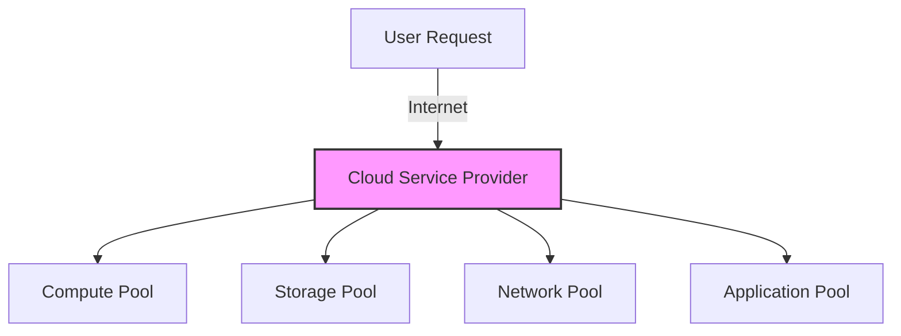

## 1.1. Cloud Computing Definition and Foundations

### 1.1.1. Core Definition
Cloud Computing is a paradigm that enables ubiquitous, convenient, on-demand network access to a shared pool of configurable computing resources (e.g., networks, servers, storage, applications, and services). These resources can be rapidly provisioned and released with minimal management effort or service provider interaction.

The transition from traditional computing to Cloud Computing represents a fundamental shift from **purchasing physical assets** to **subscribing to utility services**.

### 1.1.2. The Consumption Model Shift
*   **CapEx (Capital Expenditure):** Traditional IT requires high up-front costs to buy physical hardware, secure datacenters, and plan for 3-5 years of maximum expected growth. This leads to idle resources during off-peak times.
*   **OpEx (Operational Expenditure):** Under the cloud model, billing is operationalized. Companies pay only for what they consume per hour, minute, or second. This aligns IT expenses directly with actual business activity.

### 1.1.3. Essential Background Concepts
To understand why the cloud is a consumption model rather than a new physical technology, consider its core pillars:
1.  **Abstraction:** Physical hardware is hidden behind virtualized software layers.
2.  **Orchestration:** Management software automates the deployment and scaling of resources, removing the need for manual server setup.
3.  **Utility Billing:** Fine-grained metering tools track resource usage in real-time, functioning similarly to an electricity grid.