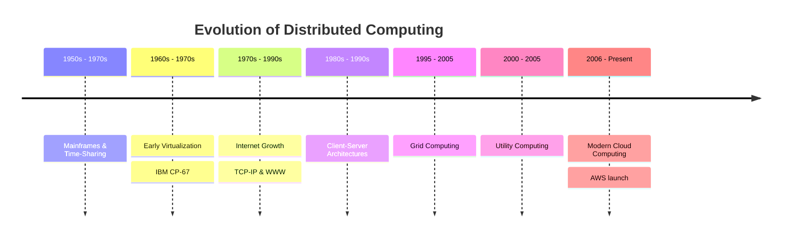

## 1.2. Historical Evolution of Computing Paradigms

### 1.2.1. Detailed Evolution of Paradigms
*   **Mainframes and Time-Sharing (1950s-1970s):** Large, expensive central systems executed tasks for multiple users. Users accessed the mainframe via passive terminals. **Time-sharing** was developed to allocate CPU cycles dynamically, laying the foundation for multi-user resource sharing.
*   **Early Virtualization (1960s-1970s):** IBM pioneered virtualization on the System/360 Model 67. The Control Program (CP) created independent virtual machines, while the Console Monitor System (CMS) provided a single-user interactive environment inside those VMs. This allowed mainframe resources to be safely partitioned.
*   **Development of Internet and Web (1970s-1990s):** The launch of ARPANET, TCP/IP, and the World Wide Web created a global network. This network made it possible to access computing resources remotely over long distances.
*   **Client-Server Architectures (1980s-1990s):** Computing shifted from centralized mainframes to distributed networks. Client machines made requests to local servers, which managed files, databases, and network traffic.
*   **Grid Computing (1995-2005):** A decentralized architecture that linked independent, geographically dispersed computers to tackle massive computational problems. Grid computing relies on specialized operating systems and lacks the ease of virtualization, but it proved the viability of large-scale resource sharing.
*   **Utility Computing (2000-2005):** This model packaged computing resources as a metered service, similar to water or electricity. It introduced pay-as-you-go pricing to the industry, though the underlying technology had not yet matured.
*   **Modern Cloud Computing (2006-Present):** In 2006, Amazon Web Services (AWS) launched Simple Storage Service (S3) and Elastic Compute Cloud (EC2). This combined virtualization, utility billing, and automated orchestration into a mature commercial platform, marking the start of the modern cloud era.